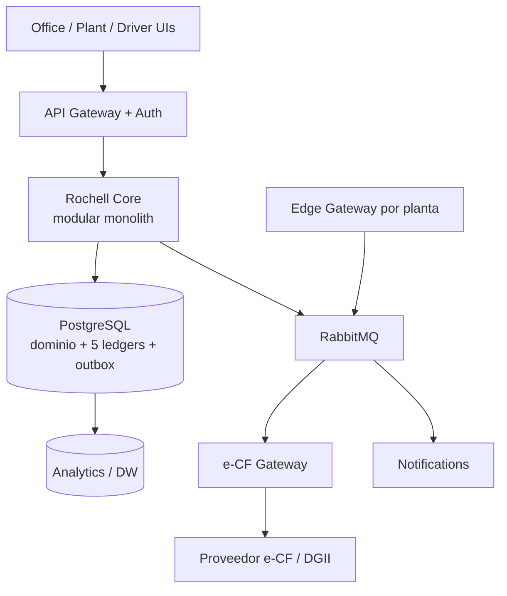
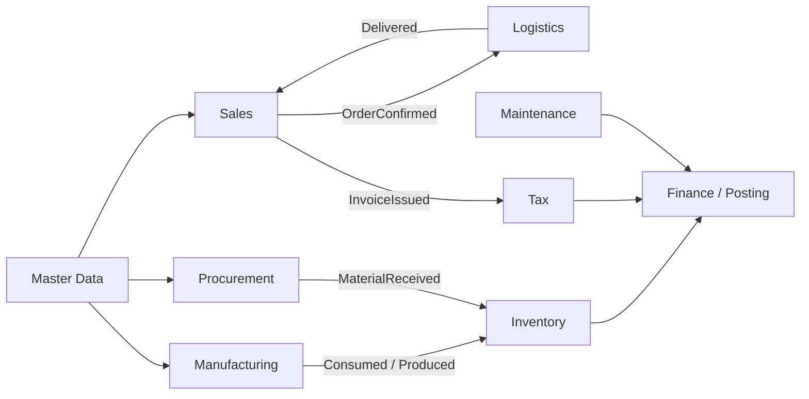
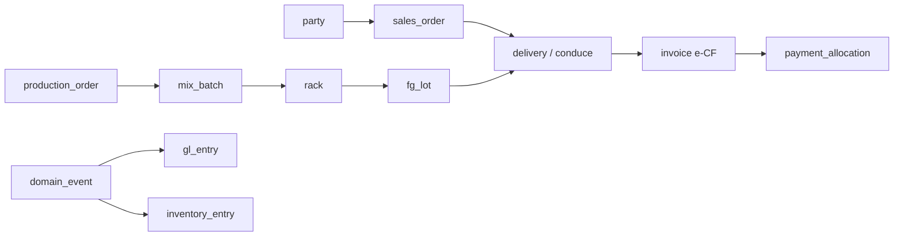
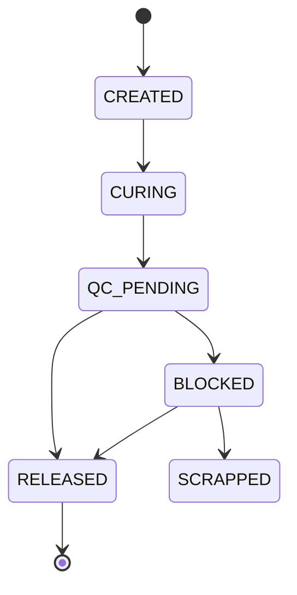
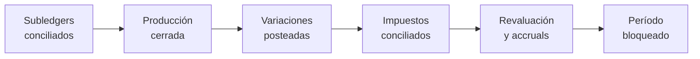
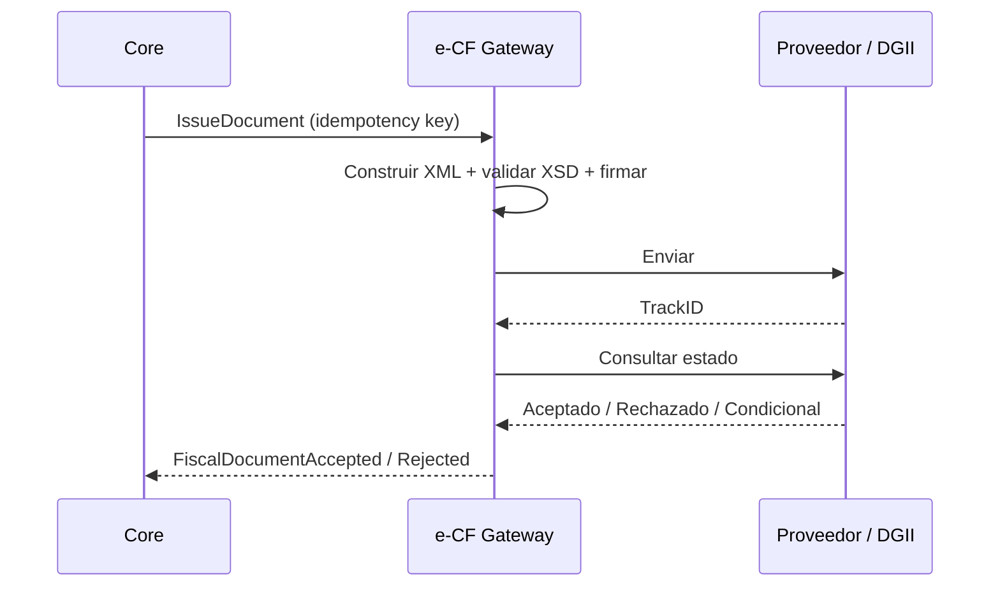
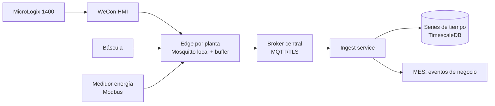
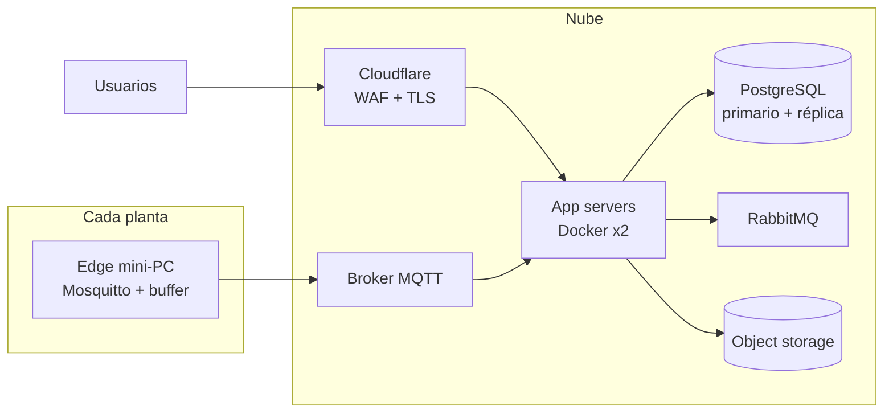
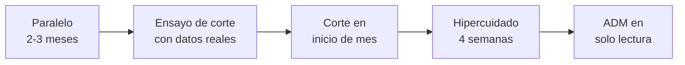

# Industrias Rochell — Arquitectura ERP/MES v1 (Entregable 1)

Sep 22, 2026 · @Alexander Rochell

## Alcance, supuestos y la decisión que ordena todo

Recomendación central: construir un **núcleo de ledgers en PostgreSQL con invariantes impuestas por la propia base de datos**, y hacer que todo lo demás (ventas, MES, TMS, BI) sean productores y lectores de esos ledgers. Si el núcleo es correcto, los 158 puntos se agregan por fases; si no, ninguna pantalla lo salva.

Este documento es el Entregable 1 (puntos 1–60). No contiene código. El Design Review multi-rol y la Architecture v2 son el Entregable 2.

**Punto de partida real (no greenfield).** El diseño parte de lo que ya existe y funciona:

| Activo existente | Estado | Destino en la arquitectura |
| --- | --- | --- |
| ADM Cloud (Premium Plus Manufacturing) | Sistema de registro actual; emite e-CF vía Polaris | Fuente de migración; operación en paralelo hasta corte |
| Sistema contable propio (PostgreSQL, sistema.industriasrochell.com.do) | Fase 1–3 en curso, paralelo con ADM | Se convierte en el núcleo de este ERP, no en un sistema aparte |
| Portal Industrias Rochell (checklist, entregas QR, producción, moldes) — PHP/SQLite/MySQL | En producción, PWA | Se absorbe por módulos: entregas QR → POD; moldes → Mold Asset; checklist → Plant Ops |
| Pipeline HMI WeCon → MQTT (Mosquitto en VPS) → Node → MySQL | Solo Planta 3 enviando | Se convierte en el primer Edge/IoT adapter |
| App de combustible (combustible.rochell.com.do) | Fase 1 desplegada | Se integra como Fuel Management vía API; no se reescribe en MVP |

**Supuestos (confirmar en Decisiones abiertas):**

- Entidades iniciales del grupo: Block Rochell, S.R.L. y ANICAL, S.R.L.; la operación de agregados (concesiones HR1/HR2) como entidad o unidad de negocio por definir.
- Tres plantas con Besser V3-12 (PLC MicroLogix 1400) y una posible línea Quadra Q12HP.
- Moneda funcional DOP; USD para importaciones y deuda.
- El equipo de desarrollo es pequeño (Alexander + 2–5 personas + asistencia de IA). Esto pesa en cada decisión técnica.

**Advertencia de alcance.** Lo descrito equivale a SAP S/4 + un MES + un TMS. Una empresa de este tamaño no necesita los 158 puntos para capturar el 80% del valor. El MVP (punto 54) está recortado a propósito.

## Parte I — Visión (1–4)

### 1. Executive Architecture

El sistema es un **modular monolith** ("Rochell Core") sobre una sola base PostgreSQL, rodeado de cuatro servicios satélite con ciclo de vida propio: Edge/IoT Gateway, e-CF Gateway, Document Store y Notifications. Todo cambio de estado de negocio se escribe como **documento de negocio + evento de dominio + asientos en los ledgers afectados, en una sola transacción de base de datos** (patrón outbox). Ningún módulo escribe en el ledger de otro; solo publica eventos o llama al Posting Engine.



Por qué este corte: las transacciones que tocan dinero, inventario y producción necesitan atomicidad; separarlas en microservicios obligaría a sagas y conciliaciones que un equipo pequeño no puede sostener.

### 2. Domain Map

| Tipo de dominio | Dominios | Por qué |
| --- | --- | --- |
| Core (ventaja competitiva) | Manufacturing/MES, Cost Accounting, Quality, Planning (ATP/CTP), Logistics | Aquí está el margen de un fabricante de block: costo real, OEE, entrega a obra |
| Supporting (específico, no diferenciador) | Inventory, Procurement, Sales/CRM, Maintenance, Fleet/Fuel, Quarry | Necesarios y a la medida, pero con patrones conocidos |
| Generic (comprar o copiar patrón) | Finance/GL, Tax/e-CF, HR/Payroll, Identity, Documents, Notifications | Reglas externas (DGII, TSS); no se innova aquí, se cumple |

Implicación: invertir diseño propio en Core; en Generic, seguir estándares y usar proveedores (ej. e-CF) cuando reduzcan riesgo regulatorio.

### 3. Context Map



Relaciones clave: Master Data es **upstream publicado** (todos conforman a sus IDs); Finance es **downstream** de todos vía Posting Engine (Anticorruption: los módulos emiten eventos de negocio, nunca asientos); Tax es **conformista** a DGII; Edge/IoT es **anticorruption layer** entre PLC/HMI y el MES.

### 4. System Landscape

| Sistema | Rol | Integración |
| --- | --- | --- |
| Rochell Core | ERP + MES + WMS + TMS + CMMS + QMS | — |
| Edge Gateway (1 por planta) | Captura HMI/PLC, báscula, medidores; buffer offline | MQTT local → RabbitMQ/HTTPS |
| e-CF Gateway | Emisión, firma, TrackID, contingencia | Proveedor certificado (Polaris hoy) o directo DGII |
| Consulta RNC DGII | Validación de clientes/proveedores | Adapter con caché |
| Bancos DR | Extractos y pagos | Archivos (CSV/MT940) primero; API cuando exista |
| GPS/telemática | Posición y geocercas | Webhook del proveedor |
| App combustible | Despachos de combustible | API REST hacia Core |
| BI (Power BI / Metabase) | Análisis | Lee del DW, nunca del OLTP |
| ADM Cloud | Legado | Solo migración + paralelo temporal |

## Parte II — Funcional (5–10)

### 5. Module Catalog

| Bounded context | Módulos | Fase |
| --- | --- | --- |
| Platform | Identity/RBAC+scope, Audit, Rules Engine, Approval Engine, Documents, Notifications, Global Search | MVP |
| Master Data | Empresas, sitios, ubicaciones, productos, materiales, UOM, clientes, proveedores, activos, precios | MVP |
| Finance | GL, AR, AP, Bancos, Conciliación, Activos Fijos, Préstamos, Cierre | MVP (GL/AR/AP/Bancos); F2 resto |
| Tax | Tax Engine, e-CF Gateway, 606/607/608/609, IR-17, Reconciliation Center | MVP |
| Sales | CRM, Cotización, Contrato, Pedido, Crédito, Cobros, Portal cliente | MVP (pedido/crédito/cobros); F2 CRM/portal |
| Procurement | Requisición, RFQ, OC, Recepción, 3-Way Match, Scorecard | MVP (OC/recepción/match) |
| Inventory/WMS | Ledger, lotes, stockpiles, ubicaciones, conteos, transferencias | MVP |
| Manufacturing/MES | Recetas, batch, rack, ciclo, estados de máquina, downtime, OEE | MVP (rack/batch/OEE básico) |
| Quality/LIMS | Ensayos, resistencia, granulometría, SPC, liberación de lotes | F2 (liberación en MVP) |
| Maintenance/CMMS | Equipos, planes, OT, repuestos, contadores | F2 |
| Logistics/TMS | Despacho, carga, viajes, POD, costo viaje | MVP (despacho/POD); F2 costo |
| Fleet | Vehículos, combustible, neumáticos, GPS | F2–F3 |
| Quarry | Frentes, extracción, trituración, stockpiles, báscula | F2 |
| Planning | Forecast, S&OP, MPS, MRP, ATP/CTP, capacidad finita | ATP en MVP; resto F2–F3 |
| HR | Empleados, turnos, asistencia, nómina, préstamos a empleados, EHS | F2 |
| Analytics/AI | Semantic layer, Command Center, Morning Brief, NL-BI, anomalías | F2–F3 |

### 6. Business Capabilities

Nivel 1 → nivel 2 (lo que la empresa debe poder hacer, independiente del software):

- **Make:** planificar producción · dosificar y mezclar · moldear y curar · controlar calidad · liberar lote.
- **Source:** extraer y procesar agregados · comprar insumos · recibir y pesar · almacenar.
- **Sell:** gestionar proyectos de obra · cotizar · prometer fecha (ATP/CTP) · otorgar crédito · facturar · cobrar.
- **Deliver:** asignar carga · despachar · transportar · confirmar entrega.
- **Maintain:** mantener máquinas, moldes y flota · gestionar repuestos.
- **Account:** registrar · costear · cumplir DGII · conciliar · cerrar · reportar.
- **Govern:** aprobar · segregar funciones · auditar · proteger datos.

### 7. End-to-End Processes

| Proceso | Cadena | Documento ancla |
| --- | --- | --- |
| Order-to-Cash | Cotización → Pedido → Crédito → ATP → Despacho (conduce) → POD → Factura e-CF → Cobro → Depósito → Conciliación | Pedido de venta |
| Procure-to-Pay | Requisición → RFQ → OC → Báscula/Recepción → QC → Factura proveedor → 3-Way Match → Pago → Retenciones | Orden de compra |
| Plan-to-Produce | Forecast → MPS → Orden producción → Batch → Rack → Curado → QC → Liberación → PT | Orden de producción |
| Mine-to-Stockpile | Frente → Extracción → Trituración → Cribado → Stockpile → Medición topográfica → Ajuste | Parte diario de cantera |
| Maintain-to-Settle | Contador/falla → OT → Repuestos → Cierre OT → Costo a máquina | Orden de trabajo |
| Record-to-Report | Eventos → Posting → Subledgers → Conciliación → Cierre → Estados | Período contable |
| Confotur (especial) | Proforma → Despachado pendiente de facturar → Factura régimen especial, o conversión a crédito fiscal al vencer plazo | Contrato/Proforma |

### 8. Roles

Director General · Director de Operaciones · Gerente de Planta · Supervisor de turno · Operador de máquina · Dosificador · Laboratorista · Jefe de mantenimiento · Técnico · Almacenista/Patio · Operador de báscula · Despachador · Chofer · Vendedor · Gerente comercial · Analista de crédito y cobros · Comprador · Contador · Controller · Tesorero · Especialista fiscal · RR.HH. · Auditor (solo lectura) · Administrador de sistema (sin acceso transaccional).

Cada rol se combina con **scope** (empresa, planta, almacén). Ej.: "Almacenista — Block Rochell — Planta 2".

### 9. Approval Matrix

Umbrales iniciales como configuración, no código:

| Documento | Nivel 1 | Nivel 2 | Nivel 3 |
| --- | --- | --- | --- |
| Compra | ≤ RD$100k: Gerente de Planta | ≤ RD$500k: Dir. Operaciones | > RD$500k: Director General |
| Pedido sobre límite de crédito | Analista crédito (≤ 10% exceso) | Controller | Director General |
| Descuento fuera de lista | Gerente comercial (≤ 5%) | Dir. Operaciones | — |
| Nota de crédito | Contador | Controller | — |
| Ajuste de inventario | Supervisor (≤ RD$25k) | Controller | Director General |
| Pago a proveedor | Tesorero prepara | Controller aprueba | Firma bancaria dual |
| Cambio de cuenta bancaria de proveedor | Compras solicita | Controller + callback verificado | — |
| Cambio de receta | Laboratorio propone | Gerente de Planta | — |
| Reapertura de período | Controller | Director General | — |

### 10. Exception Matrix

| Excepción | Detección | Acción del sistema | Dueño |
| --- | --- | --- | --- |
| Crédito excedido | Credit Engine al confirmar pedido | Bloquea; enruta a aprobación | Crédito |
| Inventario insuficiente | ATP | Ofrece CTP o entrega parcial | Ventas |
| 3-Way Match fuera de tolerancia | Al registrar factura proveedor | Retiene pago | Cuentas por pagar |
| Lote falla resistencia | QC | Lote a BLOCKED; bloquea despacho | Calidad |
| Máquina detenida > 15 min sin razón | Machine State Engine | Alerta CRITICAL; exige código de parada | Supervisor |
| e-CF rechazado | e-CF Gateway | Documento en cola de corrección; no se despacha nuevo crédito | Fiscal |
| Despacho sin POD en 48 h | TMS | Alerta; bloquea facturación del viaje si aplica | Logística |
| Consumo de cemento > ±5% vs receta | Batch vs receta | Alerta WARNING; entra a variaciones | Producción |
| Diferencia inventario vs GL | Cierre | Bloquea cierre salvo autorización | Controller |
| NCF/e-NCF duplicado de proveedor | Registro compra | Rechaza | Cuentas por pagar |

## Parte III — Datos (11–15)

### 11. Master Data Model

Todo dato maestro comparte un esqueleto: `id` (UUIDv7, ordenable por tiempo), `company_id` (o NULL si es de grupo), `code` humano, `status` (Draft → Review → Approved → Active → Obsolete), `version`, `effective_from/to`, `owner_role`.

Los atributos que afectan dinero o impuestos (precio, ITBIS, receta, BOM, cuenta contable, exención) se guardan en **tablas de versión temporal**, no como columnas editables. Una factura referencia la *versión* exacta del precio y del impuesto usados.

| Objeto | Clave natural | Owner | Versionado temporal |
| --- | --- | --- | --- |
| Empresa | RNC | Finance | Sí (datos fiscales) |
| Producto | SKU (BLOCK-060) | Producción/Comercial | Sí (receta, BOM, UOM) |
| Material | Código MP | Compras/Calidad | Sí (especificación) |
| Cliente / Proveedor | RNC/Cédula (validado DGII) | Crédito / Compras | Sí (crédito, condición fiscal, banco) |
| Máquina / Molde / Vehículo | Asset tag | Mantenimiento | Sí (capacidad, cavidades) |
| Cuenta contable | Código | Finance | Sí (mapeo 606/607) |
| Precio | Lista + producto + cliente | Comercial | Sí |
| Impuesto | Código + jurisdicción | Fiscal | Sí |

**Partner unificado:** una sola entidad `party` (persona o empresa) con roles cliente/proveedor/empleado/transportista. Evita el caso clásico de un contratista que es cliente y proveedor con dos RNC distintos en el sistema.

### 12. Transactional Data Model

Tres capas por transacción:

1. **Documento de negocio** (header + líneas): pedido, OC, conduce, factura, orden de producción, OT. Mutable solo en estado Draft.
2. **Evento de dominio** (append-only): `SalesOrderConfirmed`, `RackCreated`, `DeliveryCompleted`… con `event_id`, `correlation_id`, `causation_id`, `occurred_at`, `recorded_at`, `actor`, `payload`, `schema_version`.
3. **Entradas de ledger** (append-only): generadas por el Posting Engine a partir del evento.

Un documento **posteado** nunca se edita: se revierte o se emite un documento correctivo (nota de crédito, ajuste).

Las fechas se guardan en UTC (`timestamptz`) más la **fecha de negocio** (`business_date`) en America/Santo\_Domingo, porque un turno nocturno no debe partir la producción en dos días contables.

### 13. Ledger Architecture

Los cinco ledgers comparten un mismo patrón de fila: `entry_id`, `ledger`, `company_id`, `business_date`, `source_event_id`, `source_document`, `dimensions`, `quantity`, `uom`, `amount`, `currency`, `reverses_entry_id`.

| Ledger | Unidad | Invariante impuesta por la base de datos |
| --- | --- | --- |
| General | DOP (+ moneda original) | Σ débitos = Σ créditos por asiento (trigger diferido) |
| Inventory | UOM base + valor | Saldo por lote/ubicación ≥ 0 salvo ubicación "virtual" autorizada |
| Production | Unidades, kg, ciclos | Todo output tiene input o ajuste aprobado |
| Logistics | Unidades × ubicación origen/destino | Lo que sale de un sitio entra a otro o a "en tránsito" |
| Asset & Machine | Horas, ciclos, km, RD$ | Contadores monótonos (no decrecen) |

Reglas duras: ledgers con `REVOKE UPDATE, DELETE` para el rol de aplicación; correcciones solo por reversa. Cada fila del GL que viene de inventario apunta a la fila del Inventory Ledger que la originó; así la conciliación 101 es una consulta, no una investigación.

### 14. ERD (núcleo)



Tablas pivote relevantes: `delivery_line_lot` (qué lotes salieron en cada conduce), `batch_input_lot` (qué lotes de MP entraron a cada batch), `rack_batch` (un rack puede venir de 1–2 batches). El ERD completo por contexto se entrega en la Architecture v2.

### 15. Traceability Model

La trazabilidad **no requiere una base de grafos**. Se modela como una tabla de aristas genérica `trace_link(from_type, from_id, to_type, to_id, qty, uom, link_type, event_id)` que se llena automáticamente desde cada evento.

- Hacia atrás ("¿qué cemento terminó en la factura E31…?"): consulta recursiva `WITH RECURSIVE` sobre `trace_link`.
- Hacia adelante ("¿a qué obras llegó el lote de cemento MP-001?"): la misma consulta invertida. Crítico para un recall por resistencia baja.

Alternativas evaluadas: Neo4j (mejor para consultas de grafo profundas; pero segunda base, segunda fuente de verdad, más operación) vs Apache AGE sobre PostgreSQL vs tabla de aristas. **Recomendado: tabla de aristas.** Profundidad esperada ≤ 15 saltos y volúmenes de miles de lotes/mes; PostgreSQL lo resuelve en milisegundos con índices. Riesgo: si la trazabilidad por bloque individual se volviera requisito (no lo es), se reevalúa.

## Parte IV — Manufactura (16–23)

### 16. MES Architecture

El MES vive dentro del monolito (contexto Manufacturing) y recibe dos flujos: **eventos automáticos** del Edge (ciclos, estados, alarmas) y **eventos humanos** de la UI de planta (inicio de orden, cierre de rack, código de parada, consumo real). El Edge nunca escribe en la base central; publica eventos que el MES valida.

Capas: Edge (tiempo real, segundos) → Machine State Engine (minutos) → Production Ledger (rack/batch) → Cost Accounting (turno/día).

### 17. Production Model

Una bloquera es **proceso continuo en la mezcla y discreto en el moldeo**. El modelo refleja ambos:

| Nivel | Entidad | Granularidad |
| --- | --- | --- |
| Plan | Production Order | Producto × máquina × turno/día |
| Mezcla (continuo) | Mix Batch | Cada descarga de mezcladora |
| Moldeo (discreto) | Machine Cycle (agregado) | Conteo por minuto desde HMI |
| Unidad de manejo | Rack | Cada rack al cuarto de curado |
| Unidad de calidad | FG Lot | Agrupa racks: máquina + producto + turno + día |

La orden de producción se cierra por **backflush controlado**: consumo teórico = racks buenos × receta; consumo real = batches registrados; la diferencia es variación (punto 28), nunca se oculta.

### 18. Batch Model

`mix_batch`: batch\_id, planta, mezcladora, hora, `recipe_version_id`, humedad medida por agregado, pesos objetivo secos, pesos corregidos húmedos, pesos reales (báscula de dosificación o manual), agua efectiva, aditivo, operador, máquina destino.

Corrección por humedad (se guarda la fórmula usada y sus entradas):

```latex
W_{h\acute{u}medo} = W_{seco}\,(1 + w),\qquad Agua_{efectiva} = Agua_{receta} - \sum_i W_{seco,i}\,(w_i - a_i)
```

w = humedad total del agregado, a = absorción. Hoy la mayoría de los batches probablemente se registran a mano; el modelo acepta `source = manual | scale | plc` para no bloquear el MVP.

### 19. Rack Model

Estados y transiciones:



Cada rack lleva QR físico (etiqueta resistente a humedad). Al pasar a RELEASED, sus unidades se mueven en el Inventory Ledger de "WIP-curado" a "PT disponible". **Lo que no está RELEASED no existe para ATP.** Cantidad por rack = configuración producto + molde (no hardcodeada).

### 20. Machine Model

`machine`: id, fabricante, modelo (Besser V3-12, Quadra Q12HP), serial, work center, PLC/HMI asociado, capacidad teórica (ciclos/min), estado. `machine_mold_config`: máquina + molde + producto → unidades/ciclo, ciclo estándar, unidades/rack. Así una Quadra y una Besser con el mismo producto tienen rendimientos distintos sin tocar código.

### 21. Recipe/BOM Model

Separar dos cosas que en ADM Cloud están mezcladas:

- **Recipe** (calidad/proceso): proporciones por batch, versionada (V1, V2…), aprobada por Laboratorio + Gerente de Planta, con `effective_from`. Nunca se sobrescribe.
- **BOM** (costo/inventario): materiales por unidad de producto, derivada de la receta ÷ rendimiento del molde. Recalculada al aprobar receta o cambiar configuración de molde.

El batch guarda la versión de receta usada; el costo estándar guarda la versión de BOM usada.

### 22. OEE Engine

```latex
OEE = \frac{T_{operando}}{T_{planificado}} \times \frac{Ciclos \times Ciclo_{ideal}}{T_{operando}} \times \frac{Unidades_{buenas}}{Unidades_{totales}}
```

Fuentes: tiempo operando y ciclos del Machine State Engine (Edge); unidades buenas de racks RELEASED menos scrap. Cálculo por máquina × turno, agregado hacia arriba **sumando tiempos y unidades, nunca promediando OEE**. Cada cifra muestra su desglose y los eventos que la originan.

Nota: "unidades buenas" se conoce días después (tras curado y QC). Se publican dos OEE: **OEE preliminar** (al cierre del turno, calidad estimada) y **OEE final** (al liberar el lote).

### 23. Downtime Model

`machine_state_interval`: máquina, estado (RUNNING, IDLE, SETUP, STARVED, BLOCKED, MAINTENANCE, BREAKDOWN, PLANNED\_STOP), inicio, fin, fuente (PLC/usuario), `reason_code`, comentario.

Catálogo jerárquico de 3 niveles (Mecánica → Vibrador → Rodamiento). Regla: toda parada > 3 min (configurable) exige código antes de cerrar el turno. Paradas sin clasificar se muestran como su propia categoría en el Loss Tree para que no desaparezcan. Cada parada monetizada = unidades perdidas × margen de contribución del producto programado.

## Parte V — Finanzas (24–29)

### 24. General Ledger Architecture

Plan de cuentas **corto** (≈ 200–300 cuentas por empresa) más dimensiones analíticas obligatorias según la cuenta: Company, Plant, Department, CostCenter, Project, Machine, ProductLine, Party. Las dimensiones se validan por regla (ej. toda cuenta 61xx de mantenimiento exige Machine o Vehicle).

Alternativas: (a) cuentas con sufijos por máquina (lo que hacen muchos sistemas locales), (b) dimensiones en columnas fijas, (c) dimensiones en JSONB. **Recomendado (b) columnas fijas** para las 8 dimensiones oficiales + JSONB solo para dimensiones experimentales. Motivo: índices, integridad referencial y reportes rápidos; JSONB puro vuelve frágil la conciliación.

Multimoneda: cada línea guarda moneda de transacción, monto original, tasa (con fuente y fecha) y monto funcional DOP. Revaluación USD mensual por regla.

### 25. Subledgers

| Subledger | Cuenta control GL | Conciliación automática |
| --- | --- | --- |
| AR (clientes) | 1120 Cuentas por cobrar | Diaria |
| AP (proveedores) | 2110 Cuentas por pagar | Diaria |
| GRNI (recibido no facturado) | 2115 | Semanal; antigüedad > 30 días alerta |
| Despachado no facturado (incl. Confotur) | 1125 | Diaria |
| Inventario (MP, WIP, PT, repuestos) | 13xx | Al cierre (punto 101) |
| Activos fijos | 15xx / 16xx | Mensual |
| Préstamos bancarios e intercompany | 21xx / 25xx | Mensual |
| Préstamos a empleados | 1140 | Por nómina |

Las cuentas control están **bloqueadas para asientos manuales**; solo el subledger postea en ellas. Así el punto 121 se cumple por diseño.

### 26. Posting Rules Engine

Entrada: evento de dominio. Salida: asiento balanceado. La regla se elige por `company × event_type × product_category × warehouse` con `effective_from`.

| Evento | Débito | Crédito |
| --- | --- | --- |
| MaterialReceived | Inventario MP | GRNI |
| SupplierInvoicePosted | GRNI + ITBIS adelantado | CxP (− retenciones) |
| MaterialIssuedToProduction | WIP | Inventario MP |
| RackReleased | PT (costo estándar) | WIP |
| ProductionOrderClosed | Variaciones (precio, uso, eficiencia) | WIP (residual a cero) |
| DeliveryCompleted (sin factura) | Costo de ventas | PT |
| InvoiceIssued | CxC | Ventas + ITBIS por pagar |
| PaymentReceived | Banco / Valores en tránsito | CxC |
| MaintenancePartConsumed | Gasto mantenimiento \[Machine\] | Inventario repuestos |

Cada asiento guarda `rule_id` y `rule_version`: se puede explicar por qué se contabilizó así hace dos años. Un evento sin regla aplicable **no se descarta**: va a una cola de "posting pendiente" que bloquea el cierre.

Decisión a confirmar: reconocer costo de ventas al **despacho** (recomendado: el riesgo pasa al entregar) y no al facturar, lo que es clave para Confotur, donde se despacha mucho antes de facturar.

### 27. Cost Accounting

Costeo por **órdenes de producción con absorción por tasas**:

- Materiales: consumo real por batch × costo promedio ponderado por lote/almacén.
- Energía: kWh medido (o prorrateado por horas-máquina si no hay medidor) × tarifa.
- Mano de obra: nómina del turno asignada por horas registradas por máquina (punto 83).
- Máquina: depreciación + mantenimiento → tasa RD$/hora operando.
- Molde: costo ÷ vida en ciclos → RD$/ciclo ("¿cuánto me cuesta el molde por block?").
- Overhead de planta: tasa predeterminada por unidad, ajustada al cierre.

Respuesta a "¿cuánto costó el block #X?": el costo por block es el **costo de su lote**, no de la unidad individual. Ese es el nivel correcto de precisión para un producto de este valor.

Método de valuación de inventario: **promedio ponderado** (recomendado; simple y aceptado) vs FIFO por lote (más exacto, más costoso de operar). Confirmar con el auditor externo.

### 28. Standard vs Actual Cost

Costo estándar anual (o trimestral) por SKU × planta, versionado y nunca sobrescrito. El PT entra al estándar; las diferencias se aíslan en variaciones:

| Variación | Causa típica en bloquera |
| --- | --- |
| Precio de material | Cemento subió |
| Uso de material | Exceso de cemento por batch, humedad mal corregida |
| Rendimiento (yield) | Scrap, racks rotos, desmoldeo defectuoso |
| Eficiencia | Ciclo lento, paradas (enlaza con OEE) |
| Gasto indirecto | Volumen producido distinto al planificado |

Esta tabla es la respuesta estructural a "¿por qué subió el costo del block 6 esta semana?" (punto 87).

### 29. Closing Architecture

Cierre en tres niveles: **diario** (turnos cerrados, paradas clasificadas, despachos con POD), **semanal** (conciliación de producción servidor vs racks, requisito ya planteado), **mensual** (Closing Cockpit).



Estados del período por módulo: Open → Soft-closed (solo ajustes de cierre) → Closed. Se puede cerrar Ventas del mes mientras Contabilidad aún hace accruals. Reabrir exige aprobación de nivel 2 y queda auditado.

## Parte VI — Cumplimiento fiscal (30–33)

Regla de este bloque: cualquier dato normativo aquí (tipos de e-CF, formatos, tasas) es **de trabajo** y debe confirmarse contra la documentación vigente de DGII en un ADR con fuente, versión y fecha de consulta antes de implementarse (punto 152).

### 30. Dominican Tax Engine

El Tax Engine es una función pura: recibe **contexto** (empresa, contraparte y su condición fiscal vigente, producto y su tipo fiscal, fecha, tipo de documento, destino) y devuelve **determinación** (impuestos, tasas, bases, retenciones, tipo de e-CF, mapeo a reportes) con el `rule_set_version` usado.

| Entidad | Contenido | Versionado |
| --- | --- | --- |
| tax\_code | ITBIS general, exento, ISC si aplica | effective\_from/to |
| tax\_rate | Tasa por código | effective\_from/to |
| withholding\_rule | Retención ITBIS/ISR por tipo de proveedor y servicio | effective\_from/to |
| fiscal\_condition | Condición especial de la contraparte + documento soporte + vigencia | Por contraparte |
| document\_type\_rule | Qué tipo de e-CF corresponde según contexto | effective\_from/to |
| report\_mapping | Qué casilla/columna de 606/607/IT-1/IR-17 alimenta | effective\_from/to |

**Confotur y regímenes especiales:** la exención nunca se infiere del cliente. Existe un `fiscal_condition` con resolución/certificado adjunto, proyecto asociado y vigencia. El flujo proforma → "despachado pendiente de facturar" → factura de régimen especial, o conversión a crédito fiscal al vencer el plazo, es una máquina de estados del contrato, con alerta N días antes del vencimiento. El tratamiento de ITBIS prorrata asociado va por regla, no por ajuste manual.

### 31. e-CF Gateway

Servicio separado con su propia base (o esquema aislado), porque tiene otro ciclo de vida (cambios de XSD de DGII) y otro perímetro de seguridad (certificado digital).



Se guardan: XML original, XML firmado, respuesta, hashes, timestamps, versión de esquema, e-NCF, código de seguridad y QR.

**Decisión clave — ¿emisor directo o vía proveedor?**

| Opción | A favor | En contra |
| --- | --- | --- |
| A. Seguir con proveedor certificado (Polaris hoy) detrás del Gateway | Ya funciona; certificación y cambios de XSD los absorbe el proveedor; menor riesgo regulatorio | Costo por documento; dependencia |
| B. Certificarse como emisor con software propio | Control total; sin costo por documento | Proceso de certificación ante DGII, custodia de certificado, mantenimiento de XSD, contingencia propia |

**Recomendado: A en MVP y Fase 2**, con el Gateway diseñado como puerto/adaptador para migrar a B después si el volumen lo justifica. Riesgo principal: que la API del proveedor no exponga todos los estados; validarlo antes de firmar diseño.

Contingencia: si DGII o el proveedor no responden, el despacho **no se detiene** (el conduce es interno); la factura queda en cola con reintento idempotente y alerta a Fiscal.

### 32. DGII Reporting

Cada reporte (606 compras, 607 ventas, 608 anulados, 609 pagos al exterior, más IT-1 e IR-17 según aplique) es una **vista reproducible** sobre los documentos fiscales del período, no una exportación editable. Al generarlo se congela un snapshot con hash; cualquier corrección posterior genera un reporte rectificativo con su propio snapshot.

Cada línea del reporte enlaza: línea → documento → asiento → cuenta. En compras, el registro exige e-NCF/NCF válido del proveedor, validado contra DGII cuando el servicio esté disponible.

### 33. Tax Reconciliation Center

Panel mensual con tres columnas que deben coincidir:

| Concepto | Documentos fiscales | GL | Reporte a presentar | Diferencia |
| --- | --- | --- | --- | --- |
| ITBIS facturado | Σ e-CF emitidos | Cuenta ITBIS por pagar | 607 / IT-1 | Debe ser 0 |
| ITBIS adelantado | Σ facturas proveedor | Cuenta ITBIS adelantado | 606 / IT-1 | Debe ser 0 |
| Retenciones | Σ retenciones aplicadas | Cuentas de retención | IR-17 / 606 | Debe ser 0 |
| Notas de crédito | Σ E34 | Reversos de venta | 607 | Debe ser 0 |
| e-CF aceptados vs emitidos | Estado Gateway | — | — | Rechazos pendientes = 0 |

El cierre fiscal no se habilita con diferencias abiertas, salvo excepción aprobada y documentada.

## Parte VII — Supply Chain (34–38)

### 34. Procurement

Procure-to-Pay con dos carriles, porque el 80% del gasto de una bloquera son pocos insumos recurrentes:

| Carril | Aplica a | Flujo |
| --- | --- | --- |
| Recurrente con contrato | Cemento, arena, gravilla, aditivos, combustible | Contrato marco con precio vigente → OC liberada por programación → báscula/recepción → factura → 3-Way Match automático |
| Spot | Repuestos, servicios, CAPEX, oficina | Requisición → RFQ (≥ 3 cotizaciones sobre umbral) → comparación → aprobación → OC → recepción → factura → match |

3-Way Match: tolerancias configurables por categoría (ej. cantidad ±2% en granel pesado, 0% en repuestos; precio 0% contra contrato). Fuera de tolerancia → retención del pago, nunca bloqueo silencioso. La recepción de materiales a granel toma la cantidad del **ticket de báscula**, no de la factura del proveedor.

Scorecard de proveedor calculado desde los propios eventos: OTIF (fecha OC vs recepción), rechazos QC, variación de precio, variación de peso báscula vs guía del suplidor.

Transporte propio en recepción: la recepción registra vehículo y chofer (requisito existente) y genera un viaje en el Logistics Ledger con costo imputado al material recibido (landed cost interno).

### 35. Inventory

Inventory Ledger por **lote × ubicación × estado de stock**:

| Estado | Significado | Disponible para ATP |
| --- | --- | --- |
| Available | Liberado | Sí |
| Reserved | Asignado a pedido | No (para otros) |
| Quality hold | Curado / QC pendiente / bloqueado | No |
| In transit | Entre plantas o en camión | No |
| Consigned | Despachado pendiente de facturar (ej. Confotur) | No; sigue siendo nuestro contablemente si así se define |

Inventario de granel (arena, gravilla) por **stockpile**: el sistema lleva el saldo teórico (entradas báscula − consumos batch); la medición topográfica o por dron periódica genera un ajuste aprobado con su variación explicada. Cemento en silo: saldo teórico + lectura de nivel cuando haya sensor.

Valuación: promedio ponderado por empresa × almacén × producto (ver 27). Landed cost de importaciones distribuible por valor, peso, volumen o cantidad.

### 36. MRP

MRP de un solo nivel es suficiente al inicio: el BOM de un block es plano (cemento, agregados, aditivo, agua). Calcula por material y planta:

```latex
Necesidad_{neta} = Consumo_{MPS} + Stock_{seguridad} - Stock_{disponible} - OC_{abiertas}
```

Salida: sugerencias de compra con fecha = necesidad − lead time. Las sugerencias las aprueba un humano (punto 137). Para cemento, la métrica que se muestra es **días de cobertura**, porque así se decide en la práctica.

### 37. Planning

| Horizonte | Herramienta | Frecuencia | Salida |
| --- | --- | --- | --- |
| 3–12 meses | Forecast + S&OP | Mensual | Plan de demanda y capacidad; necesidad de caja |
| 1–4 semanas | MPS | Semanal | Producto × máquina × día |
| 1–3 días | Programación finita | Diaria | Secuencia por turno considerando moldes y mantenimiento |
| Instante | ATP / CTP | Por pedido | Fecha prometible |

ATP = disponible + producción programada liberable antes de la fecha − comprometido. CTP = ATP + capacidad libre de máquina/molde/material hasta la fecha, menos tiempo de curado. **El curado es la restricción que más olvidan los sistemas genéricos**: un block producido hoy no es despachable hoy.

Forecast inicial: promedio móvil estacional por SKU + pipeline de proyectos del CRM ponderado por probabilidad. Modelos estadísticos más sofisticados solo después de 12–18 meses de datos limpios.

### 38. Warehousing

Jerarquía Company → Site → Plant → Warehouse → Zone → Location, con Bin opcional (útil en repuestos, no en patio). El patio de PT se organiza por **zona de producto + fila**, no por posición exacta: rastrear posición por pallet en patio abierto tiene más costo operativo que beneficio.

Operaciones: recepción, put-away, transferencia entre plantas, picking por conduce, conteo cíclico (repuestos por ABC; PT por zona semanal), ajuste con aprobación. Todo movimiento por escaneo QR desde tablet/teléfono.

## Parte VIII — Logística (39–44)

### 39. Dispatch

El pedido de venta es despachable **parcialmente**: cada despacho genera un conduce que referencia líneas del pedido; la factura puede ser por despacho o por el pedido completo (requisito existente). El conduce descuenta inventario; la factura reconoce ingreso.

Dispatch Control Tower (una pantalla, columnas tipo kanban): Pendiente → Programado → Cargando → En tránsito → Entregado → Con incidencia. Datos: cliente, obra, cantidades, camión, chofer, hora prometida vs real.

Load building (punto 46): el sistema valida peso y cantidad contra la capacidad configurada del vehículo (ej. unidades de Block 6" por camión según peso unitario) y sugiere combinaciones por destino. Optimización de rutas multi-parada: Fase 3, solo si hay volumen de entregas pequeñas.

### 40. TMS

`trip`: trip\_id, vehículo, remolque, chofer, ayudante, conduces asociados (1..n), salida planta, llegada obra, inicio/fin descarga, retorno, km (odómetro y/o GPS), estado. Un viaje puede ser de entrega, recepción de MP (transporte propio) o transferencia entre plantas.

Costo real del viaje:

```latex
Costo_{viaje} = Combustible + (Chofer + Ayudante)_{horas} + Peajes + km \times (Depreciaci\acute{o}n + Neum\acute{a}ticos + Mantenimiento)_{/km} + Seguro_{/d\acute{i}a}
```

Salidas en pesos por km, por viaje, por tonelada y por unidad entregada. El costo del viaje se asigna al cliente/pedido para la rentabilidad por cliente (punto 49), separado de lo que se le cobra como flete.

### 41. Fleet

Registro de vehículos y equipo pesado (camiones, cargadores, retroexcavadoras de cantera) como activos del Asset & Machine Ledger, con contadores de km y horómetro. Mantenimiento por contador (cada X km/horas) desde el CMMS. Documentos con vencimiento: marbete, seguro, licencia del chofer, revista; alerta 30 días antes.

GPS/telemática: integración vía webhook del proveedor; geocercas automáticas en cada planta y en cada obra activa. Llegada/salida detectada por geocerca alimenta los tiempos del viaje sin digitación.

### 42. Fuel

La app de combustible existente (combustible.rochell.com.do) se **mantiene como aplicación de captura** y se integra al Core por API: cada ticket autorizado produce un evento `FuelDispensed` (vehículo/equipo, galones con 3 decimales, precio, odómetro/horómetro, operador, autorizador). En Core alimenta: inventario de tanque, costo al vehículo/equipo, costo del viaje o de la hora de cantera.

Rendimiento esperado vs real por equipo; anomalía cuando el consumo se desvía más de N desviaciones estándar de su propio histórico. Tanques: inventario por medición (varilla/sensor) vs teórico, con merma tolerada.

Se unifica con el Core en Fase 3 si conviene; reescribirla antes no aporta valor.

### 43. Tires

Módulo opcional (Fase 3). Cada neumático es un activo serializado: marca, modelo, medida, posición, instalación (fecha, km), retiro (fecha, km, motivo), recapados. Resultado: costo por km por neumático, marca y posición. Solo vale la pena con flota pesada de más de \~10 camiones; con menos, basta un gasto por vehículo.

### 44. Proof of Delivery

Evolución del sistema de entregas QR actual (QR en conduce → foto + nombre del receptor):

- El QR del conduce apunta al Core, no a ADM.
- Captura: llegada (geocerca o manual con GPS), foto de la carga descargada, nombre y firma del receptor, cantidad recibida, novedades (rotos, faltantes).
- Offline-first: la app guarda localmente y sincroniza al recuperar señal; conflicto se resuelve con regla "el primer POD válido gana; los siguientes quedan como anexos".
- Diferencia entre cantidad despachada y recibida abre una incidencia que puede generar nota de crédito, nunca un ajuste silencioso.
- El POD queda en el portal del cliente y habilita la facturación del despacho.

## Parte IX — Sistemas industriales (45–48)

### 45. PLC Integration

Punto de partida real: las HMI WeCon PI8150ig ya leen los MicroLogix 1400 y publican por MQTT; solo Planta 3 está enviando. La arquitectura conserva ese camino y lo endurece; no se conecta el ERP al PLC.

| Opción | A favor | En contra |
| --- | --- | --- |
| A. HMI → MQTT (actual) | Ya funciona; sin hardware nuevo | La HMI no tiene buffer robusto; esquema de mensaje informal |
| B. Edge PC → EtherNet/IP al PLC (pycomm3 / Node) → MQTT | Lectura directa de tags, buffer local, un solo software para todas las plantas | Requiere mini-PC industrial por planta y acceso a la red del PLC |
| C. Gateway comercial (Kepware, Ignition Edge) | Robusto, soporte, OPC-UA nativo | Costo de licencia |

**Recomendado: A ahora, B al estabilizar el MVP**, con un contrato de mensaje único para no rehacer el backend. Contrato mínimo por evento: `plant, machine_id, ts_utc, seq, type (cycle|state|alarm|counter), value, source`. El `seq` monótono permite detectar huecos y hace los reintentos idempotentes.

Tags a leer en MicroLogix (definir con el programa RSLogix 500 existente): máquina en marcha, contador de ciclos, tiempos de alimentación/vibración/acabado, alarmas activas, modo manual/automático. Nunca escritura desde el ERP hacia el PLC.

### 46. IoT Architecture



Se separan dos tipos de dato: **telemetría** (alta frecuencia: corriente, vibración, temperatura) va a una tabla de series de tiempo (extensión TimescaleDB en el mismo PostgreSQL al inicio); **eventos de negocio** (ciclo, cambio de estado, alarma) van al MES. La telemetría se retiene cruda 90 días y agregada por minuto indefinidamente, lo que habilita mantenimiento predictivo futuro (punto 36) sin llenar la base.

Seguridad: MQTT con TLS y usuario por planta (hoy puerto 1883 sin TLS en el VPS; migrar a 8883). Tópicos con ACL: cada planta solo publica en su propio árbol.

### 47. Edge Computing

Un mini-PC industrial por planta (fanless, 8–16 GB RAM, SSD, UPS dedicada) con: Mosquitto local, un servicio de ingesta con cola en disco (SQLite o PostgreSQL local), y un **modo degradado** de la UI de planta para registrar racks, batches y paradas sin Internet.

Comportamiento sin Internet: todo se escribe localmente con `seq` y se reenvía en orden al volver la conexión; el central deduplica por `(plant, machine, seq)`. Autonomía objetivo: 72 horas de datos. Si falla la electricidad, la UPS da tiempo al cierre ordenado.

### 48. Weighbridge Integration

Flujo de báscula como máquina de estados del ticket: Entrada → Identificación (placa/QR del vehículo, OC o pedido) → Peso 1 → Carga/descarga → Peso 2 → Neto → Ticket cerrado.

- El indicador de la báscula se lee por serial/TCP desde el Edge; la UI **no permite digitar el peso** salvo modo manual con motivo y aprobación.
- Se guarda foto de placa (cámara IP) y peso con timestamp y firma hash.
- El ticket cerrado dispara `MaterialReceived` (compras/cantera) o `LoadWeighed` (ventas de agregados, control de sobrecarga).
- Tara de vehículos propios almacenada y verificada periódicamente; alerta si la tara medida difiere más de un umbral.

## Parte X — Tecnología (49–53)

### 49. Final Technology Stack

Decisión de backend (la más cara de revertir):

| Criterio | .NET 10 / ASP.NET Core | NestJS / TypeScript |
| --- | --- | --- |
| Tipo decimal nativo para dinero | Sí (`decimal`) | No; requiere librería (decimal.js) y disciplina |
| Un solo lenguaje front + back | No | Sí |
| Encaje con lo existente (Node subscriber, apps JS/PHP) | Bajo | Alto |
| Madurez para DDD/ledgers | Muy alta | Alta |
| Disponibilidad de desarrolladores en RD | Media | Alta |
| Productividad con asistencia de IA | Alta | Alta |

**Recomendado: TypeScript end-to-end (NestJS + Next.js)**, con dos compensaciones obligatorias por la debilidad numérica: todo monto es `numeric` en PostgreSQL y un tipo `Money`/`Quantity` propio en el código (nunca `number`), y las invariantes contables viven **en la base de datos** (triggers y constraints), de modo que un bug de aplicación no pueda desbalancear un asiento. Si el sistema contable en curso ya está en otro lenguaje con avance real, esa inversión pesa más que esta tabla; confirmarlo antes de fijar.

| Capa | Elección | Nota |
| --- | --- | --- |
| Base de datos | PostgreSQL 17 + TimescaleDB | Una sola base para OLTP y telemetría inicial |
| Acceso a datos | Kysely o Drizzle (SQL tipado) | Evitar ORM que oculte SQL; los ledgers se escriben con SQL explícito |
| API | REST + OpenAPI; eventos internos por outbox | GraphQL no aporta a este dominio |
| Frontend | Next.js + React + TypeScript; PWA para planta y chofer | Tres shells de UI (Office, Plant, Driver) sobre las mismas APIs |
| Mensajería | RabbitMQ | Kafka es sobredimensionado para este volumen |
| IoT | Mosquitto (edge y central) | EMQX si crece a muchas plantas |
| Caché / colas ligeras | Redis | Sesiones, rate limiting, jobs |
| Archivos | S3-compatible (Cloudflare R2 o MinIO) | Documentos, fotos POD, XML e-CF |
| Observabilidad | OpenTelemetry → Grafana (Loki, Tempo, Prometheus) | Stack abierto, sin costo por usuario |
| BI | Metabase (inicio) / Power BI (dirección) | Leen solo del DW |
| Contenedores | Docker Compose → Kubernetes solo si hace falta | K8s no se justifica en MVP |

### 50. Deployment Diagram



Alternativas de hosting: (a) seguir en VPS Hostinger (barato; pero backups, parches y HA quedan a cargo propio), (b) VPS de proveedor con PostgreSQL administrado y PITR (DigitalOcean, AWS Lightsail/RDS, Azure), (c) servidor on-premise en Higüey. **Recomendado (b)** para producción: el riesgo de perder el libro mayor no se debe cargar sobre un solo VPS autogestionado. El VPS actual sigue sirviendo como ambiente de pruebas/staging.

### 51. Security Architecture

- Identidad: OIDC (Keycloak autoalojado o proveedor administrado); MFA obligatorio para roles financieros y administradores.
- Autorización: RBAC + scope (empresa/planta/almacén), evaluado en el servidor en cada consulta; ABAC solo para datos RESTRICTED (salarios).
- Segregación de funciones: matriz SoD declarada; el sistema impide que un mismo usuario cree proveedor, apruebe factura y pague.
- Datos: TLS en tránsito; cifrado en reposo del disco y de backups; campos RESTRICTED (cuentas bancarias, salarios) cifrados a nivel de columna.
- Secretos: gestor de secretos (Doppler, Vault o el del proveedor cloud); certificado e-CF solo accesible por el e-CF Gateway.
- Superficie: Cloudflare WAF + rate limiting; panel de administración solo por VPN/Zero Trust; sin puertos de base de datos expuestos.
- Auditoría: tabla de auditoría append-only (quién, qué, cuándo, dónde, antes, después, motivo) separada de los logs técnicos.

### 52. Observability Architecture

Cada request y cada evento llevan `correlation_id`, propagado a RabbitMQ, al e-CF Gateway y al Edge. Se instrumentan tres señales con OpenTelemetry: logs estructurados, métricas y trazas.

Métricas de negocio además de las técnicas: eventos sin postear, e-CF pendientes > 1 h, plantas sin datos > 5 min (ya existe para Planta 3), cola del Edge sin vaciar, diferencias de conciliación. Alertas técnicas van a sistemas; alertas de negocio van al Alert Center (punto 93).

### 53. DR Architecture

Objetivos propuestos: **RPO 5 minutos, RTO 4 horas** para el Core; RPO 0 en planta gracias al buffer del Edge.

| Escenario | Respuesta |
| --- | --- |
| Falla de base de datos | Réplica promovida; PITR desde WAL archivado en object storage de otra región |
| Falla del proveedor cloud | Backups diarios cifrados en un segundo proveedor; runbook de restauración probado trimestralmente |
| Ransomware | Backups inmutables (object lock) con retención 35 días; credenciales de backup separadas |
| Caída de Internet en planta | Edge en modo degradado 72 h |
| Caída de DGII o proveedor e-CF | Cola con reintento; despacho sigue; contingencia según norma vigente |
| Falla eléctrica | UPS en Edge y red; cierre ordenado |

Un backup que no se ha restaurado no cuenta: restauración de prueba mensual a un ambiente aislado, con verificación automática de invariantes contables sobre la copia.

## Parte XI — Implementación (54–60)

### 54. MVP (≈ 6–9 meses)

Objetivo: **apagar ADM Cloud** para Block Rochell sin perder nada de lo que hoy hace, y ganar trazabilidad rack → conduce → factura. Criterio de salida: un mes cerrado completamente en el sistema nuevo, con conciliación a cero contra el paralelo.

| Bloque | Incluye |
| --- | --- |
| Plataforma | Identidad, RBAC+scope, auditoría, aprobaciones, documentos, búsqueda global, API |
| Master Data | Empresas (Block Rochell + ANICAL), productos, clientes/proveedores con validación RNC, UOM, precios, cuentas |
| Finance | GL con dimensiones, AR, AP, bancos, conciliación bancaria semiautomática, cierre mensual |
| Tax | Tax Engine, e-CF vía Gateway + proveedor, 606/607/608, IT-1/IR-17 base, Confotur |
| Ventas | Cotización, pedido, crédito, ATP simple, conduce, factura, cobros, préstamos a empleados\* |
| Compras + inventario | OC, recepción, 3-Way Match, inventario por lote/ubicación, stockpiles básicos |
| Producción | Recetas versionadas, batch (manual), racks con QR, liberación simple, OEE preliminar desde HMI |
| Logística | Despacho, POD (evolución de entregas QR) |

\*Préstamos a empleados entra en MVP como cuenta de AR de empleado; la nómina completa es Fase 2.

Fuera del MVP a propósito: CRM, MRP, S&OP, CMMS, cantera, laboratorio completo, flota, BI avanzado, IA.

### 55. Phase 2 (≈ 6 meses)

Cost Accounting completo (estándar vs real, variaciones), Quality/LIMS con resistencia y SPC, CMMS con repuestos y contadores, Edge por planta (opción B), energía, costo de viaje y rentabilidad por cliente, HR + nómina + asistencia por turno, Quarry y báscula, integración de combustible por API, Command Center y Morning Brief, portal de clientes.

### 56. Phase 3 (≈ 6–12 meses)

MRP, MPS y programación finita, CTP, S&OP, forecast, CAPEX/proyectos (línea Quadra), activos fijos completos, consolidación multiempresa con eliminaciones intercompany, telemática GPS, neumáticos, DW + semantic layer, asistente de IA con NL-BI de solo lectura, detección de anomalías, simuladores de rentabilidad y capacidad.

### 57. Migration Strategy

Flujo: Extract (API/exportes de ADM Cloud) → Stage (esquema `staging`) → Validate (reglas: RNC válido, saldos cuadran) → Transform → Approve (Controller firma) → Import → Reconcile.

| Dato | Estrategia |
| --- | --- |
| Maestros (clientes, proveedores, productos) | Migración completa, limpieza de duplicados antes |
| Saldos GL | Balance de apertura a la fecha de corte; histórico queda consultable en ADM (solo lectura) o en tablas de archivo |
| AR / AP | Documentos abiertos uno a uno, cuadrados contra la cuenta control |
| Inventario | Conteo físico en la fecha de corte; no se migra el kardex histórico |
| Facturas históricas | Archivo de consulta (PDF + XML e-CF) enlazado al cliente, no reprocesadas |
| Activos fijos | Costo, depreciación acumulada y vida restante por activo |

Fecha de corte recomendada: inicio de mes, idealmente inicio de trimestre, nunca en diciembre.

### 58. Testing Strategy

| Nivel | Qué prueba | Obligatorio antes de merge |
| --- | --- | --- |
| Unit | Reglas de dominio, Tax Engine, cálculos de costo | Sí |
| Invariantes (property-based) | Σ débitos = Σ créditos; inventario no negativo; asiento posteado inmutable; PT sin producción imposible | Sí |
| Integración | API + PostgreSQL real (Testcontainers) | Sí |
| Contrato | Mensajes Edge, e-CF Gateway, API de combustible | Sí |
| Conciliación | Subledger = GL para AR, AP, inventario, activos | Nightly |
| E2E | Order-to-Cash, Procure-to-Pay, Plan-to-Produce | Por release |
| Rendimiento | Operación común < 2 s con volumen de 3 años | Por release |
| Seguridad | Dependencias, SAST, pentest externo antes de go-live | Por release |

El paralelo con ADM Cloud es en sí la prueba de aceptación más fuerte: cada día se compara ventas, cobros e inventario de ambos sistemas.

### 59. Go-Live Strategy



Criterios go/no-go: tres cierres semanales consecutivos sin diferencias no explicadas, e-CF emitidos y aceptados en ambiente de prueba del proveedor, usuarios clave capacitados por rol, restauración de backup probada. Plan de retroceso: ADM Cloud permanece activo 60 días tras el corte.

Orden por empresa: Block Rochell primero (mayor complejidad, mayor beneficio), ANICAL después reutilizando la plataforma.

### 60. Estimated Team Structure

| Rol | MVP | Fase 2–3 |
| --- | --- | --- |
| Product owner / arquitecto de negocio (Alexander) | 1 (parcial) | 1 |
| Tech lead full-stack | 1 | 1 |
| Desarrolladores full-stack | 2 | 3 |
| Contador/Controller como experto funcional | 1 (50%) | 1 (25%) |
| Especialista fiscal (consultoría) | Por demanda | Por demanda |
| QA / analista de pruebas | 1 | 1 |
| DevOps / infraestructura | 0.5 | 0.5 |
| Ingeniero de automatización (PLC/Edge) | Por demanda | 0.5 |

Con asistencia de IA la productividad sube, pero **no elimina la necesidad de un contador que valide cada regla de posteo** ni de un segundo desarrollador que revise el código de ledgers. Con una sola persona desarrollando, el MVP se estima en 12–18 meses, no en 6–9.

## Decisiones abiertas antes del Design Review

Estas respuestas cambian el diseño; el Entregable 2 (revisión CFO/COO/Plant Manager/Controller/Auditor/CTO/Fiscal y Architecture v2) las necesita cerradas.

- [ ] ¿En qué lenguaje/stack está hoy el sistema contable de sistema.industriasrochell.com.do? Decide si se mantiene o se migra a la recomendación del punto 49.
- [ ] ¿La operación de agregados (HR1/HR2) será una sociedad propia o una unidad de negocio dentro de Block Rochell? Afecta multiempresa, intercompany y costeo de arena/gravilla.
- [ ] ¿Costo de ventas al despacho o a la factura? Recomendado: despacho (punto 26). Validar con el auditor externo, sobre todo por Confotur.
- [ ] ¿Promedio ponderado o FIFO por lote para inventario? (punto 27)
- [ ] ¿e-CF vía proveedor (Polaris) en MVP, o hay intención de certificarse como emisor directo? (punto 31)
- [ ] ¿Hosting de producción en nube administrada o permanecer en VPS propio? (punto 50)
- [ ] ¿Cuántas personas estarán realmente en el equipo durante el MVP? Cambia el plazo de 6–9 a 12–18 meses (punto 60).
- [ ] ¿La línea Quadra Q12HP entra antes o después del go-live? Si entra antes, el modelo de máquina y el CAPEX suben de fase.
