# Industrias Rochell ERP/MES — Design Review & Architecture v2

Sep 22, 2026 · @Alexander Rochell

## 1. Design Review ejecutivo

**Veredicto: el Entregable 1 no está listo para desarrollo.** La dirección (monolito modular, ledgers inmutables, PostgreSQL, e-CF desacoplado) se mantiene, pero se encontraron **10 fallas bloqueantes** que producirían doble consumo de inventario, costos de producto no auditables, riesgos de ITBIS en Confotur y condiciones de carrera en reservas y pagos. Tres decisiones de v1 se revierten: backend TypeScript → **.NET 10**, telemetría en la misma base → **instancia separada**, RabbitMQ en MVP → **outbox + cola en PostgreSQL**.

Esta revisión se hizo buscando dónde falla, no defendiendo v1. Todo dato normativo DGII citado es de trabajo y debe confirmarse en un ADR fiscal con fuente, versión y fecha antes de implementarse.

| # | Hallazgo bloqueante | Consecuencia si no se corrige | Corrección v2 |
| --- | --- | --- | --- |
| C-01 | v1 describe consumo teórico (backflush) **y** consumo real (batches) sin decir cuál mueve inventario | Doble salida de cemento; inventario y GL inflados en costo | Una sola fuente de salida por material y planta, declarada en configuración; la otra es solo memoria analítica |
| C-02 | PT "a costo estándar" y MP "a promedio ponderado" sin política de control de precio ni asignación de variaciones | Inventario de PT no se aproxima a costo real (NIC 2); auditor lo objeta | Price control por tipo de material + prorrateo mensual de variaciones entre inventario y costo de ventas |
| C-03 | Órdenes de producción por turno como objeto de costo | Cientos de liquidaciones WIP al mes; residuos que nadie concilia | Separar orden operativa (turno/día) de **cost collector** (producto × línea × mes) |
| C-04 | "Costo de ventas al despacho" como regla única | Ingreso y costo mal reconocidos en entregas en obra, facturación anticipada y Confotur | Policy Engine de transferencia de control por término de entrega |
| C-05 | Confotur modelado como flujo de contrato | No se puede responder qué autorización cubre qué venta; riesgo de hecho generador de ITBIS con despachos no facturados por meses | Submodelo Fiscal Authorization con consumo por línea + verificación del hecho generador |
| C-06 | Saldo de inventario ≥ 0 validado por trigger con SUM | Dos transacciones concurrentes pasan la validación; stock negativo real | Tabla de saldos con actualización condicional atómica y CHECK |
| C-07 | Inventory Ledger solo con cantidad y valor en la misma fila | No detecta "cantidad correcta, valor incorrecto"; revaluaciones rompen historia | Entradas separadas de cantidad y de valor |
| C-08 | Una sola `business_date` | Conduce del 31/03 registrado el 02/04 con marzo cerrado: el usuario cambia la fecha o se pierde el corte | Cinco fechas + cuatro períodos con dependencias |
| C-09 | trace\_link llenado por código de cada evento | Un desarrollador olvida un enlace y la trazabilidad se rompe sin aviso | Trazabilidad derivada de los ledgers por construcción (FK NOT NULL) + verificación nocturna |
| C-10 | Inmutabilidad solo por REVOKE UPDATE/DELETE | Un superusuario o DBA puede alterar filas sin evidencia | Cadena de hash por ledger + digest diario anclado en almacenamiento WORM |

**Qué sobrevive de v1 sin cambios:** monolito modular, PostgreSQL como fuente única, patrón outbox, Posting Engine por reglas versionadas, cuentas control bloqueadas, dimensiones en columnas, e-CF vía proveedor detrás de un gateway, Edge por planta con buffer, trazabilidad sin base de grafos, orden de fases.

**Qué cambia el alcance:** el MVP v2 (sección 18) es más pequeño que el MVP v1 en funciones y más grande en controles. Se retira del P0 todo lo que no se necesita para apagar ADM Cloud con datos conciliados.

## 2. Hallazgos críticos y escenarios de falla

Cada hallazgo incluye el escenario concreto que lo rompe. Severidad: **C** = bloquea desarrollo, **A** = alto, corregir antes de go-live, **M** = medio, corregir en P1.

### Escenarios demostrativos de las fallas bloqueantes

**C-01 — Doble consumo.** Turno A produce 40 racks de Block 6" con 18 batches. v1 postea `MaterialIssuedToProduction` por cada batch (cemento real: 18 × 350 kg) y al cerrar la orden postea backflush (40 racks × receta). Resultado: el silo teórico baja dos veces, WIP recibe el doble de cemento, la variación de uso sale negativa enorme y nadie sabe si es real. La conciliación de silo (sección 7) nunca cuadra.

**C-06 — Carrera en reservas.** Hay 20,000 Block 6" disponibles. Despachador 1 reserva 15,000 para Construvesa; despachador 2, en el mismo segundo, reserva 12,000 para otro cliente. Ambas transacciones ejecutan `SELECT SUM(qty)` → 20,000, ambas pasan el trigger y ambas confirman. Reservado = 27,000 contra 20,000 físicos. En aislamiento READ COMMITTED esto ocurre siempre que haya concurrencia real.

**C-08 — Corte mal hecho.** Conduce 10583 salió el 31/03 a las 16:40. El chofer entrega el papel el 02/04; marzo ya está cerrado. Opciones en v1: el usuario pone fecha 02/04 (ventas y costo de marzo subestimados, ITBIS potencialmente mal declarado) o pide reabrir marzo (bloquea a todo contabilidad). Ninguna es aceptable.

**C-10 — Alteración silenciosa.** Un administrador con acceso `postgres` ejecuta `UPDATE gl_entry SET amount = …` para "arreglar" un error. REVOKE no aplica al superusuario; el trigger se puede deshabilitar. Sin cadena de hash no hay evidencia.

### Hallazgos adicionales

| # | Sev. | Hallazgo | Escenario de falla | Corrección |
| --- | --- | --- | --- | --- |
| H-11 | A | Asignación de e-NCF no definida | Dos facturas concurrentes toman el mismo número o quedan huecos sin justificar ante DGII | Secuencia por serie con bloqueo de fila, asignada solo al confirmar emisión; huecos → anulación reportable |
| H-12 | A | Pago aplicado sin bloqueo de la factura | Dos cajeros aplican RD$100k cada uno a una factura de RD$150k | Bloqueo de fila de la factura + CHECK saldo abierto ≥ 0 |
| H-13 | A | Recepción concurrente contra misma OC | Dos recepciones de 30 t sobre OC de 40 t; ambas pasan | Bloqueo de línea de OC + tope con tolerancia |
| H-14 | A | Eventos del Edge fuera de orden | Estado STOPPED llega antes que RUNNING; el intervalo queda negativo o abierto | Reordenar por `seq` por stream; buffer de 60 s; huecos marcados como UNKNOWN, no inventados |
| H-15 | A | Batch registrado a mano por cada descarga | 150+ capturas por turno; el operador inventa datos al final | Registro por resumen de turno cuando no hay báscula integrada; por batch solo con integración |
| H-16 | A | Código de parada obligatorio > 3 min antes de cerrar turno | Supervisor bloqueado a las 6 a.m.; clasifica todo como "Otros" | Clasificación asistida, cierre permitido con "sin clasificar" visible y medido |
| H-17 | A | Consumo de combustible desde app externa sin idempotencia | Reintento del webhook duplica galones y costo | Clave idempotente = id del ticket en la app de combustible |
| H-18 | A | Intercompany sin clave de emparejamiento | ANICAL factura combustible a Block Rochell; cada lado registra en fechas y montos distintos; la eliminación no cuadra | Documento intercompany único con dos patas generadas; utilidad no realizada en tanques eliminada al consolidar |
| H-19 | A | Moneda: tasa sin fuente definida | Revaluación con tasa "del día" que cada usuario busca | Tabla de tasas con fuente oficial, tipo (compra/venta/promedio) y fecha efectiva |
| H-20 | A | Anulación de e-CF no modelada | Factura aceptada con error; el usuario quiere "borrarla" | Solo nota de crédito E34 que referencia el e-NCF original; nunca borrado |
| H-21 | A | Pagos al exterior (hosting, licencias) no contemplados | Servicios cloud pagados al exterior sin registro en 609 ni evaluación de retención | Tipo de proveedor exterior + regla fiscal versionada |
| H-22 | A | IdP con Keycloak autogestionado | Una pieza más que operar, parchear y respaldar | Google Workspace como IdP para oficina (ya se usa) + credencial local con PIN para operadores en tablets compartidas |
| H-23 | M | RabbitMQ en MVP | Otro servicio con estado; mensajes perdidos si se configura mal | Outbox + cola en PostgreSQL (`SKIP LOCKED`); broker solo cuando haya consumidores externos |
| H-24 | M | Ubicación de patio por zona + fila, sin estado de propiedad | Camión cargado fuera del portón: ¿de quién es? | Modelo de ownership separado (sección 7) |
| H-25 | M | Conversión m³ ↔ t implícita | Stockpile medido en m³ convertido con densidad vieja; ajuste enorme sin explicación | Toda conversión guarda densidad, fecha y origen |
| H-26 | M | Silo sin entidad | Diferencias de cemento imposibles de ubicar | Entidad Silo con reconciliación |
| H-27 | M | Estados de integración binarios | e-CF "falló" sin saber si reintentar o corregir | Estados PENDING…FAILED\_PERMANENTLY |
| H-28 | M | Moldes solo con costo/ciclos | No se sabe qué reparación extendió vida ni qué costo capitalizar | Mold History con eventos y política de capitalización |
| H-29 | M | Liberación de lote única (RELEASED) | Planta no puede despachar sin ensayo de 28 días, o despacha sin control | Liberación preliminar / condicional / final configurable |
| H-30 | M | Un solo cierre de período | Fiscal no puede presentar 607 hasta que costos cierre inventario | Cuatro períodos independientes con dependencias |

### Matriz de las 20 preguntas contra el diseño v2

| Pregunta | Respuesta del diseño v2 | Sección |
| --- | --- | --- |
| 1. ¿Inconsistencias contables? | Posting por reglas, asiento balanceado por constraint diferido, cuentas control cerradas a manual | 4, 13 |
| 2. ¿Inconsistencias de inventario? | Una fuente de salida por material; ledger cantidad + valor; reconciliación diaria | 7 |
| 3. ¿Pérdida de trazabilidad? | Trazabilidad derivada de ledgers, no insertada a mano | 9 |
| 4. ¿Fallas por concurrencia? | Actualización condicional, bloqueo de fila, constraints únicos, versión de agregado | 8 |
| 5. ¿Doble contabilización? | `UNIQUE(source_event_id, rule_id)` en asientos | 8 |
| 6. ¿Stock negativo indebido? | CHECK en tabla de saldos; excepción solo en ubicaciones virtuales autorizadas | 7 |
| 7. ¿Errores fiscales? | Tax Engine versionado; reconciliación e-CF ↔ ventas ↔ 607 | 4, 13 |
| 8. ¿Difícil de auditar? | Explain this entry; hash chain; audit trail con antes/después | 13, 3 |
| 9. ¿Cuello de botella? | Telemetría aislada; reportes en réplica; saldos precalculados | 5, 4 |
| 10. ¿Demasiado complejo? | MVP v2 recortado; sin broker, sin K8s, sin microservicios salvo e-CF y Edge | 18 |
| 11. ¿Alternativa más simple? | Evaluada en cada ADR | 15, 16 |
| 12. ¿Falla a mitad de transacción? | Documento + ledger + outbox en una transacción; todo o nada | 8 |
| 13. ¿Evento duplicado? | Inbox con clave única; idempotency\_key en comandos | 8 |
| 14. ¿Fuera de orden? | `seq` por stream; posting por `business_date`, no por llegada | 8 |
| 15. ¿Falla Internet? | Edge con 72 h de autonomía; apps de patio offline | 14 |
| 16. ¿DGII fuera de servicio? | e-CF en RETRYING/contingencia; el despacho no se detiene | 12 |
| 17. ¿Edge envía datos incompletos? | Intervalos UNKNOWN; validación de contrato; no se infiere producción | 8, 10 |
| 18. ¿Corrección histórica? | Reversa + nuevo registro; nunca edición; fecha de posteo en período abierto | 8 |
| 19. ¿Cierre y reapertura? | Reapertura en cascada con aprobación; documentos tardíos al primer día abierto | 8 |
| 20. ¿Reconstrucción a años? | Eventos, reglas y esquemas versionados; XML e-CF archivado; particiones nunca borradas | 4, 16 |

## 3. Revisión multirol A–E

### A. CFO

Conclusión: v1 produce buen libro mayor pero **información financiera pobre para decidir**. Faltan presupuesto, flujo de caja indirecto, covenants y costo de capital.

| Área | Brecha en v1 | Corrección v2 |
| --- | --- | --- |
| Estados financieros | Solo derivados del GL; sin mapeo a NIIF para PYMES/NIIF completas ni notas | Estructura de reporte versionada (líneas de estado → cuentas); mapeo a presentación NIIF que use el auditor |
| Flujo de caja | Solo posición diaria y forecast directo | Añadir flujo indirecto mensual derivado del balance + forecast directo 13 semanas desde AR/AP/nómina/deuda programada |
| Capital de trabajo | No se mide | DSO, DIO, DPO, ciclo de conversión de caja por empresa, calculados en semantic layer |
| Deuda | Cronograma, sin covenants | Covenants con fórmula (DSCR, deuda/EBITDA) y alerta de incumplimiento proyectado |
| CAPEX | Presupuesto vs real | Compromisos (OC abiertas) + real + estimado a completar; IRR/VPN post-inversión de la línea Quadra con datos reales de OEE y costo |
| Presupuesto | Inexistente | Presupuesto anual por cuenta × dimensión, versionado (original, reforecast Q2/Q3), comparación mensual |
| Rentabilidad | Por cliente y SKU | Añadir por proyecto/obra y por modalidad de entrega (retira vs entregado) |
| Consolidación | Eliminaciones automáticas | Emparejamiento intercompany por documento único; utilidad no realizada en inventario (combustible ANICAL en tanques de Block Rochell) |
| Moneda | USD en importación y deuda | Exposición cambiaria neta y sensibilidad a la tasa |

### B. Controller

Flujos que en v1 pueden romper la igualdad subledger = GL:

| Riesgo | Cómo ocurre | Control v2 |
| --- | --- | --- |
| AR ≠ GL | Asiento manual a 1120; nota de crédito fuera del subledger; cobro aplicado a cliente equivocado y corregido por asiento | Cuenta control cerrada a manual; toda corrección como documento AR (reaplicación, nota) |
| AR ≠ GL | Revaluación USD de facturas en dólares postea al GL pero no al saldo del subledger | Revaluación como documento del subledger con asiento derivado |
| AP ≠ GL | Factura de proveedor posteada con retenciones calculadas distinto en GL y en AP | Un solo cálculo del Tax Engine; ambos leen el mismo resultado |
| AP ≠ GL | GRNI sin limpiar cuando factura llega con otro precio | Diferencia de precio a variación o a inventario según stock remanente, por regla |
| Inventario ≠ GL | Ajuste de costo (landed cost tardío) cuando parte del lote ya se vendió | Entrada de valor parte a inventario y parte a costo de ventas, prorrateada por cantidad remanente |
| Inventario ≠ GL | Evento de inventario sin regla de posteo | Evento queda en cola `UNPOSTED`; bloquea cierre de inventario |
| AF ≠ GL | Capitalización manual de un activo en curso | Capitalización solo como documento del subledger de activos |

Cut-off y accruals: el sistema genera automáticamente GRNI (recibido no facturado), entregado no facturado, nómina devengada, intereses devengados y energía estimada al cierre, con reversa automática el día 1. Los ajustes manuales de cierre se registran en un **diario de ajustes** con plantilla, soporte adjunto obligatorio y aprobación.

Dimensiones: combinaciones válidas por cuenta (reglas), para evitar gasto de mantenimiento con dimensión de cliente. Intercompany: cuentas espejo por par de empresas, con reconciliación que exige saldo espejo = 0.

### C. Auditor

Operaciones de v1 que podían cambiar sin evidencia suficiente:

- Datos maestros aprobados y luego editados (precio, cuenta bancaria, límite de crédito). v2: todo cambio de maestro crítico crea nueva versión con aprobación; la anterior queda.
- Reglas de posteo modificadas sin control. v2: las reglas son datos maestros con flujo Draft → Approved y prueba contra casos de regresión antes de activarse.
- Configuración de tolerancias (3-Way Match, conciliación). v2: auditada igual que un maestro.
- Ajustes de inventario pequeños bajo umbral repetidos (fraccionamiento). v2: regla de fraude sobre suma de ajustes por usuario × período.
- Acceso directo a base. v2: hash chain, logs de pgAudit enviados a almacenamiento externo, cuentas nominales para DBA con acceso temporal aprobado (break-glass).
- Evidencia: fotos POD, tickets de báscula, certificados de exención y XML e-CF con hash SHA-256 guardado en la fila del documento.

SoD mínima: crear proveedor ≠ aprobar factura ≠ liberar pago; crear cliente ≠ aprobar crédito; registrar ajuste de inventario ≠ aprobarlo; configurar regla fiscal ≠ emitir e-CF. El sistema bloquea la combinación en asignación de roles y la reporta si se otorga como excepción.

### D. COO / Operaciones

¿Se puede usar todos los días? **Con v1, no del todo**: exigía demasiada captura. Principios v2 para planta y patio:

- Máximo tres toques para las acciones frecuentes (crear rack, registrar parada, cargar camión).
- El sistema propone y el humano confirma: rack precargado con producto, máquina, molde y turno desde la programación y el contador del HMI.
- Captura por excepción: si el turno salió según plan, el supervisor confirma el resumen; solo corrige lo que difiere.
- Funciona en tablet con guantes, luz solar y sin señal.

Restricciones operativas que v1 no modelaba: tiempo mínimo de curado antes de despacho, capacidad de cuartos/zona de curado, disponibilidad de montacargas, cambio de molde (30–90 min según máquina), limpieza de mezcladora y ventanas de entrega de obra.

### E. Gerente de Planta

| Punto | Problema v1 | Ajuste v2 |
| --- | --- | --- |
| Production Orders | Por turno, con apertura/cierre formal | Programación diaria generada; el turno solo "arranca" y "termina"; costo va al cost collector mensual |
| Batches | Captura por batch | Resumen por turno (batches × receta) hasta que haya báscula integrada |
| Racks | QR impreso por rack y escaneo | Rack creado automáticamente por conteo de ciclos ÷ unidades por rack; operador confirma o corrige |
| Moldes | Sin eventos de montaje | Cambio de molde = evento de 1 toque; inicia estado SETUP y cuenta ciclos del molde |
| Ciclos | Del HMI | Igual; si el HMI no envía, el turno se marca "conteo manual" y el OEE se muestra con esa etiqueta |
| Downtime | Código obligatorio | Lista corta de 8 causas frecuentes por máquina; el resto en árbol |
| Curado | Estado CURING | Tiempo mínimo por producto; liberación preliminar automática al cumplirse + inspección visual |
| Scrap | Solo en rack | Scrap en desmoldeo, en curado, en patio y en carga, cada uno con causa |
| Reproceso | Inexistente | Bloque roto triturado vuelve como agregado reciclado (material propio, costo cero o valor neto realizable) |
| Turnos | Asistencia | Dotación estándar por turno; solo se registran ausencias y reemplazos |

## 4. Revisión multirol G–J (F: Costos, en sección 6)

### G. CTO / Arquitecto de software

El monolito modular se confirma. Lo que v1 dejaba abierto y v2 fija:

| Tema | Decisión v2 |
| --- | --- |
| Límites de módulo | Un esquema PostgreSQL por bounded context; un módulo solo lee tablas de otro a través de vistas publicadas o su API interna; prueba de arquitectura en CI que falla si se viola |
| Transacción | Comando = una transacción: documento + ledgers + outbox. Nada de llamadas HTTP dentro de una transacción |
| Mensajería interna | Outbox leído por un dispatcher en proceso; consumidores internos con inbox. Sin broker en MVP |
| Trabajos en segundo plano | Cola en PostgreSQL con `FOR UPDATE SKIP LOCKED` (reintentos, backoff, estados) |
| Dentro del monolito | Master Data, Finance, Tax Engine, Sales, Procurement, Inventory, Manufacturing, Quality, Maintenance, Logistics, HR, Planning |
| Fuera del monolito | e-CF Gateway (certificado, ciclo XSD), Edge por planta (físicamente en planta), Ingesta de telemetría (carga distinta), Reporting/DW (no compite con OLTP) |
| Escalado | Vertical primero; réplica de lectura para reportes; el monolito se replica horizontalmente detrás del balanceador (sin estado en memoria) |
| Versionado de API | `/v1/`; cambios incompatibles solo con nueva versión y 6 meses de convivencia |

### H. DBA PostgreSQL

**Claves.** UUIDv7 como PK técnica (ordenable, sin hotspot excesivo); clave natural única adicional por empresa (`company_id, doc_type, doc_number`). Ledgers con PK compuesta `(posting_date, entry_id)` para permitir particionamiento.

**Tablas de saldo.** Los saldos nunca se calculan con SUM en línea para validar:

```sql
-- Conceptual
CREATE TABLE inv.stock_balance (
  company_id, plant_id, location_id, item_id, lot_id, stock_status,
  qty_on_hand   numeric(18,4) NOT NULL,
  qty_reserved  numeric(18,4) NOT NULL DEFAULT 0,
  version       bigint NOT NULL,
  PRIMARY KEY (company_id, location_id, item_id, lot_id, stock_status),
  CHECK (qty_on_hand >= 0 OR location_is_virtual),
  CHECK (qty_reserved >= 0 AND qty_reserved <= qty_on_hand)
);
```

El ledger es la verdad; `stock_balance` es su proyección mantenida **en la misma transacción** y verificada cada noche contra la suma del ledger.

**Append-only.** Rol de aplicación sin UPDATE/DELETE en ledgers; trigger `BEFORE UPDATE OR DELETE` que aborta; columna `prev_hash` + `row_hash = sha256(prev_hash || contenido canónico)` por cadena (empresa × ledger × día); digest diario escrito a object storage con bloqueo de objeto (WORM).

**Particionamiento.** Por rango mensual de `posting_date` en GL, inventario y producción cuando superen \~10 M filas (no desde el día 1: partición prematura complica). Índices: B-tree `(company_id, account_id, posting_date)` en GL; `(company_id, item_id, location_id, posting_date)` en inventario; BRIN en `recorded_at`.

**Snapshots.** Saldo de cierre por período (GL por cuenta × dimensiones; inventario por ítem × lote × ubicación) congelado con hash al cerrar. Reportes históricos parten del snapshot más cercano.

**Archivo.** Nunca borrar. Particiones de más de 5 años se mueven a tablespace de menor costo y quedan de solo lectura.

**Consultas.** OLTP en primario; reportes pesados y BI en réplica o DW; `statement_timeout` distinto por rol; prohibido ORM lazy loading en listados (N+1).

**Timescale en la misma instancia:** rechazado (Decisión 4). El WAL de la telemetría satura réplica y backups del ERP.

### I. Seguridad — threat model

| Amenaza | Vector probable | Controles |
| --- | --- | --- |
| Robo de credenciales | Phishing a contabilidad/tesorería | MFA resistente a phishing (llave o passkey) para roles de pago; sesión corta; alerta por login nuevo |
| Alteración de cuenta bancaria de proveedor | Correo falso "cambiamos de banco" | Cambio = versión nueva en Review; verificación por llamada a número registrado previamente; pagos a cuenta nueva retenidos 72 h |
| Fraude de proveedores | Proveedor fantasma creado por empleado | RNC validado en DGII; duplicados por RNC, cuenta, teléfono, dirección; SoD crear/aprobar/pagar |
| Ransomware | Equipo de oficina comprometido | Sin acceso de red directo a la base; backups inmutables fuera de la cuenta principal; restauración probada |
| Acceso a nómina | Usuario con rol amplio | Datos RESTRICTED cifrados por columna; ABAC por rol de nómina; registro de cada lectura |
| Manipulación de inventario | Ajustes, conteos o scrap inflados para encubrir robo | Ajuste requiere aprobación; scrap con foto; alertas por patrón |
| Modificación de e-CF | Alterar XML antes o después de firmar | Firma solo en Gateway; hash del XML firmado en Core; comparación diaria con estado en proveedor/DGII |
| Acceso directo a la base | Credencial de app filtrada | Red privada; credenciales rotadas por gestor de secretos; pgAudit; hash chain |
| Compromiso del Edge | Mini-PC en planta con acceso físico | Disco cifrado; certificado de cliente por planta; ACL MQTT por tópico; Edge solo publica eventos, nunca comandos a Core; Core valida rangos físicos (ciclos/min imposibles) |
| Abuso del asistente de IA | Prompt injection vía datos | IA con credencial de solo lectura sobre semantic layer; nunca acceso a comandos de escritura |

### J. Fiscal RD / e-CF

Todo lo siguiente queda como **requisito a verificar** contra DGII vigente (ADR-022) y se implementa como reglas versionadas, no como código.

| Tema | Riesgo en v1 | Requisito v2 |
| --- | --- | --- |
| Hecho generador ITBIS | v1 asume que el impuesto nace con la factura | Verificar si nace con la entrega del bien o la factura, lo que ocurra primero. Si es así, los despachos no facturados (Confotur) generan obligación en el mes del despacho |
| Retenciones | Porcentajes fijos | Reglas por tipo de proveedor (persona física, jurídica, exterior), tipo de bien/servicio y vigencia |
| Secuencias e-NCF | No definidas | Rango autorizado por serie; asignación sin huecos al confirmar; control de vencimiento de rangos |
| Tipos de e-CF | Genérico | Mapeo contexto → tipo (crédito fiscal, consumo, nota de débito, nota de crédito, compras, gastos menores, regímenes especiales, gubernamental, exportación, pagos al exterior), cada uno a verificar |
| Notas de crédito | Sin plazos | Verificar reglas de plazo y efecto en ITBIS; siempre referencian e-NCF original |
| Notas de débito | No modeladas | Documento propio (intereses por mora, ajustes de precio) |
| Compras | Solo facturas con NCF | Comprobante de compras para proveedores informales; gastos menores; importaciones con liquidación aduanal |
| 606/607/608/609 | Vistas | Además: reconciliación con e-CF recibidos y emitidos según consulta DGII |
| IT-1 / IR-17 | Base | Derivados de las mismas líneas fiscales que alimentan 606/607 |
| Anticipos | No modelados | Verificar tratamiento fiscal de anticipos de clientes antes de entrega |
| Regímenes especiales / Confotur | Bandera | Submodelo de autorización (Decisión 2) |
| Contingencia | Solo reintento | Procedimiento de contingencia según norma y proveedor; documentos en contingencia identificados y regularizados |

## 5. Decisiones 1–5

### Decisión 1 — Reconocimiento de ingreso y costo de venta

**DECISIÓN.** Cuándo se reconoce ingreso y COGS, y cómo se separa del movimiento físico y de la factura.

**ALTERNATIVAS.** (a) COGS al despacho (v1). (b) COGS a la factura. (c) Policy Engine: el reconocimiento ocurre en la **transferencia de control**, determinada por el término de entrega del pedido.

**RECOMENDACIÓN: (c) Inventory Ownership & Revenue Recognition Policy Engine.**

Cinco hechos distintos, cada uno con su propio evento:

| Hecho | Evento | Qué cambia |
| --- | --- | --- |
| Transferencia física | `GoodsIssued` (sale del portón) / `GoodsDelivered` (POD) | Ubicación física |
| Transferencia de control | `ControlTransferred` | Propiedad contable; aquí se reconoce ingreso y COGS |
| Facturación | `InvoiceIssued` | Derecho de cobro exigible, documento fiscal |
| Reconocimiento de ingreso | Derivado de control | Ingreso vs activo de contrato / pasivo de contrato |
| Reconocimiento de COGS | Derivado de control | PT → costo de ventas |

Reglas por término de entrega (tabla configurable `delivery_term_policy`, versionada):

| Término | Control se transfiere en | En tránsito es de |
| --- | --- | --- |
| Retira en planta (cliente o su transportista) | Salida por portón con ticket de báscula / conduce firmado | Cliente |
| Entregado en obra con transporte propio | POD en obra | Nosotros (IN\_TRANSIT, propiedad nuestra) |
| Entregado con transportista contratado por nosotros | POD en obra | Nosotros |
| Consignación en obra | Consumo reportado por el cliente | Nosotros hasta el reporte |
| Bill-and-hold (facturado, queda en nuestra planta) | Solo si se cumplen criterios de bill-and-hold (identificado, separado, listo, solicitado por cliente) | Según criterios; si no, nosotros |

Asientos:

- Control transferido sin factura: Dr Activo de contrato (entregado no facturado) / Cr Ingreso; Dr COGS / Cr PT.
- Factura posterior: Dr CxC / Cr Activo de contrato + ITBIS por pagar.
- Factura anticipada (antes del control): Dr CxC / Cr Pasivo de contrato (anticipo) + ITBIS según regla fiscal verificada; al transferirse el control: Dr Pasivo de contrato / Cr Ingreso.
- POD con faltante: solo se transfiere control de lo recibido; la diferencia vuelve a inventario o va a pérdida en tránsito con causa.

**JUSTIFICACIÓN.** NIIF 15 reconoce ingreso cuando el cliente obtiene el control. En entregas en obra con camión propio, el riesgo (roturas, accidente) sigue siendo nuestro hasta la descarga; reconocer COGS al salir sobrestima el margen del mes y oculta la pérdida en tránsito.

**RIESGOS.** POD que no llega (chofer sin señal) deja ventas sin reconocer al cierre. **MITIGACIÓN.** POD offline; al cierre, despachos en tránsito > 24 h generan excepción; el Controller puede aplicar regla de cut-off por geocerca o confirmación del cliente, auditada.

### Decisión 2 — Confotur: Fiscal Authorization / Exemption

**DECISIÓN.** Modelo de autorizaciones fiscales que responda "¿qué parte de esta venta está cubierta por qué autorización?".

**ALTERNATIVAS.** (a) Bandera en cliente. (b) Bandera en proyecto/contrato. (c) Entidad de autorización con consumo por línea.

**RECOMENDACIÓN: (c).**

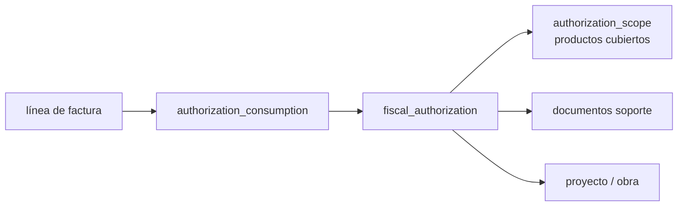

| Entidad | Campos clave |
| --- | --- |
| fiscal\_authorization | tipo (Confotur, otro régimen), beneficiario (party), proyecto, autoridad emisora, número de resolución, fecha emisión, vigencia desde/hasta, monto o cantidad autorizada (si aplica), moneda, condición tributaria resultante, estado (DRAFT → VERIFIED → ACTIVE → SUSPENDED → EXPIRED → EXHAUSTED), verificado por, fecha de verificación |
| authorization\_scope | categorías o SKUs cubiertos, impuestos afectados, límites por ítem |
| authorization\_document | resolución, certificado, carta de no objeción, con hash y versión |
| authorization\_consumption | línea de factura, cantidad, base, impuesto no cobrado, fecha, autorización; restricción: Σ consumo ≤ autorizado |

El Tax Engine consulta autorizaciones ACTIVAS del beneficiario + proyecto + fecha + producto; si una línea está cubierta parcialmente, **divide la línea** en porción cubierta y no cubierta. El flujo proforma → despachado pendiente → factura régimen especial / conversión a crédito fiscal se mantiene, pero el vencimiento del plazo dispara la conversión automática propuesta (humano aprueba) y la verificación del hecho generador de ITBIS (ver J) decide si hay obligación en el mes del despacho.

**RIESGOS.** Autorización vencida sin detectar; cliente usa la autorización de otro proyecto. **MITIGACIÓN.** Estado ACTIVE requiere verificación por Fiscal; alerta 30/15/5 días antes de vencer; la obra del pedido debe coincidir con el proyecto autorizado.

### Decisión 3 — Cost pool de inventario

| Opción | Pro | Contra |
| --- | --- | --- |
| A. Empresa × producto | Simple; un costo | Mezcla plantas con eficiencias distintas; oculta la planta ineficiente; transferencia no mueve costo |
| B. Planta × producto | Refleja costo real de cada planta; transferencias explícitas | Transferencias necesitan regla de costo |
| C. Almacén × producto | Máximo detalle | Mover de patio A a patio B en la misma planta cambia el costo sin causa económica |
| D. Lote / FIFO | Exacto por lote | Carga operativa alta; con miles de racks, costoso y frágil |

**RECOMENDACIÓN: B — área de valuación = empresa × planta**, con control de precio por tipo:

- MP comprada (cemento, agregados comprados, aditivos, repuestos): **promedio ponderado móvil** por área de valuación.
- PT fabricado: **costo estándar** por área de valuación, con prorrateo mensual de variaciones entre inventario final y COGS cuando sean materiales (umbral en ADR-005), para que el inventario se aproxime a costo real (NIC 2).
- Agregados propios de cantera: costo estándar de producción de cantera, igual que PT.
- Costo real por lote se guarda como **memoria analítica** en el Production Ledger (no valúa inventario).

Transferencias entre plantas: dos pasos. Salida de planta A a su costo (estándar o promedio) → IN\_TRANSIT propiedad de la empresa → entrada en planta B al mismo valor + flete interno capitalizable por política (sección 11). Si planta B tiene estándar distinto, la diferencia va a variación de transferencia en B. Entre empresas distintas es venta intercompany, no transferencia.

**RIESGOS.** Estándar desactualizado distorsiona margen. **MITIGACIÓN.** Revisión trimestral; alerta si variaciones acumuladas > 5% del costo.

### Decisión 4 — Base de telemetría

| Opción | Aislamiento de CPU/IO | Aislamiento de WAL, réplica y backup | Operación |
| --- | --- | --- | --- |
| 1. Misma base | Ninguno | Ninguno | Mínima |
| 2. Mismo servidor, base separada | Nulo en CPU/disco | Parcial (mismo clúster = mismo WAL) | Baja |
| 3. Instancia separada | Total | Total | Media |

**RECOMENDACIÓN: 3, instancia separada (PostgreSQL + TimescaleDB) en máquina pequeña propia.** Opción 2 no aísla nada relevante: en PostgreSQL las bases de un mismo clúster comparten WAL, `shared_buffers`, checkpoints y réplica. Una ráfaga de sensores retrasaría la réplica que usa BI y alargaría la restauración del ERP.

Además: el OLTP **no recibe telemetría**, solo eventos de negocio ya agregados por el Edge (ciclo por minuto, cambio de estado, contador de turno). En MVP la instancia de telemetría ni siquiera es necesaria; entra en P2 con mantenimiento predictivo. **RIESGO:** dos bases. **MITIGACIÓN:** la telemetría es descartable/regenerable; RPO relajado (24 h).

### Decisión 5 — Backend: .NET 10 vs NestJS

| Criterio (peso) | .NET 10 / ASP.NET Core | NestJS / TypeScript |
| --- | --- | --- |
| Contabilidad y dinero (alto) | `decimal` de 128 bits nativo, aritmética exacta en todo el runtime | `number` es float; exige librería en cada operación y disciplina perpetua; un solo descuido corrompe montos |
| Concurrencia (alto) | Multihilo real; async maduro; bloqueos y transacciones explícitos con Npgsql | Un hilo por proceso; bien para I/O, débil para cálculo de costeo/MRP |
| PostgreSQL (alto) | Npgsql excelente (tipos, COPY, numeric exacto); EF Core + SQL directo | Drivers buenos; `numeric` llega como string y hay que convertir siempre |
| DDD / modelado (medio) | Tipos de valor, records, pattern matching, analizadores de arquitectura | Posible; sistema de tipos estructural facilita saltarse invariantes |
| Performance (medio) | Muy alto | Alto |
| Mantenimiento 10–15 años (alto) | LTS cada 2 años con 3 años de soporte; ecosistema estable; migraciones de versión predecibles | Ecosistema npm cambia rápido; dependencias transitivas masivas; riesgo de supply chain |
| Contratación en RD (medio) | Demanda consolidada en banca, gobierno y empresas grandes | Oferta amplia, más junior |
| Desarrollo con IA (medio) | Muy bueno; el compilador detecta más errores de la IA | Muy bueno; más errores llegan a runtime |
| Encaje con lo existente (bajo) | Razor ya usado en plantillas ADM | Node en subscriber MQTT |

**RECOMENDACIÓN DEFINITIVA: .NET 10 (LTS) con ASP.NET Core para el backend, Next.js/TypeScript para el frontend.** Se revierte v1. El argumento decisivo es que en un sistema que maneja dinero durante 15 años, la corrección numérica y de tipos debe ser una propiedad del lenguaje, no de la disciplina del equipo.

**RIESGOS.** Dos lenguajes; el sistema contable en curso quizá esté en otro stack. **MITIGACIÓN.** Contratos OpenAPI generan tipos TypeScript del frontend automáticamente; lo ya construido se usa como prototipo funcional y fuente de requisitos, y se migra por módulos (ADR-009).

## 6. Modelo de costos industrial v2 (F. Cost Accountant)

Principio: **el inventario se valúa a costo estándar que incluye solo costos de producto a capacidad normal; todo lo demás es costo del período o variación con nombre propio.** Producir menos no infla el costo unitario del inventario; la diferencia aparece como capacidad ociosa en el estado de resultados.

### 6.1 Estructura de acumulación

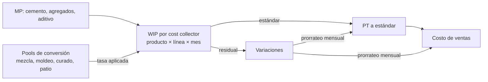

- **Orden operativa** (planificación/ejecución): producto × máquina × turno. No lleva costo.
- **Cost collector** (objeto de costo): versión de producto × línea × mes. Recibe consumos reales y conversión aplicada; entrega PT a estándar; se liquida al cierre de mes. Esto reduce las liquidaciones de cientos a decenas por mes (corrige C-03).
- **Pools de conversión** (centros de costo productivos): Mezcla (por m³ de mezcla), Moldeo por máquina (por hora-máquina operando), Curado (por rack-día), Patio y logística interna (por unidad movida), Calidad (por lote), Administración de planta (por hora-máquina total).

### 6.2 Elementos de costo

| Elemento | Comportamiento | Base de asignación | ¿Costo de producto? | Notas |
| --- | --- | --- | --- | --- |
| Materia prima (cemento, agregados, aditivos, agua) | Variable | Consumo real por collector | Sí | Salida por una sola fuente (C-01) |
| Mano de obra de producción | Semi-fija (cuadrilla por turno) | Hora-máquina del pool de moldeo | Sí, a capacidad normal | Horas extra por ineficiencia = variación |
| Energía | Semi-variable: kWh variable, demanda/cargo fijo | kWh medido por máquina o horas-máquina | Parte variable sí; cargo fijo vía overhead | Cargo de demanda en overhead fijo |
| Depreciación de máquinas | Fija (línea recta contable) | Hora-máquina a capacidad normal | Sí, a capacidad normal | Exceso no absorbido → capacidad ociosa |
| Mantenimiento preventivo | Semi-fijo | Hora-máquina | Sí | Presupuestado en tasa |
| Mantenimiento correctivo | Variable/irregular | Hora-máquina | Normal sí; averías mayores anormales → período | Umbral configurable |
| Moldes | Variable por ciclo | Ciclos del molde | Sí | Depreciación por unidades de producción |
| Tablas/bandejas de producción, consumibles | Semi-variable | Ciclos o racks | Sí | Tablas pueden ser activo con vida en ciclos |
| Overhead de planta (supervisión, seguridad, patio, montacargas) | Fijo | Hora-máquina total a capacidad normal | Sí, a capacidad normal |  |
| Calidad (laboratorio, ensayos rutinarios) | Semi-fijo | Por lote | Sí (inspección normal) | Ensayos extra por falla → COPQ |
| Logística interna (racks a curado y patio) | Semi-variable | Unidad movida | Sí |  |
| Scrap normal | Variable | Factor de rendimiento estándar | Sí, dentro del estándar |  |
| Scrap anormal | — | — | No, gasto del período |  |
| Reproceso | Variable | Orden de reproceso | Normal según política; anormal a gasto |  |
| Administración, ventas, despacho a clientes | Fijo / variable | — | No | Costo del período / costo de servir |

### 6.3 Costo estándar (rollup)

```latex
C_{est} = \frac{\sum_i q_i \, p_i}{1 - s_n} + \sum_k \frac{h_k}{u} \, (r^{var}_k + r^{fix}_k) + \frac{c_{molde}}{u_{ciclo}} + o_{lote}
```

q = cantidad de material por batch estándar, p = precio estándar, s\_n = tasa de scrap normal, h\_k/u = horas del pool k por unidad, r = tasas variable y fija del pool, c\_molde = costo por ciclo del molde, u\_ciclo = unidades por ciclo, o\_lote = calidad por unidad. El estándar se versiona por producto × planta × período; nunca se sobrescribe.

### 6.4 Capacidad y capacidad ociosa

| Concepto | Definición | Uso |
| --- | --- | --- |
| Capacidad teórica | Ciclo ideal × 24 h × 365 d | Referencia OEE; no para costos |
| Capacidad práctica | Teórica menos paradas planificadas inevitables (limpieza, mantenimiento, turnos programados) | Techo de planificación |
| Capacidad normal | Producción esperada promedio en varios períodos en circunstancias normales, incluyendo paradas planificadas y estacionalidad | **Denominador de la tasa fija** |
| Capacidad real | Horas-máquina efectivamente operadas en el período | Absorción real |
| Capacidad ociosa | Normal − real, cuando real < normal | Variación al gasto |

```latex
r^{fix}_k = \frac{Presupuesto\ fijo_k}{H^{normal}_k} \qquad VarOciosa_k = r^{fix}_k \times (H^{normal}_k - H^{real}_k)
```

Si real < normal, la parte no absorbida es **gasto del período** (NIC 2 exige que los costos fijos se asignen con base en capacidad normal y que lo no asignado se reconozca como gasto). Si real > normal, la tasa efectiva se reduce para que el inventario no quede por encima del costo real: el exceso absorbido vuelve como variación favorable prorrateada. Así, un mes de poca demanda muestra "capacidad ociosa RD 1.2 M" en el estado de resultados en lugar de un block 6" que "subió 18%".

### 6.5 Variaciones del cost collector

| Variación | Fórmula | Cuenta |
| --- | --- | --- |
| Precio de material | (p\_real − p\_est) × q\_real | Variación precio MP |
| Uso de material | (q\_real − q\_est permitida para producción buena + scrap normal) × p\_est | Variación uso MP |
| Rendimiento / scrap anormal | Unidades perdidas sobre normal × costo estándar acumulado en ese punto | Scrap anormal (gasto, no variación prorrateable) |
| Eficiencia de conversión | (H\_real − H\_est permitidas) × r^var | Variación eficiencia |
| Gasto variable | Gasto real variable − H\_real × r^var | Variación gasto |
| Gasto fijo (presupuesto) | Gasto real fijo − presupuesto fijo | Variación presupuesto |
| Volumen / capacidad ociosa | Sección 6.4 | Capacidad ociosa (gasto) |

Al cierre: las variaciones **prorrateables** (precio, uso, eficiencia, gasto) se distribuyen entre PT en inventario y COGS del mes según las unidades del período, si superan el umbral de materialidad; scrap anormal y capacidad ociosa **nunca** se capitalizan.

### 6.6 Scrap normal y anormal

Scrap normal = tasa estándar s\_n por producto y máquina (ej. 1.5%, configurable y aprobada). Está dentro del costo estándar: no genera asiento aparte.

Scrap anormal: el exceso sobre s\_n, medido por punto de detección (desmoldeo, curado, patio, carga).

- Detectado en proceso (antes de PT): Dr Scrap anormal (gasto) / Cr WIP, al costo estándar acumulado hasta ese punto.
- Detectado en PT (patio, carga): Dr Scrap anormal / Cr PT, a costo estándar total.
- Si el material se tritura y vuelve como agregado reciclado: Dr Inventario agregado reciclado (a valor neto realizable o cero según política) / Cr Scrap anormal.
- Roturas en tránsito con camión propio antes de POD: Dr Pérdida en tránsito / Cr PT en tránsito (cuenta separada para medir logística).

### 6.7 Reproceso

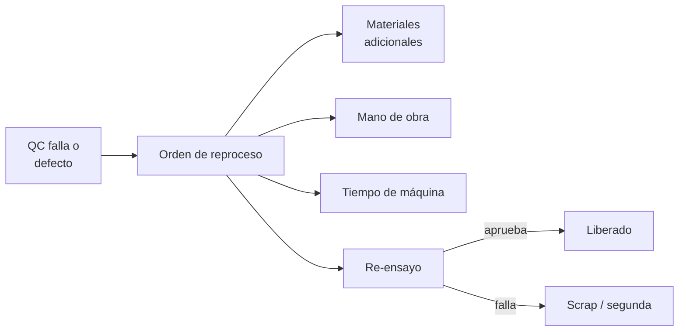

En block de hormigón el reproceso físico es limitado (no se "repara" un block); los casos reales son reclasificación a segunda calidad, recorte, reempaque y **re-ensayo** con muestras adicionales. La orden de reproceso es un cost collector propio: acumula materiales, horas y ensayos. Si la falla es normal (dentro de tasa esperada) el costo va a overhead de calidad; si es anormal va a gasto del período. Reclasificar a segunda calidad reduce el valor a su valor neto realizable: Dr Pérdida por reclasificación / Cr PT.

### 6.8 COPQ — Costo de mala calidad

```latex
COPQ = Scrap_{anormal} + Reproceso + Reclasificaci\acute{o}n + Reclamos + Devoluciones + Downtime_{calidad} + Ensayos_{extra}
```

Se informa por mes, planta, máquina, producto y causa, en pesos y como % de ventas. Reclamos y devoluciones incluyen flete de retorno y notas de crédito por calidad. Downtime por calidad = paradas con causa de calidad × margen de contribución perdido.

## 7. Inventario v2

### 7.1 Inventory Ownership Model

Cada unidad de stock tiene **cuatro atributos independientes**; v1 los mezclaba en un solo "estado".

| Atributo | Valores | Quién lo cambia |
| --- | --- | --- |
| Ubicación física | Planta › almacén › zona › ubicación; IN\_TRANSIT (vehículo); CUSTOMER\_SITE (obra) | Movimientos físicos: portón, POD, transferencia |
| Propiedad legal | Empresa del grupo / cliente / proveedor (consignación recibida) | Policy Engine de control (Decisión 1) y contratos |
| Propiedad contable | Sí/No en el balance de la empresa; cuenta (MP, WIP, PT, en tránsito, en consignación) | Posting Engine, derivado de la propiedad legal |
| Disponibilidad | AVAILABLE, RESERVED, QUALITY\_HOLD, BLOCKED, CONDITIONAL, NOT\_PROMISABLE | Calidad, ventas, reservas |

Ejemplo: 5,000 Block 6" en camión C-12 rumbo a obra con término "entregado en obra". Ubicación = IN\_TRANSIT/C-12; propiedad legal = Block Rochell; contable = PT en tránsito (en balance); disponibilidad = NOT\_PROMISABLE (ya comprometido a ese pedido). Con término "retira en planta", el mismo camión (del cliente) tendría propiedad legal = cliente y no estaría en el balance.

### 7.2 Inventory Ledger v2 — cantidad y valor separados

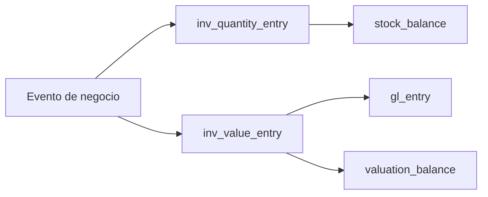

| Tabla | Campos esenciales |
| --- | --- |
| `inv_quantity_entry` | entry\_id, event\_id, company, plant, location, item, lot, ownership\_state, availability, qty (+/−), uom\_base, qty\_original + uom\_original + conversión usada, occurred\_at, posting\_date |
| `inv_value_entry` | entry\_id, event\_id, quantity\_entry\_id (nullable: revaluaciones y landed cost no tienen cantidad), valuation\_area (empresa × planta), item, amount (+/−), value\_type (compra, estándar, variación, revaluación, landed cost), posting\_date, gl\_entry\_id |

Por qué separarlos: un landed cost que llega tarde, una revaluación por cambio de estándar o una corrección de precio de compra afectan valor **sin mover una sola unidad**. En v1 obligaban a inventar movimientos de cantidad cero o a editar costos. Además permite detectar "cantidad correcta, valor incorrecto".

Triángulo de conciliación, diario y al cierre:

```latex
\sum Q_{ledger} = Q_{stock\_balance} = Q_{f\acute{i}sica\ contada}\qquad \sum V_{ledger} = V_{valuation\_balance} = Saldo_{GL\ inventario}
```

Y una verificación cruzada: para cada ítem de área de valuación con cantidad cero, el valor debe ser cero (valor huérfano = error).

Método de actualización atómica (corrige C-06):

```sql
-- Conceptual: reservar solo si hay disponible; 0 filas = no alcanza
UPDATE inv.stock_balance
   SET qty_reserved = qty_reserved + :q, version = version + 1
 WHERE company_id = :c AND location_id = :l AND item_id = :i
   AND lot_id = :lot AND stock_status = 'AVAILABLE'
   AND qty_on_hand - qty_reserved >= :q;
```

### 7.3 Production Ledger v2 — qué registra y qué no

| Pregunta | Inventory Ledger | Production Ledger |
| --- | --- | --- |
| ¿Dónde está y de quién es? | Sí | No |
| ¿Cuánto vale? | Sí | No (solo costo analítico real por lote como memoria) |
| ¿Qué entró a la transformación? | El movimiento de salida de MP | El vínculo input → run → output, con consumo teórico, real y diferencia |
| ¿Qué proceso ocurrió? | No | Máquina, molde, receta, turno, ciclos, horas, parámetros |
| ¿Qué se perdió y dónde? | Solo el ajuste final de scrap | Pérdidas por punto (desmoldeo, curado, patio) y causa |
| ¿Qué salió? | La entrada de PT | La relación output ↔ inputs y el rendimiento |

Regla anti-duplicidad: **el Production Ledger nunca contiene cantidades que muevan stock**. Toda salida/entrada de inventario se escribe una sola vez en el Inventory Ledger; el Production Ledger referencia esos `quantity_entry_id`. El consumo teórico vive solo en el Production Ledger como cifra analítica.

Fuente de salida de material (corrige C-01), configurada por material × planta:

| Modo | Cuándo | Salida de inventario |
| --- | --- | --- |
| MEASURED | Báscula de dosificación integrada | Por batch real |
| SHIFT\_SUMMARY | Sin integración (MVP) | Batches confirmados en el resumen de turno × receta, con corrección de humedad |
| BACKFLUSH | Materiales menores (aditivo) | Racks buenos × BOM estándar |

Un material tiene exactamente un modo activo; el sistema rechaza el segundo tipo de salida.

### 7.4 Silo de cemento

| Entidad | Campos |
| --- | --- |
| silo | id, planta, capacidad (t), material, estado, sensor asociado |
| silo\_receipt | camión, proveedor, ticket de báscula (neto), peso guía del proveedor, silo destino, lote de cemento, hora |
| silo\_consumption | por batch o resumen de turno (según modo), kg |
| silo\_reading | nivel del sensor o medición manual (varilla), convertido a t con la curva del silo (versionada) |
| silo\_reconciliation | fecha, teórico, medido, diferencia, % , estado (OK / investigar / ajuste aprobado) |

```latex
Te\acute{o}rico_t = Te\acute{o}rico_{t-1} + Recepciones_{b\acute{a}scula} - Consumos_{batch}
```

Tolerancia configurable (ej. ±2% de capacidad). Fuera de tolerancia se abre investigación; el ajuste requiere aprobación y va a variación de uso o merma. La diferencia entre peso de báscula propia y guía del proveedor alimenta el scorecard del suplidor.

### 7.5 Agregados: volumen, peso, densidad y humedad

Unidad base de inventario para agregados: **tonelada seca**. Justificación: la báscula mide masa; el volumen cambia con compactación y la humedad cambia el peso sin cambiar el material útil.

Toda conversión se registra como hecho auditable:

| Campo | Ejemplo |
| --- | --- |
| conversion\_id | CNV-2026-004411 |
| de → a | 18.0 m³ suelto → 26.46 t húmedas → 25.20 t secas |
| densidad aparente usada | 1.47 t/m³ (suelto) |
| humedad usada | 5.0% |
| origen de la densidad | Ensayo LAB-2026-0912, fecha, stockpile |
| vigencia | desde/hasta |

Compras facturadas por m³ de camión guardan cantidad facturada en m³ y cantidad de inventario en t secas con su conversión. Mediciones topográficas de stockpile (volumen) se convierten con la densidad vigente del stockpile; el ajuste resultante muestra por separado cuánto se debe a cambio de densidad y cuánto a diferencia física.

## 8. Eventos, idempotencia, concurrencia, tiempo y períodos

### 8.1 Garantías de entrega (at-least-once)

Se asume que **todo mensaje puede llegar dos veces, tarde o fuera de orden**. La corrección se logra con cuatro identificadores de propósito distinto:

| Identificador | Qué identifica | Dónde se impone |
| --- | --- | --- |
| `idempotency_key` | La **intención** de un comando (lo genera el cliente: UI, Edge, app de combustible) | `UNIQUE(company_id, command_type, idempotency_key)` en `command_log`; repetir devuelve el resultado original |
| `event_id` | Un evento emitido (UUIDv7) | `UNIQUE` en outbox y en el `inbox` de cada consumidor |
| `sequence_number` | Orden dentro de un stream externo (Edge por máquina, e-CF por serie) | `UNIQUE(stream_id, seq)`; detección de huecos |
| `aggregate_version` | Versión del agregado (pedido, factura, OC) | Bloqueo optimista: `UPDATE … WHERE version = :v` |

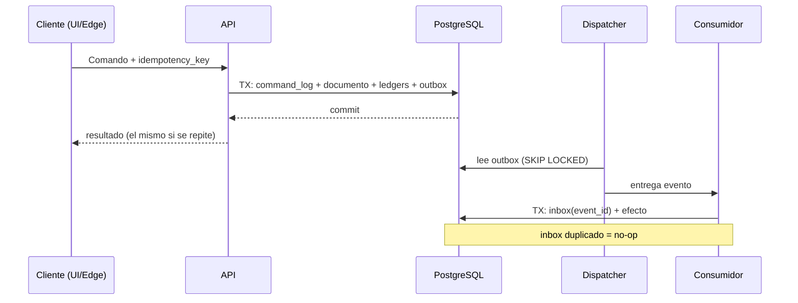

Cómo se evita cada duplicado:

| Riesgo | Barrera |
| --- | --- |
| Factura duplicada | idempotency\_key del comando; `UNIQUE` de vínculo documental (una línea de conduce solo puede facturarse hasta su cantidad, vía tabla de saldo facturable con CHECK); e-NCF único por serie; el Gateway usa el e-NCF como clave idempotente ante el proveedor |
| Inventario duplicado | `UNIQUE(source_event_id, entry_role)` en `inv_quantity_entry`; asientos `UNIQUE(source_event_id, rule_id)` |
| Rack duplicado | Rack derivado del Edge: `UNIQUE(machine_id, shift_id, rack_seq)`; rack manual: idempotency\_key de la tablet |
| Pago duplicado | `UNIQUE(bank_account_id, bank_reference, amount, value_date)` en recibos importados; aplicación con bloqueo de factura |
| Ciclo duplicado del PLC | `UNIQUE(machine_id, edge_stream_id, seq)` |

Fuera de orden: los efectos se ordenan por `occurred_at` y `seq`, no por llegada. Para máquinas, el MES retiene eventos 60 s y reordena; un hueco de `seq` sin llenar tras 10 min se marca `GAP` y el intervalo queda UNKNOWN (nunca se inventa producción). Datos incompletos del Edge (campo faltante, valor fuera de rango físico) van a cuarentena con estado REQUIRES\_ACTION.

Falla a mitad de transacción: documento, ledgers, command\_log y outbox se escriben en **una sola transacción**; o todo o nada. Las llamadas externas (e-CF, bancos, correo) ocurren después, desde el outbox.

### 8.2 Concurrencia — escenarios

| Escenario | Estrategia | Por qué esa |
| --- | --- | --- |
| Dos despachadores reservan el mismo inventario | UPDATE condicional atómico sobre `stock_balance` (sección 7.2) | Sin ventana de carrera; sin bloqueo largo |
| Dos compradores reciben contra la misma OC | `SELECT … FOR UPDATE` de la línea de OC + CHECK `received ≤ ordered × (1 + tolerancia)` | Pocas colisiones; cola corta |
| Dos pagos aplican a la misma factura | `FOR UPDATE` en `invoice_open_balance` + CHECK `open_amount ≥ 0` | La restricción es la última defensa |
| La máquina manda el mismo ciclo dos veces | `UNIQUE(machine_id, stream, seq)` + `INSERT … ON CONFLICT DO NOTHING` | Idempotencia pura |
| Dos usuarios editan el mismo pedido en borrador | Bloqueo optimista por `aggregate_version`; el segundo recibe conflicto y recarga | UI sin bloqueos |
| Asignación de e-NCF | `FOR UPDATE` sobre la fila de la serie; incremento dentro de la transacción de emisión | Sin huecos ni duplicados |
| Cierre de período mientras se postea | `SERIALIZABLE` en la transacción de cierre + chequeo de período abierto dentro de cada posteo con bloqueo compartido de la fila del período | Pocas transacciones, alto valor |

Regla: SERIALIZABLE solo en cierre, costeo mensual y revaluación. El resto en READ COMMITTED con las barreras indicadas; los deadlocks se evitan ordenando los bloqueos siempre por (tipo de entidad, id).

### 8.3 Modelo temporal

| Fecha | Significado | Quién la fija | ¿Editable? |
| --- | --- | --- | --- |
| `occurred_at` | Instante en que el hecho físico ocurrió (camión salió, rack cerrado) | Dispositivo o usuario, con evidencia | No; corrección por reversa |
| `recorded_at` | Instante en que el sistema lo registró | Servidor | Nunca |
| `business_date` | Día operativo al que pertenece (un turno nocturno que cruza medianoche pertenece al día en que inició) | Calendario de turnos de la planta | No |
| `posting_date` | Fecha contable del asiento; debe caer en un período contable abierto | Posting Engine según reglas de período | No; se revierte y re-postea |
| `effective_date` | Desde cuándo rige un dato maestro o regla (precio, tasa, receta, impuesto) | Aprobador del maestro | Nueva versión |

Fecha fiscal: la del documento fiscal (fecha de emisión del e-CF), que no se retrocede.

**Caso: conduce del 31/03 registrado el 02/04 con marzo cerrado.**

1. `occurred_at` = 31/03 16:40 (declarado por el despachador, con foto del conduce firmado; si difiere > 24 h de `recorded_at`, requiere aprobación del supervisor).
2. `business_date` = 31/03. Los reportes operativos de marzo (producción, despachos, OTIF) lo incluyen, marcados "registrado tarde".
3. Inventario: si el período de inventario de marzo está abierto, la salida postea en marzo. Si está cerrado, `posting_date` = 01/04 y el reporte de cut-off de marzo lo lista como diferencia explicada entre físico (conteo 31/03) y libros.
4. Contable: mismo criterio. El Controller decide: aceptar el efecto en abril (inmaterial) o reabrir marzo con aprobación. El usuario nunca cambia fechas.
5. Fiscal: si la regla verificada dice que el hecho generador ocurrió en marzo, el Tax Reconciliation Center lo marca como partida a regularizar en la declaración correspondiente; el e-CF lleva fecha de emisión real.

### 8.4 Control de períodos

| Período | Qué bloquea | Cierra cuando |
| --- | --- | --- |
| Operativo (día/turno) | Registros de producción, paradas y despachos de ese día | Supervisor confirma turno; auto-cierre a las 48 h |
| Inventario (mes) | Movimientos con `posting_date` en el mes | Conteos, silo y stockpiles conciliados; costeo mensual ejecutado |
| Contable (mes, por empresa) | Asientos en el mes | Inventario cerrado, subledgers conciliados, accruals posteados |
| Fiscal (mes, por empresa e impuesto) | Documentos fiscales del mes en reportes 606/607/608/609, IT-1, IR-17 | Reconciliación fiscal sin diferencias; reporte generado con snapshot y hash |

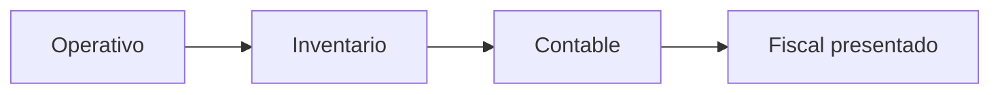

Dependencias: no se cierra inventario con días operativos abiertos; no se cierra contable con inventario abierto; el período fiscal puede **generarse** antes del cierre contable (los plazos de DGII no esperan), pero se **marca presentado** solo tras la reconciliación. Reabrir un período reabre en cascada los posteriores de la cadena (reabrir inventario reabre contable). Reabrir un período fiscal ya presentado no se permite: cualquier cambio genera una rectificativa. Toda reapertura: motivo, aprobación nivel 2, ventana de tiempo, y reporte de lo que cambió entre cierre y re-cierre.

## 9. Trazabilidad v2

### 9.1 Trazabilidad garantizada por construcción

v1 dependía de que cada caso de uso insertara filas en `trace_link`. v2 invierte la dirección: **la trazabilidad es una vista derivada de hechos que ya son obligatorios por constraint**. Si falta un enlace, la transacción de negocio misma falla.

| Salto | Hecho obligatorio que lo garantiza |
| --- | --- |
| Lote MP → batch | `batch_input` (batch\_id NOT NULL, quantity\_entry\_id NOT NULL → lote MP) |
| Batch → rack | `rack_batch_contribution` generada al crear el rack por la ventana de tiempo de alimentación |
| Rack → lote PT | `rack.fg_lot_id NOT NULL` desde su creación |
| Lote PT → conduce | `inv_quantity_entry.lot_id NOT NULL` en toda salida de PT + `document_line_id NOT NULL` |
| Conduce → factura → pago | `document_line_link` (9.3) con saldos facturable/cobrable |
| Cualquier ledger → evento → documento | `source_event_id NOT NULL`, `source_document_id NOT NULL` |

`trace_link` pasa a ser una **vista materializada** (refrescada cada 15 min y bajo demanda) que une estos hechos; ya no es tabla de escritura. Controles de respaldo:

- Prueba de arquitectura en CI: toda tabla de ledger debe tener `source_event_id NOT NULL` y FK.
- Verificación nocturna del Data Quality Engine: lotes PT sin racks, racks sin batch, salidas sin lote, facturas sin conduce (cuando el término lo exige) → ERROR.

### 9.2 Cardinalidades batch / rack / lote / entrega

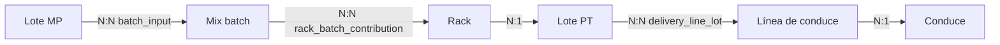

| Relación | Cardinalidad | Tabla | Atributo que la hace útil |
| --- | --- | --- | --- |
| Lote MP ↔ batch | N:N | `batch_input` | kg de cada lote en el batch |
| Batch ↔ rack | N:N | `rack_batch_contribution` | fracción estimada del rack aportada por el batch (tolva mezcla dos descargas) |
| Rack → lote PT | N:1 | FK en rack | unidades del rack |
| Lote PT ↔ línea de conduce | N:N | `delivery_line_lot` | unidades de cada lote en la línea |

Asignación batch → rack: al descargar un batch a la tolva a la hora t, se asigna a los racks producidos entre t y la descarga siguiente, ponderado por ciclos. La fracción es **estimada** y se marca así; basta para un recall (resolución de lote PT = máquina × producto × turno × día).

### 9.3 Document Graph

Además de la trazabilidad física, la cadena documental. Un documento conoce sus vecinos mediante `document_link` con tipos controlados (enum en base de datos), a nivel de cabecera y de línea.

| link\_type | De → a | Semántica | Cantidad/monto |
| --- | --- | --- | --- |
| QUOTED\_AS | Cotización → Pedido | El pedido se originó en la cotización | — |
| FULFILLS | Conduce → Pedido | El despacho cumple líneas del pedido | Cantidad |
| INVOICES | Factura → Conduce / Pedido | La factura cobra lo despachado o lo pedido (anticipo) | Cantidad y monto |
| SETTLES | Pago → Factura | El pago liquida la factura | Monto |
| CREDITS | Nota de crédito → Factura | Reduce la factura | Monto |
| DEBITS | Nota de débito → Factura | Aumenta la factura | Monto |
| REVERSES | Documento → Documento | Anula el efecto completo | — |
| RECEIVES | Recepción → OC | Recibe líneas de la OC | Cantidad |
| BILLS | Factura proveedor → Recepción / OC | 3-Way Match | Cantidad y monto |
| COVERED\_BY | Línea de factura → Autorización fiscal | Exención aplicada | Monto |
| TRANSFERS\_TO | Transferencia salida → Transferencia entrada | Dos pasos entre plantas | Cantidad |

Reglas que eliminan ambigüedad:

- Tabla `document_link_rule(from_type, to_type, link_type, max_cardinality)`: solo se permiten pares declarados.
- Saldos por línea: `qty_linked ≤ qty_source` por tipo de vínculo (no se puede facturar dos veces lo mismo).
- `parent_document` no existe como columna libre; es una consulta sobre el grafo con un tipo específico.
- Un vínculo es inmutable; deshacerlo requiere un documento REVERSES.

## 10. Máquinas, moldes y liberación de calidad

### 10.1 Machine Data Model

Se separan **posición** (functional location: el hueco donde va algo) de **equipo** (el objeto serializado que se instala ahí). Así un vibrador reparado que se mueve de la Besser de Planta 1 a la de Planta 2 conserva su historia.

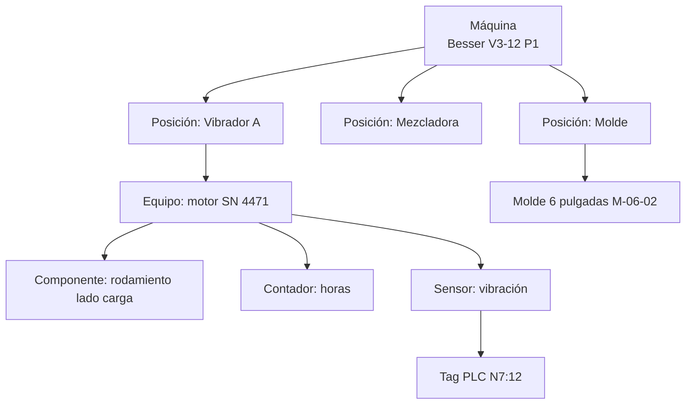

| Entidad | Rol | Claves |
| --- | --- | --- |
| machine | Unidad productiva y centro de trabajo; objeto de OEE y costo | fabricante, modelo, serial, planta, centro de costo (NOT NULL) |
| functional\_location | Posición jerárquica dentro de la máquina | ruta (P1/BESSER1/VIB-A) |
| equipment | Objeto serializado instalable (motor, reductor, vibrador) | serial, activo fijo opcional |
| component | Pieza de desgaste dentro de un equipo (rodamiento, correa) | vida esperada, repuesto asociado |
| counter | Medida acumulativa y monótona (horas, ciclos, km, unidades) | fuente: tag, manual, derivado |
| sensor | Medición continua (temperatura, vibración, corriente) | unidad, rango físico válido |
| tag | Dirección en PLC/HMI y su mapeo | dirección, tipo, escala, versión del mapeo |
| tooling | Herramental: moldes, tablas/bandejas | vida en ciclos |
| installation\_history | Qué equipo/molde estuvo en qué posición y cuándo | desde/hasta, lecturas de contador al instalar y retirar |

Mantenimiento se asigna al nivel más bajo conocido (componente > equipo > posición > máquina) y el costo sube por la jerarquía a la máquina y al pool de moldeo. Los mapeos de tags son versionados: un cambio en el programa RSLogix 500 crea una nueva versión del mapeo, y los datos antiguos siguen interpretándose con la versión antigua.

### 10.2 Mold Lifecycle y Mold History

| Evento | Datos | Efecto contable |
| --- | --- | --- |
| PURCHASED | proveedor, costo, landed cost, vida estimada en ciclos | Capitaliza como activo (herramental) |
| INSTALLED | máquina, posición, ciclos acumulados al instalar | Inicia conteo de ciclos en esa máquina |
| REMOVED | motivo (cambio de producto, desgaste, reparación), ciclos | Cierra intervalo |
| INSPECTED | medidas de desgaste (cavidades, placas), resultado, fotos | Puede revisar vida remanente |
| REPAIRED | taller, costo, trabajo | Gasto de mantenimiento del molde |
| HARDFACED | costo, ciclos agregados estimados | Capitaliza si extiende vida más allá de la original (política); si solo restaura, gasto |
| SCRAPPED | ciclos finales, motivo | Baja del activo |

Depreciación por unidades de producción:

```latex
Costo_{ciclo} = \frac{Costo_{capitalizado} - Valor_{residual}}{Vida_{estimada\ en\ ciclos}} \qquad Vida_{remanente} = Vida_{estimada} - Ciclos_{acumulados}
```

La página existente "Gestión de moldes" del portal se usa como fuente de migración de la historia actual.

### 10.3 Liberación de calidad configurable

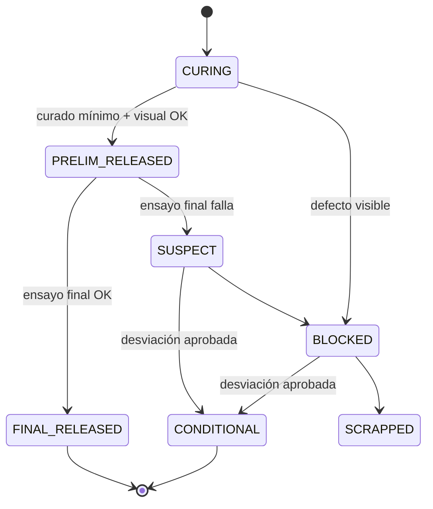

| Estado | ¿Despachable? | Condición |
| --- | --- | --- |
| CURING | No | Menos del curado mínimo del producto |
| PRELIM\_RELEASED | Sí, si la política del cliente/norma lo permite | Curado mínimo cumplido; dimensiones, peso e inspección visual dentro de especificación; ensayo temprano (ej. 7 días) si la política lo exige |
| FINAL\_RELEASED | Sí | Ensayo final (edad definida por la norma/contrato) aprobado |
| SUSPECT | No para nuevos despachos | Ensayo final falló; dispara recall hacia adelante sobre lo ya despachado |
| CONDITIONAL | Solo a clientes que aceptan la desviación | Desviación aprobada por Calidad + aceptación del cliente documentada |
| BLOCKED | No | Defecto o falla sin resolución |
| SCRAPPED | No | Scrap o reclasificación |

Política `release_policy(product, customer | contract | standard, min_cure_hours, early_test_required, final_test_age_days, allow_prelim_dispatch)`, versionada. Contrato con especificación estricta (ej. proyecto que exige ensayo final antes de entrega) sobreescribe la política general. Si un lote PRELIM\_RELEASED despachado falla el ensayo final, el sistema usa la trazabilidad hacia adelante para listar obras, conduces y cantidades, abre un caso de calidad y reclamo potencial, y registra provisión si procede.

## 11. Landed cost, rentabilidad de transporte y costo de crédito

### 11.1 Landed cost

Política configurable `capitalization_policy(company, cost_type, item_category, treatment, allocation_basis, effective_from)`, aprobada por el Controller y el auditor. Valores por defecto propuestos (alineados con NIC 2, a confirmar):

| Costo | Tratamiento por defecto | Base de prorrateo |
| --- | --- | --- |
| Precio de compra neto de descuentos | Capitaliza | — |
| Aranceles e impuestos no recuperables | Capitaliza | Valor |
| ITBIS recuperable | No capitaliza (activo fiscal) | — |
| Flete internacional, seguro | Capitaliza | Peso o valor |
| Gastos de puerto, agente aduanal | Capitaliza | Valor |
| Transporte contratado hasta planta | Capitaliza | Peso |
| Transporte propio hasta planta | Capitaliza a **tasa estándar por t-km** (crédito a cuenta de absorción de flota); la diferencia con el costo real de flota queda en variación de flota | Peso × distancia |
| Almacenamiento posterior a la llegada | Gasto | — |
| Demoras, multas, mermas anormales | Gasto | — |
| Diferencia cambiaria posterior al reconocimiento | Gasto/ingreso financiero | — |

Landed cost que llega después de que parte del lote se consumió: entrada de valor a inventario por la fracción remanente y a variación/COGS por la consumida (sección 4, Controller).

### 11.2 Rentabilidad de transporte

Pregunta: ¿ganamos con el block pero perdemos en el transporte? Se separan cuatro números por pedido, cliente y obra:

| Concepto | Origen |
| --- | --- |
| Ingreso de producto | Líneas de producto de la factura |
| Ingreso de flete | Línea de servicio de flete; si el precio es "entregado" sin separar, se asigna por precio de venta independiente de la tarifa de flete vigente |
| Costo de producto | COGS a estándar + variaciones prorrateadas |
| Costo de flete | Costo real del viaje (sección 8 de v1) asignado a los conduces del viaje por peso |

```latex
Margen_{producto} = Ingreso_{producto} - COGS \qquad Margen_{flete} = Ingreso_{flete} - Costo_{viaje\ asignado}
```

Viajes con carga parcial y retorno vacío cargan su costo completo al pedido: el reporte debe mostrar la **utilización del camión** junto al margen de flete, porque ahí suele estar la pérdida.

### 11.3 Costo de crédito y contribución por cliente

```latex
Costo_{cr\acute{e}dito} = \sum_{d} Saldo_{d} \times \frac{i}{365}
```

Saldo diario de CxC del cliente (neto de anticipos), tasa i = costo de deuda marginal de la empresa o WACC (parámetro aprobado por el CFO, versionado). Alternativa simplificada para pantallas: saldo promedio × DSO real × i / 365.

| Línea | Fuente |
| --- | --- |
| Ingreso | Facturas netas de notas de crédito comerciales |
| − Costo de producto | COGS |
| − Flete | Costo de viajes asignado |
| − Descuentos | Descuentos comerciales y por pronto pago |
| − Devoluciones y reclamos | Notas de crédito por calidad + costo de retorno |
| − Costo de crédito | Fórmula anterior |
| − Costo de cobranza | Gestiones, comisiones bancarias, legales asignadas |
| = Contribución del cliente |  |

Se muestra en pesos, por unidad entregada y como % del ingreso. Clientes con contribución negativa aparecen en la vista de excepciones de dirección.

## 12. Máquinas de estado formales y estados de error

### 12.1 Implementación común

- Cada estado es un valor de un **enum de PostgreSQL** por tipo de documento (no texto libre).
- Transiciones permitidas en tabla `state_transition(doc_type, from_state, to_state, command, required_permission, guard)`; el cambio de estado solo ocurre mediante un comando que valida la fila y escribe `state_history` (quién, cuándo, desde, hacia, motivo, event\_id).
- Un trigger rechaza cualquier UPDATE de la columna de estado que no venga acompañado de su fila de historia en la misma transacción.
- Estados terminales no tienen salida; la corrección es otro documento.

### 12.2 Máquinas por documento

| Documento | Estados | Transiciones clave y guardas | Terminales |
| --- | --- | --- | --- |
| Sales Order | DRAFT, PENDING\_CREDIT, CONFIRMED, PARTIALLY\_DELIVERED, DELIVERED, PARTIALLY\_INVOICED, CLOSED, CANCELLED | CONFIRMED requiere crédito aprobado y precio vigente; CANCELLED solo sin despachos; CLOSED cuando entregado = facturado o cierre manual con motivo | CLOSED, CANCELLED |
| Purchase Order | DRAFT, PENDING\_APPROVAL, APPROVED, SENT, PARTIALLY\_RECEIVED, RECEIVED, CLOSED, CANCELLED | APPROVED por matriz de aprobación; cambios después de APPROVED crean revisión y vuelven a PENDING\_APPROVAL | CLOSED, CANCELLED |
| Production Order (operativa) | PLANNED, RELEASED, RUNNING, PAUSED, COMPLETED, CLOSED | RUNNING requiere molde instalado compatible; COMPLETED al cerrar turno; CLOSED cuando racks conciliados | CLOSED |
| Cost Collector | OPEN, SETTLING, SETTLED | SETTLED solo en cierre de inventario | SETTLED |
| Delivery (conduce) | PLANNED, LOADING, LOADED, GATE\_OUT, IN\_TRANSIT, DELIVERED, DELIVERED\_WITH\_EXCEPTIONS, RETURNED, CANCELLED | GATE\_OUT exige peso de báscula dentro de capacidad; DELIVERED exige POD; CANCELLED solo antes de GATE\_OUT | DELIVERED, DELIVERED\_WITH\_EXCEPTIONS, RETURNED, CANCELLED |
| Invoice | DRAFT, ISSUING, ISSUED, PARTIALLY\_PAID, PAID, CREDITED | ISSUING solo con e-NCF asignado; ISSUED cuando e-CF ACCEPTED o en contingencia válida; nunca vuelve a DRAFT | PAID, CREDITED |
| Payment (recibo) | RECORDED, DEPOSITED, MATCHED, APPLIED, PARTIALLY\_APPLIED, BOUNCED, REVERSED | MATCHED por conciliación bancaria; BOUNCED reabre facturas y genera cargo si aplica | APPLIED, REVERSED |
| Quality Lot | CURING, PRELIM\_RELEASED, FINAL\_RELEASED, SUSPECT, CONDITIONAL, BLOCKED, SCRAPPED | Sección 10.3 | FINAL\_RELEASED, CONDITIONAL, SCRAPPED |
| Maintenance Order | REQUESTED, APPROVED, PLANNED, IN\_PROGRESS, WAITING\_PARTS, COMPLETED, CLOSED, CANCELLED | CLOSED exige horas, repuestos y lecturas de contador; costo se liquida al cerrar | CLOSED, CANCELLED |

### 12.3 e-CF (dentro del Gateway)

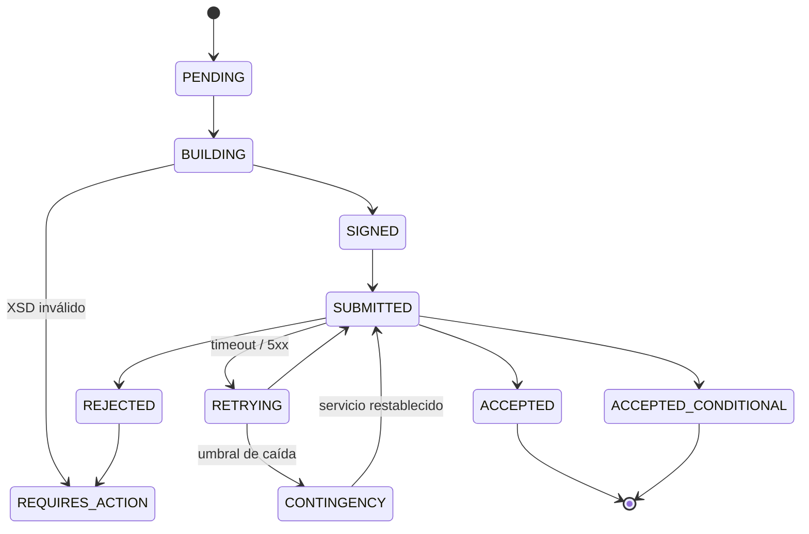

REJECTED no reusa el e-NCF si la norma no lo permite (a verificar); la corrección sigue el procedimiento vigente. Cada reintento reenvía el mismo XML firmado con la misma clave idempotente; nunca se regenera el documento en un reintento.

### 12.4 Estados de error de integraciones

Toda tarea de integración (e-CF, consulta RNC, banco, Edge, combustible, correo, GPS) usa el mismo ciclo de vida en `integration_job`:

| Estado | Significado | Siguiente acción |
| --- | --- | --- |
| PENDING | En cola | Worker la toma |
| PROCESSING | Tomada por un worker (con lease de tiempo) | Si el lease expira, vuelve a PENDING |
| RETRYING | Falla transitoria (timeout, 5xx, sin red) | Reintento con backoff exponencial + jitter; `attempt`, `next_attempt_at` |
| REQUIRES\_ACTION | Falla que un humano puede corregir (dato inválido, RNC inexistente, rechazo de negocio) | Aparece en la bandeja del dueño con el error legible; al corregir, vuelve a PENDING |
| FAILED\_PERMANENTLY | Agotó reintentos o error no recuperable | Alerta CRITICAL; requiere decisión documentada (reemitir, anular, escalar) |
| SUCCEEDED | Completada | — |
| CANCELLED | Anulada por un humano con motivo | — |

Cada tarea guarda `correlation_id`, payload de solicitud y respuesta (con datos sensibles enmascarados), número de intentos y el último error clasificado (TRANSIENT, VALIDATION, BUSINESS, AUTH, UNKNOWN). Límites de reintento por integración: e-CF sin límite de tiempo hasta contingencia; banco 24 h; RNC 1 h y luego REQUIRES\_ACTION.

## 13. Explainability, Reconciliation Engine y Data Quality Engine

### 13.1 "Explain this entry"

Cada línea de asiento guarda lo necesario para explicarse sin reconstrucciones: `source_event_id`, `source_document_id`, `posting_rule_id`, `posting_rule_version`, `rule_line_id` (qué línea de la regla generó esta pata), `determination_inputs` (JSON congelado con los valores usados: categoría de producto, almacén, condición fiscal, tasa, precio estándar) y `tax_determination_id` si aplica.

Cada línea de regla de posteo tiene una **plantilla de explicación** versionada con la regla:

| Campo de la regla | Ejemplo |
| --- | --- |
| Condición | event = ControlTransferred AND delivery\_term = DELIVERED\_SITE |
| Línea débito | Costo de ventas \[ProductLine, Plant\] |
| Explicación débito | "Se reconoce costo de ventas porque el control de {qty} {uom} de {sku} pasó al cliente {customer} con el POD {pod} el {date}, a costo estándar {std\_cost}." |
| Línea crédito | PT en tránsito \[Plant\] |
| Explicación crédito | "Sale del inventario en tránsito del vehículo {vehicle}; el producto ya no es propiedad de {company}." |

La pantalla muestra: evento (con `occurred_at`, actor y dispositivo), documento enlazado, regla y versión vigente en la fecha de posteo, texto de explicación renderizado para débito y crédito, valores de entrada congelados, asientos hermanos del mismo evento, y enlaces a reversas si existen. Si la regla cambió después, se muestra la versión usada y un aviso de que hoy se contabilizaría distinto.

### 13.2 Reconciliation Engine genérico

Modelo:

| Entidad | Contenido |
| --- | --- |
| `recon_definition` | nombre, lado A (consulta publicada), lado B, claves de emparejamiento, campos comparados, tolerancia (monto y %), frecuencia, dueño, severidad |
| `recon_run` | definición, período, fecha, totales A y B, diferencia, estado (MATCHED, MATCHED\_WITH\_TOLERANCE, EXCEPTIONS, FAILED) |
| `recon_exception` | clave, valor A, valor B, diferencia, clasificación (timing, faltante en A, faltante en B, monto distinto), asignado a, resolución, evidencia |

Definiciones iniciales:

| Conciliación | Lado A | Lado B | Frecuencia | Bloquea cierre |
| --- | --- | --- | --- | --- |
| AR ↔ GL | Saldos abiertos de facturas por cliente | Cuenta control CxC | Diaria | Contable |
| AP ↔ GL | Saldos abiertos por proveedor | Cuenta control CxP | Diaria | Contable |
| Inventario ↔ GL | Σ value entries por área de valuación | Cuentas 13xx | Diaria | Inventario |
| Cantidad ↔ saldos | Σ quantity entries | stock\_balance | Nocturna | Inventario |
| Banco ↔ GL | Extracto importado | Cuenta de banco | Diaria | Contable |
| e-CF ↔ ventas | Documentos ACCEPTED en Gateway | Facturas ISSUED | Horaria | Fiscal |
| 606 ↔ AP | Líneas del 606 | Facturas de proveedor del mes | Mensual | Fiscal |
| 607 ↔ AR | Líneas del 607 | Facturas y notas del mes | Mensual | Fiscal |
| Producción ↔ inventario | Racks liberados (Production Ledger) | Entradas PT (Inventory Ledger) | Diaria | Operativo |
| Silo | Teórico | Medido | Diaria | Inventario |
| Intercompany | Saldo espejo empresa A | Saldo espejo empresa B | Mensual | Consolidación |
| Despachado no facturado | Conduces sin factura | Activo de contrato | Diaria | Contable |

### 13.3 Data Quality Engine

`dq_rule(code, entity, severity, predicate, owner, blocks)` evaluado en tiempo real al guardar (reglas baratas) y en lote nocturno (reglas cruzadas). Hallazgos en `dq_finding` con estado abierto/resuelto.

| Regla | Severidad | Efecto |
| --- | --- | --- |
| Cliente/proveedor sin RNC o cédula válida | ERROR | No se puede emitir e-CF de crédito fiscal ni registrar compra con crédito de ITBIS |
| UOM inválida o sin conversión al UOM base | ERROR | Bloquea movimiento |
| Producto fabricado sin receta/BOM vigente | ERROR | Bloquea orden de producción |
| Máquina sin centro de costo | ERROR | Bloquea costeo |
| Proveedor con cuenta bancaria no verificada | ERROR | Bloquea pago |
| Lote de inventario sin costo | ERROR | Bloquea cierre de inventario |
| Factura sin estado fiscal final > 24 h | ERROR | Alerta a Fiscal |
| Cliente sin límite de crédito | WARNING | Ventas solo de contado |
| Autorización fiscal a 15 días de vencer | WARNING | Alerta a Fiscal y Ventas |
| Producto sin peso unitario | WARNING | Load building no valida capacidad |
| Duplicado probable de cliente/proveedor (nombre, teléfono, cuenta) | WARNING | Revisión |
| Precio de compra fuera de ±10% del histórico | WARNING | Revisión antes de aprobar |
| Contacto sin correo | INFO | — |

ERROR bloquea la operación afectada o el cierre; WARNING aparece en la bandeja del dueño del dato; INFO solo en reportes. El tablero de calidad de datos es uno de los criterios de go-live (sección 20).

## 14. Architecture v2

Esta sección **reemplaza** las secciones equivalentes del Entregable 1. Donde no se dice nada, v1 sigue vigente.

### 14.1 Decisiones reemplazadas

| Decisión v1 | Problema encontrado | Decisión v2 | Razón |
| --- | --- | --- | --- |
| Backend NestJS/TypeScript | Sin decimal nativo; riesgo numérico perpetuo | .NET 10 LTS backend; Next.js frontend | Corrección numérica y de tipos como propiedad del lenguaje (ADR-009) |
| Telemetría en la misma base con TimescaleDB | Comparte WAL, buffers, réplica y backup con el ERP | Instancia separada; OLTP solo recibe eventos agregados | Aislamiento total (ADR-011) |
| RabbitMQ desde MVP | Servicio adicional con estado para un equipo pequeño | Outbox + cola en PostgreSQL; broker cuando haya consumidores externos | Menos piezas, misma garantía (ADR-003) |
| Keycloak autoalojado | Operación y parches propios | Google Workspace (OIDC) para oficina + PIN local para operadores | Reutiliza identidad existente (ADR-012) |
| COGS al despacho | Incorrecto en entrega en obra, anticipo, consignación | Policy Engine por término de entrega | NIIF 15 (ADR-006) |
| Confotur como flujo del contrato | Sin trazabilidad de cobertura ni tope | Fiscal Authorization con consumo por línea | Responde qué autorización cubre qué venta (ADR-020) |
| Promedio por empresa × almacén, PT a estándar sin política | Costo cambia al mover de patio; variaciones sin destino | Área de valuación empresa × planta; control de precio por tipo; prorrateo de variaciones | NIC 2 (ADR-005) |
| Orden de producción como objeto de costo | Cientos de liquidaciones | Cost collector producto × línea × mes | Costeo repetitivo (ADR-018) |
| Consumo teórico y real sin fuente única | Doble salida | Un modo de salida por material × planta | Evita C-01 (ADR-019) |
| Inventory Ledger con cantidad y valor juntos | No aísla errores de valor | quantity\_entry + value\_entry | ADR-016 |
| Saldo ≥ 0 por trigger con SUM | Carrera | Tabla de saldos + update condicional + CHECK | ADR-017 |
| Una fecha de negocio | Cut-off manipulable | Cinco fechas | ADR-023 |
| Un período | Fiscal y costos acoplados | Cuatro períodos con dependencias | ADR-024 |
| trace\_link escrita por código | Enlaces olvidados | Vista derivada de hechos obligatorios | ADR-010 |
| Inmutabilidad por REVOKE | Superusuario altera sin evidencia | Hash chain + digest WORM + pgAudit | ADR-004 |
| Batch por batch a mano | Datos inventados | Resumen de turno hasta integrar báscula | ADR-019 |
| Liberación única | Operación bloqueada o sin control | Liberación preliminar/final/condicional | ADR-025 |
| MQTT 1883 sin TLS | Tráfico y credenciales en claro | MQTT 8883 con TLS y certificado por planta | ADR-008 |
| Hosting en nube administrada (recomendación) | Se mantiene | Se mantiene, con backups en segundo proveedor | ADR-026 |

### 14.2 System Landscape

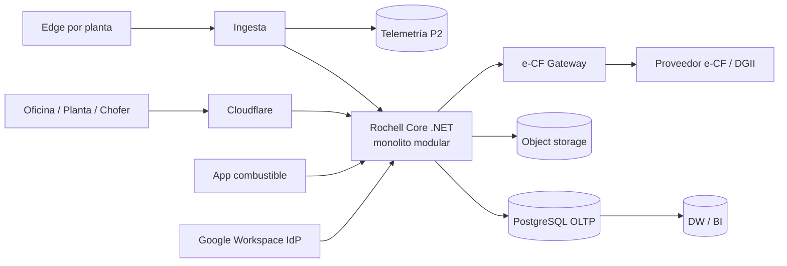

### 14.3 Domain Map v2

| Tipo | Dominios | Cambio vs v1 |
| --- | --- | --- |
| Core | Manufacturing/MES, Cost Accounting, Inventory Ownership & Valuation, Quality Release, Planning (ATP/CTP) | Inventario sube a Core: ownership + valuación es donde se juega la integridad |
| Supporting | Sales, Procurement, Logistics/TMS, Maintenance, Fleet/Fuel, Quarry | Logística baja a Supporting |
| Generic | GL, Tax/e-CF, HR/Payroll, Identity, Documents, Notifications, Reconciliation, Data Quality | Reconciliación y Data Quality como servicios de plataforma |

### 14.4 Context Map v2

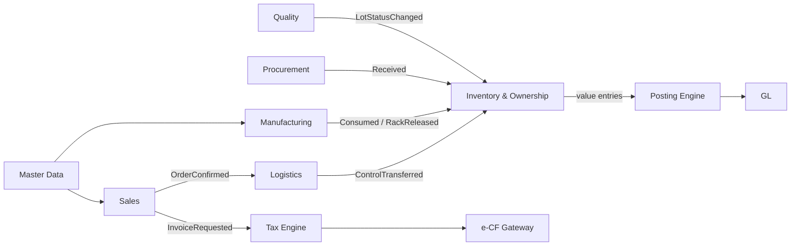

Cambio clave: **Inventory & Ownership** es el único contexto que escribe cantidad y valor; Logistics solo informa hechos físicos y el Policy Engine (dentro de Inventory) decide la transferencia de control.

### 14.5 Deployment v2

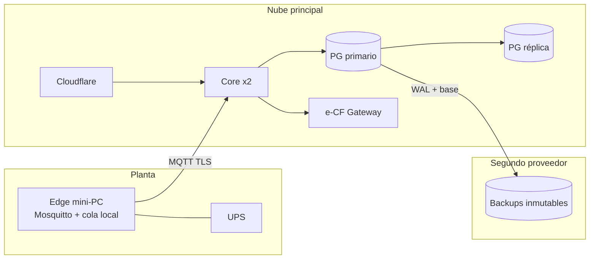

### 14.6 Data Architecture

| Capa | Almacén | Contenido | RPO |
| --- | --- | --- | --- |
| OLTP | PostgreSQL primario (un esquema por contexto) | Maestros, documentos, 5 ledgers, outbox, inbox, jobs | 5 min |
| Lectura | Réplica | Reportes operativos, Explain, búsqueda | — |
| Analítica | DW (PostgreSQL separado al inicio) | Modelo estrella + semantic layer | 24 h |
| Telemetría | PostgreSQL + TimescaleDB separado (P2) | Series de sensores | 24 h |
| Documentos | Object storage con versionado y object lock | PDFs, XML e-CF, fotos POD, certificados | 5 min |
| Edge | Cola local por planta | Eventos pendientes | 0 |

### 14.7 Ledger Architecture v2

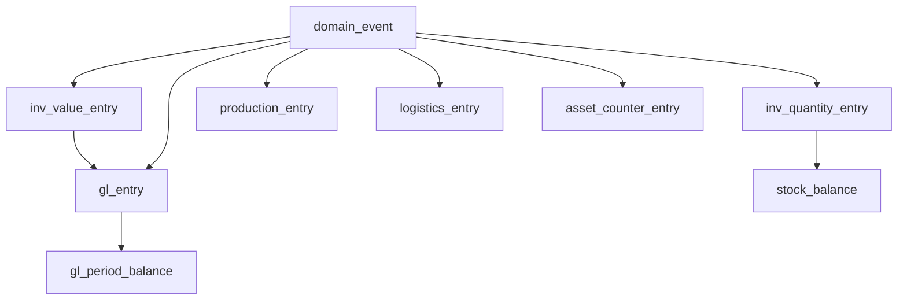

Reglas: todos append-only con hash chain; solo el Posting Engine escribe `gl_entry`; solo Inventory escribe quantity/value; los saldos son proyecciones mantenidas en la misma transacción y verificadas cada noche.

### 14.8 Event Architecture

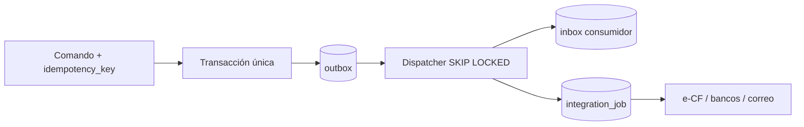

Eventos internos: esquema versionado (`schema_version`), inmutables, retenidos para siempre en `domain_event`. Eventos externos (Edge): contrato versionado, validados en la ingesta antes de convertirse en eventos de dominio.

### 14.9 Manufacturing Architecture v2

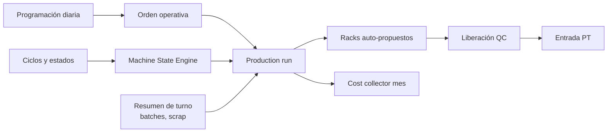

### 14.10 Edge Architecture v2

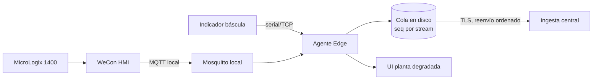

El agente Edge valida contrato y rangos físicos, asigna `seq`, persiste antes de confirmar y reenvía en orden. Fase 1 conserva el camino HMI → MQTT existente; la lectura directa del PLC por EtherNet/IP llega en P2 si el HMI resulta insuficiente.

## 15. Architecture Decision Records (ADR-001 a ADR-014)

**Regla de gobierno de ADRs.** Todos tienen estado *Aceptado* a la fecha de este documento. Un ADR no se edita: se reemplaza con uno nuevo que lo marca *Superseded* y explica por qué. Ningún desarrollador ni asistente de IA puede contradecir un ADR en código; si lo necesita, primero propone el ADR sustituto y lo aprueba el arquitecto (Alexander) + el revisor técnico. Los ADRs viven también en el repositorio (`/docs/adr/`) y el pipeline de CI incluye pruebas de arquitectura que verifican los que son verificables automáticamente.

### ADR-001 — Monolito modular

**Contexto.** Equipo de 3–6 personas; transacciones que cruzan inventario, contabilidad y fiscal deben ser atómicas. **Decisión.** Un solo servicio desplegable (Rochell Core) con módulos por bounded context, un esquema de base por módulo y prohibición de acceso cruzado a tablas. **Alternativas.** Microservicios (sagas, consistencia eventual en dinero: rechazado); monolito sin límites (se degrada en "big ball of mud": rechazado). **Consecuencias.** Despliegue simple, transacciones ACID; requiere disciplina de módulos verificada en CI. **Riesgos.** Acoplamiento progresivo. **Revisitar si** un módulo necesita escalar 10× distinto al resto, o un equipo independiente de > 4 personas lo mantiene.

### ADR-002 — PostgreSQL como única base transaccional

**Contexto.** Se necesitan constraints, transacciones serializables, JSON, particionamiento y costo razonable. **Decisión.** PostgreSQL 17+ (o versión soportada vigente) para OLTP, un clúster primario + réplica. **Alternativas.** SQL Server (licencias, menor encaje Linux/cloud), MySQL (el portal actual lo usa; constraints y DDL transaccional más débiles). **Consecuencias.** Toda integridad crítica se expresa en la base. **Riesgos.** Dependencia de competencia DBA. **Revisitar si** el volumen OLTP supera la capacidad de un nodo grande con réplicas (no esperado en 10 años).

### ADR-003 — Eventos de dominio con outbox; sin broker en MVP

**Contexto.** Efectos secundarios (e-CF, notificaciones, proyecciones) no deben perderse ni ejecutarse sin commit. **Decisión.** Documento + ledgers + outbox en una transacción; dispatcher en proceso con `SKIP LOCKED`; consumidores con inbox; cola de trabajos en PostgreSQL. RabbitMQ solo cuando existan consumidores fuera del proceso que lo justifiquen. **Alternativas.** RabbitMQ desde el día 1; Kafka; llamadas síncronas. **Consecuencias.** Entrega at-least-once; todos los consumidores idempotentes. **Riesgos.** La tabla outbox crece. **Mitigación.** Purga de entregados > 30 días (el evento de dominio permanece en `domain_event`). **Revisitar si** > 200 eventos/s sostenidos o aparece un consumidor externo en tiempo real.

### ADR-004 — Inmutabilidad de ledgers y evidencia de alteración

**Contexto.** Auditoría y confianza en cifras años después. **Decisión.** Ledgers y `domain_event` append-only (sin UPDATE/DELETE para el rol de aplicación, trigger que aborta); correcciones por reversa; hash chain por empresa × ledger × día; digest diario a object storage con object lock; pgAudit hacia almacenamiento externo; acceso de superusuario solo break-glass registrado. **Alternativas.** Solo permisos (insuficiente); base de datos de ledger especializada (inmadura en ecosistema, más operación). **Consecuencias.** Errores se corrigen con más filas, no menos. **Riesgos.** Volumen. **Revisitar si** aparece una exigencia regulatoria de firma de registros contables.

### ADR-005 — Valuación de inventario

**Contexto.** Plantas con eficiencias distintas, transferencias entre plantas, NIC 2. **Decisión.** Área de valuación = empresa × planta. MP comprada a promedio ponderado móvil; PT y agregados propios a costo estándar con prorrateo mensual de variaciones prorrateables entre inventario y COGS cuando superan 2% del costo del período (umbral a confirmar con auditor). Costo real por lote solo como memoria analítica. **Alternativas.** Empresa × producto; almacén × producto; FIFO por lote (Decisión 3). **Consecuencias.** Transferencias entre plantas en dos pasos con variación de transferencia. **Riesgos.** Estándar desactualizado. **Revisitar si** las variaciones prorrateadas superan 5% durante dos trimestres o el auditor exige otro método.

### ADR-006 — Reconocimiento de ingreso y costo por transferencia de control

**Contexto.** Entregas en planta, en obra con camión propio, consignación, anticipos, Confotur. **Decisión.** Policy Engine con tabla versionada `delivery_term_policy`; eventos separados para movimiento físico, control, factura; ingreso y COGS en `ControlTransferred`; activo y pasivo de contrato para los desfases con la factura. **Alternativas.** Al despacho; a la factura. **Consecuencias.** Requiere POD confiable. **Riesgos.** POD tardío al cierre. **Revisitar si** cambia la norma contable aplicada o aparecen contratos con múltiples obligaciones de desempeño complejas.

### ADR-007 — e-CF Gateway con proveedor certificado

**Contexto.** Emisión actual vía proveedor; cambios de esquema DGII; custodia de certificado. **Decisión.** Servicio separado con su propio almacenamiento y puerto/adaptador de proveedor; primer adaptador: proveedor actual; e-NCF asignado por el Core en la transacción de emisión; XML firmado, respuesta y hash archivados; máquina de estados de la sección 12.3. **Alternativas.** Emisión directa certificada; integración de proveedor incrustada en el Core. **Consecuencias.** Cambiar de proveedor = nuevo adaptador. **Riesgos.** API del proveedor sin estados suficientes o sin idempotencia. **Mitigación.** Prueba de contrato antes de P0. **Revisitar si** costo por documento × volumen anual supera el costo de certificarse y mantener emisión propia, o el proveedor falla SLA dos meses seguidos.

### ADR-008 — Arquitectura Edge por planta

**Contexto.** Internet inestable; HMI WeCon publicando MQTT; seguridad de planta. **Decisión.** Agente Edge por planta con Mosquitto local, cola en disco, `seq` por stream, reenvío ordenado por MQTT sobre TLS (8883) con certificado por planta; Edge solo publica, nunca recibe comandos del ERP; nunca escritura al PLC. P0 conserva el camino HMI → MQTT; lectura directa EtherNet/IP en P2. **Alternativas.** HMI directo a la nube (sin buffer); gateway comercial (licencias). **Consecuencias.** Un equipo más por planta. **Riesgos.** Hardware en ambiente hostil. **Revisitar si** se instalan más de 6 líneas o se requiere control en lazo cerrado.

### ADR-009 — Lenguaje y plataforma de backend

**Contexto.** Vida útil 10–15 años; dinero; concurrencia; equipo pequeño asistido por IA. **Decisión.** .NET 10 LTS, ASP.NET Core, C#; EF Core para agregados de escritura y SQL explícito (Dapper o Npgsql directo) para ledgers y reportes; migración a cada LTS dentro de los 12 meses de su salida. Frontend Next.js/TypeScript con tipos generados desde OpenAPI. **Alternativas.** NestJS/TypeScript (v1); Java/Spring (igual de sólido, menor encaje local). **Consecuencias.** Dos lenguajes; lo construido en el sistema contable actual sirve como prototipo y especificación. **Riesgos.** Curva de aprendizaje si el equipo viene de PHP/JS. **Revisitar si** no se logra contratar al menos dos desarrolladores .NET en 3 meses.

### ADR-010 — Trazabilidad derivada

**Contexto.** Recall por resistencia, auditoría de cadena documental. **Decisión.** Trazabilidad física como vista materializada sobre hechos obligatorios (FK NOT NULL en batch\_input, rack\_batch\_contribution, rack.fg\_lot\_id, delivery\_line\_lot); cadena documental por `document_link` con tipos controlados; sin base de grafos. **Alternativas.** Tabla trace\_link escrita por código (v1); Neo4j; Apache AGE. **Consecuencias.** Faltar un enlace hace fallar la transacción. **Riesgos.** Rigidez en casos excepcionales. **Mitigación.** Ajuste de trazabilidad como documento aprobado. **Revisitar si** se exige trazabilidad por unidad individual.

### ADR-011 — Almacenamiento de telemetría

**Contexto.** Datos de sensores de alta frecuencia no deben afectar facturación ni contabilidad. **Decisión.** Instancia separada PostgreSQL + TimescaleDB (P2); el OLTP recibe solo eventos agregados. **Alternativas.** Misma base; misma instancia base separada (comparte WAL); InfluxDB (otro lenguaje de consulta). **Consecuencias.** Dos bases que operar. **Riesgos.** Menor. **Revisitar si** la telemetría supera 50 GB/mes o se requiere analítica de vibración espectral.

### ADR-012 — Autenticación y autorización

**Contexto.** Oficina usa Google Workspace; operadores y choferes pueden no tener correo; tablets compartidas. **Decisión.** OIDC con Google Workspace para usuarios de oficina (MFA forzado desde Workspace; llave de seguridad para roles de pago); cuentas locales de planta con PIN + tablet registrada (device binding) y sesión por turno; autorización RBAC + scope evaluada en servidor; SoD en asignación de roles. **Alternativas.** Keycloak; Microsoft Entra ID; solo cuentas locales. **Consecuencias.** Dependencia de Workspace para acceso de oficina. **Riesgos.** Caída de Google. **Mitigación.** Dos cuentas locales break-glass con llave física. **Revisitar si** el grupo cambia de suite de ofimática o supera 150 usuarios.

### ADR-013 — Multiempresa

**Contexto.** Block Rochell, ANICAL y posibles sociedades futuras (agregados, transporte). **Decisión.** Una base, `company_id` en toda tabla transaccional con Row-Level Security como segunda barrera; plan de cuentas por empresa con plantilla de grupo y mapeo a cuentas de consolidación; transacciones intercompany como documento único que genera dos patas; eliminaciones y utilidad no realizada en módulo de consolidación. **Alternativas.** Base por empresa (consolidación difícil); esquema por empresa. **Consecuencias.** Consultas siempre filtradas por empresa. **Riesgos.** Fuga entre empresas por error de consulta. **Mitigación.** RLS + pruebas. **Revisitar si** una sociedad se vende o requiere aislamiento legal de datos.

### ADR-014 — Almacenamiento de documentos

**Contexto.** XML e-CF, PDFs, fotos POD, certificados de exención; retención legal prolongada. **Decisión.** Object storage S3-compatible con versionado y object lock (modo compliance) para evidencia fiscal y contable; metadatos y hash SHA-256 en PostgreSQL; nombres por id inmutable, no por nombre de archivo; retención mínima 10 años para documentos fiscales (plazo exacto a verificar). **Alternativas.** Archivos en disco del servidor; BLOBs en la base. **Consecuencias.** Documentos no se pueden borrar durante la retención, ni siquiera por error. **Riesgos.** Costo creciente. **Revisitar si** almacenamiento > 2 TB o cambia la norma de retención.

## 16. Architecture Decision Records (ADR-015 a ADR-030)

### ADR-015 — Representación de dinero y cantidades

**Contexto.** Errores de redondeo destruyen conciliaciones. **Decisión.** En base: `numeric(19,4)` para montos en moneda, `numeric(18,6)` para cantidades, `numeric(18,8)` para tasas de cambio, `numeric(12,6)` para tasas de impuesto y factores; en C#: `decimal` envuelto en tipos de valor `Money(amount, currency)` y `Quantity(value, uom)` que prohíben operar monedas o UOM distintas sin conversión explícita; redondeo a 2 decimales solo en el documento fiscal y en el asiento, por línea, con regla de redondeo versionada (half-up salvo que la norma fiscal indique otra); diferencia de redondeo a cuenta dedicada. Nunca `float`/`double`. En frontend, montos viajan como string. **Alternativas.** Enteros en centavos (pierde precisión en costos unitarios). **Consecuencias.** Más verbosidad. **Riesgos.** Redondeo por línea vs total distinto al del proveedor e-CF. **Revisitar si** DGII especifica otra regla de redondeo.

### ADR-016 — Inventory Ledger de cantidad y valor separados

**Contexto.** Revaluaciones, landed cost tardío, errores de valor. **Decisión.** `inv_quantity_entry` y `inv_value_entry` distintos, ligados por `event_id`; solo el módulo Inventory los escribe; todo value entry genera o referencia su asiento. **Alternativas.** Una fila con ambos (v1). **Consecuencias.** Triángulo de conciliación Q–V–GL. **Riesgos.** Más filas. **Revisitar si** nunca (principio estructural).

### ADR-017 — Concurrencia de stock y documentos

**Contexto.** Reservas, recepciones y pagos simultáneos. **Decisión.** Proyecciones de saldo (`stock_balance`, `invoice_open_balance`, `po_line_open_qty`) actualizadas en la misma transacción con update condicional o `FOR UPDATE` + CHECK; bloqueo optimista por `aggregate_version` en documentos; orden global de bloqueo por (tipo, id); SERIALIZABLE solo en cierre y costeo. **Alternativas.** SERIALIZABLE global (reintentos masivos); bloqueos de aplicación. **Consecuencias.** Las restricciones son la última defensa. **Revisitar si** aparecen deadlocks > 1/día en producción.

### ADR-018 — Costeo estándar con cost collectors

**Contexto.** Producción repetitiva de pocos SKUs en alto volumen. **Decisión.** Orden operativa sin costo; cost collector por versión de producto × línea × mes; pools de conversión por centro de costo productivo con tasas a capacidad normal; capacidad ociosa y scrap anormal al gasto; variaciones con nombre (sección 6.5). **Alternativas.** Costeo por orden de turno; costeo por procesos puro. **Consecuencias.** Requiere presupuesto anual de gastos fijos y capacidad normal aprobada. **Revisitar si** se fabrica a pedido con especificaciones por cliente.

### ADR-019 — Fuente única de salida de materiales

**Contexto.** Riesgo de doble consumo. **Decisión.** Modo por material × planta: MEASURED, SHIFT\_SUMMARY o BACKFLUSH; exactamente uno activo; el sistema rechaza salidas por otro modo. En P0, cemento y agregados en SHIFT\_SUMMARY; aditivo en BACKFLUSH. **Alternativas.** Registrar ambos y conciliar. **Consecuencias.** La precisión del consumo depende del modo; se muestra en reportes. **Revisitar si** se integra báscula de dosificación (pasa a MEASURED).

### ADR-020 — Autorizaciones fiscales (Confotur y regímenes especiales)

**Contexto.** Exenciones con resolución, proyecto, vigencia y tope. **Decisión.** Entidad `fiscal_authorization` con alcance, documentos y consumo por línea (Decisión 2); nunca una bandera de cliente; Tax Engine divide líneas parcialmente cubiertas. **Alternativas.** Bandera en cliente o contrato. **Consecuencias.** Fiscal verifica cada autorización antes de activarla. **Riesgos.** Verificación tardía bloquea ventas. **Revisitar si** DGII publica un servicio de validación automática de autorizaciones.

### ADR-021 — Entrega at-least-once e idempotencia

**Contexto.** Redes inestables, reintentos, Edge offline. **Decisión.** `idempotency_key` obligatorio en todo comando que cree documentos o movimientos; `command_log` con resultado; inbox por consumidor; `UNIQUE(source_event_id, role)` en ledgers; `seq` por stream externo. **Alternativas.** Exactly-once (no existe en la práctica sin estas mismas técnicas). **Consecuencias.** Clientes (UI, apps, Edge) deben generar claves. **Revisitar si** nunca (principio estructural).

### ADR-022 — Gobierno de reglas fiscales

**Contexto.** Normas DGII cambian; errores fiscales son costosos. **Decisión.** Toda regla fiscal (tasas, tipos de e-CF, retenciones, formatos, plazos) es dato versionado con `effective_from`, aprobado por el especialista fiscal; cada versión referencia un ADR fiscal con fuente oficial, versión del documento y fecha de consulta; suite de casos de prueba fiscales que debe pasar antes de activar una versión. **Alternativas.** Reglas en código. **Consecuencias.** Cambio fiscal sin despliegue. **Riesgos.** Regla mal configurada. **Mitigación.** Doble aprobación y pruebas de regresión. **Revisitar si** DGII publica reglas en formato legible por máquina.

### ADR-023 — Modelo temporal de cinco fechas

**Contexto.** Registros tardíos y cortes. **Decisión.** `occurred_at`, `recorded_at`, `business_date`, `posting_date`, `effective_date` según sección 8.3; UTC en almacenamiento, America/Santo\_Domingo para fecha de negocio; `occurred_at` distinto de `recorded_at` en más de 24 h requiere aprobación. **Alternativas.** Una fecha editable. **Consecuencias.** Reportes deben elegir fecha explícitamente. **Revisitar si** nunca.

### ADR-024 — Control de períodos

**Contexto.** Cierres de distinto ritmo. **Decisión.** Cuatro períodos (operativo, inventario, contable, fiscal) por empresa con dependencias y reapertura en cascada; documentos tardíos postean en el primer día abierto; períodos fiscales presentados no se reabren (rectificativa). **Alternativas.** Un período único. **Revisitar si** se adopta cierre diario contable.

### ADR-025 — Liberación de calidad configurable

**Contexto.** Despacho antes del ensayo final. **Decisión.** Estados de la sección 10.3 con `release_policy` por producto × cliente/contrato/norma; recall hacia adelante automático al fallar ensayo final de lote despachado. **Alternativas.** Esperar siempre ensayo final; no controlar. **Revisitar si** la norma o un contrato mayor exige otro esquema.

### ADR-026 — Hosting, backup y recuperación

**Contexto.** Libro mayor no puede perderse; equipo pequeño. **Decisión.** Producción en proveedor cloud con PostgreSQL administrado o autogestionado con PITR (WAL archivado); backups diarios cifrados en segundo proveedor con object lock 35 días; RPO 5 min, RTO 4 h; restauración de prueba mensual con verificación de invariantes; VPS actual solo como staging. **Alternativas.** VPS único; on-premise. **Revisitar si** el costo cloud supera 2× el de on-premise equivalente con personal.

### ADR-027 — Máquinas de estado en base de datos

**Contexto.** Estados como texto libre producen datos imposibles. **Decisión.** Enum por tipo de documento, tabla de transiciones, `state_history` obligatoria verificada por trigger; cambios solo por comandos. **Alternativas.** Validación solo en código. **Revisitar si** nunca.

### ADR-028 — Acceso de IA a datos

**Contexto.** Asistente y NL-BI futuros. **Decisión.** La IA consulta solo la semantic layer del DW con una credencial de solo lectura, filtrada por el scope del usuario que pregunta; nunca SQL libre contra OLTP; nunca comandos de escritura; toda respuesta enlaza las cifras a su consulta. **Alternativas.** Acceso directo a la base. **Revisitar si** se habilitan acciones asistidas (siempre con aprobación humana, ADR nuevo).

### ADR-029 — Identificadores

**Contexto.** Claves técnicas y números legibles. **Decisión.** UUIDv7 como PK técnica; números de documento humanos por empresa × tipo × serie, asignados sin huecos solo donde la ley lo exige (e-NCF) y con huecos permitidos en el resto; e-NCF nunca como PK. **Alternativas.** Secuencias enteras globales; UUIDv4. **Revisitar si** nunca.

### ADR-030 — Versionado de datos maestros críticos

**Contexto.** Precio, receta, BOM, cuentas bancarias, límites de crédito, reglas de posteo. **Decisión.** Flujo Draft → Review → Approved → Active → Obsolete; versiones con `effective_from/to`; documentos referencian la versión usada; cambios de cuenta bancaria con verificación fuera de banda y retención de pagos 72 h. **Alternativas.** Edición con historial de auditoría. **Revisitar si** nunca.

## 17. Pre-mortem: septiembre de 2029, el proyecto fracasó

Ordenado por riesgo (probabilidad × impacto). La causa más probable no es técnica: es que el proyecto dependa de una sola persona y crezca más rápido de lo que se estabiliza.

| # | Causa del fracaso | Prob. | Impacto | Prevención |
| --- | --- | --- | --- | --- |
| 1 | Dependencia de una sola persona (Alexander diseña, programa, configura y decide) | Alta | Crítico | Tech lead contratado antes de P0; ADRs; revisión de código obligatoria por segunda persona en módulos de ledger; documentación de runbooks |
| 2 | Scope creep: se construyen dashboards, IA y simuladores antes de cerrar un mes conciliado | Alta | Alto | MVP v2 congelado; ningún P2 empieza sin el criterio de go-live cumplido; comité mensual que aprueba cambios de alcance |
| 3 | La contabilidad no concilia y el contador vuelve a Excel/ADM | Media | Crítico | Reconciliation Engine desde el día 1; paralelo con conciliación diaria; contador co-diseña reglas de posteo |
| 4 | Datos migrados malos (clientes duplicados, saldos sin soporte, costos inventados) | Alta | Alto | Limpieza antes de migrar; Data Quality Engine; certificación de saldos firmada |
| 5 | Operadores y supervisores no adoptan la app de planta | Media | Alto | Diseñar con ellos en planta; tres toques; captura por excepción; supervisor como dueño del dato del turno |
| 6 | Error fiscal: e-CF mal emitidos, 606/607 incorrectos, Confotur mal tratado → sanciones | Media | Crítico | ADR-022; especialista fiscal revisa reglas; pruebas fiscales; paralelo de reportes contra ADM antes de corte |
| 7 | Costos no creíbles: el gerente no confía en el costo del block y lo ignora | Media | Alto | Estándares acordados con planta; variaciones explicadas; Explain this entry; empezar con costeo simple y refinar |
| 8 | Integración IoT consume meses sin valor contable | Media | Medio | IoT fuera de P0 salvo contador de ciclos existente; conteo manual como plan B siempre disponible |
| 9 | Exceso de configurabilidad: todo parametrizable, nada funciona por defecto | Media | Alto | Configuración solo donde el negocio cambia (precios, impuestos, reglas de posteo, tolerancias); lo demás es lógica de dominio |
| 10 | Falta de pruebas: una corrección rompe asientos de meses anteriores | Media | Crítico | Pruebas de invariantes en CI; suite de regresión contable con meses reales anonimizados |
| 11 | Rendimiento degrada con 3 años de datos | Baja | Alto | Saldos precalculados, snapshots, réplica para reportes; prueba de carga con volumen de 5 años sintético |
| 12 | Pérdida o corrupción de datos (ransomware, error humano, VPS) | Baja | Crítico | ADR-026; restauración mensual probada; backups en segundo proveedor |
| 13 | Proveedor e-CF cambia API o condiciones | Media | Alto | Gateway con puerto/adaptador; contrato con SLA; plan de salida documentado |
| 14 | El go-live se retrasa indefinidamente y ADM Cloud nunca se apaga (doble costo, doble captura) | Alta | Alto | Fecha de corte fijada con criterios; paralelo máximo 3 meses; si no se cumple, se recorta alcance, no se extiende el paralelo |
| 15 | Rotación del equipo: el desarrollador clave se va y el código .NET queda huérfano | Media | Alto | Dos personas por módulo crítico; código estándar sin "magia"; ADRs y pruebas como documentación viva; salario competitivo |

Señales tempranas a vigilar cada mes: conciliaciones abiertas > 7 días, hallazgos ERROR de Data Quality en aumento, funciones P2 en desarrollo antes de cerrar P0, capturas de planta hechas al final del turno en bloque, y horas extra del contador reconstruyendo cifras fuera del sistema.

## 18. MVP v2

Pregunta de corte: **¿qué necesita existir para apagar ADM Cloud en Block Rochell sin perder control del dinero, el inventario y las obligaciones fiscales?** Todo lo demás espera.

- **P0** — indispensable para go-live.
- **P1** — primeros 90 días después del go-live.
- **P2** — después (6–12 meses).
- **P3** — futuro.

| Área | P0 | P1 | P2 | P3 |
| --- | --- | --- | --- | --- |
| Plataforma | Identidad (Workspace + PIN planta), RBAC + scope, SoD básica, auditoría, hash chain, aprobaciones, idempotencia, outbox, jobs, state machines, Data Quality (reglas ERROR), Reconciliation Engine (definiciones P0) | Búsqueda global, bandeja de notificaciones, Explain this entry completo | Command palette, portal de clientes | Asistente IA, NL-BI |
| Master Data | Empresas, plantas, ubicaciones, party con validación RNC DGII, productos con marca comprado/vendido/fabricado, UOM, precios versionados, cuentas, cuentas bancarias verificadas | Contratos de precio por cliente | Contratos marco de compra | — |
| Finanzas | GL con dimensiones, AR, AP, bancos, conciliación bancaria semiautomática, accruals automáticos básicos, cierre mensual con 4 períodos, diario de ajustes | Activos fijos y depreciación, préstamos bancarios | Presupuesto, flujo 13 semanas, covenants, consolidación | Simuladores |
| Fiscal | Tax Engine versionado, e-CF Gateway con proveedor actual, e-NCF por serie, notas de crédito/débito, 606/607/608, IT-1, IR-17, Fiscal Authorization (Confotur), Tax Reconciliation | 609 y pagos al exterior | Validación automática de e-CF recibidos | Emisión directa certificada |
| Ventas y cobros | Cotización, pedido (OC del cliente, prioridad, condición, dirección), crédito con bloqueo, ATP simple, factura desde conduce o pedido, cobros y aplicación, estados de cuenta, impresión de cotización/pedido/conduce/factura | Collections Workbench | CRM, CTP | Forecast |
| Despacho | Conduce con chofer y vehículo, báscula manual con ticket, POD (evolución de entregas QR), Policy Engine de control con 2 términos (retira en planta, entregado en obra) | Dispatch Control Tower, load building por peso | Costo real de viaje, rentabilidad de flete | Telemática GPS, rutas |
| Compras | OC con aprobación, recepción (con chofer si transporte propio), 3-Way Match, retenciones, factura de proveedor | Requisición, RFQ | Scorecard de proveedor | — |
| Inventario | Ledger cantidad/valor, stock\_balance, lotes, estados de disponibilidad y ownership, transferencias entre plantas, conteos, ajustes aprobados, silo teórico + medición manual, agregados en t con conversiones auditables | Stockpiles con medición topográfica | Landed cost de importación | WMS avanzado |
| Producción | Programación diaria simple, orden operativa, resumen de turno (batches × receta, humedad), racks auto-propuestos desde conteo HMI o manual, lote PT, scrap por punto, recetas versionadas, modo de salida por material | Paradas con lista corta, OEE preliminar, moldes con Mold History | Edge con buffer por planta, OEE final, golden run | Telemetría y predictivo |
| Calidad | Liberación por curado mínimo + inspección (PRELIM\_RELEASED), bloqueo | Ensayos de resistencia ligados a lote, FINAL\_RELEASED, recall | SPC, granulometría, LIMS | Integración con prensa |
| Costos | Costo estándar de PT aprobado, cost collectors, variaciones básicas (precio, uso), capacidad ociosa | Pools de conversión completos, prorrateo de variaciones | COPQ, costo por máquina | Machine P&L |
| Mantenimiento | — | Órdenes de trabajo básicas con costo a máquina | CMMS con contadores, repuestos, jerarquía de componentes | Predictivo |
| RR.HH. | Préstamos a empleados (como subledger de AR); nómina solo si hoy se procesa en ADM | Nómina y asignación de costo por turno | Asistencia, EHS | — |
| Flota y combustible | Integración de la app de combustible por API (costo a vehículo) | Rendimiento esperado vs real | Neumáticos | — |
| Cantera | — | — | Módulo de cantera y báscula integrada | Drones |
| BI | Reportes operativos y fiscales "como ADM"; balance, resultados, antigüedad AR/AP | Command Center y Morning Brief | DW + semantic layer | IA |

Cambios respecto al MVP v1: sale OEE del P0 (pasa a P1), sale costo real de viaje, sale ATP con producción programada (queda ATP sobre stock liberado), sale CRM. Entran al P0: Fiscal Authorization, Policy Engine de control, ledger cantidad/valor, 4 períodos, Reconciliation y Data Quality engines, hash chain. Es **menos funcionalidad visible y más integridad**.

Estimación con equipo de 4–5 personas (tech lead .NET, 2 desarrolladores, QA, contador 50%): P0 en 7–9 meses, incluyendo 2–3 meses de paralelo. Con una sola persona desarrollando, P0 no es realista en menos de 15 meses.

## 19. Migración desde ADM Cloud y Cutover Runbook

### 19.1 Estrategia de migración

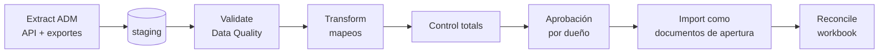

Principio: los saldos de apertura entran como **documentos de apertura** (factura de apertura, recepción de apertura, asiento de apertura) que pasan por el Posting Engine, no como inserciones directas en ledgers. Así la apertura es explicable con "Explain this entry" como cualquier otra operación.

### 19.2 Reconciliation Workbook

Libro de control (una hoja por objeto) que firman los dueños. Cada hoja tiene: fuente ADM (reporte, fecha, hora de extracción, hash del archivo), total en ADM, total en staging, total importado, diferencia, explicación de cada diferencia, firma.

| Objeto | Control totals obligatorios | Dueño que firma |
| --- | --- | --- |
| Clientes | Cantidad de registros, cantidad con RNC válido, duplicados fusionados (lista) | Crédito |
| Proveedores | Cantidad, RNC válido, cuentas bancarias verificadas | Compras + Tesorería |
| Productos | Cantidad, con UOM, con receta (fabricados), con cuenta | Producción + Contabilidad |
| AR abierto | Σ saldo por cliente = saldo cuenta control ADM = saldo importado; cantidad de documentos; antigüedad por tramo | Crédito + Contador |
| AP abierto | Ídem por proveedor | Contador |
| Inventario | Cantidad por ítem × planta según **conteo físico** del día de corte; valor = cantidad × costo aprobado; Σ valor = cuentas de inventario | Planta + Contador |
| Activo contrato (despachado no facturado, Confotur) | Conduces abiertos por cliente/proyecto | Ventas + Fiscal |
| Autorizaciones fiscales | Una por resolución vigente, con documento y consumo a la fecha | Fiscal |
| Bancos | Saldo según extracto al corte = saldo importado; partidas en tránsito listadas | Tesorería |
| GL | Balanza de comprobación completa al corte; Σ débitos = Σ créditos; resultado del ejercicio | Controller |
| Activos fijos | Costo, depreciación acumulada, valor neto por activo = cuentas | Contador |
| Préstamos a empleados | Saldo por empleado = cuenta | RR.HH. + Contador |
| Secuencias e-NCF | Último e-NCF usado por serie, rangos autorizados vigentes | Fiscal |

### 19.3 Opening Balance Certification y sign-off

1. El Controller emite la **certificación de saldos de apertura**: balanza al corte, conciliaciones de cada subledger contra GL con diferencia cero, conteo físico firmado, lista de diferencias explicadas y sus ajustes aprobados.
2. Fiscal certifica secuencias, autorizaciones y documentos fiscales en tránsito.
3. El Director de Operaciones firma el **migration sign-off**: autoriza que la apertura es la verdad inicial. A partir de ahí, ninguna cifra de apertura se modifica: se corrige con documento de ajuste en el primer período.
4. El archivo de extracción de ADM (con hash) se conserva en object storage con object lock.

Historia de ADM: facturas y documentos históricos quedan como archivo de consulta (PDF + XML) enlazado al cliente; ADM se conserva en solo lectura el tiempo que permita el contrato, y se exporta completo antes de darlo de baja.

### 19.4 Cutover Runbook

Corte al **inicio de mes** (idealmente de trimestre, nunca diciembre). Día 0 = primer día operativo en el sistema nuevo.

| Día | Actividad | Responsable | Validación | Fallback |
| --- | --- | --- | --- | --- |
| −30 | Congelar alcance P0; último ensayo de migración completo con datos de fin de mes anterior; restauración de backup probada | Tech lead + Controller | Workbook del ensayo con diferencias = 0 | Mover fecha de corte un mes |
| −30 | Capacitación por rol inicia (oficina, planta, choferes) | Dir. Operaciones | Asistencia y prueba práctica por usuario | — |
| −15 | Limpieza final de maestros en ADM; congelar alta de nuevos clientes/proveedores salvo aprobación | Crédito, Compras | Data Quality sin ERROR en staging | — |
| −15 | Prueba e-CF en ambiente del proveedor con todos los tipos usados | Fiscal | 100% aceptados | Corregir antes de −7 o posponer |
| −7 | Go/no-go preliminar con los criterios de la sección 20 | Comité | Checklist firmado | Posponer |
| −7 | Tablets de planta configuradas, credenciales y PIN entregados, impresoras de conduce probadas | Tech lead + Planta | Prueba en cada planta | — |
| −1 | Cierre de ADM: últimas facturas, cobros y recepciones; extracción final; conteo físico de inventario en todas las plantas al cierre de operaciones | Contador + Planta | Conteo firmado; extracción con hash | — |
| −1 (noche) | Importación de apertura; conciliación workbook; certificación y sign-off | Controller + Tech lead | Diferencias = 0 | No abrir el sistema nuevo; seguir en ADM al día siguiente |
| 0 | Go-live: primer pedido, despacho, factura e-CF y cobro reales observados en vivo; soporte en cada planta | Todo el equipo | Primer e-CF aceptado antes de las 10 a.m. | Si e-CF falla > 4 h: facturar desde ADM ese día (secuencias coordinadas) y registrar como documentos externos |
| +1 | Conciliación diaria completa (AR, AP, inventario, bancos, e-CF); revisión de bandeja REQUIRES\_ACTION | Controller | Sin excepciones abiertas > 24 h | Corrección por documentos |
| +7 | Primer cierre semanal de producción y despachos; encuesta de usabilidad en planta | Gerente de Planta | Racks vs conteo HMI; POD 100% | Ajustes de UI prioritarios |
| +30 | Primer cierre mensual completo en el sistema nuevo; 606/607 generados y conciliados; ADM a solo lectura | Controller + Fiscal | Criterios post go-live (sección 20) | ADM permanece activo 60 días para consulta y contingencia |

Regla de fallback: después del día 0 **no se vuelve a ADM como sistema de registro** salvo desastre declarado por el comité; los problemas se corrigen hacia adelante. La excepción es facturación: si el e-CF Gateway no puede emitir, ADM (o el portal del proveedor) actúa como contingencia con secuencias previamente separadas.

## 20. Criterios cuantificables de go-live

Go-live solo si **todos** los criterios de bloque A–E se cumplen en el día −7 y se re-verifican en el día −1. Un criterio no cumplido requiere excepción firmada por Director General + Controller, con plan y fecha; los marcados ★ no admiten excepción.

### A. Integridad contable (medido sobre el último ensayo y sobre la apertura)

| # | Criterio | Meta |
| --- | --- | --- |
| A1 ★ | AR subledger − GL | 0.00 DOP |
| A2 ★ | AP subledger − GL | 0.00 DOP |
| A3 ★ | Inventario subledger (valor) − GL | 0.00 DOP |
| A4 ★ | Σ débitos − Σ créditos, todos los asientos | 0.00 DOP |
| A5 | Activos fijos subledger − GL (si en P0/P1) | 0.00 DOP |
| A6 ★ | Bancos: saldo libro − extracto, neto de partidas en tránsito identificadas | 0.00 DOP |
| A7 ★ | Eventos sin regla de posteo (UNPOSTED) | 0 |
| A8 ★ | Documentos posteados modificables (prueba: intento de UPDATE/DELETE con rol de aplicación y con usuario de UI) | 0 éxitos |
| A9 ★ | Verificación de hash chain de todos los ledgers | 100% válida |
| A10 | Paralelo: diferencia de ventas del mes ADM vs nuevo | ≤ 0.1% y 100% explicada |

### B. Inventario y producción

| # | Criterio | Meta |
| --- | --- | --- |
| B1 ★ | Σ quantity entries − stock\_balance, por ítem × lote × ubicación | 0 |
| B2 | Cantidad en sistema vs conteo físico de apertura | 100% igual (diferencias ajustadas y aprobadas antes) |
| B3 ★ | Ítems con cantidad 0 y valor ≠ 0 | 0 |
| B4 ★ | Lotes de inventario sin costo | 0 |
| B5 ★ | Materiales con más de un modo de salida activo | 0 |
| B6 | Racks del ensayo de 2 semanas vs conteo HMI/manual | Diferencia ≤ 1% y explicada |
| B7 | Silo teórico vs medido en el ensayo | Dentro de tolerancia configurada |
| B8 ★ | Salidas de PT sin lote | 0 |

### C. Fiscal

| # | Criterio | Meta |
| --- | --- | --- |
| C1 ★ | e-CF emitidos en pruebas de todos los tipos usados | 100% ACCEPTED o ACCEPTED\_CONDITIONAL justificado |
| C2 ★ | En paralelo: e-CF enviados correctamente o en contingencia válida | 100% |
| C3 ★ | e-NCF duplicados o huecos no justificados | 0 |
| C4 | 606/607/608 del mes de paralelo vs los de ADM | Diferencias 0 o 100% explicadas |
| C5 ★ | ITBIS ventas: e-CF vs GL vs 607 | 0.00 DOP |
| C6 ★ | Autorizaciones fiscales vigentes cargadas y verificadas por Fiscal | 100% |
| C7 ★ | Reglas fiscales activas con ADR fiscal (fuente, versión, fecha de consulta) | 100% |
| C8 | Clientes activos con RNC/cédula validada | ≥ 98% (resto solo contado/consumo) |

### D. Operación y usuarios

| # | Criterio | Meta |
| --- | --- | --- |
| D1 ★ | Usuarios críticos (facturación, despacho, contabilidad, supervisores, choferes) capacitados y con prueba práctica aprobada | 100% |
| D2 | Tiempo para crear pedido + conduce + factura (usuario entrenado) | ≤ 3 min |
| D3 | Tiempo para registrar resumen de turno | ≤ 10 min |
| D4 | POD registrados en el ensayo | ≥ 98% dentro de 24 h |
| D5 | Operaciones comunes (p95) | < 2 s |
| D6 | Reportes de cierre (balanza, antigüedad, 606/607) | < 60 s o asíncronos |
| D7 ★ | Impresión de conduce, factura, pedido y cotización en cada planta y oficina | 100% probado |
| D8 ★ | Data Quality: hallazgos ERROR abiertos | 0 |

### E. Seguridad, recuperación y soporte

| # | Criterio | Meta |
| --- | --- | --- |
| E1 ★ | Restauración completa de backup a ambiente aislado, con invariantes verificadas | Aprobada en los últimos 30 días |
| E2 ★ | RPO medido en prueba (pérdida máxima de datos) | ≤ 5 min |
| E3 | RTO medido en prueba | ≤ 4 h |
| E4 ★ | MFA activo en roles financieros y administradores | 100% |
| E5 ★ | Conflictos SoD sin excepción aprobada | 0 |
| E6 | Pentest externo: hallazgos críticos/altos abiertos | 0 |
| E7 ★ | Runbooks de contingencia e-CF, caída de Internet en planta y restauración, probados | 3 de 3 |
| E8 | Soporte en sitio en cada planta el día 0 y +1 | Asignado |
| E9 ★ | Migration sign-off y Opening Balance Certification firmados | Sí |

### F. Criterios post go-live (día +30) para declarar éxito y pasar ADM a solo lectura

| # | Criterio | Meta |
| --- | --- | --- |
| F1 | Primer cierre mensual completo en el sistema nuevo | ≤ 10 días hábiles |
| F2 | Criterios A1–A4, B1, C5 en el cierre | Todos en cero |
| F3 | Integraciones en REQUIRES\_ACTION con > 48 h | 0 |
| F4 | Operaciones hechas fuera del sistema (Excel/ADM) para suplir funciones P0 | 0 |
| F5 | 606/607/IT-1 del primer mes presentados desde el sistema nuevo | Sí, sin rectificativa por error de sistema |

Próximo paso recomendado: validar con el contador y el especialista fiscal las decisiones marcadas "a verificar" (hecho generador de ITBIS en despachos no facturados, umbral de prorrateo de variaciones, reglas de notas de crédito) y confirmar la Decisión 5 antes de contratar al tech lead, porque define el perfil a buscar.
