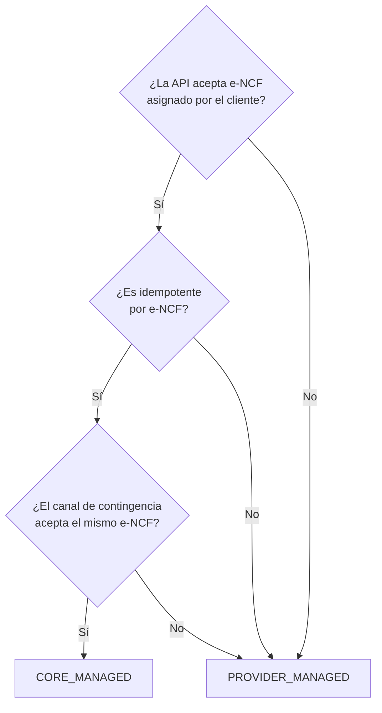
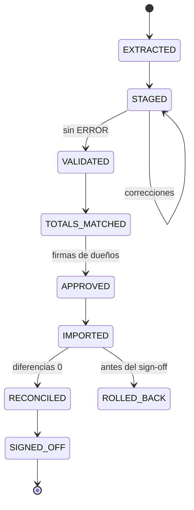
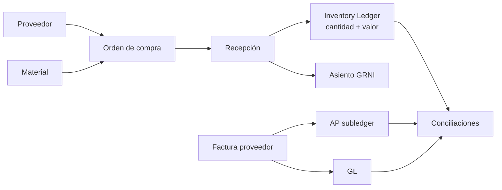

# Industrias Rochell ERP/MES — Architecture v2.1 & Build Readiness Package

Sep 22, 2026 · @Alexander Rochell

## 1. Resumen de v2.1

v2.1 conserva todas las decisiones de Architecture v2 salvo las diez correcciones siguientes, y convierte la arquitectura en una especificación implementable para P0. **No se agrega funcionalidad P1/P2/P3.** El objetivo único es que dos desarrolladores, o un desarrollador y un asistente de IA, implementen el mismo comportamiento.

| # | Corrección | Qué cambia respecto a v2 | ADR |
| --- | --- | --- | --- |
| 1 | Accounting Ownership ≠ Legal Title | La propiedad contable ya no se deriva del título legal; la determina el Policy Engine | ADR-031 (enmienda ADR-006) |
| 2 | Cierres independientes | La cadena lineal Operativo → Inventario → Contable → Fiscal se reemplaza por una matriz de dependencias por componente | ADR-032 (reemplaza ADR-024) |
| 3 | Sin doble fuente de verdad en contingencia | Se elimina el fallback a ADM Cloud; la emisión externa solo ejecuta el acto fiscal | ADR-033 |
| 4 | FiscalSequenceAuthority | Una autoridad de secuencia por serie; contract test de Polaris obligatorio antes de implementar | ADR-034 (enmienda ADR-007) |
| 5 | Documentos de apertura | Seis tipos de documento de apertura con reglas de posteo propias, sin efecto fiscal | ADR-035 |
| 6 | Puente cost collector ↔ valuation area | Costo real y variaciones por línea; un solo estándar de planta por SKU | ADR-036 (enmienda ADR-018) |
| 7 | Hash chain concurrente | Sellado asíncrono por cadena + Merkle diario anclado en WORM; sin lock global | ADR-037 (enmienda ADR-004) |
| 8 | Identidad en planta | Sin usuarios genéricos; PIN identifica a un empleado; reautenticación en acciones sensibles | ADR-038 (enmienda ADR-012) |
| 9 | Parámetros de política contable | Ningún umbral contable en código; políticas versionadas con aprobación | ADR-039 (enmienda ADR-005, ADR-018) |
| 10 | Gate de implementación fiscal | Ninguna regla "a verificar" llega a producción sin fuente oficial registrada y pruebas | ADR-040 (enmienda ADR-022) |

Cada ADR nuevo sigue el formato de v2 (Contexto, Decisión, Alternativas, Consecuencias, Riesgos, Revisitar si) y se redacta dentro de su corrección. Los ADRs enmendados quedan con estado *Amended by ADR-0xx*; ADR-024 queda *Superseded by ADR-032*.

Orden de lectura para quien implementa: correcciones 1–10 → A (contratos) → B (base de datos) → C y D (transacciones y concurrencia) → E y F (catálogos) → G (estados) → H (errores) → I (permisos) → J (migración) → K (pruebas) → L (primer slice) → decisión final.

## 2. Corrección 1 — Accounting Ownership ≠ Legal Title

v2 decía que la propiedad contable se "deriva" de la legal. Es incorrecto: el título legal y el control económico pueden separarse (bill-and-hold, consignación, facturación anticipada). v2.1 mantiene **cuatro atributos independientes** en cada unidad de stock, cada uno escrito por un único responsable:

| Atributo | Valores | Único escritor |
| --- | --- | --- |
| `physical_location` | Ubicación de planta; `IN_TRANSIT:<vehículo>`; `CUSTOMER_SITE:<obra>`; `CARRIER:<transportista>` | Eventos físicos (portón, POD, transferencia, devolución) |
| `legal_title_holder` | Empresa del grupo, cliente o proveedor | Término contractual del documento (pedido/contrato), nunca inferido |
| `accounting_owner` | Empresa que lo reconoce en su balance, o NONE | **Solo** el Policy Engine, al evaluar control económico con la política contable activa |
| `availability` | AVAILABLE, RESERVED, QUALITY\_HOLD, BLOCKED, CONDITIONAL, COMMITTED\_TO\_ORDER, NOT\_PROMISABLE, LOST | Calidad, reservas, Policy Engine |

El Policy Engine evalúa en cada evento físico o comercial: término de entrega, estado del POD, criterios de bill-and-hold cumplidos, estado de consignación y política contable vigente. Su salida es un `ControlAssessment` persistido (entradas, versión de política, resultado), que es lo que "Explain this entry" muestra.

### Escenarios

Convenciones: *Revenue* = estado del ingreso (NONE, RECOGNIZED, REVERSED); *COGS* = estado del costo; *AR/CA* = cuenta por cobrar (AR), activo de contrato (CA) o pasivo de contrato (CL); *Fiscal* = estado del documento fiscal. El momento exacto del hecho generador de ITBIS en escenarios sin factura queda sujeto a la regla fiscal verificada (Corrección 10); aquí se marca "según regla".

| Escenario / etapa | Ubicación física | Titular legal | Dueño contable | Disponibilidad | Revenue | COGS | AR / CA / CL | Fiscal |
| --- | --- | --- | --- | --- | --- | --- | --- | --- |
| Retiro en planta — cargando | Planta, zona de carga | Empresa | Empresa | COMMITTED\_TO\_ORDER | NONE | NONE | — | Sin e-CF |
| Retiro en planta — salió por portón | Vehículo del cliente | Cliente | NONE | — | RECOGNIZED | RECOGNIZED | CA hasta facturar; AR al facturar | e-CF al facturar; hecho generador según regla |
| Transporte propio, entregado en obra — en tránsito | IN\_TRANSIT: camión propio | Empresa | Empresa | NOT\_PROMISABLE | NONE | NONE | — | Conduce; sin e-CF |
| Transporte propio — POD en obra | CUSTOMER\_SITE | Cliente | NONE | — | RECOGNIZED | RECOGNIZED | CA o AR | e-CF según momento de facturación |
| Transportista contratado por nosotros, entregado en obra — en tránsito | CARRIER | Empresa | Empresa | NOT\_PROMISABLE | NONE | NONE | — | Sin e-CF |
| Transportista contratado — POD | CUSTOMER\_SITE | Cliente | NONE | — | RECOGNIZED | RECOGNIZED | CA o AR | Ídem |
| Consignación en obra — entregado | CUSTOMER\_SITE | Empresa | Empresa | NOT\_PROMISABLE (consignado) | NONE | NONE | — | Sin e-CF de venta |
| Consignación — consumo reportado | CUSTOMER\_SITE (consumido) | Cliente | NONE | — | RECOGNIZED (lo consumido) | RECOGNIZED | CA o AR | e-CF por lo consumido |
| Bill-and-hold — facturado, criterios cumplidos | Planta, zona separada | Cliente | NONE | NOT\_PROMISABLE | RECOGNIZED | RECOGNIZED | AR | e-CF emitido |
| Bill-and-hold — facturado, criterios NO cumplidos | Planta | Cliente (según contrato) | **Empresa** | COMMITTED\_TO\_ORDER | NONE | NONE | AR contra CL (anticipo) | e-CF emitido; ITBIS según regla |
| Facturado no entregado (anticipo, sin bill-and-hold) | Planta | Empresa | Empresa | COMMITTED\_TO\_ORDER | NONE | NONE | AR contra CL | e-CF emitido |
| Entregado no facturado (incluye Confotur pendiente) | CUSTOMER\_SITE | Cliente | NONE | — | RECOGNIZED | RECOGNIZED | CA | Sin e-CF; posible obligación según regla (Corrección 10) |
| Devolución autorizada — en tránsito de regreso | IN\_TRANSIT hacia planta | Cliente hasta recepción | NONE | — | RECOGNIZED (sin cambio aún) | RECOGNIZED | AR | Sin nota aún |
| Devolución — recibida e inspeccionada | Planta, cuarentena | Empresa | Empresa | QUALITY\_HOLD | REVERSED (por lo devuelto) | REVERSED al costo original o a valor neto realizable si dañado | AR reducido por nota de crédito | Nota de crédito referencia e-NCF original |
| Pérdida en tránsito — camión propio, término entregado en obra | Destruido / LOST | Empresa | Empresa → baja | LOST | NONE | Pérdida en tránsito (no COGS) | — | Sin e-CF; reclamo a seguro si aplica |
| Pérdida en tránsito — vehículo del cliente (retiro en planta) | LOST | Cliente | NONE | — | RECOGNIZED | RECOGNIZED | AR | e-CF normal; pérdida es del cliente |
| Pérdida en tránsito — transportista contratado por nosotros | LOST | Empresa | Empresa → baja | LOST | NONE | Pérdida en tránsito | CxC al transportista si procede reclamo | Sin e-CF |

### ADR-031 — Separación de título legal y control contable

**Contexto.** Título legal y control económico pueden no coincidir. **Decisión.** Cuatro atributos independientes con escritor único; `accounting_owner` solo lo cambia el Policy Engine mediante un `ControlAssessment` persistido y versionado; `legal_title_holder` proviene del término contractual y nunca se usa como insumo automático de reconocimiento contable. **Alternativas.** Derivar contable de legal (v2). **Consecuencias.** Reportes legales ("¿de quién es?") y contables ("¿está en mi balance?") pueden diferir y se explican. **Riesgos.** Criterios de bill-and-hold mal evaluados. **Mitigación.** Bill-and-hold requiere aprobación del Controller por pedido. **Revisitar si** cambia la norma contable aplicada.

## 3. Corrección 2 — Period Dependency Matrix

v2 modelaba una cadena lineal. v2.1 modela **componentes de cierre** (close tasks) con estado propio, y cada cierre declara solo los componentes que realmente necesita. El cierre contable se divide en dos niveles: **Soft Close** (gestión mensual) y **Final Close** (estados definitivos).

### 3.1 Componentes de cierre

| Código | Componente | Dueño |
| --- | --- | --- |
| OP-DAY | Días operativos confirmados (turnos, despachos, POD) | Supervisores |
| INV-MOV | Movimientos de inventario del mes posteados, sin UNPOSTED | Almacén |
| INV-CNT | Conteos físicos, silo y stockpiles conciliados | Planta + Contador |
| COST-SET | Liquidación de cost collectors | Costos |
| VAR-ALLOC | Prorrateo de variaciones a inventario / COGS | Costos |
| AR-REC / AP-REC | Subledger = GL | Contador |
| BANK-REC | Conciliación bancaria | Tesorería |
| DEP | Depreciación | Contador |
| ACR-TAX | Accruals con efecto tributario (ej. retenciones de servicios devengados) | Fiscal + Contador |
| ACR-NTX | Accruals sin efecto tributario (bonos, provisiones) | Contador |
| FX-REV | Revaluación cambiaria | Contador |
| FISC-DOC | Documentos fiscales del mes en estado final (e-CF emitidos y recibidos) | Fiscal |
| FISC-WHT | Retenciones calculadas y posteadas | Fiscal |
| FISC-AUTH | Consumo de autorizaciones fiscales conciliado | Fiscal |
| FISC-REC | Reconciliación fiscal de impuestos indirectos (ITBIS y retenciones: documento ↔ GL ↔ reporte) | Fiscal |

### 3.2 Matriz

R = requerido; — = no requerido; S = solo sus componentes fiscales.

| Componente | Operational Close (día) | Inventory Close (mes) | Accounting Soft Close | Accounting Final Close | Fiscal Close mensual (606/607/608/609, IT-1, IR-17) | Fiscal anual (ISR sociedades) |
| --- | --- | --- | --- | --- | --- | --- |
| OP-DAY | — | R | R | R | S (solo despachos y POD si la regla fiscal liga ITBIS a la entrega) | R |
| INV-MOV | — | R | R | R | — | R |
| INV-CNT | — | R | — | R | — | R |
| COST-SET | — | R | — | R | — | R |
| VAR-ALLOC | — | — | — | R | — | R |
| AR-REC / AP-REC | — | — | R | R | — | R |
| BANK-REC | — | — | R | R | — | R |
| DEP | — | — | — | R | — | R |
| ACR-TAX | — | — | R | R | R | R |
| ACR-NTX | — | — | — | R | — | R |
| FX-REV | — | — | — | R | — | R |
| FISC-DOC | — | — | — | R | R | R |
| FISC-WHT | — | — | — | R | R | R |
| FISC-AUTH | — | — | — | R | R | R |
| FISC-REC | — | — | — | R | R | R |

Consecuencias:

- El Fiscal Close mensual **no espera** depreciación, costeo, prorrateo de variaciones, accruals no tributarios ni revaluación.
- Accounting Final Close **sí** requiere que Fiscal mensual esté cerrado, porque las cuentas de impuestos por pagar deben coincidir con lo declarado.
- Inventory Close no depende de nada fiscal.
- El Fiscal anual (declaración de ISR) depende del Final Close de los 12 meses.

### 3.3 Reglas de reapertura

Reabrir un componente reabre solo los cierres que lo declaran como R. Ejemplo: reabrir COST-SET reabre Inventory Close y Accounting Final Close, pero no Fiscal mensual. Un Fiscal Close presentado nunca se reabre: la corrección genera una declaración rectificativa y un documento de ajuste en el período abierto. Cada período guarda el snapshot y hash de sus componentes al cerrar; al re-cerrar se muestra la diferencia.

### ADR-032 — Cierres por componentes

**Contexto.** Plazos fiscales no deben depender de tareas contables sin efecto fiscal. **Decisión.** Componentes de cierre con estado propio y matriz declarativa de dependencias (tabla `close_dependency`), reapertura selectiva. Reemplaza ADR-024. **Alternativas.** Cadena lineal (v2). **Consecuencias.** Más estados que gestionar, pero sin bloqueos artificiales. **Riesgos.** Declarar como no requerido algo que sí afecta impuestos. **Mitigación.** La matriz es política versionada aprobada por Fiscal y Controller. **Revisitar si** cambia la estructura de obligaciones mensuales.

## 4. Corrección 3 — Sin doble fuente de verdad en contingencia

v2 permitía facturar desde ADM Cloud si el e-CF fallaba el día 0. Eso crea dos sistemas de registro y obliga a copiar operaciones a mano. **Se elimina.** Desde el día 0, Rochell Core es la única fuente de verdad; ADM Cloud pasa a solo lectura y no se usa para ninguna operación.

### 4.1 Flujo de emisión fiscal externa

Si el Gateway no puede emitir y la contingencia exige usar otro canal (portal del proveedor, facturador gratuito u otro mecanismo que la norma permita), la herramienta externa **solo ejecuta el acto fiscal**.

```mermaid
sequenceDiagram
  participant U as Usuario
  participant C as Rochell Core
  participant X as Canal fiscal externo
  U->>C: Emitir factura (pedido, conduce existentes)
  C->>C: Invoice ISSUING, AR, asiento, outbox
  C-->>U: Gateway en contingencia → estado FISCAL_PENDING_EXTERNAL
  C->>U: Paquete fiscal exportado (datos, montos, impuestos, e-NCF si CORE_MANAGED)
  U->>X: Emite con el paquete
  X-->>U: e-NCF, código de seguridad, XML/PDF
  U->>C: RecordExternalFiscalDocument(invoice_id, evidencias)
  C->>C: Valida montos = factura; evento ExternalFiscalDocumentIssued; Invoice ISSUED
```

Reglas:

1. El documento comercial (pedido, conduce, factura de negocio, AR, movimiento de inventario, asiento) **siempre nace en Core**. La factura de negocio queda en `FISCAL_PENDING_EXTERNAL`.
2. Core genera el **paquete fiscal** (datos del receptor, líneas, bases, impuestos, totales y, si la serie es CORE\_MANAGED, el e-NCF ya asignado). El usuario no redacta nada en el canal externo que no venga del paquete.
3. `RecordExternalFiscalDocument` exige: e-NCF, fecha de emisión, código de seguridad, XML o PDF adjunto con hash, totales. Core compara totales, RNC y líneas contra la factura; si difieren, el registro se rechaza y la factura queda en REQUIRES\_ACTION.
4. El evento `ExternalFiscalDocumentIssued` enlaza el documento fiscal al existente (`document_link` tipo FISCALIZES). No se crea ningún documento comercial nuevo.
5. Si la serie es PROVIDER\_MANAGED, el e-NCF lo asigna el canal externo y Core lo registra; si es CORE\_MANAGED, el canal debe aceptar el e-NCF de Core, y si no puede, esa serie no admite contingencia externa (ver Corrección 4).
6. Prohibido: crear una operación comercial en ADM Cloud o en cualquier portal y luego copiarla a Core.

### 4.2 Cutover Runbook revisado

Cambios respecto a v2: (a) se define un **punto de no retorno**; (b) se elimina todo fallback que use ADM como sistema de registro después de ese punto; (c) la contingencia fiscal sigue 4.1.

| Día | Actividad | Responsable | Validación | Si falla |
| --- | --- | --- | --- | --- |
| −30 | Congelar alcance P0; ensayo completo de migración; restauración de backup probada | Tech lead + Controller | Workbook del ensayo con diferencias 0 | Mover corte un mes |
| −30 | Contract test del proveedor e-CF aprobado; procedimiento de contingencia externa ensayado de punta a punta | Fiscal + Tech lead | Factura de prueba registrada vía 4.1 | Posponer go-live |
| −15 | Limpieza final de maestros; congelar altas en ADM | Crédito, Compras | Data Quality sin ERROR | — |
| −7 | Go/no-go con criterios de v2 sección 20 (actualizados en L) | Comité | Checklist firmado | Posponer |
| −1 | Últimas operaciones en ADM; extracción final con hash; conteo físico | Contador + Planta | Conteo firmado | — |
| −1 noche | Importación de apertura, workbook, certificación, sign-off | Controller + Tech lead | Diferencias 0 | **Antes del punto de no retorno:** no abrir Core; ADM sigue siendo el sistema al día siguiente y se repite el corte en una fecha nueva |
| 0, 06:00 | **Punto de no retorno:** ADM a solo lectura (usuarios de escritura desactivados); primera transacción real en Core | Dir. Operaciones | ADM sin usuarios con escritura | — |
| 0 | Operación en vivo; primer e-CF aceptado antes de las 10:00 | Todo el equipo | e-CF ACCEPTED | Contingencia fiscal 4.1; Core sigue como único registro |
| +1 | Conciliación diaria completa; bandeja REQUIRES\_ACTION | Controller | Sin excepciones > 24 h | Corrección hacia adelante |
| +7 | Primer cierre semanal operativo | Gerente de Planta | Racks vs conteo; POD ≥ 98% | Ajustes de UI |
| +30 | Primer Fiscal Close y Soft Close; ADM archivado | Controller + Fiscal | Criterios F de v2 | ADM permanece solo para consulta |

Desastre después del punto de no retorno (Core inaccesible): se restaura Core desde backup (RTO 4 h); durante la caída, planta y patio operan offline (Edge y apps) y los despachos se documentan con conduces en papel prenumerados de contingencia, que se registran en Core al restablecerse con su `occurred_at` real. Nunca se reactiva ADM.

### ADR-033 — Fuente única de verdad desde el punto de no retorno

**Contexto.** Doble registro produce diferencias imposibles de conciliar. **Decisión.** Core es el único sistema de registro desde el día 0, 06:00; los actos fiscales externos se vinculan a documentos existentes mediante `ExternalFiscalDocumentIssued`; contingencia operativa con conduces en papel prenumerados que se registran después. **Alternativas.** Fallback a ADM (v2). **Consecuencias.** La contingencia fiscal debe estar ensayada antes del go-live. **Riesgos.** Canal externo no acepta e-NCF asignado por Core. **Mitigación.** Corrección 4. **Revisitar si** nunca.

## 5. Corrección 4 — FiscalSequenceAuthority

Cada serie fiscal (empresa × tipo de e-CF × rango autorizado) tiene **exactamente una** autoridad de secuencia:

| Valor | Quién asigna el e-NCF | Qué guarda Core |
| --- | --- | --- |
| `CORE_MANAGED` | Core, dentro de la transacción de emisión, con bloqueo de fila de la serie | Rango, siguiente número, números usados, anulados |
| `PROVIDER_MANAGED` | El proveedor (o su portal) | Solo registra el e-NCF devuelto; no asigna nunca |

```sql
-- Conceptual
CREATE TABLE tax.fiscal_sequence_series (
  series_id uuid PRIMARY KEY,
  company_id uuid NOT NULL,
  ecf_type text NOT NULL,
  authority text NOT NULL CHECK (authority IN ('CORE_MANAGED','PROVIDER_MANAGED')),
  range_from bigint, range_to bigint, next_number bigint,
  valid_until date,
  status text NOT NULL,
  CHECK (authority = 'PROVIDER_MANAGED' OR (range_from IS NOT NULL AND next_number BETWEEN range_from AND range_to + 1))
);
CREATE UNIQUE INDEX one_active_series ON tax.fiscal_sequence_series (company_id, ecf_type) WHERE status = 'ACTIVE';
```

Cambiar la autoridad de una serie exige cerrar la serie y abrir otra (nunca se cambia en caliente).

### 5.1 Contract test obligatorio del proveedor (Polaris)

No se asume ninguna capacidad de la API. Antes de escribir el adaptador, se ejecuta un contract test contra el ambiente de pruebas del proveedor y se documenta cada respuesta real. Resultado esperado: una tabla de comportamiento firmada por Fiscal y el tech lead.

| # | Pregunta | Prueba | Evidencia a guardar |
| --- | --- | --- | --- |
| CT-01 | ¿Quién asigna el e-NCF? | Enviar documento sin e-NCF; enviar con e-NCF | Respuestas crudas |
| CT-02 | ¿Se puede reservar un e-NCF antes de enviar? | Buscar endpoint de reserva; solicitar dos reservas | Respuesta o ausencia documentada |
| CT-03 | ¿Qué ocurre si falla antes de enviar (error de validación)? | Enviar XML inválido | ¿Se consumió el número? |
| CT-04 | ¿Qué ocurre después de firmar y antes de enviar a DGII? | Si el proveedor firma: cortar la sesión tras la firma | Estado consultable del documento |
| CT-05 | ¿Qué ocurre después de enviar (timeout del cliente)? | Forzar timeout del lado cliente | ¿Se puede consultar por clave propia? |
| CT-06 | Idempotencia | Reenviar exactamente el mismo documento 2 veces | ¿Duplica o devuelve el mismo resultado? ¿Con qué clave? |
| CT-07 | Reintento con cambios | Reenviar con un cambio menor | ¿Rechaza, crea otro, sobrescribe? |
| CT-08 | Rechazo | Enviar documento que DGII rechace por regla de negocio | ¿Se libera, se consume o se anula el e-NCF? |
| CT-09 | Aceptación condicional | Caso que la produzca | Campos devueltos |
| CT-10 | Anulación | Anular un e-NCF no usado y uno usado | Procedimiento, efecto en 608 |
| CT-11 | Contingencia | Simular indisponibilidad de DGII | Comportamiento del proveedor, estados, regularización |
| CT-12 | Consulta de estado | Consultar por TrackID y por clave propia | Estados posibles y su semántica |
| CT-13 | Notas de crédito/débito | Emitir referenciando e-NCF original | Validaciones |
| CT-14 | Límites | Ráfaga de 50 documentos | Límite de tasa, códigos de error |
| CT-15 | Seguridad | Autenticación, rotación de credenciales, IP permitidas | Configuración |
| CT-16 | Webhooks | ¿Notifica cambios de estado? | Firma de webhooks, reintentos |

### 5.2 Árbol de decisión



En PROVIDER\_MANAGED, la clave idempotente hacia el proveedor es el `invoice_id` de Core (si CT-06 lo permite); si no hay ninguna idempotencia posible, el Gateway **nunca reenvía a ciegas**: tras un timeout consulta el estado antes de cualquier reintento (CT-05, CT-12), y si no puede determinarlo, pasa a REQUIRES\_ACTION.

### ADR-034 — Autoridad única de secuencia fiscal

**Contexto.** Dos asignadores de e-NCF producen duplicados o huecos. **Decisión.** `FiscalSequenceAuthority` por serie (CORE\_MANAGED o PROVIDER\_MANAGED), exclusiva; elección por el árbol 5.2 con base en el contract test firmado; el adaptador del proveedor no se implementa hasta tener CT-01 a CT-16 documentados. Enmienda ADR-007 (v2 asumía asignación por Core). **Alternativas.** Asumir asignación por Core; asignación mixta. **Consecuencias.** El diseño del Gateway puede cambiar según el resultado. **Riesgos.** La API no ofrece consulta por clave propia (riesgo de duplicado tras timeout). **Mitigación.** REQUIRES\_ACTION con conciliación manual contra portal. **Revisitar si** cambia de proveedor o de versión de API.

## 6. Corrección 5 — Documentos de apertura

Seis tipos de documento exclusivos de migración. Pasan por el mismo comando, Posting Engine, hash chain y audit trail que cualquier documento, pero con una **clase fiscal y comercial NEUTRAL** que los excluye de toda consecuencia de negocio del período actual.

### 6.1 Campos comunes obligatorios

| Campo | Contenido |
| --- | --- |
| `migration_origin` | Siempre `MIGRATION` (CHECK) |
| `source_system` | `ADM_CLOUD` (enum) |
| `source_document_number` | Número del documento en ADM |
| `original_document_date` | Fecha original |
| `original_due_date` | Vencimiento original (AR/AP) |
| `original_fiscal_number` | NCF/e-NCF original (AR/AP) |
| `opening_outstanding_amount` | Saldo pendiente al corte (moneda original + DOP) |
| `source_file_hash` | SHA-256 del archivo de extracción del que proviene |
| `migration_batch_id` | FK a `mig.migration_batch` |
| `cutover_date` | Fecha de corte |

Unicidad que hace la migración repetible: `UNIQUE(company_id, doc_type, source_system, source_document_number)`.

### 6.2 Tipos y reglas de posteo

Todos postean con `posting_date` = último día anterior al corte, en el período especial `OPENING` (cerrado al firmar el sign-off). La contrapartida es el rol `MIGRATION_CLEARING`, que debe quedar en **cero exacto** tras importar todos los documentos del lote.

| Tipo | Débito | Crédito | Subledger afectado | Notas |
| --- | --- | --- | --- | --- |
| OpeningARDocument (factura/ND pendiente) | AR\_CONTROL \[Party\] | MIGRATION\_CLEARING | Crea documento AR abierto con saldo, vencimiento y e-NCF original | Si es nota de crédito o anticipo pendiente: Dr MIGRATION\_CLEARING / Cr AR\_CONTROL o CUSTOMER\_ADVANCES |
| OpeningAPDocument | MIGRATION\_CLEARING | AP\_CONTROL \[Party\] | Crea documento AP abierto | Retenciones pendientes de pago al fisco van en OpeningGLEntry, no aquí |
| OpeningInventoryBalance | RAW\_MATERIAL / FINISHED\_GOODS / SPARE\_PARTS \[Plant\] | MIGRATION\_CLEARING | Crea quantity entry + value entry por ítem × lote × ubicación, con ownership = empresa, disponibilidad según estado de calidad | Costo = costo aprobado en la certificación |
| OpeningFixedAsset | FIXED\_ASSET\_COST \[Asset\] | MIGRATION\_CLEARING | Crea activo con costo, fecha de adquisición original, vida remanente | Segunda línea: Dr MIGRATION\_CLEARING / Cr ACCUMULATED\_DEPRECIATION |
| OpeningBankBalance | BANK \[BankAccount\] | MIGRATION\_CLEARING | Saldo en libros; partidas en tránsito como `bank_reconciling_item` abiertas | Si saldo acreedor, se invierte |
| OpeningGLEntry | Cuentas **no controladas** por subledger (impuestos por pagar, ITBIS adelantado, retenciones, préstamos, patrimonio, resultados acumulados, resultado del ejercicio a la fecha) | MIGRATION\_CLEARING (o viceversa) | Ninguno | Rechaza cualquier línea a cuenta con rol de control (AR\_CONTROL, AP\_CONTROL, inventarios, activos, bancos) |

Prueba de cuadre final del lote:

```latex
Saldo(MIGRATION\_CLEARING) = 0 \quad y \quad Balanza_{Core}(corte) = Balanza_{ADM}(corte)\ cuenta\ por\ cuenta\ (seg\acute{u}n\ mapeo)
```

### 6.3 Exclusiones garantizadas por construcción

Los documentos de apertura tienen `fiscal_class = 'NONE'` y `commercial_class = 'OPENING'`, y:

| No debe | Cómo se garantiza |
| --- | --- |
| Emitir e-CF | El comando de emisión rechaza `commercial_class = 'OPENING'`; no existe transición a ISSUING en su máquina de estados |
| Generar impuestos | El Tax Engine no se invoca; CHECK: líneas de apertura no tienen `tax_determination_id` |
| Consumir autorizaciones fiscales | FK de `authorization_consumption` a líneas con `commercial_class <> 'OPENING'` (trigger) |
| Aparecer como ventas/compras del período | Las vistas de ventas, compras, 606/607 y KPIs filtran `commercial_class <> 'OPENING'`; prueba de regresión lo verifica |
| Mover el costo promedio de forma arbitraria | La apertura fija el costo inicial; no pasa por la fórmula de promedio móvil |

Los cobros y pagos posteriores sobre documentos de apertura son operaciones normales (aplicación de cobro a un AR abierto) y sí aparecen en reportes del período, pero **no generan un nuevo documento fiscal de venta** porque la venta ocurrió antes del corte.

### ADR-035 — Documentos de apertura neutrales

**Contexto.** La apertura debe reconstruir saldos sin crear hechos fiscales ni comerciales. **Decisión.** Seis tipos con campos de origen obligatorios, clase fiscal NONE, contrapartida MIGRATION\_CLEARING que debe quedar en cero, período OPENING cerrado al firmar, unicidad por documento de origen. **Alternativas.** Inserción directa en ledgers (sin explicabilidad); documentos normales (duplicarían impuestos). **Consecuencias.** La migración es repetible e idempotente. **Revisitar si** se migra otra empresa desde un sistema distinto (nuevo `source_system`).

## 7. Corrección 6 — Puente cost collector ↔ valuation area

Regla central: **el inventario de un SKU dentro de una planta tiene un solo costo contable (el estándar de planta), sin importar qué línea lo fabricó.** La línea es una dimensión de análisis del costo real y de las variaciones, nunca un atributo de valuación del stock. Un Block 6" de Besser 1 y uno de Besser 2 en el mismo patio son indistinguibles contablemente.

### 7.1 Cuatro conceptos

| Concepto | Nivel | Qué es | ¿Valúa inventario? |
| --- | --- | --- | --- |
| Line Actual Cost | Collector (versión de producto × línea × mes) | Costos reales acumulados en WIP de esa línea | No |
| Line Engineering Standard | Versión de producto × línea | Costo esperado en esa línea (memoria; considera ciclo y rendimiento propios) | No |
| Plant Standard Cost | Versión de producto × planta (valuation area) | Costo al que entra el PT al inventario | **Sí** |
| Plant Variance Settlement | Valuation area × mes | Suma de variaciones de todas las líneas de la planta, prorrateada a inventario/COGS según política | Sí, vía prorrateo |

El estándar de planta se calcula como el promedio de los estándares de ingeniería de las líneas, ponderado por la mezcla de capacidad normal aprobada:

```latex
Std_{planta} = \sum_{l} w_l \, Std_{l}, \qquad w_l = \frac{Q^{normal}_l}{\sum_{l} Q^{normal}_l}
```

### 7.2 Flujo contable

1. Consumos y conversión real → Dr WIP \[Line, ProductVersion\] / Cr RAW\_MATERIAL, CONVERSION\_ABSORPTION.
2. Rack liberado → Dr FINISHED\_GOODS \[Plant\] a **Std\_planta** / Cr WIP \[Line\] a Std\_planta.
3. Liquidación del collector al cierre: el residual de WIP de la línea es su **Line Variance**, dividida en dos componentes, ambos con dimensión Line:

```latex
LineVar_l = \underbrace{(Real_l - Q_l\,Std_l)}_{desempe\tilde{n}o\ de\ l\acute{i}nea} + \underbrace{Q_l\,(Std_l - Std_{planta})}_{mezcla\ de\ l\acute{i}nea}
```

El componente de desempeño se desglosa además en precio, uso, eficiencia, gasto y scrap anormal (v2, sección 6.5). 4. Plant Variance Settlement: se suman las variaciones prorrateables de todas las líneas del SKU en la planta; si superan el umbral de la política contable (Corrección 9), se prorratean entre FINISHED\_GOODS de la valuation area y COGS. La porción que va a inventario ajusta el valor del área de valuación, **no** de un lote ni de una línea.

### 7.3 Por qué no se crean dos costos

- El stock no lleva `line_id` en `valuation_balance` (solo empresa, planta, ítem). El Production Ledger sí conserva línea y lote para análisis.
- Mover producto dentro de la planta no genera value entries.
- La variación de mezcla explica por qué la planta "cuesta distinto" cuando cambia la proporción producida por cada línea, sin distorsionar el inventario.

Reportes que resultan: costo real por línea y por unidad buena, desempeño de Besser 1 vs Besser 2 (o Quadra) contra su propio estándar, efecto mezcla, y costo contable único por SKU y planta.

### ADR-036 — Estándar de planta con análisis por línea

**Contexto.** Varias líneas producen el mismo SKU en una misma área de valuación. **Decisión.** WIP y variaciones por línea; entrada a PT a estándar de planta; estándar de planta = mezcla ponderada de estándares de línea a capacidad normal; variación de línea = desempeño + mezcla; settlement por área de valuación. Enmienda ADR-018. **Alternativas.** Estándar por línea en inventario (dos costos del mismo SKU); sin estándar por línea (no se ve el desempeño). **Riesgos.** Mezcla real muy distinta a la normal genera variaciones de mezcla grandes. **Mitigación.** Revisión trimestral de ponderaciones. **Revisitar si** una línea produce un SKU que ninguna otra produce (entonces Std\_planta = Std\_línea sin cambios).

## 8. Corrección 7 — Hash chain bajo concurrencia

### 8.1 Evaluación

| Opción | Concurrencia | Detecta borrado | Detecta alteración | Veredicto |
| --- | --- | --- | --- | --- |
| A. Cadena global por ledger calculada al insertar | Cada insert necesita el hash anterior → lock global; serializa todo el GL | Sí | Sí | Rechazada |
| B. Cadena por empresa × ledger × día al insertar | Menos contención, pero todos los posteos del día de una empresa siguen serializados | Sí | Sí | Rechazada |
| C. Hash por journal (sin encadenar) | Sin contención | **No** (borrar un journal completo no deja rastro) | Sí | Insuficiente sola |
| D. Merkle / digest periódico | Sin contención | Sí, si hay secuencia | Sí | Necesita orden estable |
| **Elegida: hash por fila al insertar + sellado asíncrono en cadena por un único sellador + Merkle diario anclado en WORM** | Insert sin locks adicionales; un solo proceso escribe la cadena | Sí | Sí | **Aceptada** |

El insert solo calcula el hash de su propia fila (sin leer nada más). La cadena la construye después un **sellador** que es el único escritor de la tabla de sellos; por eso no hay contención entre transacciones de negocio.

### 8.2 Especificación

**Cadenas.** Una cadena por `(company_id, ledger)` con ledger ∈ {GL, INV\_QTY, INV\_VALUE, PRODUCTION, LOGISTICS, ASSET, DOMAIN\_EVENT, AUDIT}.

**Serialización canónica (hash\_version = 1).** Lista fija y ordenada de campos por ledger; cada campo se codifica como `longitud(4 bytes big-endian) || bytes UTF-8`; `numeric` como texto con escala fija de la columna (ej. `1250.5000`), sin separadores de miles; timestamps ISO-8601 UTC con microsegundos y sufijo `Z`; UUID en minúsculas con guiones; NULL como marcador de longitud `0xFFFFFFFF`; booleanos `t`/`f`; JSON (determination\_inputs) en forma canónica RFC 8785 (JCS).

**Hash de fila (al insertar, en la misma transacción).**

```latex
row\_hash = SHA256(\text{"ROCHELL-LEDGER-v1"} \,\|\, ledger \,\|\, canonical(row))
```

**Agrupación transaccional.** Las filas de un mismo journal (o evento, en ledgers no GL) forman un **grupo**; `group_hash = SHA256(row_hash_1 || … || row_hash_n)` en orden de `line_no`. El grupo es la unidad de sellado: nunca se sella medio asiento.

**Sellado (tabla `ledger_seal`, append-only).**

```sql
-- Conceptual
CREATE TABLE audit.ledger_seal (
  company_id uuid, ledger text, ledger_sequence bigint,
  group_ref uuid NOT NULL,        -- journal_id / event_id
  group_hash bytea NOT NULL,
  prev_hash bytea NOT NULL,
  chain_hash bytea NOT NULL,      -- SHA256(prev_hash || ledger_sequence || group_hash)
  sealed_at timestamptz NOT NULL,
  PRIMARY KEY (company_id, ledger, ledger_sequence),
  UNIQUE (company_id, ledger, group_ref)
);
```

Algoritmo del sellador (cada 5 s; un proceso por cadena, garantizado con `pg_try_advisory_lock(hash(company, ledger))`):

1. Lee grupos confirmados sin sello, en orden `(recorded_at, group_ref)`, límite 1,000.
2. Lee la última fila de sello de la cadena (prev\_hash, ledger\_sequence).
3. Para cada grupo: recalcula `group_hash` desde las filas (no confía en el valor almacenado); asigna `ledger_sequence + 1`; calcula `chain_hash`; inserta el sello.
4. Commit. Si falla, nada queda sellado y se reintenta.

Un grupo que se confirma "tarde" (transacción larga con `recorded_at` anterior) simplemente se sella en la siguiente pasada: el orden de la cadena es el **orden de sellado**, no el de negocio. SLA: ningún grupo sin sellar más de 60 s (alerta si lo hay).

**Digest diario.** A las 00:15 (hora local) por cadena: Merkle tree binario SHA-256 sobre los `chain_hash` sellados durante el día, en orden de `ledger_sequence` (hoja impar se duplica). Registro `ledger_digest(company, ledger, date, first_seq, last_seq, count, merkle_root, last_chain_hash, prev_digest_hash, digest_hash)`.

**Anclaje WORM.** El digest se escribe como objeto JSON firmado (clave de firma solo disponible para el servicio de sellado) en un bucket con object lock en modo compliance de un **segundo proveedor**, y una copia se envía por correo a una dirección de auditoría fuera del dominio operativo. Retención igual a la de documentos fiscales.

### 8.3 Verificación y detección

Verificación completa (nocturna para el día anterior; mensual para todo el historial):

1. Para cada sello en orden: recalcular `row_hash` de cada fila del grupo desde los datos actuales → `group_hash` → `chain_hash` con el `prev_hash` recalculado.
2. Comparar `ledger_sequence` sin huecos.
3. Recalcular Merkle root del día y compararlo con el digest **leído desde WORM**, no desde la base.
4. Buscar filas de ledger sin sello con `recorded_at` más antiguo que 10 min.

| Manipulación | Cómo se detecta |
| --- | --- |
| Alterar un monto en `gl_entry` | row\_hash recalculado ≠ → group\_hash ≠ → chain\_hash ≠ |
| Alterar fila y su sello | chain\_hash de los sellos siguientes ≠; Merkle ≠ WORM |
| Borrar un journal completo con su sello | Hueco de `ledger_sequence`; si se renumera, Merkle ≠ WORM |
| Insertar filas falsas con fecha pasada | Quedan sin sello (alerta) o se sellan con `sealed_at` actual: visibles como posteo nuevo con fecha de negocio antigua |
| Reescribir toda la cadena | No coincide con los digests anclados en WORM y enviados por correo |

Resultado de corrupción: alerta CRITICAL, bloqueo de cierres del período afectado, informe con el primer `ledger_sequence` inválido. La reparación nunca edita: se restaura desde backup o se documenta con dictamen del auditor.

### ADR-037 — Sellado asíncrono con anclaje Merkle

**Contexto.** Evidencia de alteración sin convertir el GL en un cuello de botella. **Decisión.** Hash por fila al insertar; sellado en cadena por un sellador único por (empresa, ledger) con advisory lock; unidad de sellado = journal/evento; Merkle diario firmado y anclado en WORM externo; verificación desde WORM. Enmienda ADR-004. **Alternativas.** A, B, C (8.1). **Consecuencias.** Ventana de hasta 60 s sin sello. **Riesgos.** Sellador caído. **Mitigación.** Alerta si hay grupos sin sello > 60 s; el negocio sigue operando. **Revisitar si** el volumen supera 1,000 grupos/s por cadena.

## 9. Correcciones 8–10

### 9.1 Corrección 8 — Identidad en planta

**Prohibido:** usuarios genéricos ("planta1", "despacho", "supervisor"). La base lo impide: `iam.user` exige `employee_id NOT NULL UNIQUE` para usuarios humanos, y solo las cuentas de servicio (Edge, sellador, integraciones) pueden no tener empleado, con `kind = 'SERVICE'` y sin permiso a comandos humanos.

**Autenticación en tablet compartida:**

| Elemento | Especificación |
| --- | --- |
| Dispositivo | Tablet registrada (`device_id`, certificado de cliente, planta asignada); una tablet no registrada no muestra la pantalla de PIN |
| Selección | El empleado toca su nombre o escanea su carnet (QR/NFC) |
| PIN | 6 dígitos, hash Argon2id, bloqueo tras 5 intentos (desbloquea supervisor), cambio obligatorio cada 180 días, no reutilizable |
| Sesión | `plant_session(session_id, user_id, employee_id, device_id, plant_id, shift_id, login_at, auth_method, logout_at)`; bloqueo por inactividad a los 3 min; cierre automático al terminar el turno |
| Atribución | Todo comando guarda `session_id`, y a través de ella user, employee, device, plant, shift, login\_at |

**Reautenticación obligatoria (step-up)** — reingresar PIN, y para las marcadas ★ PIN de un segundo empleado con el permiso:

| Acción | Reautenticación |
| --- | --- |
| Ajuste de inventario, scrap anormal | PIN ★ (supervisor) |
| Cambio de estado de lote de calidad (liberar, bloquear, condicional) | PIN |
| Anulación o reversa de rack, batch o despacho | PIN ★ |
| Registro manual de peso de báscula (modo manual) | PIN ★ |
| Registro con `occurred_at` > 24 h antes | PIN ★ |
| Cierre de turno | PIN |
| En oficina: aprobar pago, cambiar cuenta bancaria, aprobar crédito, reabrir período, activar regla fiscal o política contable | Reautenticación en el IdP con segundo factor |

**ADR-038** — Identidad personal en planta. Enmienda ADR-012 ("cuentas locales de planta" pasa a "credencial local de un empleado identificado"). Contexto: atribución individual obligatoria. Decisión: la descrita. Alternativas: usuarios por puesto. Riesgo: PIN compartido entre compañeros. Mitigación: bloqueo por inactividad corto, auditoría de patrones (mismo PIN en dos tablets a la vez = alerta), carnet como segundo factor opcional. Revisitar si se implementa biometría.

### 9.2 Corrección 9 — Parámetros de política contable

Los umbrales citados en v2 (2%, 5%) **se retiran del texto normativo**; eran ejemplos. Ningún umbral contable vive en código.

| Tabla | Clave | Contenido |
| --- | --- | --- |
| `acc.accounting_policy` | policy\_code | Nombre, descripción, dueño (Controller), ámbito (grupo/empresa) |
| `acc.accounting_policy_version` | (policy\_code, company\_id, version) | status DRAFT/REVIEW/APPROVED/ACTIVE/RETIRED, effective\_from, effective\_to, prepared\_by, reviewed\_by, approved\_by, approved\_at, justificación, documento de soporte |
| `acc.accounting_policy_parameter` | (policy\_version\_id, param\_code) | tipo (DECIMAL\_PERCENT, AMOUNT, ENUM, INTEGER, BOOLEAN), valor, unidad, rango permitido |

Parámetros P0 (valores iniciales los propone y aprueba el Controller; aquí no se fijan):

| param\_code | Tipo | Uso |
| --- | --- | --- |
| `variance_allocation_threshold` | DECIMAL\_PERCENT | Mínimo para prorratear variaciones a inventario |
| `variance_allocation_method` | ENUM (UNITS, VALUE) | Base del prorrateo |
| `idle_capacity_policy` | ENUM (EXPENSE\_BELOW\_NORMAL) | Tratamiento de capacidad ociosa |
| `normal_capacity_basis` | ENUM (MACHINE\_HOURS, UNITS) | Denominador de tasas fijas |
| `abnormal_scrap_threshold` | DECIMAL\_PERCENT por familia | Frontera normal/anormal |
| `inventory_adjustment_materiality` | AMOUNT | Umbral de aprobación de nivel 2 |
| `grni_aging_alert_days` | INTEGER | Alerta de recibido no facturado |
| `late_entry_hours` | INTEGER | Umbral de registro tardío |
| `rounding_difference_tolerance` | AMOUNT | Tolerancia por redondeo en asiento |
| `bill_and_hold_enabled` | BOOLEAN | Permite el escenario |

Reglas: solo una versión ACTIVE por (policy, company) en una fecha (exclusion constraint sobre rango de vigencia); preparador ≠ aprobador; la aprobación exige reautenticación; todo asiento o cálculo que use un parámetro guarda `policy_version_id` en sus `determination_inputs`. **ADR-039** — Políticas contables como datos versionados; enmienda ADR-005 y ADR-018. Revisitar si nunca.

### 9.3 Corrección 10 — Fiscal Implementation Gate

```sql
-- Conceptual
CREATE TABLE tax.fiscal_rule_source (
  source_id uuid PRIMARY KEY,
  official_source text NOT NULL,       -- emisor oficial (DGII, Congreso, etc.)
  document_title text NOT NULL,
  document_version text NOT NULL,
  publication_date date NOT NULL,
  consulted_at timestamptz NOT NULL,
  effective_from date NOT NULL, effective_to date,
  url_or_reference text NOT NULL,
  file_hash bytea NOT NULL,             -- copia archivada en object storage
  approved_by uuid NOT NULL, approved_at timestamptz NOT NULL
);
CREATE TABLE tax.fiscal_rule_version_source (
  rule_version_id uuid REFERENCES tax.fiscal_rule_version,
  source_id uuid REFERENCES tax.fiscal_rule_source,
  PRIMARY KEY (rule_version_id, source_id)
);
```

Gate de activación de una `fiscal_rule_version` (trigger + comando):

1. Al menos una fuente oficial vinculada y aprobada.
2. Suite de regresión fiscal de la regla ejecutada en el ambiente de staging con resultado 100% verde, guardada como `fiscal_rule_test_run` con hash del resultado.
3. Aprobación del especialista fiscal (≠ quien configuró), con reautenticación.

Sin las tres, la regla queda en estado `BLOCKED_PENDING_SOURCE` y **toda funcionalidad que dependa de ella queda deshabilitada en producción** (feature gate), no "con un valor provisional".

Reglas actualmente bloqueadas (deben resolverse antes de su uso):

| Regla | Dependencia P0 | Dueño |
| --- | --- | --- |
| Tasa general de ITBIS y bienes exentos aplicables a los productos | Facturación, compras (Vertical Slice #1) | Fiscal |
| Momento del hecho generador de ITBIS en entregas no facturadas | Confotur, despachado no facturado | Fiscal |
| Retenciones por tipo de proveedor y servicio | Factura de proveedor (Vertical Slice #1) | Fiscal |
| Mapeo contexto → tipo de e-CF | Emisión | Fiscal |
| Plazos y efectos de notas de crédito | Notas de crédito | Fiscal |
| Tratamiento de anticipos | Facturación anticipada | Fiscal |
| Estructura vigente de 606/607/608/609, IT-1, IR-17 | Reportes | Fiscal |
| Regla de redondeo del e-CF | Emisión | Fiscal |
| Procedimiento de contingencia | Corrección 3 | Fiscal |
| Plazo de conservación de documentos | Object lock | Fiscal + Legal |

**ADR-040** — Gate de implementación fiscal; enmienda ADR-022. Revisitar si DGII publica reglas legibles por máquina.

## 10. A. Domain Contracts (1/2)

Convenciones: los comandos son imperativos y llevan siempre `idempotency_key`, `session_id` y `company_id`; los eventos están en pasado y llevan `event_id`, `aggregate_id`, `aggregate_version`, `occurred_at`, `schema_version`. "Publicado" = otros contextos pueden suscribirse; "interno" = solo el propio contexto. Una transacción nunca modifica más de un agregado de **otro** contexto; los efectos cruzados van por eventos, excepto los ledgers, que se escriben mediante los servicios de dominio de Inventory y Finance **en la misma transacción** (ver C).

### Identity (esquema `iam`)

| Elemento | Contenido |
| --- | --- |
| Responsabilidad | Usuarios, empleados vinculados, dispositivos, sesiones, roles, scopes, SoD, reautenticación |
| Aggregate roots | User, Device, Role, RoleAssignment |
| Entities | PlantSession, OfficeSession, SodRule |
| Value objects | Scope(company, plant, warehouse), PinHash, AuthMethod |
| Commands | RegisterUser, LinkEmployee, RegisterDevice, AssignRole, RevokeRole, StartPlantSession, EndSession, StepUpAuthenticate, ResetPin |
| Domain events | UserRegistered, RoleAssigned, RoleRevoked, SessionStarted, SessionEnded, StepUpSucceeded, PinLocked, SodConflictDetected |
| Publicados | RoleAssigned, RoleRevoked, SodConflictDetected |
| Consumidos | EmployeeTerminated (HR, P1; en P0 manual) |
| Invariantes | Usuario humano ⇒ employee\_id único; asignación que viole SoD se rechaza salvo excepción aprobada; una sesión de planta pertenece a un dispositivo registrado de esa planta |
| Transacciones | AssignRole: RoleAssignment + evaluación SoD + audit en una TX |

### Master Data (esquema `md`)

| Elemento | Contenido |
| --- | --- |
| Responsabilidad | Party (cliente/proveedor), ítems, UOM y conversiones, plantas/ubicaciones, precios, cuentas bancarias de terceros, términos de entrega, estándares de costo (versión aprobada) |
| Aggregate roots | Party, Item, Location, PriceList, UomConversion, DeliveryTerm |
| Entities | PartyRole, PartyBankAccount (versionada), ItemVersion, PriceListLine |
| Value objects | Rnc, Uom, Quantity, Money, Address, EffectivePeriod |
| Commands | CreateParty, ValidateRnc, SubmitPartyChange, ApprovePartyChange, CreateItem, ApproveItemVersion, DefineUomConversion, PublishPriceList, ChangeBankAccount, VerifyBankAccount |
| Domain events | PartyCreated, PartyVersionActivated, BankAccountChanged, BankAccountVerified, ItemVersionActivated, PriceListPublished |
| Publicados | Todos los anteriores |
| Consumidos | RncValidationCompleted (Integration) |
| Invariantes | Una sola versión ACTIVE por vigencia; RNC único por empresa; cuenta bancaria nueva no pagable hasta VERIFIED + 72 h; ítem fabricado exige receta/estándar para activarse en producción |
| Transacciones | ApprovePartyChange: nueva versión + cierre de vigencia anterior + evento |

### Finance (esquema `fin`)

| Elemento | Contenido |
| --- | --- |
| Responsabilidad | Posting Engine, GL, AR y AP subledgers, pagos y cobros, bancos, períodos y cierres, políticas contables |
| Aggregate roots | Journal, ArDocument, ApDocument, Payment, BankStatement, Period, AccountingPolicyVersion, PostingRuleVersion |
| Entities | GlEntry, ArApplication, ApApplication, BankStatementLine, CloseComponent |
| Value objects | AccountRole, Dimensions, Money, FxRate, PostingDate |
| Commands | PostEvent (interno), ReverseJournal, PostManualAdjustment, RecordReceipt, ApplyReceipt, UnapplyReceipt, RecordSupplierPayment, ImportBankStatement, MatchBankLine, CloseComponent, ReopenComponent, ActivatePolicyVersion |
| Domain events | JournalPosted, JournalReversed, ReceiptRecorded, ReceiptApplied, PaymentReleased, BankLineMatched, ComponentClosed, ComponentReopened |
| Publicados | JournalPosted, ReceiptApplied, ComponentClosed/Reopened |
| Consumidos | Todos los eventos con consecuencia contable (vía reglas de posteo) |
| Invariantes | Journal balanceado por moneda funcional; `posting_date` en período abierto para el componente; cuentas de control solo desde subledger; saldo abierto AR/AP ≥ 0; `UNIQUE(source_event_id, rule_id)` |
| Transacciones | El posteo corre **en la transacción del evento que lo origina**; aplicación de cobro bloquea la factura (D) |

### Tax (esquema `tax`)

| Elemento | Contenido |
| --- | --- |
| Responsabilidad | Tax Engine (determinación), reglas y fuentes fiscales, series e-NCF, autorizaciones fiscales, documentos fiscales, reportes fiscales, reconciliación fiscal |
| Aggregate roots | FiscalRuleVersion, FiscalRuleSource, FiscalSequenceSeries, FiscalAuthorization, FiscalDocument, FiscalReport |
| Entities | AuthorizationScope, AuthorizationConsumption, TaxDetermination, FiscalDocumentAttempt |
| Value objects | Encf, TaxCode, TaxRate, WithholdingRule, FiscalPeriod |
| Commands | DetermineTax (función pura, sin estado), RegisterRuleSource, ActivateRuleVersion, OpenSeries, AssignEncf (si CORE\_MANAGED), RequestFiscalIssue, RecordFiscalResult, RecordExternalFiscalDocument, VerifyAuthorization, ConsumeAuthorization, GenerateFiscalReport |
| Domain events | FiscalRuleActivated, EncfAssigned, FiscalDocumentAccepted, FiscalDocumentRejected, ExternalFiscalDocumentIssued, AuthorizationActivated, AuthorizationConsumed, AuthorizationExhausted, FiscalReportGenerated |
| Publicados | FiscalDocumentAccepted/Rejected, ExternalFiscalDocumentIssued, AuthorizationExhausted |
| Consumidos | InvoiceIssueRequested (Sales), SupplierInvoiceRegistered (Procurement), IntegrationJobCompleted |
| Invariantes | Regla sin fuente oficial no se activa; e-NCF único por empresa; una autoridad por serie; Σ consumo ≤ autorizado; documento de apertura nunca genera determinación |
| Transacciones | AssignEncf: lock de serie + asignación + FiscalDocument en la TX de emisión de la factura |

### Sales (esquema `sal`)

| Elemento | Contenido |
| --- | --- |
| Responsabilidad | Cotización, pedido, crédito, factura de negocio, notas de crédito/débito, anticipos |
| Aggregate roots | Quote, SalesOrder, Invoice, CreditNote, DebitNote, CustomerCredit |
| Entities | SalesOrderLine, InvoiceLine, CreditCheck |
| Value objects | DeliveryTermRef, PriceRef(versión), CreditLimit, PaymentTerms |
| Commands | CreateQuote, ConvertQuote, CreateSalesOrder, SubmitForCredit, ApproveCredit, ConfirmOrder, CancelOrder, CreateInvoiceFromDeliveries, CreateAdvanceInvoice, IssueInvoice, CreateCreditNote, IssueCreditNote |
| Domain events | SalesOrderConfirmed, SalesOrderCancelled, CreditApproved, CreditBlocked, InvoiceIssueRequested, InvoiceIssued, CreditNoteIssued |
| Publicados | SalesOrderConfirmed/Cancelled, InvoiceIssueRequested, InvoiceIssued, CreditNoteIssued |
| Consumidos | ControlTransferred (Inventory), DeliveryCompleted (Logistics), FiscalDocumentAccepted/Rejected (Tax), ReceiptApplied (Finance) |
| Invariantes | Precio y término tomados de versiones vigentes; exposición de crédito ≤ límite salvo aprobación; cantidad facturada por línea de conduce ≤ entregada; factura sin e-NCF no llega a ISSUED |
| Transacciones | IssueInvoice: ver C-11 |

## 11. A. Domain Contracts (2/2)

### Procurement (esquema `pur`)

| Elemento | Contenido |
| --- | --- |
| Responsabilidad | Órdenes de compra, recepción (documento), factura de proveedor, 3-Way Match |
| Aggregate roots | PurchaseOrder, GoodsReceipt, SupplierInvoice |
| Entities | PurchaseOrderLine, GoodsReceiptLine, SupplierInvoiceLine, MatchResult |
| Value objects | Tolerance (desde política), WeighTicketRef, DriverRef, VehicleRef |
| Commands | CreatePurchaseOrder, SubmitPurchaseOrder, ApprovePurchaseOrder, RevisePurchaseOrder, ClosePurchaseOrder, PostGoodsReceipt, ReverseGoodsReceipt, RegisterSupplierInvoice, MatchSupplierInvoice, ApproveMatchException, PostSupplierInvoice |
| Domain events | PurchaseOrderApproved, GoodsReceiptPosted, GoodsReceiptReversed, SupplierInvoiceRegistered, SupplierInvoiceMatched, MatchExceptionRaised, SupplierInvoicePosted |
| Publicados | GoodsReceiptPosted/Reversed, SupplierInvoicePosted |
| Consumidos | PartyVersionActivated, FiscalRuleActivated (vía Tax Engine) |
| Invariantes | Recibido por línea ≤ pedido × (1 + tolerancia de política); factura con NCF/e-NCF de proveedor único por proveedor; no se postea factura con match fuera de tolerancia sin aprobación |
| Transacciones | PostGoodsReceipt y PostSupplierInvoice: ver C-01 y C-14 |

### Inventory & Ownership (esquema `inv`)

| Elemento | Contenido |
| --- | --- |
| Responsabilidad | **Único escritor** de cantidad y valor de stock; ownership (4 atributos); reservas; Policy Engine de control; valuación; transferencias; ajustes; conteos; silo |
| Aggregate roots | StockPosition (item × lot × location × ownership × availability), Reservation, Lot, InventoryAdjustment, PhysicalCount, Silo, ControlAssessment |
| Entities | QuantityEntry, ValueEntry, SiloReading, ConversionRecord |
| Value objects | Quantity, Uom, ValuationArea, OwnershipState, Availability, Money |
| Commands | ReceiveStock (interno, invocado por GR), IssueStock (interno), Reserve, ReleaseReservation, TransferStock, AssessControl (interno), AdjustInventory, ApproveAdjustment, RecordCount, PostCountDifferences, RecordSiloReading, ChangeAvailability |
| Domain events | StockReceived, StockIssued, StockReserved, ReservationReleased, ControlTransferred, ControlRetained, StockAdjusted, AvailabilityChanged, SiloReconciled |
| Publicados | Todos |
| Consumidos | GoodsReceiptPosted, MaterialConsumed, RackReleased, LotStatusChanged, GoodsIssued, DeliveryCompleted, ReturnReceived |
| Invariantes | Σ quantity entries = stock\_balance; qty\_on\_hand ≥ 0 salvo ubicación virtual; reservado ≤ disponible; todo value entry con posting; un material, un modo de salida; propiedad contable solo cambia por ControlAssessment |
| Transacciones | Siempre dentro de la TX del comando de negocio que la invoca (GR, consumo, despacho) |

### Manufacturing (esquema `mfg`)

| Elemento | Contenido |
| --- | --- |
| Responsabilidad | Programación diaria, production run, resumen de mezcla, racks, estados de máquina (evento agregado), cost collectors |
| Aggregate roots | ProductionRun, MixSummary, Rack, CostCollector, MachineShiftLog |
| Entities | RackBatchContribution, ScrapRecord, MoldInstallation |
| Value objects | RecipeVersionRef, MoistureReading, CycleCount, ShiftRef |
| Commands | StartProductionRun, RecordMixSummary, ConsumeMaterials, ProposeRacks (desde contador), ConfirmRack, CorrectRack, RecordScrap, CompleteRun, SettleCostCollector |
| Domain events | ProductionRunStarted, MixSummaryRecorded, MaterialConsumed, RackCreated, RackCorrected, ScrapRecorded, ProductionRunCompleted, CostCollectorSettled |
| Publicados | MaterialConsumed, RackCreated, ScrapRecorded, CostCollectorSettled |
| Consumidos | CycleCountAggregated (Edge), LotReleased (Quality), ItemVersionActivated |
| Invariantes | Run solo con receta y estándar vigentes; rack pertenece a un run y a un lote; consumo según modo del material; collector liquidado solo con inventario del mes cerrado para movimientos |
| Transacciones | ConfirmRack y ConsumeMaterials invocan Inventory en la misma TX |

### Quality (esquema `qa`)

| Elemento | Contenido |
| --- | --- |
| Responsabilidad | Estado del lote PT (liberación), políticas de liberación, inspección P0 |
| Aggregate roots | FgLotQuality, ReleasePolicyVersion |
| Entities | Inspection, QualityDecision |
| Value objects | CureTime, InspectionResult |
| Commands | RecordInspection, ReleasePreliminary, BlockLot, ReleaseConditional, ScrapLot |
| Domain events | LotStatusChanged (con estado nuevo) |
| Publicados | LotStatusChanged |
| Consumidos | RackCreated |
| Invariantes | PRELIM\_RELEASED solo si curado mínimo cumplido y política lo permite; decisión exige reautenticación |
| Transacciones | LotStatusChanged cambia disponibilidad en Inventory en la misma TX |

### Logistics (esquema `log`)

| Elemento | Contenido |
| --- | --- |
| Responsabilidad | Conduce (delivery), carga, pesaje, salida, POD, devoluciones físicas, viaje simple |
| Aggregate roots | Delivery, WeighTicket, Pod, Trip |
| Entities | DeliveryLine, DeliveryLineLot, PodException |
| Value objects | VehicleRef, DriverRef, GeoPoint, Signature, PhotoRef |
| Commands | PlanDelivery, StartLoading, ConfirmLoaded, RecordWeighing, GateOut, RecordPod, RecordPodException, CancelDelivery, RecordReturn |
| Domain events | DeliveryPlanned, GoodsIssued (en GateOut), DeliveryCompleted, DeliveryException, ReturnReceived |
| Publicados | GoodsIssued, DeliveryCompleted, DeliveryException, ReturnReceived |
| Consumidos | SalesOrderConfirmed, LotStatusChanged |
| Invariantes | Salida solo de lotes con estado despachable; peso ≤ capacidad del vehículo; POD único por conduce (duplicados se anexan); chofer y vehículo obligatorios en transporte propio |
| Transacciones | GateOut y RecordPod invocan Inventory (y el Policy Engine) en la misma TX |

## 12. B. Database Blueprint (1/2) — núcleo, eventos y finanzas

Convenciones para todo el esquema P0: PK `uuid` (UUIDv7) salvo PK compuestas indicadas; toda tabla transaccional tiene `company_id NOT NULL` con Row-Level Security; `created_at`, `created_by_session` en todas; documentos mutables tienen `version bigint NOT NULL` (bloqueo optimista); ledgers no tienen `version` ni UPDATE; montos `numeric(19,4)`, cantidades `numeric(18,6)`; estados como enum. El SQL es conceptual: define la integridad, no la sintaxis final.

### 12.1 Núcleo (`core`)

```sql
CREATE TABLE core.command_log (
  company_id uuid, command_type text, idempotency_key text,
  session_id uuid NOT NULL, received_at timestamptz NOT NULL,
  status text NOT NULL CHECK (status IN ('IN_PROGRESS','SUCCEEDED','REJECTED')),
  result_ref uuid, result_payload jsonb,
  PRIMARY KEY (company_id, command_type, idempotency_key)
);

CREATE TABLE core.domain_event (
  event_id uuid PRIMARY KEY,
  company_id uuid NOT NULL, event_type text NOT NULL, schema_version int NOT NULL,
  aggregate_type text NOT NULL, aggregate_id uuid NOT NULL, aggregate_version bigint NOT NULL,
  occurred_at timestamptz NOT NULL, recorded_at timestamptz NOT NULL DEFAULT now(),
  business_date date, session_id uuid, correlation_id uuid NOT NULL, causation_id uuid,
  payload jsonb NOT NULL, row_hash bytea NOT NULL,
  UNIQUE (aggregate_type, aggregate_id, aggregate_version)   -- sin dos eventos por versión
);  -- append-only

CREATE TABLE core.outbox (
  outbox_id bigserial PRIMARY KEY, event_id uuid NOT NULL UNIQUE REFERENCES core.domain_event,
  destination text NOT NULL, available_at timestamptz NOT NULL,
  dispatched_at timestamptz, attempts int NOT NULL DEFAULT 0
);
CREATE INDEX outbox_pending ON core.outbox (available_at) WHERE dispatched_at IS NULL;

CREATE TABLE core.inbox (
  consumer text, event_id uuid, processed_at timestamptz NOT NULL,
  PRIMARY KEY (consumer, event_id)
);

CREATE TABLE core.integration_job (
  job_id uuid PRIMARY KEY, company_id uuid NOT NULL, job_type text NOT NULL,
  idempotency_key text NOT NULL, subject_type text, subject_id uuid,
  status core.job_status NOT NULL,  -- PENDING, PROCESSING, RETRYING, REQUIRES_ACTION, FAILED_PERMANENTLY, SUCCEEDED, CANCELLED
  attempt int NOT NULL DEFAULT 0, next_attempt_at timestamptz, lease_until timestamptz,
  last_error_class text, last_error text, request jsonb, response jsonb,
  correlation_id uuid NOT NULL, version bigint NOT NULL,
  UNIQUE (company_id, job_type, idempotency_key),
  CHECK (status <> 'PROCESSING' OR lease_until IS NOT NULL)
);

CREATE TABLE core.document_link (
  from_type text, from_id uuid, from_line_id uuid,
  to_type text, to_id uuid, to_line_id uuid,
  link_type core.link_type NOT NULL, qty numeric(18,6), amount numeric(19,4),
  event_id uuid NOT NULL REFERENCES core.domain_event,
  link_id uuid PRIMARY KEY
);  -- append-only; pares válidos en core.document_link_rule
CREATE UNIQUE INDEX document_link_uq ON core.document_link
  (from_id, COALESCE(from_line_id, '00000000-0000-0000-0000-000000000000'::uuid),
   to_id, COALESCE(to_line_id, '00000000-0000-0000-0000-000000000000'::uuid), link_type);
```

### 12.2 Finanzas (`fin`)

```sql
CREATE TABLE fin.gl_journal (
  journal_id uuid PRIMARY KEY, company_id uuid NOT NULL,
  posting_date date NOT NULL, period_id uuid NOT NULL REFERENCES fin.period,
  source_event_id uuid NOT NULL REFERENCES core.domain_event,
  posting_rule_id uuid NOT NULL, posting_rule_version int NOT NULL,
  policy_version_ids uuid[] NOT NULL DEFAULT '{}',
  journal_type text NOT NULL,      -- AUTO, MANUAL_ADJUSTMENT, REVERSAL, OPENING
  reverses_journal_id uuid REFERENCES fin.gl_journal,
  occurred_at timestamptz NOT NULL, recorded_at timestamptz NOT NULL,
  UNIQUE (source_event_id, posting_rule_id),                -- sin doble posteo
  UNIQUE (reverses_journal_id),                              -- una sola reversa por journal
  CHECK (journal_type <> 'REVERSAL' OR reverses_journal_id IS NOT NULL)
);

CREATE TABLE fin.gl_entry (
  journal_id uuid REFERENCES fin.gl_journal, line_no int,
  company_id uuid NOT NULL, posting_date date NOT NULL,
  account_id uuid NOT NULL REFERENCES fin.account, account_role text NOT NULL,
  debit numeric(19,4) NOT NULL DEFAULT 0, credit numeric(19,4) NOT NULL DEFAULT 0,
  currency char(3) NOT NULL, amount_txn numeric(19,4) NOT NULL, fx_rate numeric(18,8),
  plant_id uuid, cost_center_id uuid, project_id uuid, machine_id uuid,
  product_line_id uuid, party_id uuid, line_id uuid,         -- dimensiones fijas
  subledger_type text, subledger_doc_id uuid,                -- AR/AP/INV/FA
  inv_value_entry_id uuid, rule_line_id uuid NOT NULL,
  determination_inputs jsonb NOT NULL, row_hash bytea NOT NULL,
  PRIMARY KEY (journal_id, line_no),
  CHECK (debit >= 0 AND credit >= 0 AND (debit = 0) <> (credit = 0))
);
-- Constraint trigger DEFERRABLE INITIALLY DEFERRED: Σ debit = Σ credit por journal_id
-- Trigger: cuentas con role de control exigen subledger_type NOT NULL y journal_type <> 'MANUAL_ADJUSTMENT'
-- Trigger: period del posting_date abierto para el componente del journal

CREATE TABLE fin.gl_period_balance (  -- proyección
  company_id uuid, period_id uuid, account_id uuid, dims_hash bytea,
  debit numeric(19,4) NOT NULL, credit numeric(19,4) NOT NULL,
  PRIMARY KEY (company_id, period_id, account_id, dims_hash)
);

CREATE TABLE fin.ar_document (
  ar_doc_id uuid PRIMARY KEY, company_id uuid NOT NULL, party_id uuid NOT NULL,
  doc_type text NOT NULL,          -- INVOICE, DEBIT_NOTE, CREDIT_NOTE, ADVANCE, OPENING
  source_doc_id uuid NOT NULL UNIQUE,   -- factura/nota de Sales, o documento de apertura
  commercial_class text NOT NULL CHECK (commercial_class IN ('NORMAL','OPENING')),
  doc_date date NOT NULL, due_date date, currency char(3) NOT NULL,
  original_amount numeric(19,4) NOT NULL, open_amount numeric(19,4) NOT NULL,
  version bigint NOT NULL,
  CHECK (open_amount >= 0 AND open_amount <= original_amount)
);

CREATE TABLE fin.ar_application (
  application_id uuid PRIMARY KEY, company_id uuid NOT NULL,
  receipt_id uuid NOT NULL REFERENCES fin.payment,
  ar_doc_id uuid NOT NULL REFERENCES fin.ar_document,
  amount numeric(19,4) NOT NULL CHECK (amount > 0),
  applied_at timestamptz NOT NULL, event_id uuid NOT NULL,
  reverses_application_id uuid UNIQUE REFERENCES fin.ar_application
);  -- append-only; desaplicar = fila de reversa

CREATE TABLE fin.ap_document ( -- simétrica a ar_document
  ap_doc_id uuid PRIMARY KEY, company_id uuid NOT NULL, party_id uuid NOT NULL,
  doc_type text NOT NULL, source_doc_id uuid NOT NULL UNIQUE,
  supplier_fiscal_number text,     -- NCF/e-NCF del proveedor
  commercial_class text NOT NULL, doc_date date NOT NULL, due_date date,
  currency char(3) NOT NULL, original_amount numeric(19,4) NOT NULL,
  open_amount numeric(19,4) NOT NULL, version bigint NOT NULL,
  UNIQUE (company_id, party_id, supplier_fiscal_number),
  CHECK (open_amount >= 0 AND open_amount <= original_amount)
);

CREATE TABLE fin.payment (   -- cobros y pagos
  payment_id uuid PRIMARY KEY, company_id uuid NOT NULL,
  direction text NOT NULL CHECK (direction IN ('RECEIPT','DISBURSEMENT')),
  party_id uuid, bank_account_id uuid NOT NULL, method text NOT NULL,
  amount numeric(19,4) NOT NULL CHECK (amount > 0), currency char(3) NOT NULL,
  value_date date NOT NULL, bank_reference text,
  unapplied_amount numeric(19,4) NOT NULL CHECK (unapplied_amount >= 0),
  status fin.payment_status NOT NULL, version bigint NOT NULL,
  UNIQUE (company_id, bank_account_id, direction, bank_reference, amount, value_date)
);

CREATE TABLE fin.period (
  period_id uuid PRIMARY KEY, company_id uuid NOT NULL,
  period_kind text NOT NULL, starts_on date, ends_on date,
  UNIQUE (company_id, period_kind, starts_on)
);
CREATE TABLE fin.close_component_state (
  period_id uuid, component text, status text NOT NULL,  -- OPEN, CLOSED, REOPENED
  closed_by uuid, closed_at timestamptz, snapshot_hash bytea, version bigint NOT NULL,
  PRIMARY KEY (period_id, component)
);
```

Relaciones de ledger: `gl_entry.inv_value_entry_id` → `inv.inv_value_entry`; `gl_journal.source_event_id` → `core.domain_event`; `ar_document.source_doc_id` → `sal.invoice` o documento de apertura; `ar_application` y `payment` generan su propio evento y journal. Índices clave: `gl_entry (company_id, account_id, posting_date)`, `gl_entry (subledger_type, subledger_doc_id)`, `ar_document (company_id, party_id) WHERE open_amount > 0`.

## 13. B. Database Blueprint (2/2) — inventario, producción, logística, ventas, compras

### 13.1 Inventario (`inv`)

```sql
CREATE TABLE inv.inv_quantity_entry (
  entry_id uuid, posting_date date NOT NULL,
  company_id uuid NOT NULL, plant_id uuid NOT NULL, location_id uuid NOT NULL,
  item_id uuid NOT NULL, lot_id uuid NOT NULL,
  physical_location_kind text NOT NULL,        -- PLANT, IN_TRANSIT, CUSTOMER_SITE, CARRIER
  legal_title_holder uuid NOT NULL,           -- party o empresa
  accounting_owner uuid,                       -- empresa o NULL (fuera de balance)
  availability inv.availability NOT NULL,
  qty numeric(18,6) NOT NULL CHECK (qty <> 0),
  uom_base text NOT NULL, qty_original numeric(18,6), uom_original text, conversion_id uuid,
  entry_role text NOT NULL,                    -- p.ej. ISSUE_FROM, RECEIVE_TO
  source_event_id uuid NOT NULL REFERENCES core.domain_event,
  source_document_type text NOT NULL, source_document_id uuid NOT NULL, source_line_id uuid,
  control_assessment_id uuid, occurred_at timestamptz NOT NULL, recorded_at timestamptz NOT NULL,
  row_hash bytea NOT NULL,
  PRIMARY KEY (posting_date, entry_id),
  UNIQUE (source_event_id, source_line_id, entry_role, lot_id, location_id)
);

CREATE TABLE inv.inv_value_entry (
  entry_id uuid, posting_date date NOT NULL,
  company_id uuid NOT NULL, valuation_area_id uuid NOT NULL,   -- empresa × planta
  item_id uuid NOT NULL, quantity_entry_id uuid,               -- NULL en revaluación / landed cost
  value_type inv.value_type NOT NULL,   -- RECEIPT_AT_PO_PRICE, ISSUE_AT_AVG, STD_RECEIPT, VARIANCE_ALLOC, REVALUATION, LANDED_COST, OPENING, ADJUSTMENT
  amount numeric(19,4) NOT NULL,
  source_event_id uuid NOT NULL REFERENCES core.domain_event,
  gl_journal_id uuid NOT NULL REFERENCES fin.gl_journal,
  row_hash bytea NOT NULL,
  PRIMARY KEY (posting_date, entry_id),
  UNIQUE (source_event_id, quantity_entry_id, value_type),
  CHECK (quantity_entry_id IS NOT NULL OR value_type IN ('REVALUATION','LANDED_COST','VARIANCE_ALLOC'))
);

CREATE TABLE inv.stock_balance (  -- proyección de cantidad
  company_id uuid, location_id uuid, item_id uuid, lot_id uuid,
  accounting_owner uuid, legal_title_holder uuid, availability inv.availability,
  qty_on_hand numeric(18,6) NOT NULL, qty_reserved numeric(18,6) NOT NULL DEFAULT 0,
  location_is_virtual boolean NOT NULL, version bigint NOT NULL,
  PRIMARY KEY (company_id, location_id, item_id, lot_id, accounting_owner, legal_title_holder, availability),
  CHECK (qty_on_hand >= 0 OR location_is_virtual),
  CHECK (qty_reserved >= 0 AND qty_reserved <= GREATEST(qty_on_hand, 0))
);

CREATE TABLE inv.valuation_balance (  -- proyección de valor
  company_id uuid, valuation_area_id uuid, item_id uuid,
  qty numeric(18,6) NOT NULL, value numeric(19,4) NOT NULL,
  moving_avg_cost numeric(19,6),            -- solo price_control = MOVING_AVG
  price_control text NOT NULL CHECK (price_control IN ('MOVING_AVG','STANDARD')),
  standard_cost_version_id uuid,
  version bigint NOT NULL,
  PRIMARY KEY (company_id, valuation_area_id, item_id),
  CHECK (qty <> 0 OR value = 0)             -- sin valor huérfano
);

CREATE TABLE inv.reservation (
  reservation_id uuid PRIMARY KEY, company_id uuid NOT NULL,
  sales_order_line_id uuid NOT NULL, location_id uuid, item_id uuid NOT NULL, lot_id uuid,
  qty numeric(18,6) NOT NULL CHECK (qty > 0), qty_consumed numeric(18,6) NOT NULL DEFAULT 0,
  status text NOT NULL, version bigint NOT NULL,
  CHECK (qty_consumed <= qty)
);

CREATE TABLE inv.control_assessment (
  assessment_id uuid PRIMARY KEY, company_id uuid NOT NULL,
  trigger_event_id uuid NOT NULL, delivery_term_policy_version_id uuid NOT NULL,
  accounting_policy_version_id uuid NOT NULL, inputs jsonb NOT NULL,
  result text NOT NULL CHECK (result IN ('CONTROL_TRANSFERRED','CONTROL_RETAINED','CONTROL_RETURNED')),
  UNIQUE (trigger_event_id)
);
```

### 13.2 Producción y calidad (`mfg`, `qa`)

```sql
CREATE TABLE mfg.production_run (
  run_id uuid PRIMARY KEY, company_id uuid NOT NULL, plant_id uuid NOT NULL,
  line_id uuid NOT NULL, shift_id uuid NOT NULL, business_date date NOT NULL,
  item_version_id uuid NOT NULL, recipe_version_id uuid NOT NULL, mold_id uuid NOT NULL,
  cost_collector_id uuid NOT NULL REFERENCES mfg.cost_collector,
  status mfg.run_status NOT NULL, version bigint NOT NULL,
  UNIQUE (line_id, shift_id, item_version_id)
);

CREATE TABLE mfg.cost_collector (
  cost_collector_id uuid PRIMARY KEY, company_id uuid NOT NULL,
  item_version_id uuid NOT NULL, line_id uuid NOT NULL, period_id uuid NOT NULL,
  valuation_area_id uuid NOT NULL, status text NOT NULL, version bigint NOT NULL,
  UNIQUE (item_version_id, line_id, period_id)
);

CREATE TABLE mfg.mix_summary (   -- resumen de turno (modo SHIFT_SUMMARY)
  mix_summary_id uuid PRIMARY KEY, run_id uuid NOT NULL REFERENCES mfg.production_run,
  batch_count int NOT NULL CHECK (batch_count >= 0),
  recipe_version_id uuid NOT NULL, moisture jsonb NOT NULL,   -- por agregado, con fuente
  consumption_event_id uuid UNIQUE,                         -- evento MaterialConsumed
  confirmed_by_session uuid NOT NULL, version bigint NOT NULL,
  UNIQUE (run_id)                                           -- un resumen por run; correcciones por reversa
);

CREATE TABLE mfg.rack (
  rack_id uuid PRIMARY KEY, company_id uuid NOT NULL,
  run_id uuid NOT NULL REFERENCES mfg.production_run,
  fg_lot_id uuid NOT NULL REFERENCES qa.fg_lot,
  rack_seq int NOT NULL, units numeric(18,6) NOT NULL CHECK (units > 0),
  source text NOT NULL CHECK (source IN ('COUNTER','MANUAL')),
  status mfg.rack_status NOT NULL, created_at timestamptz NOT NULL, version bigint NOT NULL,
  UNIQUE (run_id, rack_seq)
);
CREATE TABLE mfg.rack_mix_contribution (
  rack_id uuid REFERENCES mfg.rack, mix_summary_id uuid REFERENCES mfg.mix_summary,
  fraction numeric(9,6) NOT NULL CHECK (fraction > 0 AND fraction <= 1), estimated boolean NOT NULL,
  PRIMARY KEY (rack_id, mix_summary_id)
);

CREATE TABLE qa.fg_lot (
  fg_lot_id uuid PRIMARY KEY, company_id uuid NOT NULL, lot_code text NOT NULL,
  plant_id uuid NOT NULL, line_id uuid NOT NULL, item_version_id uuid NOT NULL,
  business_date date NOT NULL, shift_id uuid NOT NULL,
  release_policy_version_id uuid NOT NULL, cure_min_until timestamptz NOT NULL,
  status qa.lot_status NOT NULL, version bigint NOT NULL,
  UNIQUE (company_id, lot_code), UNIQUE (line_id, shift_id, item_version_id)
);
```

### 13.3 Logística y ventas (`log`, `sal`)

```sql
CREATE TABLE log.delivery (
  delivery_id uuid PRIMARY KEY, company_id uuid NOT NULL, delivery_no text NOT NULL,
  sales_order_id uuid NOT NULL, delivery_term_id uuid NOT NULL,
  vehicle_id uuid, driver_employee_id uuid, carrier_party_id uuid,
  status log.delivery_status NOT NULL, gate_out_at timestamptz, pod_id uuid UNIQUE,
  version bigint NOT NULL,
  UNIQUE (company_id, delivery_no),
  CHECK (carrier_party_id IS NOT NULL OR (vehicle_id IS NOT NULL AND driver_employee_id IS NOT NULL) OR status IN ('PLANNED','CANCELLED'))
);
CREATE TABLE log.delivery_line (
  delivery_line_id uuid PRIMARY KEY, delivery_id uuid NOT NULL REFERENCES log.delivery,
  sales_order_line_id uuid NOT NULL, item_id uuid NOT NULL,
  qty_planned numeric(18,6) NOT NULL, qty_issued numeric(18,6) NOT NULL DEFAULT 0,
  qty_delivered numeric(18,6) NOT NULL DEFAULT 0, qty_invoiced numeric(18,6) NOT NULL DEFAULT 0,
  version bigint NOT NULL,
  CHECK (qty_delivered <= qty_issued AND qty_invoiced <= qty_delivered + qty_issued)
);
CREATE TABLE log.delivery_line_lot (
  delivery_line_id uuid REFERENCES log.delivery_line, fg_lot_id uuid REFERENCES qa.fg_lot,
  qty numeric(18,6) NOT NULL CHECK (qty > 0), issue_quantity_entry_id uuid NOT NULL,
  PRIMARY KEY (delivery_line_id, fg_lot_id)
);

CREATE TABLE sal.invoice (
  invoice_id uuid PRIMARY KEY, company_id uuid NOT NULL, party_id uuid NOT NULL,
  invoice_kind text NOT NULL CHECK (invoice_kind IN ('FROM_DELIVERY','FROM_ORDER','ADVANCE')),
  status sal.invoice_status NOT NULL,
  fiscal_state text NOT NULL,   -- NOT_REQUESTED, PENDING, FISCAL_PENDING_EXTERNAL, ACCEPTED, ACCEPTED_CONDITIONAL, REJECTED
  encf text, fiscal_series_id uuid, tax_determination_id uuid NOT NULL,
  total numeric(19,4) NOT NULL, tax_total numeric(19,4) NOT NULL,
  version bigint NOT NULL,
  UNIQUE (company_id, encf),
  CHECK (status <> 'ISSUED' OR (encf IS NOT NULL AND fiscal_state IN ('ACCEPTED','ACCEPTED_CONDITIONAL','FISCAL_PENDING_EXTERNAL')))
);
```

### 13.4 Compras (`pur`)

```sql
CREATE TABLE pur.purchase_order_line (
  po_line_id uuid PRIMARY KEY, po_id uuid NOT NULL, item_id uuid NOT NULL,
  qty_ordered numeric(18,6) NOT NULL CHECK (qty_ordered > 0),
  qty_received numeric(18,6) NOT NULL DEFAULT 0, qty_invoiced numeric(18,6) NOT NULL DEFAULT 0,
  unit_price numeric(19,6) NOT NULL, receipt_tolerance_pct numeric(9,6) NOT NULL,  -- copiado de política al aprobar
  version bigint NOT NULL,
  CHECK (qty_received >= 0 AND qty_received <= qty_ordered * (1 + receipt_tolerance_pct))
);
CREATE TABLE pur.goods_receipt (
  gr_id uuid PRIMARY KEY, company_id uuid NOT NULL, gr_no text NOT NULL, po_id uuid NOT NULL,
  weigh_ticket_id uuid, driver_employee_id uuid, vehicle_id uuid,
  status pur.gr_status NOT NULL, reverses_gr_id uuid UNIQUE REFERENCES pur.goods_receipt,
  version bigint NOT NULL, UNIQUE (company_id, gr_no)
);
CREATE TABLE pur.supplier_invoice (
  si_id uuid PRIMARY KEY, company_id uuid NOT NULL, party_id uuid NOT NULL,
  supplier_fiscal_number text NOT NULL, doc_date date NOT NULL,
  match_status text NOT NULL, status pur.si_status NOT NULL, version bigint NOT NULL,
  UNIQUE (company_id, party_id, supplier_fiscal_number)
);
```

Tablas P0 restantes (misma convención, sin detalle aquí): `md.party`, `md.party_version`, `md.item`, `md.item_version`, `md.uom_conversion`, `md.location`, `md.delivery_term_policy_version`, `iam.*`, `tax.*` (sección 9.3 y 5), `acc.*` (9.2), `sal.sales_order`, `sal.sales_order_line`, `sal.invoice_line`, `pur.purchase_order`, `pur.goods_receipt_line`, `pur.supplier_invoice_line`, `pur.match_result`, `log.pod`, `log.weigh_ticket`, `inv.silo`, `inv.silo_reading`, `inv.conversion_record`, `audit.ledger_seal`, `audit.ledger_digest`, `mig.*` (J).

## 14. C. Transaction Boundaries

Plantilla común a toda operación crítica (pasos 0 y final se omiten en la tabla):

- **Paso 0:** `INSERT INTO core.command_log … ON CONFLICT DO NOTHING`; si ya existe con SUCCEEDED, se devuelve el resultado guardado y **no se ejecuta nada más**; si existe IN\_PROGRESS de otra sesión, se responde 409 reintentable.
- **Paso final:** marcar command\_log SUCCEEDED con resultado → escribir `domain_event` → escribir `outbox` → COMMIT.
- Nada sale de la base (HTTP, correo, e-CF) antes del COMMIT.
- Si cualquier paso falla, ROLLBACK total: ni documento, ni ledger, ni evento, ni outbox.

| ID | Operación | Dentro de UNA transacción (en orden) | Después del commit (vía outbox) |
| --- | --- | --- | --- |
| C-01 | Receive Material (Goods Receipt) | 1) Lock líneas de OC `FOR UPDATE` (orden por id) 2) validar estado OC APPROVED, tolerancia, ticket de báscula no usado 3) insertar GR + líneas, estado POSTED 4) `qty_received +=` en líneas OC (CHECK) 5) crear/obtener lote MP 6) inv\_quantity\_entry (+) 7) upsert stock\_balance 8) inv\_value\_entry a precio OC 9) upsert valuation\_balance (promedio móvil) 10) Posting: Dr RAW\_MATERIAL / Cr GRNI 11) document\_link RECEIVES | Proyecciones de reportes; notificación a Compras |
| C-02 | Reserve Inventory | 1) Lock línea de pedido (version) 2) UPDATE condicional de stock\_balance (`qty_on_hand − qty_reserved ≥ q`, availability AVAILABLE) — 0 filas = rechazo 3) insertar reservation | — |
| C-03 | Release Reservation | 1) Lock reservation 2) `qty_reserved −= q` en stock\_balance 3) reservation → RELEASED | — |
| C-04 | Start Production | 1) Validar receta, estándar y molde vigentes 2) obtener/crear cost\_collector (UNIQUE) 3) insertar production\_run RUNNING (UNIQUE línea × turno × ítem) 4) crear fg\_lot (UNIQUE) | Programación en tablero |
| C-05 | Consume Material (resumen de turno) | 1) Lock production\_run 2) validar modo de salida de cada material = SHIFT\_SUMMARY 3) insertar mix\_summary (UNIQUE run) 4) calcular cantidades con humedad (conversion\_record) 5) inv\_quantity\_entry (−) por lote MP (FIFO de lotes para trazabilidad) 6) stock\_balance (CHECK ≥ 0) 7) inv\_value\_entry a costo promedio 8) valuation\_balance 9) Posting: Dr WIP \[Line\] / Cr RAW\_MATERIAL | Silo teórico actualizado (proyección) |
| C-06 | Create Rack | 1) Lock production\_run 2) insertar rack (UNIQUE run × seq) estado CREATED 3) rack\_mix\_contribution 4) inv\_quantity\_entry (+) en ubicación de curado, availability QUALITY\_HOLD, a Std\_planta 5) stock\_balance 6) inv\_value\_entry STD\_RECEIPT 7) valuation\_balance 8) Posting: Dr FINISHED\_GOODS \[Plant\] / Cr WIP \[Line\] | Contador del tablero |
| C-07 | Release Lot (preliminar) | 1) Lock fg\_lot (version) 2) validar curado mínimo, política, inspección 3) fg\_lot → PRELIM\_RELEASED 4) inv\_quantity\_entry par (−QUALITY\_HOLD, +AVAILABLE) por ubicación 5) stock\_balance 6) sin value entry, sin posting | ATP actualizado |
| C-08 | Dispatch (Gate Out) | 1) Lock delivery (version) 2) lock reservas del pedido 3) validar lotes despachables, peso ≤ capacidad 4) consumir reservas 5) inv\_quantity\_entry par (−planta / +IN\_TRANSIT o +vehículo cliente) 6) stock\_balance 7) **Policy Engine**: ControlAssessment; si retiro en planta → C-10 dentro de esta misma TX 8) delivery\_line.qty\_issued, delivery\_line\_lot 9) delivery → IN\_TRANSIT o DELIVERED 10) logistics entry | Impresión de conduce, aviso al cliente |
| C-09 | POD | 1) Lock delivery 2) validar POD no existente (UNIQUE) o anexar 3) insertar pod 4) qty\_delivered; excepciones → PodException 5) inv\_quantity\_entry par (−IN\_TRANSIT / +CUSTOMER\_SITE) 6) **Policy Engine** → C-10 en la misma TX si el término transfiere control al POD 7) delivery → DELIVERED / DELIVERED\_WITH\_EXCEPTIONS | Facturable; notificación |
| C-10 | Transfer Control (siempre dentro de C-08 o C-09) | 1) insertar control\_assessment (UNIQUE trigger\_event) 2) inv\_quantity\_entry cambiando accounting\_owner a NULL 3) inv\_value\_entry (−) a costo de valuación 4) valuation\_balance 5) Posting: Dr COGS / Cr FINISHED\_GOODS; Dr CONTRACT\_ASSET / Cr REVENUE (si no hay factura) o Dr CONTRACT\_LIABILITY / Cr REVENUE (si hubo anticipo) | — |
| C-11 | Issue Invoice | 1) Lock delivery\_lines a facturar (orden por id) 2) validar `qty_invoiced + q ≤ qty_delivered` 3) Tax Engine (función pura, reglas activas) → tax\_determination 4) si CORE\_MANAGED: lock serie y asignar e-NCF 5) invoice ISSUING 6) ar\_document 7) Posting: Dr AR\_CONTROL / Cr CONTRACT\_ASSET (o REVENUE si control ya transferido sin CA) + Cr ITBIS\_PAYABLE 8) qty\_invoiced 9) consumo de autorización fiscal si aplica 10) integration\_job e-CF PENDING | Gateway emite; resultado vuelve como FiscalDocumentAccepted → invoice ISSUED |
| C-12 | Receive Payment | 1) insertar payment (UNIQUE por referencia bancaria) unapplied = amount 2) Posting: Dr BANK o CASH\_IN\_TRANSIT / Cr UNAPPLIED\_RECEIPTS | — |
| C-13 | Apply Payment | 1) Lock payment y ar\_documents (orden por id) 2) validar montos ≤ unapplied y ≤ open 3) insertar ar\_application 4) actualizar open\_amount y unapplied (CHECK) 5) Posting: Dr UNAPPLIED\_RECEIPTS / Cr AR\_CONTROL | Estado de cuenta |
| C-14 | Supplier Invoice | 1) Lock líneas OC y GR relacionadas 2) validar e-NCF/NCF de proveedor único 3) Tax Engine (ITBIS adelantado, retenciones) 4) 3-Way Match con tolerancias de política → match\_result 5) si fuera de tolerancia: estado MATCH\_EXCEPTION y fin (sin posting) 6) ap\_document 7) Posting: Dr GRNI + Dr ITBIS\_RECOVERABLE (+ Dr PRICE\_VARIANCE o RAW\_MATERIAL por diferencia) / Cr AP\_CONTROL + Cr WITHHOLDING\_PAYABLE 8) qty\_invoiced en OC | Programación de pago |
| C-15 | Inventory Adjustment (aprobar) | 1) Lock adjustment (version) 2) validar aprobador ≠ creador y reautenticación 3) lock stock\_balance de las posiciones 4) inv\_quantity\_entry 5) stock\_balance (CHECK) 6) inv\_value\_entry a costo de valuación 7) valuation\_balance 8) Posting: Dr/Cr INVENTORY\_ADJUSTMENT\_EXPENSE ↔ RAW\_MATERIAL / FINISHED\_GOODS | Alerta si supera materialidad de política |

En todas: el trigger de período verifica que `posting_date` esté abierto para el componente afectado; si está cerrado, el Posting Engine usa el primer día abierto y marca `late_entry = true` (ADR-023).

## 15. D. Concurrency Matrix

### 15.1 Orden global de bloqueo

Toda transacción que bloquee más de un recurso lo hace **en este orden**, y dentro de cada nivel por `id` ascendente. Una prueba de arquitectura revisa que los repositorios respeten el orden (los métodos de bloqueo reciben listas y las ordenan).

| Nivel | Recurso |
| --- | --- |
| 1 | `fin.close_component_state` (bloqueo compartido `FOR SHARE` para posteo; exclusivo solo en cierre) |
| 2 | `tax.fiscal_sequence_series` |
| 3 | Documentos cabecera: sales\_order, purchase\_order, delivery, invoice, payment, production\_run, fg\_lot, adjustment |
| 4 | Líneas de documento: sales\_order\_line, po\_line, delivery\_line |
| 5 | `inv.reservation` |
| 6 | `inv.stock_balance` |
| 7 | `inv.valuation_balance` |
| 8 | `fin.ar_document` / `fin.ap_document` |
| 9 | `fin.gl_period_balance` (upsert al final) |

Nivel 1 se toma con `FOR SHARE` para que los posteos concurrentes no se bloqueen entre sí, pero el cierre (FOR UPDATE) espera a que terminen y los impide mientras cierra.

### 15.2 Matriz

| Operación | Recurso protegido | Estrategia | Constraint de última defensa | Reintento | Deadlock posible y prevención |
| --- | --- | --- | --- | --- | --- |
| C-01 Receive Material | Cantidad recibida de línea OC; saldo de stock | `FOR UPDATE` líneas OC (N4); upsert stock\_balance (N6); valuation\_balance `FOR UPDATE` (N7) | CHECK qty\_received ≤ tolerancia; UNIQUE (source\_event, …) en ledger; UNIQUE ticket de báscula por GR | Automático 3× ante serialización/deadlock, mismo idempotency\_key | Dos GR de OC distintas que comparten ítem: ambas llegan a N7; orden por id evita ciclo |
| C-02 Reserve | Disponible de stock | UPDATE condicional atómico (N6) | CHECK qty\_reserved ≤ qty\_on\_hand | No reintenta si 0 filas: devuelve "insuficiente" con disponible actual | Reservas multi-línea: bloqueo de stock\_balance en orden por id |
| C-03 Release | Reservado | `FOR UPDATE` reservation (N5) → stock\_balance (N6) | CHECK qty\_reserved ≥ 0 | 3× | Bajo |
| C-04 Start Production | Unicidad del run y collector | INSERT con UNIQUE; sin bloqueo previo | UNIQUE (línea, turno, ítem); UNIQUE collector | Si conflicto: devolver el existente (idempotente) | Ninguno |
| C-05 Consume | Stock MP; resumen único | `FOR UPDATE` run (N3); stock\_balance (N6) en orden | UNIQUE mix\_summary.run\_id; CHECK stock ≥ 0 | 3× | Consumo simultáneo de dos líneas del mismo silo: orden por id en N6 |
| C-06 Create Rack | Secuencia de rack | `FOR UPDATE` run (N3); rack\_seq = max+1 dentro del lock | UNIQUE (run, rack\_seq) | 3× | Ninguno |
| C-07 Release Lot | Estado del lote | Optimista por `version` en fg\_lot | Transición válida (trigger de estado) | No automático: conflicto → recargar | Ninguno |
| C-08 Dispatch | Delivery, reservas, stock | `FOR UPDATE` delivery (N3) → lines (N4) → reservations (N5) → stock (N6) → valuation (N7) | CHECK stock; UNIQUE control\_assessment por evento | 3× | El más complejo; cubierto por el orden global |
| C-09 POD | POD único | `FOR UPDATE` delivery (N3) | UNIQUE delivery.pod\_id; UNIQUE control\_assessment | Duplicado → se anexa como evidencia, no reprocesa | Ninguno |
| C-11 Issue Invoice | Cantidad facturable; e-NCF | serie (N2) → invoice (N3) → delivery\_lines (N4) → ar\_document (N8) | CHECK qty\_invoiced ≤ qty\_delivered; UNIQUE (company, encf) | 3× (la serie se reasigna en el reintento porque todo hizo rollback) | Serie bloqueada solo durante la TX; orden global evita ciclo con otras facturas |
| C-12 Receive Payment | Unicidad del movimiento bancario | INSERT con UNIQUE | UNIQUE (cuenta, dirección, referencia, monto, fecha valor) | Conflicto = duplicado → devolver existente | Ninguno |
| C-13 Apply Payment | Saldo abierto de factura y no aplicado del pago | `FOR UPDATE` payment (N3) y ar\_documents (N8) ordenados | CHECK open\_amount ≥ 0; CHECK unapplied ≥ 0 | 3× | Dos pagos a las mismas facturas: orden N3 por id, luego N8 por id |
| C-14 Supplier Invoice | NCF de proveedor; cantidad facturada OC | `FOR UPDATE` po\_lines (N4) → ap\_document (N8) | UNIQUE (party, supplier\_fiscal\_number); CHECK qty\_invoiced | 3× | Bajo |
| C-15 Adjustment | Estado del ajuste; stock | Optimista en adjustment; `FOR UPDATE` stock (N6) | CHECK stock; transición válida | 3× | Bajo |
| Cierre de componente | Período | `FOR UPDATE` close\_component\_state (N1), SERIALIZABLE | Trigger de período en posteo | Manual | Espera a posteos en curso (FOR SHARE); timeout 30 s y reintento del cierre |

Reintento automático: solo ante `serialization_failure` (40001) y `deadlock_detected` (40P01), con backoff 50/200/800 ms + jitter, reutilizando el mismo `idempotency_key`. Violaciones de CHECK/UNIQUE de negocio **no** se reintentan: se traducen a un error de dominio legible.

## 16. E. Accounting Posting Catalog P0

Las reglas usan **roles de cuenta**; el mapeo rol → cuenta por empresa (y opcionalmente por categoría de ítem o planta) es un dato maestro versionado que aprueba el Controller. Una regla sin mapeo activo deja el evento en UNPOSTED (bloquea cierre).

Roles P0: AR\_CONTROL, AP\_CONTROL, CUSTOMER\_ADVANCES, CONTRACT\_ASSET, CONTRACT\_LIABILITY, UNAPPLIED\_RECEIPTS, CASH\_IN\_TRANSIT, BANK, BANK\_CHARGES, RAW\_MATERIAL, SPARE\_PARTS, WIP, FINISHED\_GOODS, FINISHED\_GOODS\_IN\_TRANSIT, GRNI, COGS, REVENUE\_PRODUCT, REVENUE\_FREIGHT, SALES\_RETURNS, SALES\_DISCOUNTS, ITBIS\_PAYABLE, ITBIS\_RECOVERABLE, WITHHOLDING\_PAYABLE, WITHHOLDING\_RECEIVABLE, CONVERSION\_ABSORPTION, PURCHASE\_PRICE\_VARIANCE, MATERIAL\_USAGE\_VARIANCE, CONVERSION\_VARIANCE, LINE\_MIX\_VARIANCE, IDLE\_CAPACITY, ABNORMAL\_SCRAP, TRANSIT\_LOSS, INVENTORY\_ADJUSTMENT, ROUNDING\_DIFFERENCE, FX\_GAIN\_LOSS, MIGRATION\_CLEARING, y los de apertura (sección 6).

Dimensiones abreviadas: Co = empresa, Pl = planta, Ln = línea, It = ítem/familia, Pa = party, Pr = proyecto, CC = centro de costo, BA = cuenta bancaria.

| # | Evento | Débito | Crédito | Dimensiones | Regla / notas | Reverso |
| --- | --- | --- | --- | --- | --- | --- |
| P-01 | GoodsReceiptPosted (MP) | RAW\_MATERIAL (qty × precio OC) | GRNI | Co, Pl, It, Pa | Promedio móvil se recalcula en valuation\_balance | GoodsReceiptReversed: asiento espejo al mismo valor; si el stock ya se consumió, la diferencia de costo va a PURCHASE\_PRICE\_VARIANCE |
| P-02 | GoodsReceiptPosted (repuestos) | SPARE\_PARTS | GRNI | Co, Pl, It, Pa | Ídem | Ídem |
| P-03 | SupplierInvoicePosted (con match) | GRNI (qty × precio OC); ITBIS\_RECOVERABLE | AP\_CONTROL (neto de retenciones); WITHHOLDING\_PAYABLE | Co, Pa | Tax Engine determina ITBIS y retención | Nota de crédito de proveedor: espejo parcial/total |
| P-04 | Diferencia de precio factura vs OC | RAW\_MATERIAL (por fracción aún en stock) y PURCHASE\_PRICE\_VARIANCE (por fracción consumida) | GRNI / AP según signo | Co, Pl, It | Prorrateo por cantidad remanente en valuation\_balance | Con P-03 |
| P-05 | SupplierInvoicePosted (gasto sin OC de inventario) | Cuenta de gasto por categoría; ITBIS\_RECOVERABLE | AP\_CONTROL; WITHHOLDING\_PAYABLE | Co, CC, Pa | Mapeo por categoría de gasto | Nota de crédito |
| P-06 | SupplierPaymentReleased | AP\_CONTROL | BANK | Co, Pa, BA | — | Pago anulado: espejo |
| P-07 | WithholdingRemitted | WITHHOLDING\_PAYABLE | BANK | Co, BA | Al pagar la declaración | Espejo |
| P-08 | MaterialConsumed | WIP | RAW\_MATERIAL (costo promedio) | Co, Pl, Ln, It | Un solo modo de salida | MaterialConsumptionReversed: espejo al mismo costo |
| P-09 | ConversionApplied (tasa × horas-máquina) | WIP | CONVERSION\_ABSORPTION | Co, Pl, Ln, CC | Tasas de estándar vigente; política de capacidad normal | Espejo |
| P-10 | RackCreated | FINISHED\_GOODS (Std\_planta) | WIP | Co, Pl, Ln, It | Entra en QUALITY\_HOLD; valor igual | RackCorrected/Voided: espejo |
| P-11 | ScrapRecorded (anormal, en proceso) | ABNORMAL\_SCRAP | WIP | Co, Pl, Ln, It | Frontera según parámetro `abnormal_scrap_threshold` | Espejo |
| P-12 | ScrapRecorded (anormal, en PT) | ABNORMAL\_SCRAP | FINISHED\_GOODS | Co, Pl, It | — | Espejo |
| P-13 | CostCollectorSettled | Variaciones (PURCHASE\_PRICE / MATERIAL\_USAGE / CONVERSION / LINE\_MIX / IDLE\_CAPACITY) según signo | WIP (residual a cero) | Co, Pl, Ln, It | Descomposición de sección 7 | Reapertura de COST-SET: espejo completo |
| P-14 | PlantVarianceSettled | FINISHED\_GOODS y COGS (porción prorrateada) | Cuentas de variación prorrateables | Co, Pl, It | Solo si supera `variance_allocation_threshold`; IDLE\_CAPACITY y ABNORMAL\_SCRAP nunca | Espejo si se reabre |
| P-15 | GoodsIssued (término entregado en obra) | FINISHED\_GOODS\_IN\_TRANSIT | FINISHED\_GOODS | Co, Pl, It | Sigue en balance | Anulación antes de POD: espejo |
| P-16 | ControlTransferred — sin factura previa | COGS; CONTRACT\_ASSET | FINISHED\_GOODS o FINISHED\_GOODS\_IN\_TRANSIT; REVENUE\_PRODUCT (y REVENUE\_FREIGHT si hay línea de flete) | Co, Pl, It, Pa, Pr | Precio de la versión vigente del pedido | ControlReturned (devolución): P-24 |
| P-17 | ControlTransferred — con factura anticipada | COGS; CONTRACT\_LIABILITY | FINISHED\_GOODS…; REVENUE\_PRODUCT | Co, Pl, It, Pa | — | Ídem |
| P-18 | InvoiceIssued (control ya transferido) | AR\_CONTROL | CONTRACT\_ASSET; ITBIS\_PAYABLE | Co, Pa, Pr | ITBIS según regla fiscal activa | CreditNoteIssued |
| P-19 | InvoiceIssued anticipada (control no transferido) | AR\_CONTROL | CONTRACT\_LIABILITY; ITBIS\_PAYABLE (si la regla verificada lo exige al facturar) | Co, Pa | Gate fiscal | CreditNoteIssued |
| P-20 | InvoiceIssued con autorización fiscal | AR\_CONTROL | CONTRACT\_ASSET (sin ITBIS en porción cubierta) | Co, Pa, Pr | Consumo de autorización en la misma TX | Nota de crédito libera consumo |
| P-21 | DebitNoteIssued (interés, ajuste de precio) | AR\_CONTROL | Ingreso financiero o REVENUE\_PRODUCT; ITBIS\_PAYABLE si aplica | Co, Pa | Gate fiscal | Nota de crédito |
| P-22 | CreditNoteIssued (comercial/descuento) | SALES\_DISCOUNTS; ITBIS\_PAYABLE | AR\_CONTROL | Co, Pa | Referencia e-NCF original | No se revierte; se emite otro documento |
| P-23 | ReceiptRecorded | BANK o CASH\_IN\_TRANSIT | UNAPPLIED\_RECEIPTS | Co, Pa, BA | — | ReceiptBounced: espejo + reapertura |
| P-24 | ReturnReceived (control devuelto) | SALES\_RETURNS; FINISHED\_GOODS (costo original o valor neto realizable) | AR\_CONTROL o CONTRACT\_ASSET; COGS | Co, Pl, It, Pa | Nota de crédito asociada; ITBIS en P-22 | Espejo |
| P-25 | ReceiptApplied | UNAPPLIED\_RECEIPTS | AR\_CONTROL | Co, Pa | — | ReceiptUnapplied: espejo |
| P-26 | ReceiptApplied a anticipo (sin factura) | UNAPPLIED\_RECEIPTS | CUSTOMER\_ADVANCES | Co, Pa | Tratamiento fiscal del anticipo en gate | Espejo |
| P-27 | WithholdingByCustomer (cliente retuvo) | WITHHOLDING\_RECEIVABLE | AR\_CONTROL | Co, Pa | Con certificado de retención | Espejo |
| P-28 | BankChargeRecognized | BANK\_CHARGES; ITBIS\_RECOVERABLE si aplica | BANK | Co, BA | Desde conciliación | Espejo |
| P-29 | CashInTransitDeposited | BANK | CASH\_IN\_TRANSIT | Co, BA | — | Espejo |
| P-30 | TransitLossRecognized | TRANSIT\_LOSS | FINISHED\_GOODS\_IN\_TRANSIT | Co, Pl, It | Solo con control retenido | Recuperación de seguro: ingreso separado |
| P-31 | InventoryAdjusted (faltante) | INVENTORY\_ADJUSTMENT | RAW\_MATERIAL / FINISHED\_GOODS / SPARE\_PARTS | Co, Pl, It | Materialidad por política | Espejo |
| P-32 | InventoryAdjusted (sobrante) | RAW\_MATERIAL / … | INVENTORY\_ADJUSTMENT | Co, Pl, It | Valor al costo de valuación vigente | Espejo |
| P-33 | FxRevaluation (AR/AP/banco USD) | AR/AP/BANK o FX\_GAIN\_LOSS | FX\_GAIN\_LOSS o AR/AP/BANK | Co, Pa, BA | Tasa de la tabla oficial | Reversa automática día 1 si la política es de reversa |
| P-34 | ManualAdjustmentPosted | Cuentas no controladas | Cuentas no controladas | Obligatorias por cuenta | Solo diario de ajustes; soporte y aprobación | ReverseJournal |
| P-35 | RoundingDifference | ROUNDING\_DIFFERENCE | (o viceversa) | Co | Solo dentro de `rounding_difference_tolerance` | Con el documento |

Reversos: siempre un journal nuevo `REVERSAL` que referencia el original (UNIQUE), con los mismos importes invertidos y `posting_date` en período abierto. Nunca se borra ni edita un journal.

## 17. F. Inventory Event Catalog

Frontera entre ledgers, sin excepciones:

- **Inventory Ledger** (quantity + value): único lugar donde cambian cantidad, valor, ubicación física de stock, título legal, dueño contable y disponibilidad.
- **Production Ledger**: vínculos input → run → output, consumo teórico, horas, ciclos, pérdidas por punto y causa. Nunca cantidades que muevan stock; referencia `quantity_entry_id`.
- **Logistics Ledger**: hechos del viaje y del vehículo (salida, llegada, km, pesos, tiempos, POD). Nunca cantidades de stock; referencia `delivery_id` y `quantity_entry_id`.

Notación: + / − cantidad; Δ valor; = sin cambio; → cambio de atributo.

| Evento | Cantidad | Valor | Ubicación física | Título legal | Dueño contable | Disponibilidad | Production Ledger | Logistics Ledger |
| --- | --- | --- | --- | --- | --- | --- | --- | --- |
| StockReceived (GR) | + MP en planta | + precio OC | → planta/ubicación | Empresa | Empresa | AVAILABLE (o QUALITY\_HOLD si requiere inspección) | — | Recepción con vehículo/chofer si transporte propio |
| GoodsReceiptReversed | − | − mismo valor (diferencia a PPV si ya consumido) | = | = | = | = | — | — |
| MaterialConsumed | − MP | − costo promedio | = (sale del stock) | = | = | = | Input del run: teórico, real, diferencia | — |
| RackCreated | + PT | + Std\_planta | → zona de curado | Empresa | Empresa | QUALITY\_HOLD | Output del run; ciclos; rack ↔ mezcla | — |
| ScrapRecorded (en proceso) | = (no había stock) | — (va contra WIP) | — | — | — | — | Pérdida por punto y causa | — |
| ScrapRecorded (PT) | − PT | − Std\_planta | = | = | = | → BLOCKED antes de baja | Pérdida por causa | — |
| LotStatusChanged | = (par −/+ entre estados) | = | = | = | = | → según estado QC | Resultado de inspección | — |
| StockReserved | = (qty\_reserved +) | = | = | = | = | → RESERVED (en proyección) | — | — |
| ReservationReleased | = (qty\_reserved −) | = | = | = | = | → AVAILABLE | — | — |
| StockTransferred (salida entre plantas) | − planta A / + IN\_TRANSIT | − área A / + tránsito (mismo valor) | → IN\_TRANSIT | = | = | NOT\_PROMISABLE | — | Viaje de transferencia |
| StockTransferred (entrada) | − IN\_TRANSIT / + planta B | Δ variación de transferencia si Std\_B ≠ valor | → planta B | = | = | AVAILABLE | — | Llegada |
| GoodsIssued — retiro en planta | − planta / + vehículo cliente | − costo (con ControlTransferred) | → vehículo del cliente | → Cliente | → NONE | — | — | Salida por portón, peso |
| GoodsIssued — entregado en obra | − planta / + IN\_TRANSIT | = (cuenta a PT en tránsito) | → IN\_TRANSIT | = Empresa | = Empresa | NOT\_PROMISABLE | — | Salida, peso, vehículo, chofer |
| DeliveryCompleted (POD) con control | − IN\_TRANSIT / + CUSTOMER\_SITE | − costo | → CUSTOMER\_SITE | → Cliente | → NONE | — | — | Llegada, descarga, POD |
| DeliveryCompleted consignación | − IN\_TRANSIT / + CUSTOMER\_SITE | = | → CUSTOMER\_SITE | = Empresa | = Empresa | NOT\_PROMISABLE | — | POD |
| ConsignmentConsumed | − CUSTOMER\_SITE | − costo | = | → Cliente | → NONE | — | — | — |
| PodException (faltante/rotura) | Diferencia: − IN\_TRANSIT a LOST o retorno | − (TRANSIT\_LOSS) si control retenido | → LOST o → IN\_TRANSIT de regreso | = | = | LOST | — | Excepción con foto |
| ReturnReceived | + planta (cuarentena) | + costo original o valor neto realizable | → planta | → Empresa | → Empresa | QUALITY\_HOLD | — | Retorno |
| InventoryAdjusted | ± | ± costo de valuación | = | = | = | = | — | — |
| CountDifferencePosted | ± | ± | = | = | = | = | — | — |
| RevaluationPosted / LandedCostPosted | = | Δ | = | = | = | = | — | — |
| SiloReconciled (ajuste aprobado) | ± cemento | ± promedio | = | = | = | = | — | — |
| OpeningInventoryBalance | + | + costo certificado | → ubicación | Empresa | Empresa | Según estado QC migrado | — | — |

## 18. G. State Machines P0 (1/2) — comerciales

Estas máquinas **reemplazan** las de v2 sección 12.2 para P0. Toda transición: por comando, con fila en `state_history`, con evento de dominio. Estados terminales en **negrita**.

### Sales Order

| Origen | Comando | Destino | Guardas | Efectos |
| --- | --- | --- | --- | --- |
| DRAFT | SubmitForCredit | PENDING\_CREDIT | Líneas con precio vigente; party activa | CreditCheck calculado |
| PENDING\_CREDIT | ApproveCredit (auto o manual) | CONFIRMED | Exposición ≤ límite o aprobación por matriz | SalesOrderConfirmed; reservas opcionales |
| PENDING\_CREDIT | RejectCredit | DRAFT | Motivo | CreditBlocked |
| CONFIRMED | (DeliveryIssued parcial) | PARTIALLY\_DELIVERED | Σ entregado < pedido | — |
| CONFIRMED / PARTIALLY\_DELIVERED | (DeliveryIssued total) | DELIVERED | Σ entregado = pedido | Reservas remanentes liberadas |
| DELIVERED | Close | **CLOSED** | Σ facturado = Σ entregado, o cierre manual con motivo aprobado | SalesOrderClosed |
| DRAFT / PENDING\_CREDIT / CONFIRMED | Cancel | **CANCELLED** | Sin entregas | Reservas liberadas |
| PARTIALLY\_DELIVERED | CloseShort | **CLOSED** | Motivo + aprobación | Reservas liberadas |

### Purchase Order

| Origen | Comando | Destino | Guardas | Efectos |
| --- | --- | --- | --- | --- |
| DRAFT | Submit | PENDING\_APPROVAL | Proveedor activo con cuenta verificada si pago por transferencia | Ruta de aprobación calculada |
| PENDING\_APPROVAL | Approve | APPROVED | Aprobador según matriz; aprobador ≠ creador; reautenticación sobre umbral | Tolerancia de recepción copiada de política |
| PENDING\_APPROVAL | Reject | DRAFT | Motivo | — |
| APPROVED | Revise | PENDING\_APPROVAL | Sin recepciones en las líneas modificadas | Nueva revisión; la anterior queda |
| APPROVED | (GoodsReceiptPosted parcial) | PARTIALLY\_RECEIVED | — | — |
| APPROVED / PARTIALLY\_RECEIVED | (recepción total) | RECEIVED | Σ recibido ≥ pedido | — |
| RECEIVED / PARTIALLY\_RECEIVED | Close | **CLOSED** | Facturación completa o cierre manual aprobado | GRNI residual señalado |
| DRAFT / PENDING\_APPROVAL / APPROVED | Cancel | **CANCELLED** | Sin recepciones | — |

### Goods Receipt

| Origen | Comando | Destino | Guardas | Efectos |
| --- | --- | --- | --- | --- |
| — | PostGoodsReceipt | POSTED | OC APPROVED/PARTIALLY\_RECEIVED; tolerancia; ticket de báscula (granel) no usado; período abierto | C-01 |
| POSTED | ReverseGoodsReceipt | **REVERSED** | No facturado; stock suficiente para revertir o aprobación; reautenticación | GR de reversa; asiento espejo |
| POSTED | (factura asociada) | **INVOICED** | Match OK | — |

### Delivery (conduce)

| Origen | Comando | Destino | Guardas | Efectos |
| --- | --- | --- | --- | --- |
| — | PlanDelivery | PLANNED | Pedido CONFIRMED | — |
| PLANNED | StartLoading | LOADING | Vehículo y chofer (propio) o transportista | — |
| LOADING | ConfirmLoaded | LOADED | Lotes despachables; cantidades ≤ reservado/disponible | — |
| LOADED | RecordWeighing + GateOut | IN\_TRANSIT (entregado en obra) / **DELIVERED** (retiro en planta) | Peso ≤ capacidad; tolerancia peso teórico vs báscula | C-08; C-10 si retiro en planta |
| IN\_TRANSIT | RecordPod | **DELIVERED** | POD con firma, nombre, foto, GPS o manual justificado | C-09, C-10 |
| IN\_TRANSIT | RecordPod con excepción | **DELIVERED\_WITH\_EXCEPTIONS** | Cantidad recibida < enviada, con causa | Excepción; pérdida o retorno |
| IN\_TRANSIT | RecordReturnTrip (rechazo total) | **RETURNED** | Motivo | Stock de vuelta; sin transferencia de control |
| PLANNED / LOADING / LOADED | Cancel | **CANCELLED** | Antes de GateOut | Reservas conservadas o liberadas según elección |

### Invoice

| Origen | Comando | Destino | Guardas | Efectos |
| --- | --- | --- | --- | --- |
| DRAFT | IssueInvoice | ISSUING | Reglas fiscales activas (gate); cantidades facturables; e-NCF asignado si CORE\_MANAGED | C-11; job e-CF |
| ISSUING | (FiscalDocumentAccepted / AcceptedConditional) | ISSUED | — | e-NCF confirmado |
| ISSUING | (Gateway en contingencia) | FISCAL\_PENDING\_EXTERNAL | Umbral de contingencia alcanzado | Paquete fiscal disponible |
| FISCAL\_PENDING\_EXTERNAL | RecordExternalFiscalDocument | ISSUED | Totales, RNC y líneas coinciden | ExternalFiscalDocumentIssued |
| ISSUING | (FiscalDocumentRejected) | FISCAL\_REJECTED | — | REQUIRES\_ACTION a Fiscal; AR permanece (la deuda comercial existe) |
| FISCAL\_REJECTED | CorrectAndReissue | ISSUING | Procedimiento de corrección según regla fiscal verificada | Nuevo intento vinculado |
| ISSUED | (ReceiptApplied parcial) | PARTIALLY\_PAID | — | — |
| ISSUED / PARTIALLY\_PAID | (saldo = 0 por cobros) | **PAID** | — | — |
| ISSUED / PARTIALLY\_PAID | (CreditNote por el total) | **CREDITED** | Nota de crédito ISSUED | Consumo de autorización liberado |

No existe transición de ISSUING/ISSUED a DRAFT ni borrado.

### Payment (recibo de cliente)

| Origen | Comando | Destino | Guardas | Efectos |
| --- | --- | --- | --- | --- |
| — | RecordReceipt | RECORDED | UNIQUE referencia bancaria | P-23 |
| RECORDED | (BankLineMatched) | MATCHED | Conciliación | — |
| RECORDED / MATCHED | ApplyReceipt | PARTIALLY\_APPLIED / **APPLIED** | Montos ≤ saldos | C-13 |
| APPLIED / PARTIALLY\_APPLIED | UnapplyReceipt | RECORDED / PARTIALLY\_APPLIED | Período abierto; reautenticación | Aplicación de reversa |
| RECORDED / MATCHED / APPLIED | MarkBounced | **BOUNCED** | Evidencia bancaria | Desaplica; reabre facturas |
| RECORDED | Reverse | **REVERSED** | Sin aplicaciones | Asiento espejo |

## 19. G. State Machines P0 (2/2) — producción, fiscal, integración

### Production Run

| Origen | Comando | Destino | Guardas | Efectos |
| --- | --- | --- | --- | --- |
| — | StartProductionRun | RUNNING | Receta, estándar y molde vigentes; molde compatible instalado; sesión del supervisor | C-04 |
| RUNNING | Pause (setup, parada larga) | PAUSED | Motivo | — |
| PAUSED | Resume | RUNNING | — | — |
| RUNNING / PAUSED | CompleteRun | COMPLETED | Mix summary registrado; racks confirmados o propuestos resueltos | ProductionRunCompleted |
| COMPLETED | Reopen | RUNNING | Día operativo abierto; reautenticación supervisor | — |
| COMPLETED | CloseRun | **CLOSED** | Día operativo cerrado | Datos del run inmutables |

### Rack

| Origen | Comando | Destino | Guardas | Efectos |
| --- | --- | --- | --- | --- |
| — | ProposeRack (desde contador) | PROPOSED | Contador ≥ unidades por rack | Sin efecto en inventario |
| PROPOSED | ConfirmRack | CREATED | Operador identificado | C-06 |
| — | CreateRackManual | CREATED | Motivo "conteo manual"; marca source MANUAL | C-06 |
| PROPOSED | DiscardProposal | **DISCARDED** | Motivo | — |
| CREATED | (curado iniciado) | CURING | — | — |
| CREATED / CURING | CorrectRackUnits | CURING | Reautenticación ★; período abierto | Par reversa + nuevo quantity/value entry |
| CURING | (lote liberado) | **IN\_LOT\_RELEASED** | Estado del lote | Disponibilidad vía lote |
| CREATED / CURING | VoidRack | **VOIDED** | Reautenticación ★ | Reversa completa (P-10 espejo) |

El estado de calidad vive en el **FG Lot**; el rack solo registra su ciclo físico.

### FG Lot

| Origen | Comando | Destino | Guardas | Efectos |
| --- | --- | --- | --- | --- |
| — | (C-04) | CURING | — | — |
| CURING | ReleasePreliminary | PRELIM\_RELEASED | `now ≥ cure_min_until`; inspección OK; política permite | C-07 |
| CURING / PRELIM\_RELEASED | BlockLot | BLOCKED | Motivo; reautenticación | Stock → BLOCKED |
| PRELIM\_RELEASED | RecordFinalTestPass | **FINAL\_RELEASED** | Ensayo final OK (P1; en P0 manual con evidencia) | — |
| PRELIM\_RELEASED | RecordFinalTestFail | SUSPECT | — | Stock → BLOCKED; lista de despachos afectados |
| SUSPECT / BLOCKED | ReleaseConditional | **CONDITIONAL** | Desviación aprobada + aceptación del cliente | Disponible solo para ese cliente |
| BLOCKED / SUSPECT | ScrapLot | **SCRAPPED** | Reautenticación ★ | P-12 |

### e-CF (en el Gateway)

| Origen | Comando / evento | Destino | Guardas | Efectos |
| --- | --- | --- | --- | --- |
| — | RequestFiscalIssue | PENDING | Invoice ISSUING | Job creado |
| PENDING | Build | BUILT | XSD de la versión vigente OK | XML guardado + hash |
| PENDING | Build (falla XSD) | REQUIRES\_ACTION | — | Error legible a Fiscal |
| BUILT | Sign (si firma el Gateway) / Submit | SUBMITTED | Contract test define quién firma | Solicitud guardada |
| SUBMITTED | Timeout / 5xx | UNKNOWN\_OUTCOME | — | **Consultar estado antes de reenviar** (CT-05) |
| UNKNOWN\_OUTCOME | QueryStatus → aceptado/rechazado | ACCEPTED / REJECTED | — | — |
| UNKNOWN\_OUTCOME | QueryStatus → no existe | PENDING | Solo si el proveedor garantiza inexistencia | Reintento con misma clave |
| UNKNOWN\_OUTCOME | Indeterminable tras N consultas | REQUIRES\_ACTION | — | Conciliación manual con portal |
| SUBMITTED | Respuesta | **ACCEPTED** / **ACCEPTED\_CONDITIONAL** / REJECTED | — | Evento a Sales |
| SUBMITTED / PENDING | Umbral de caída | CONTINGENCY | Procedimiento verificado | Invoice → FISCAL\_PENDING\_EXTERNAL o contingencia del proveedor |
| CONTINGENCY | RecordExternalFiscalDocument | **ACCEPTED\_EXTERNAL** | Validación de totales | ExternalFiscalDocumentIssued |
| REJECTED | Correct | PENDING (nuevo intento) | Regla fiscal de corrección | Intento anterior conservado |

### Integration Job

| Origen | Evento | Destino | Guardas | Efectos |
| --- | --- | --- | --- | --- |
| PENDING | Worker toma (SKIP LOCKED) | PROCESSING | lease\_until = now + timeout | — |
| PROCESSING | Éxito | **SUCCEEDED** | — | Evento de resultado |
| PROCESSING | Error TRANSIENT | RETRYING | attempt < máximo | next\_attempt\_at con backoff |
| RETRYING | Tiempo cumplido | PENDING | — | — |
| PROCESSING | Error VALIDATION/BUSINESS | REQUIRES\_ACTION | — | Bandeja del dueño |
| REQUIRES\_ACTION | Resolve | PENDING | Dato corregido | — |
| PROCESSING / RETRYING | Máximo alcanzado o error no recuperable | FAILED\_PERMANENTLY | — | Alerta CRITICAL |
| FAILED\_PERMANENTLY / REQUIRES\_ACTION | Cancel | **CANCELLED** | Motivo + aprobación | — |
| PROCESSING | Lease expirado | PENDING | — | attempt + 1 |

### Fiscal Authorization

| Origen | Comando | Destino | Guardas | Efectos |
| --- | --- | --- | --- | --- |
| — | RegisterAuthorization | DRAFT | Documentos adjuntos | — |
| DRAFT | SubmitForVerification | PENDING\_VERIFICATION | Campos completos | — |
| PENDING\_VERIFICATION | Verify | VERIFIED | Especialista fiscal ≠ registrador; reautenticación | — |
| VERIFIED | Activate | ACTIVE | `effective_from ≤ hoy`; regla fiscal asociada activa | AuthorizationActivated |
| ACTIVE | Suspend | SUSPENDED | Motivo | Ventas cubiertas bloqueadas |
| SUSPENDED | Reactivate | ACTIVE | Verificación | — |
| ACTIVE | (Σ consumo = autorizado) | **EXHAUSTED** | — | AuthorizationExhausted |
| ACTIVE / SUSPENDED | (fecha > effective\_to) | **EXPIRED** | Job diario | Alerta; pedidos pendientes pasan a revisión |
| DRAFT / PENDING\_VERIFICATION | Reject | **REJECTED** | Motivo | — |

## 20. H. Error & Recovery Matrix

| # | Escenario | Qué ocurre exactamente | Estado final esperado | Acción humana |
| --- | --- | --- | --- | --- |
| E-01 | La base cae después de insertar el documento pero antes de escribir outbox | Imposible por diseño: documento, ledgers, evento, outbox y command\_log están en la misma transacción. Sin COMMIT, PostgreSQL descarta todo al recuperarse | No existe el documento ni el command\_log. El cliente recibe error de conexión; reintenta con el **mismo** idempotency\_key y la operación se ejecuta una sola vez | Ninguna |
| E-01b | La base cae después del COMMIT pero antes de que el dispatcher lea outbox | La fila de outbox persiste (WAL). Al volver, el dispatcher la entrega | Efectos secundarios ocurren con retraso, una vez (consumidores con inbox) | Ninguna |
| E-02 | Proveedor e-CF responde timeout después de haber aceptado | Gateway marca UNKNOWN\_OUTCOME; **no reenvía**; consulta estado por clave propia/TrackID; lo encuentra ACCEPTED | Invoice ISSUED con el e-NCF aceptado; un solo documento fiscal | Si la API no permite consultar: REQUIRES\_ACTION; Fiscal verifica en portal y registra resultado |
| E-03 | Usuario hace doble clic en "Emitir factura" | La UI genera el idempotency\_key al abrir el formulario (no al hacer clic); ambas solicitudes llevan la misma clave. La segunda encuentra command\_log IN\_PROGRESS (409) o SUCCEEDED (devuelve el mismo resultado) | Una factura, un e-NCF, un asiento | Ninguna |
| E-04 | Tablet reenvía operación offline (ej. rack creado sin señal) | La tablet guardó el comando con su idempotency\_key y `occurred_at` local. Al reconectar, lo envía; si ya había llegado (reenvío tras ack perdido), command\_log devuelve el resultado original | Un rack; `recorded_at` = llegada, `occurred_at` = momento real; si > 24 h, requiere aprobación (late entry) | Supervisor aprueba si es tardío |
| E-05 | Edge duplica evento de ciclos | Ingesta hace `INSERT … ON CONFLICT (machine_id, stream_id, seq) DO NOTHING` | Contadores sin duplicar; métrica de duplicados descartados | Ninguna |
| E-06 | POD llega tres días tarde | `occurred_at` = hora real del POD (dispositivo); `recorded_at` = hoy. Policy Engine transfiere control; `posting_date` = fecha del POD si el período sigue abierto para ese componente, o el primer día abierto con `late_entry = true` | Ingreso y COGS en el período correcto si está abierto; si no, en el siguiente, visible en reporte de cut-off; mientras tanto el conduce apareció como "en tránsito > 24 h" en excepciones | Controller revisa el cut-off al cierre |
| E-07 | Pago bancario importado dos veces (mismo archivo o solapado) | Segundo insert viola UNIQUE (cuenta, dirección, referencia, monto, fecha valor); el importador lo reporta como duplicado | Un solo recibo; reporte de importación "1 duplicado omitido" | Si el banco no provee referencia: el importador exige confirmación humana de posibles duplicados por monto+fecha |
| E-08 | Dos recepciones simultáneas contra la misma OC | Ambas bloquean las líneas de OC en orden; la segunda espera; al entrar valida `qty_received + q ≤ tolerancia`; si excede, falla con error de dominio | Solo lo permitido queda recibido; la segunda recibe "excede tolerancia, pendiente X" | Comprador decide: ampliar OC (revisión) o rechazar el excedente |
| E-09 | Dos despachadores reservan el mismo stock | UPDATE condicional atómico; el primero afecta 1 fila; el segundo 0 filas | Una reserva; el segundo ve "disponible actual: N" y puede reservar menos o elegir otro lote | Ninguna |
| E-10 | Evento consumido dos veces por un consumidor (reentrega del dispatcher) | Inbox `(consumer, event_id)` PK: el segundo insert falla y el consumidor hace no-op | Efecto único | Ninguna |
| E-11 | Posteo contra período cerrado | Trigger detecta componente cerrado; Posting Engine usa primer día abierto y marca late\_entry | Asiento en período abierto con referencia a fecha real | Controller decide si reabrir |
| E-12 | Sellador de hash caído 2 horas | Negocio sigue; grupos sin sello se acumulan; alerta a los 60 s | Al volver, sella en orden de llegada; cadena íntegra | Investigar causa |
| E-13 | Regla de posteo faltante para un evento | Evento queda UNPOSTED; documento operativo existe | Inventory/Accounting Close bloqueados hasta resolver | Contador configura mapeo; reprocesa evento (idempotente por UNIQUE source\_event, rule) |
| E-14 | Edge envía resumen con campo faltante o valor imposible (ciclos/min > físico) | Validación de contrato → cuarentena con REQUIRES\_ACTION; no se crean racks propuestos | Turno marcado "conteo incompleto"; supervisor crea racks manuales si procede | Supervisor |
| E-15 | Gateway recibe rechazo por dato del cliente (RNC) | e-CF REJECTED → invoice FISCAL\_REJECTED; AR se mantiene | Fiscal corrige maestro y reemite según regla; historial de intentos conservado | Fiscal + Crédito |

## 21. I. Security Permission Matrix

Permiso = `resource:action`, otorgado a un rol dentro de un scope (Co = empresa, Pl = planta, Wh = almacén). La evaluación ocurre en el servidor en cada comando y cada consulta. "SoD" indica con qué permiso no puede coexistir en el mismo usuario (sin excepción aprobada). Reauth: **S** = PIN / segundo factor del mismo usuario; **S2** = además un segundo empleado autorizado; — = no.

| Recurso | Acción | Roles | Scope | SoD (conflicto con) | Reauth |
| --- | --- | --- | --- | --- | --- |
| party (proveedor) | create / edit | Comprador, Contador | Co | payment:release; supplier\_invoice:approve | — |
| party.bank\_account | change | Tesorero (solicita) | Co | party.bank\_account:verify | S |
| party.bank\_account | verify | Controller | Co | party.bank\_account:change | S |
| party (cliente) | create / edit | Vendedor, Crédito | Co | customer\_credit:approve (si Vendedor) | — |
| customer\_credit | set\_limit / approve\_override | Analista de crédito, Controller | Co | sales\_order:create | S |
| item / item\_version | approve | Producción + Contabilidad | Co | — | — |
| price\_list | publish | Gerente comercial | Co | — | S |
| purchase\_order | create | Comprador | Co, Pl | purchase\_order:approve (mismo documento) | — |
| purchase\_order | approve | Según matriz de montos | Co, Pl | purchase\_order:create (mismo documento) | S sobre umbral |
| goods\_receipt | post | Almacenista, Operador de báscula | Pl, Wh | supplier\_invoice:post | — |
| goods\_receipt | reverse | Supervisor de almacén | Pl | — | S2 |
| weigh\_ticket | manual\_weight | Operador de báscula | Pl | — | S2 |
| supplier\_invoice | register / post | Cuentas por pagar | Co | goods\_receipt:post; payment:release | — |
| match\_exception | approve | Controller | Co | supplier\_invoice:post (mismo documento) | S |
| payment (desembolso) | prepare | Tesorero | Co | payment:release | — |
| payment (desembolso) | release | Controller / Director | Co | payment:prepare; party:create (proveedor) | S |
| receipt (cobro) | record / apply | Caja, Cobros | Co | ar\_credit\_note:issue | — |
| receipt | unapply | Contador | Co | — | S |
| sales\_order | create / confirm | Vendedor | Co, Pl | customer\_credit:approve\_override | — |
| delivery | load / gate\_out | Despachador | Pl | inventory\_adjustment:approve | — |
| delivery | record\_pod | Chofer (app), Despachador | Pl | — | — (el chofer ya está identificado) |
| delivery | cancel | Supervisor de despacho | Pl | — | S |
| invoice | issue | Facturación | Co | fiscal\_rule:activate | — |
| credit\_note | issue | Facturación (propone), Contador (aprueba) | Co | receipt:apply (mismo cliente, mismo día) | S |
| external\_fiscal\_document | record | Fiscal | Co | — | S |
| production\_run | start / complete | Supervisor de turno | Pl | — | — |
| mix\_summary | record | Supervisor de turno, Dosificador | Pl | — | S (cierre de turno) |
| rack | confirm | Operador de máquina | Pl | — | — |
| rack | correct / void | Supervisor de turno | Pl | — | S2 |
| fg\_lot | release / block / conditional | Calidad | Pl | production\_run:start | S |
| fg\_lot | scrap | Calidad + Gerente de planta | Pl | — | S2 |
| inventory\_adjustment | create | Almacenista | Pl, Wh | inventory\_adjustment:approve | — |
| inventory\_adjustment | approve | Supervisor (≤ materialidad), Controller (>) | Pl / Co | inventory\_adjustment:create | S |
| physical\_count | post\_differences | Contador | Pl | physical\_count:count | S |
| journal | post\_manual\_adjustment | Contador | Co | journal:approve\_manual | — |
| journal | approve\_manual / reverse | Controller | Co | journal:post\_manual\_adjustment | S |
| close\_component | close | Dueño del componente | Co | — | S |
| close\_component | reopen | Controller + Director General | Co | — | S2 |
| accounting\_policy\_version | prepare | Contador | Co | accounting\_policy:approve | — |
| accounting\_policy\_version | approve / activate | Controller | Co | accounting\_policy:prepare | S |
| fiscal\_rule\_version | configure | Analista fiscal | Co | fiscal\_rule:activate | — |
| fiscal\_rule\_version | activate | Especialista fiscal | Co | fiscal\_rule:configure; invoice:issue | S |
| fiscal\_authorization | register | Ventas, Fiscal | Co | fiscal\_authorization:verify | — |
| fiscal\_authorization | verify / activate | Especialista fiscal | Co | fiscal\_authorization:register | S |
| posting\_rule / account\_role\_map | approve | Controller | Co | journal:post\_manual\_adjustment | S |
| role\_assignment | assign / revoke | Administrador de seguridad | Grupo | Cualquier permiso transaccional | S2 (segundo admin o Director) |
| migration\_batch | import | Tech lead | Co | migration\_batch:sign\_off | S |
| migration\_batch | sign\_off | Controller + Dir. Operaciones | Co | migration\_batch:import | S2 |
| audit\_log / hash verification | read | Auditor, Controller | Grupo | — | — |
| payroll / salaries (RESTRICTED) | read | RR.HH. nómina | Co | — | S (cada sesión) |

Reglas adicionales: el Administrador de sistema no tiene permisos transaccionales; el rol Auditor es solo lectura sobre todo, incluido el hash chain; los permisos de cuentas de servicio están restringidos a los comandos de su integración (Edge: solo ingesta; sellador: solo `audit.*`).

## 22. J. Migration Specification

### 22.1 Esquemas

| Esquema | Contenido | Escritura |
| --- | --- | --- |
| `mig_raw` | Copia literal de extracciones de ADM (una tabla por archivo/endpoint), con `migration_batch_id`, número de fila y hash del archivo | Solo el extractor; inmutable |
| `mig_stage` | Datos normalizados y mapeados (tipos, UOM, RNC limpio, cuentas mapeadas), con referencia a la fila raw | Transformaciones versionadas |
| `mig_ctl` | Lotes, reglas de validación, hallazgos, control totals, firmas, mapeos (cuenta ADM → cuenta Core, ítem ADM → ítem Core, cliente duplicado → cliente maestro) | Migración + firmantes |
| Esquemas de negocio | Solo mediante **comandos** de documentos de apertura (sección 6) y de creación de maestros | Nunca INSERT directo |

### 22.2 Lote de migración



`mig_ctl.migration_batch(batch_id, company_id, cutover_date, source_system, kind (DRY_RUN | FINAL), extracted_at, file_hashes[], status, mapping_version, transform_version)`.

### 22.3 Reglas de validación (en `mig_stage`, clasificadas como Data Quality)

| Regla | Severidad |
| --- | --- |
| RNC/cédula con formato válido y validado en DGII (o marcado "consumidor final") | ERROR |
| Clientes/proveedores duplicados resueltos en tabla de fusión | ERROR |
| Todo documento AR/AP con party mapeada, fecha, vencimiento, saldo > 0 y e-NCF/NCF original | ERROR |
| Suma de documentos AR por cliente = saldo de cliente en ADM | ERROR |
| Todo ítem con UOM base y conversión | ERROR |
| Inventario: cantidades = conteo físico firmado; costo unitario aprobado > 0 | ERROR |
| Toda cuenta ADM mapeada a una cuenta Core y a un rol si es de control | ERROR |
| Balanza ADM cuadrada (Σ débitos = Σ créditos) | ERROR |
| Activos con costo, depreciación acumulada ≤ costo, vida remanente > 0 | ERROR |
| Autorizaciones fiscales con documento y vigencia | ERROR |
| Clientes sin límite de crédito | WARNING |

### 22.4 Control totals

Por lote y objeto: cantidad de registros y suma de importes en tres puntos — `mig_raw`, `mig_stage`, importado en Core — más el total del reporte oficial de ADM a la fecha de corte. Los cuatro deben coincidir o la diferencia debe estar explicada fila por fila (por ejemplo, duplicados fusionados). Adicionalmente: `MIGRATION_CLEARING = 0` y balanza de Core al corte = balanza de ADM al corte por cuenta mapeada.

### 22.5 Firmas

`mig_ctl.sign_off(batch_id, object, signer_role, user_id, signed_at, evidence_hash)` con UNIQUE por (lote, objeto, rol). Objetos y firmantes según v2 sección 19.2; el sign-off final del lote requiere Controller + Director de Operaciones con reautenticación (S2).

### 22.6 Idempotencia: prueba de que repetir no duplica

1. Todo comando de apertura lleva `idempotency_key = hash(company_id, doc_type, source_system, source_document_number)` — **deliberadamente sin batch\_id**, para que un segundo lote sobre el mismo corte colisione con el primero.
2. UNIQUE `(company_id, doc_type, source_system, source_document_number)` en cada documento de apertura.
3. Maestros: UNIQUE `(company_id, source_system, source_key)` en la tabla de mapeo; la creación devuelve el existente.
4. Asientos: `UNIQUE(source_event_id, posting_rule_id)`.

Prueba formal (test MIG-03 en K): ejecutar el mismo lote FINAL dos veces y un lote nuevo con los mismos datos. Resultado esperado: el segundo y tercer intento terminan con 0 inserciones nuevas, command\_log devuelve resultados originales, control totals idénticos, MIGRATION\_CLEARING = 0.

### 22.7 Rollback

| Momento | Rollback |
| --- | --- |
| Antes de IMPORTED | Descartar el lote (`mig_*` conserva historia) |
| IMPORTED, antes de SIGNED\_OFF (ensayos y noche de corte) | Restaurar la base al snapshot tomado antes de la importación (en ensayos y en producción antes del punto de no retorno). No se "borran" documentos: se vuelve a una base sin ellos |
| Después de SIGNED\_OFF | No hay rollback; correcciones por documentos de ajuste en el primer período abierto |

Antes de cada importación FINAL se toma un snapshot/backup etiquetado y se verifica que restaura (criterio E1 de go-live).

## 23. K. Test Specification

Las pruebas de esta sección son **criterios de aceptación ejecutables**: se escriben antes que el módulo, corren en CI contra PostgreSQL real (Testcontainers) y bloquean el merge si fallan. Las de concurrencia usan dos o más conexiones reales y barreras de sincronización, no mocks.

### 23.1 Invariantes contables (ACC)

| ID | Given | When | Then |
| --- | --- | --- | --- |
| ACC-01 | Cualquier secuencia aleatoria de 1,000 comandos válidos (property-based) | Se ejecutan | Para todo journal Σ débito = Σ crédito; para toda cuenta control, subledger = GL |
| ACC-02 | Un journal posteado | Se intenta UPDATE o DELETE con el rol de aplicación | Error; la fila no cambia; hash chain sigue válida |
| ACC-03 | Un evento ya posteado | Se reprocesa el mismo evento | 0 journals nuevos (UNIQUE source\_event, rule) |
| ACC-04 | Un journal posteado | Se revierte dos veces | La segunda falla (UNIQUE reverses\_journal\_id) |
| ACC-05 | Asiento manual a una cuenta con rol AR\_CONTROL | Se intenta postear | Rechazado |
| ACC-06 | Evento sin mapeo de rol → cuenta | Se ejecuta el comando | Documento creado, evento UNPOSTED; cierre de inventario/contable rechazado |
| ACC-07 | Componente INV-CNT cerrado para marzo | Se postea un movimiento con occurred\_at 31/03 | posting\_date = primer día abierto; late\_entry = true; Explain muestra fecha real |
| ACC-08 | Parámetro de política contable ACTIVE | Un asiento lo usa | `determination_inputs` contiene policy\_version\_id; cambiar la política después no altera el asiento |

### 23.2 Invariantes de inventario (INV)

| ID | Given | When | Then |
| --- | --- | --- | --- |
| INV-01 | Secuencia aleatoria de movimientos | Se ejecutan | Σ quantity entries = stock\_balance por posición; Σ value entries = valuation\_balance = GL de inventario |
| INV-02 | 10 unidades en stock | Se intenta emitir 11 | Rechazado por CHECK; nada se escribe |
| INV-03 | Material con modo SHIFT\_SUMMARY | Se intenta consumo BACKFLUSH | Rechazado |
| INV-04 | Valuation balance con qty 0 | Se intenta dejar valor ≠ 0 | Rechazado (CHECK valor huérfano) |
| INV-05 | Mismo SKU fabricado en Besser 1 y Besser 2 | Se crean racks en ambas líneas | Un solo valor unitario en valuation\_balance de la planta; WIP por línea separado |
| INV-06 | Término "entregado en obra" | GateOut | accounting\_owner = empresa; COGS no reconocido; FG en tránsito |
| INV-07 | Mismo caso | POD | accounting\_owner = NULL; COGS y CONTRACT\_ASSET reconocidos una vez |
| INV-08 | Bill-and-hold sin criterios aprobados | Se factura | accounting\_owner permanece empresa; AR contra CONTRACT\_LIABILITY; sin COGS |

### 23.3 Invariantes fiscales (TAX)

| ID | Given | When | Then |
| --- | --- | --- | --- |
| TAX-01 | Regla fiscal sin fuente oficial | Se intenta activar | Rechazado; estado BLOCKED\_PENDING\_SOURCE |
| TAX-02 | Regla con fuente pero sin test run verde | Se intenta activar | Rechazado |
| TAX-03 | Serie CORE\_MANAGED | 20 facturas concurrentes | 20 e-NCF consecutivos, sin duplicados ni huecos |
| TAX-04 | Serie PROVIDER\_MANAGED | Core intenta asignar e-NCF | Rechazado |
| TAX-05 | OpeningARDocument | Se intenta emitir e-CF / determinar impuesto / consumir autorización | Los tres rechazados; no aparece en 607 |
| TAX-06 | Autorización con tope 1,000 unidades y 950 consumidas | Factura de 100 unidades cubiertas | Línea dividida: 50 cubiertas, 50 gravadas; autorización EXHAUSTED |
| TAX-07 | Factura en FISCAL\_PENDING\_EXTERNAL | Se registra documento externo con total distinto | Rechazado; REQUIRES\_ACTION |

### 23.4 Concurrencia (CON)

| ID | Given | When | Then |
| --- | --- | --- | --- |
| CON-01 | 20,000 unidades disponibles | Dos sesiones reservan 15,000 y 12,000 simultáneamente | Exactamente una reserva exitosa; reservado ≤ 20,000 |
| CON-02 | OC de 40 t, tolerancia 0 | Dos recepciones de 30 t simultáneas | Una exitosa; la otra rechazada por tolerancia |
| CON-03 | Factura con saldo 150,000 | Dos aplicaciones de 100,000 simultáneas | Una exitosa; saldo nunca < 0 |
| CON-04 | Mismo ciclo de máquina | Llega dos veces en paralelo | Un registro |
| CON-05 | 50 transacciones que tocan los mismos 5 recursos en órdenes aleatorios de negocio | Se ejecutan en paralelo durante 60 s | 0 deadlocks no resueltos; invariantes ACC-01 e INV-01 se mantienen |
| CON-06 | Cierre de componente en curso | Llega un posteo al mismo período | El posteo espera o cae al primer día abierto; nunca queda dentro de un período cerrado |

### 23.5 Idempotencia (IDM)

| ID | Given | When | Then |
| --- | --- | --- | --- |
| IDM-01 | Comando exitoso | Se reenvía con la misma clave | Mismo resultado; 0 filas nuevas en cualquier tabla |
| IDM-02 | Comando en curso | Llega el duplicado | 409 reintentable; al terminar el primero, el reintento devuelve su resultado |
| IDM-03 | Evento en outbox | Dispatcher lo entrega 3 veces | Consumidor aplica efecto una vez (inbox) |
| IDM-04 | Extracto bancario | Se importa dos veces | Mismos recibos; reporte de duplicados |
| IDM-05 | Gateway con timeout tras aceptación (simulado) | Se procesa el job | Un documento fiscal; estado ACCEPTED tras consulta |

### 23.6 Cierres (CLS)

| ID | Given | When | Then |
| --- | --- | --- | --- |
| CLS-01 | DEP y COST-SET abiertos; componentes fiscales listos | Se cierra Fiscal mensual | Permitido |
| CLS-02 | FISC-REC abierto | Se intenta Accounting Final Close | Rechazado |
| CLS-03 | Inventory Close cerrado | Se reabre COST-SET | Se reabren Inventory Close y Accounting Final Close; Fiscal mensual no |
| CLS-04 | Fiscal mensual presentado | Se intenta reabrir | Rechazado; se ofrece rectificativa |
| CLS-05 | Período cerrado y re-cerrado | Se consulta | Diferencia entre snapshots visible |

### 23.7 Migración (MIG)

| ID | Given | When | Then |
| --- | --- | --- | --- |
| MIG-01 | Lote validado | Se importa | MIGRATION\_CLEARING = 0; balanza Core = ADM por cuenta mapeada |
| MIG-02 | Lote con un ERROR de validación | Se intenta aprobar | Rechazado |
| MIG-03 | Lote FINAL importado | Se reimporta el mismo lote y un lote nuevo con los mismos datos | 0 inserciones nuevas; control totals idénticos |
| MIG-04 | Documentos de apertura AR | Se generan 607 y reporte de ventas del mes | No aparecen |
| MIG-05 | Cobro aplicado a un OpeningARDocument | Se aplica | AR baja; no se genera e-CF ni impuesto |
| MIG-06 | Snapshot previo a la importación | Se ejecuta rollback | Base idéntica al snapshot (hash de tablas de negocio) |

### 23.8 Seguridad e identidad (SEC)

| ID | Given | When | Then |
| --- | --- | --- | --- |
| SEC-01 | Usuario humano sin employee\_id | Se intenta crear | Rechazado |
| SEC-02 | Usuario con party:create | Se le asigna payment:release | Rechazado salvo excepción aprobada |
| SEC-03 | Ajuste de inventario | Aprobador = creador | Rechazado |
| SEC-04 | Acción S2 | Segundo PIN del mismo empleado | Rechazado |
| SEC-05 | Tablet no registrada | Se intenta iniciar sesión | Rechazado |

### 23.9 Hash chain (HSH)

| ID | Given | When | Then |
| --- | --- | --- | --- |
| HSH-01 | Cadena sellada | Se altera un monto con superusuario | Verificación reporta el primer ledger\_sequence inválido |
| HSH-02 | Cadena sellada | Se borra un journal y su sello | Hueco detectado o Merkle ≠ WORM |
| HSH-03 | 200 posteos concurrentes | Se sellan | Cadena válida; ningún insert esperó por el sellador |

## 24. L. Vertical Slice #1 — Purchase-to-Inventory-to-GL

Objetivo: demostrar, en un flujo pequeño y real, que la plataforma cumple las propiedades que todo el ERP necesitará — workflow de documentos, permisos, ledgers, contabilidad por reglas, auditoría y hash chain, idempotencia, concurrencia, reversa y conciliación — **antes** de construir cualquier otro módulo. Se entrega en staging, no en producción.



### 24.1 Qué se construye

| Bloque | Incluye | Excluye |
| --- | --- | --- |
| Plataforma | command\_log, domain\_event, outbox + dispatcher, inbox, integration\_job (sin integraciones reales), state machine base, audit, hash por fila + sellador + digest diario (WORM en bucket de staging), RLS por empresa | Broker, notificaciones, búsqueda global |
| Identity | Login OIDC Google Workspace (oficina), roles, scopes, SoD, reautenticación; 4 roles: Comprador, Aprobador, Almacenista, Cuentas por pagar + Controller | Planta/PIN, dispositivos |
| Master Data | Party proveedor (con RNC; validación DGII simulada por adaptador falso), Item de materia prima (cemento, arena), UOM base t y kg con conversión, planta y 2 ubicaciones | Clientes, precios de venta, cuentas bancarias |
| Finance | Posting Engine con reglas versionadas, roles de cuenta y mapeo, gl\_journal/gl\_entry con constraint de balance, AP subledger, período OPEN/CLOSED para INV-MOV y ACC, Explain this entry (vista), Reconciliation Engine con 3 definiciones | Pagos, bancos, AR, cierres completos |
| Tax | Tax Engine mínimo para compras: ITBIS adelantado y una regla de retención, con `fiscal_rule_source` registrada y test run (gate completo) | e-CF, series, reportes 606 |
| Procurement | PurchaseOrder (DRAFT → PENDING\_APPROVAL → APPROVED → RECEIVED → CLOSED), GoodsReceipt (POSTED, REVERSED), SupplierInvoice con 3-Way Match y MATCH\_EXCEPTION | Requisición, RFQ, landed cost |
| Inventory | inv\_quantity\_entry, inv\_value\_entry, stock\_balance, valuation\_balance (promedio móvil), lotes MP | Reservas, transferencias, silo, conteos |
| Accounting Policy | Tabla de políticas con `grni_aging_alert_days` y tolerancias de match | Resto de parámetros |

### 24.2 Orden de construcción

1. Repositorio, CI, Testcontainers, pruebas de arquitectura (límites de módulo, orden de bloqueo), migraciones de esquema.
2. Plataforma: command\_log, eventos, outbox/inbox, state machine, audit, RLS.
3. Identity: OIDC, roles, scopes, SoD, reautenticación.
4. Master Data: party, item, UOM, ubicaciones; versionado Draft → Active.
5. Finance núcleo: cuentas, roles, mapeo, Posting Engine, journal/entry, balance constraint, período.
6. Inventory ledger + proyecciones.
7. Procurement: PO + aprobación → GoodsReceipt (C-01) → reversa.
8. Tax gate + Tax Engine mínimo → SupplierInvoice (C-14) con 3-Way Match → AP.
9. Hash chain: row\_hash, sellador, digest, verificación.
10. Reconciliation Engine: AP ↔ GL, Inventario (valor) ↔ GL, Cantidad ↔ stock\_balance; más GRNI por antigüedad.
11. Explain this entry.
12. UI mínima (Next.js) para los cuatro roles; sin pulido visual.

### 24.3 Criterios de aceptación

| # | Criterio | Prueba |
| --- | --- | --- |
| VS-01 | Flujo completo: crear proveedor y material → PO → aprobar → recibir 30 t de arena en dos recepciones → factura con ITBIS y retención → AP | E2E en staging con asientos esperados P-01, P-03 exactos |
| VS-02 | Permisos: el comprador no puede aprobar su PO; almacenista no puede postear factura; SoD en asignación | SEC-02, SEC-03 + pruebas específicas |
| VS-03 | Ledgers: Σ cantidad = stock\_balance; Σ valor = valuation\_balance = GL RAW\_MATERIAL | INV-01 |
| VS-04 | Contabilidad: todos los journals balanceados; UNIQUE (evento, regla); reprocesar no duplica | ACC-01, ACC-03 |
| VS-05 | Auditoría: cada comando con usuario, sesión, antes/después; Explain muestra evento, documento, regla y versión | Revisión manual + prueba automatizada |
| VS-06 | Hash chain: verificación verde; alteración detectada | HSH-01, HSH-02, HSH-03 |
| VS-07 | Idempotencia: doble clic en "Postear recepción" y reenvío con misma clave | IDM-01, IDM-02 |
| VS-08 | Concurrencia: dos recepciones simultáneas sobre la misma línea | CON-02 |
| VS-09 | Reversa: revertir una recepción no facturada; revertir con stock parcialmente consumido requiere aprobación | Pruebas GR-REV |
| VS-10 | Conciliación: AP ↔ GL = 0; Inventario ↔ GL = 0; GRNI listado por antigüedad | Recon runs en estado MATCHED |
| VS-11 | Gate fiscal: la regla de retención sin fuente bloquea la factura; con fuente + test run, funciona | TAX-01, TAX-02 |
| VS-12 | Período: movimiento tardío con INV-MOV cerrado cae en el primer día abierto | ACC-07 |
| VS-13 | Rendimiento: 10,000 recepciones sintéticas; p95 del comando < 500 ms; recon < 30 s | Prueba de carga |
| VS-14 | Revisión de código de todo el módulo de ledgers por una segunda persona | PR aprobados |

### 24.4 Fuera del slice

Ventas, despacho, facturación e-CF, cobros, producción, calidad, planta/PIN, Edge, migración real, reportes fiscales, pagos a proveedores, bancos, cierres completos, UI pulida, BI. Ninguna de estas se inicia hasta que VS-01 a VS-14 estén verdes.

## 25. BUILD READINESS DECISION

# READY WITH CONDITIONS

**Alcance de la autorización: solo Vertical Slice #1 (Purchase-to-Inventory-to-GL), en staging.** El desarrollo del resto del ERP no queda autorizado por esta decisión; se reevalúa cuando el slice cumpla VS-01 a VS-14.

La arquitectura v2.1 no tiene ambigüedades abiertas para el slice. Lo que falta son decisiones de personas, no de diseño, y ninguna se resuelve con optimismo:

### Condiciones para iniciar el slice

| # | Condición | Dueño | Evidencia |
| --- | --- | --- | --- |
| R-01 | Confirmar ADR-009 (.NET 10 backend) considerando el stack y el avance real del sistema contable ya desplegado en sistema.industriasrochell.com.do | Alexander | ADR-009 firmado o ADR sustituto |
| R-02 | Identificar al segundo desarrollador o revisor técnico de código de ledgers (no puede ser la misma persona que escribe) | Alexander | Nombre y disponibilidad ≥ 50% |
| R-03 | Asignar al contador/Controller que aprueba el mapeo de roles de cuenta y las políticas del slice (tolerancias de match, antigüedad GRNI) | Dirección | Nombre; sesión de revisión agendada |
| R-04 | Ambiente: repositorio, CI, staging en nube con PostgreSQL 17, object storage con object lock en un segundo proveedor para el digest WORM | Tech lead | Pipeline verde con prueba vacía; bucket con lock verificado |
| R-05 | Cliente OIDC de Google Workspace para staging | Alexander | Login de prueba |
| R-06 | ADR-031 a ADR-040 registrados en `/docs/adr/` junto con ADR-001 a ADR-030 | Tech lead | Commit |

### Condiciones para aceptar el slice (no para iniciarlo)

| # | Condición | Dueño |
| --- | --- | --- |
| R-07 | Fuentes oficiales registradas y aprobadas para la tasa de ITBIS en compras y para la regla de retención usada en el slice (Corrección 10) | Especialista fiscal |
| R-08 | VS-01 a VS-14 en verde, con revisión de código de ledgers aprobada por la segunda persona | Tech lead + revisor |

### Condiciones que bloquean el resto del ERP (fuera de esta autorización)

| # | Condición | Bloquea |
| --- | --- | --- |
| N-01 | Contract test del proveedor e-CF (CT-01 a CT-16) ejecutado y firmado; autoridad de secuencia decidida | Ventas y facturación |
| N-02 | Fuentes oficiales para las reglas fiscales bloqueadas de la sección 9.3 (hecho generador en entregas no facturadas, notas de crédito, anticipos, formatos, redondeo, contingencia) | Facturación, Confotur, reportes fiscales |
| N-03 | Políticas contables P0 aprobadas por el Controller (sección 9.2) y estándares de costo de planta por SKU | Producción y costos |
| N-04 | Equipo mínimo confirmado para P0 (v2 sección 18): sin él, el plan de 7–9 meses no es alcanzable | Planificación de P0 |

Siguiente paso: cerrar R-01 a R-06 e iniciar el paso 1 del orden de construcción del Vertical Slice #1.
