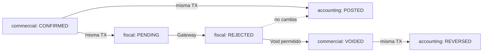
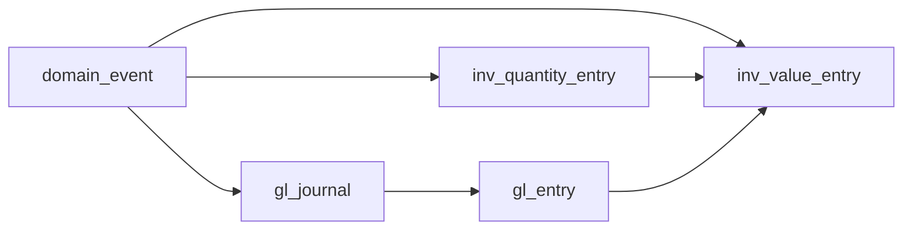

# Industrias Rochell ERP/MES — Architecture v2.1.1 Errata & Frozen Baseline

Sep 22, 2026 · @Alexander Rochell

## 1. Alcance y regla de congelamiento

Este documento contiene solo: (a) doce erratas a Architecture v2.1, y (b) la **Frozen Baseline del Vertical Slice #1**. No agrega capacidades ni modifica el alcance P0/P1/P2/P3.

| Errata | Afecta a v2.1 | Aplica a VS#1 |
| --- | --- | --- |
| E-1 Estados separados de Invoice | Secciones 18 (Invoice), 13.3 (`sal.invoice`), 14 C-11 | No (Invoice no está en VS#1); sí el patrón de estados separados para GR y SupplierInvoice |
| E-2 `event_sequence` | 12.1 `core.domain_event` | Sí |
| E-3 command\_log / request\_log | 12.1, 14 (plantilla) | Sí |
| E-4 Dirección inv\_value\_entry → GL | 12.2, 13.1 | Sí |
| E-5 Residuos de valuación | 13.1 `valuation_balance` | Sí |
| E-6 ATP sin RESERVED | 2 (Corrección 1), 13.1, 17 | Sí (enum) |
| E-7 physical\_lot\_issue\_policy | 14 C-05 | No (producción); se define el nombre |
| E-8 Reversa/devolución/corrección de recepción | 16 P-01, 18 Goods Receipt | Sí |
| E-9 RevenueAccountingPolicy | 16 P-16 a P-20 | No |
| E-10 Alcance de SupplierInvoice | 24 | Sí |
| E-11 La UI no es evidencia contable | Todo | Sí |
| E-12 Revisión de constraints | 12, 13 | Sí |

**Regla de congelamiento.** A partir de la aprobación de este documento, la Frozen Baseline de VS#1 (secciones 8 a 15) es la única especificación válida para programar el slice. Cualquier cambio requiere: (1) un ADR nuevo o una errata numerada, (2) aprobación de Alexander y del revisor técnico, (3) actualización de las pruebas de aceptación afectadas **antes** del código. Un asistente de IA o un desarrollador que encuentre una ambigüedad debe detenerse y abrir una pregunta; no debe resolverla implementando.

## 2. E-1 — Estados comercial, contable y fiscal de Invoice

**Problema en v2.1.** `sal.invoice.status` mezclaba tres dimensiones (ISSUING, ISSUED, FISCAL\_REJECTED, PAID). Una factura puede estar comercialmente confirmada y contabilizada mientras su e-CF está pendiente o rechazado; con un solo estado, o se oculta la contabilización o se oculta el problema fiscal.

**Corrección.** Tres columnas, tres máquinas, cada una con un único escritor:

| Columna | Escritor único | Valores |
| --- | --- | --- |
| `commercial_status` | Sales | DRAFT, CONFIRMED, PARTIALLY\_PAID, PAID, CREDITED, VOIDED |
| `accounting_status` | Finance (Posting Engine), en la misma TX que el journal | NOT\_POSTED, POSTED, POSTING\_BLOCKED, REVERSED |
| `fiscal_status` | Tax (al recibir resultados del Gateway o registro externo) | NOT\_REQUIRED, PENDING, SUBMITTED, UNKNOWN\_OUTCOME, ACCEPTED, ACCEPTED\_CONDITIONAL, REJECTED, PENDING\_EXTERNAL, ACCEPTED\_EXTERNAL, SUPERSEDED |

### Máquina comercial

| Origen | Comando / evento | Destino | Guardas |
| --- | --- | --- | --- |
| DRAFT | ConfirmInvoice | CONFIRMED | Cantidades facturables; reglas fiscales activas |
| CONFIRMED | ReceiptApplied (parcial / total) | PARTIALLY\_PAID / **PAID** | — |
| CONFIRMED / PARTIALLY\_PAID | CreditNote total emitida | **CREDITED** | fiscal\_status ∈ {ACCEPTED, ACCEPTED\_CONDITIONAL, ACCEPTED\_EXTERNAL} |
| CONFIRMED | VoidUnfiscalizedInvoice | **VOIDED** | fiscal\_status ∈ {PENDING (nunca enviado), REJECTED}; sin cobros aplicados; reautenticación S2 |

### Máquina contable

| Origen | Evento | Destino | Guardas / efecto |
| --- | --- | --- | --- |
| NOT\_POSTED | InvoiceConfirmed con regla y mapeo activos | POSTED | Journal creado en la misma TX |
| NOT\_POSTED | InvoiceConfirmed sin regla/mapeo | POSTING\_BLOCKED | Evento UNPOSTED; bloquea cierre |
| POSTING\_BLOCKED | Repost (tras configurar mapeo) | POSTED | Journal creado |
| POSTED | InvoiceVoided | **REVERSED** | Journal de reversa en la misma TX |

### Máquina fiscal

Igual a la máquina e-CF de v2.1 sección 19, más: `NOT_REQUIRED` (documentos de apertura y documentos internos) y `SUPERSEDED` (intento rechazado que fue sustituido por uno nuevo aceptado según el procedimiento verificado).

### Interacciones permitidas



| Situación | commercial | accounting | fiscal | ¿Válido? |
| --- | --- | --- | --- | --- |
| Confirmada, e-CF en cola | CONFIRMED | POSTED | PENDING | Sí |
| Confirmada, e-CF rechazado | CONFIRMED | POSTED | REJECTED | Sí; aparece en Tax Reconciliation y bloquea Fiscal Close |
| Confirmada, sin mapeo contable | CONFIRMED | POSTING\_BLOCKED | ACCEPTED | Sí; bloquea Accounting Close |
| Anulada tras rechazo | VOIDED | REVERSED | REJECTED | Sí |
| Pagada con e-CF pendiente | PAID | POSTED | PENDING | Sí (el cobro no depende del e-CF); alerta si > 24 h |
| Acreditada con e-CF rechazado | CREDITED | — | REJECTED | **No** (no se acredita un documento fiscal no aceptado) |
| Anulada con e-CF aceptado | VOIDED | — | ACCEPTED | **No** (requiere nota de crédito) |
| DRAFT contabilizada | DRAFT | POSTED | — | **No** |

Las combinaciones inválidas se impiden con un CHECK de combinación en la tabla y con las guardas de los comandos. El mismo patrón (commercial/document status + accounting\_status) se aplica en VS#1 a GoodsReceipt y SupplierInvoice (sección 11).

## 3. E-2 a E-4 — Eventos, idempotencia y dirección de referencias

### E-2 — Varios eventos por versión de agregado

**Problema.** `UNIQUE(aggregate_type, aggregate_id, aggregate_version)` impide que una sola transición emita dos eventos (ej. `GoodsReceiptPosted` y `PurchaseOrderLineReceived` sobre la misma versión, o `SupplierInvoiceMatched` y `SupplierInvoicePosted`).

**Corrección.**

```sql
ALTER TABLE core.domain_event ADD COLUMN event_sequence smallint NOT NULL;  -- 1..n dentro de la transición
ALTER TABLE core.domain_event ADD COLUMN command_id uuid NOT NULL;          -- = command_log.command_id
ALTER TABLE core.domain_event ADD COLUMN command_event_index int NOT NULL;  -- 1..n dentro del comando
-- reemplaza el UNIQUE anterior
UNIQUE (aggregate_type, aggregate_id, aggregate_version, event_sequence)
UNIQUE (command_id, command_event_index)
CHECK (event_sequence >= 1 AND command_event_index >= 1)
```

Orden determinístico:

- Dentro de un agregado: `(aggregate_version, event_sequence)`.
- Dentro de un comando (que puede tocar varios agregados): `command_event_index`, asignado por el Unit of Work en el orden en que el dominio emite los eventos.
- Entre comandos: `outbox_id` (bigserial asignado al insertar en la misma TX). Los consumidores procesan por `outbox_id` y, para un mismo agregado, verifican que `aggregate_version` no retroceda.

### E-3 — command\_log transaccional, request\_log separado

**Problema.** v2.1 tenía estados IN\_PROGRESS / REJECTED en `command_log` dentro de la transacción: si la transacción falla, esa fila desaparece con el rollback y el intento fallido queda invisible; si se escribe fuera, rompe la atomicidad.

**Corrección.** Dos tablas con propósitos distintos:

| Tabla | Propósito | Transacción | Contenido |
| --- | --- | --- | --- |
| `core.command_log` | Idempotencia: "este comando ya produjo efectos" | **La misma TX del comando**; solo existe si hubo COMMIT | command\_id, company\_id, command\_type, idempotency\_key, session\_id, result\_ref, result\_payload, committed\_at. Sin columna de estado: su existencia significa éxito |
| `obs.request_log` | Observabilidad de todos los intentos | **Fuera** de la TX: se escribe después del COMMIT o del ROLLBACK, en una conexión/transacción independiente y de forma asíncrona (cola en memoria con vaciado por lotes) | request\_id, idempotency\_key, command\_type, session\_id, correlation\_id, outcome (SUCCEEDED, DUPLICATE\_RETURNED, REJECTED\_DOMAIN, CONFLICT\_RETRYABLE, FAILED\_TECHNICAL), error\_code, error\_message, duration\_ms, received\_at |

Flujo de concurrencia con la misma clave:

1. La solicitud A inicia TX e inserta en `command_log` (sin commit).
2. La solicitud B, con la misma clave, intenta el mismo INSERT: PostgreSQL la **bloquea en el índice único** hasta que A termine.
3. Si A hace COMMIT, el INSERT de B falla por duplicado; B hace rollback, lee la fila de A y devuelve el mismo resultado (`DUPLICATE_RETURNED`).
4. Si A hace ROLLBACK, el INSERT de B procede y B ejecuta el comando normalmente.

Consecuencias: desaparecen IN\_PROGRESS y la respuesta 409. Un comando rechazado por regla de negocio no deja fila en command\_log (puede reintentarse cuando la situación cambie) pero sí en request\_log. Un fallo al escribir request\_log se registra en el log técnico y **nunca** afecta al comando.

### E-4 — Dirección canónica de referencias entre inventario y GL

**Problema.** v2.1 tenía `inv_value_entry.gl_journal_id NOT NULL → gl_journal` y `gl_entry.inv_value_entry_id → inv_value_entry`: dependencia circular que obliga a FKs diferibles o a inserts en dos pasos.

**Corrección.**

- **Dirección canónica: la contabilidad referencia al hecho operativo, nunca al revés.** Se elimina `inv_value_entry.gl_journal_id`. Queda `gl_entry.inv_value_entry_id → inv_value_entry`.
- **Raíz de trazabilidad:** todas las filas (quantity, value, journal, entry) llevan `source_event_id NOT NULL → core.domain_event`.
- **Asignación de IDs:** todos los UUIDv7 (evento, entradas, journal, líneas) se generan en la aplicación **antes** de cualquier INSERT, dentro del Unit of Work, de modo que cada fila conoce las claves de las demás sin lecturas intermedias.
- **Orden de INSERT dentro de la TX:** `command_log` → `domain_event` → documento/agregado (referencia `posting_event_id`) → `inv_quantity_entry` → `inv_value_entry` → `gl_journal` → `gl_entry` → proyecciones (`stock_balance`, `valuation_balance`, `gl_period_balance`) → `outbox`. Todas las FKs son inmediatas (no diferibles), salvo la verificación de balance del journal y el enlace valor → GL.
- **Invariante de enlace:** todo `inv_value_entry` con `amount <> 0` debe tener exactamente un `gl_entry` que lo referencie. Se verifica con un constraint trigger `DEFERRABLE INITIALLY DEFERRED` al final de la TX y con la conciliación nocturna.



## 4. E-5 a E-7 — Valuación, disponibilidad y selección de lotes

### E-5 — Residuos de valuación permitidos, detectados y bloqueantes al cierre

**Problema.** `CHECK (qty <> 0 OR value = 0)` en `valuation_balance` hace fallar transacciones legítimas: una corrección de precio que llega después de consumir todo el stock, un landed cost tardío o el redondeo del promedio móvil pueden dejar valor con cantidad cero por un instante o hasta que se liquide.

**Corrección.**

1. Se elimina el CHECK. Se conserva `CHECK (qty >= 0)` a nivel de área de valuación.
2. **Regla de vaciado (clear-out):** cuando una salida deja `qty = 0`, el valor de esa salida es el valor remanente completo, no `qty × promedio`. Esto elimina los residuos de redondeo en la operación normal.
3. Las entradas de valor sin cantidad (correcciones de precio, reversas con stock ya consumido) aplican la regla de reparto de la sección 5 (E-8): la porción que ya no está en stock va a variación, nunca a inventario. Así un residuo solo puede nacer de un caso no previsto.
4. **Detección:** regla de conciliación `VAL-RESIDUAL` (diaria): lista toda área × ítem con `qty = 0 AND value <> 0`, o `qty > 0 AND value <= 0`, o costo unitario implícito fuera del rango \[0.5×, 2×\] del costo del mes anterior (umbral en política contable).
5. **Bloqueo en cierre:** el componente INV-CNT no cierra mientras existan hallazgos `VAL-RESIDUAL` abiertos, salvo que cada uno tenga un `ValuationResidualAdjustment` aprobado (Controller, reautenticación): Dr/Cr variación de precio o ajuste de inventario según política, llevando el valor a cero.

### E-6 — Disponibilidad sin RESERVED

**Problema.** v2.1 tenía `availability = RESERVED` y además `qty_reserved`: dos representaciones del mismo hecho que pueden divergir.

**Corrección.**

- `availability` describe solo estado físico o de calidad: **AVAILABLE, QUALITY\_HOLD, BLOCKED, CONDITIONAL, NOT\_PROMISABLE, LOST**. Se eliminan RESERVED y COMMITTED\_TO\_ORDER del enum.
- La reserva de inventario fungible vive únicamente en `qty_reserved` (y en `inv.reservation`).

```latex
available\_to\_promise = qty\_on\_hand - qty\_reserved \quad (\text{solo filas con availability} = AVAILABLE)
```

- CONDITIONAL es prometible solo al cliente autorizado (consulta filtrada), nunca al ATP general.
- En la tabla de escenarios de v2.1 (Corrección 1), donde decía COMMITTED\_TO\_ORDER se lee: `availability = AVAILABLE` con `qty_reserved` > 0 (en planta) o `NOT_PROMISABLE` (ya cargado en vehículo o en tránsito).
- CHECK en `stock_balance`: `qty_reserved = 0 OR availability IN ('AVAILABLE','CONDITIONAL')`.

### E-7 — physical\_lot\_issue\_policy

**Problema.** v2.1 (C-05) decía "FIFO de lotes para trazabilidad", lo que puede confundirse con el método contable FIFO.

**Corrección.** Se renombra a `physical_lot_issue_policy`, parámetro por material × planta con valores **FIFO\_BY\_RECEIPT\_DATE, FEFO, MANUAL\_SELECTION, LOCATION\_PRIORITY**. Solo decide **qué lotes físicos** se decrementan en `inv_quantity_entry` (para trazabilidad). El valor de toda salida lo determina el `price_control` del área de valuación (MOVING\_AVG para materia prima): `valor = qty × valor_área / qty_área` (o regla de vaciado), **idéntico cualquiera sea el lote**. Un test (INV-09) verifica que cambiar la política de lotes no cambia ningún importe.

## 5. E-8 — ReverseGoodsReceipt, ReturnToSupplier, ReceiptCorrection

**Problema.** v2.1 usaba una sola "reversa" de recepción, incluso cuando parte del material ya se consumió, lo que obligaba a asientos "espejo" que no correspondían a la realidad física.

**Principio.** El GR original es un hecho histórico inmutable: sus líneas, entradas de ledger y asiento nunca cambian. Cada caso crea un **documento nuevo** que se vincula al GR con un tipo de enlace propio. El GR solo cambia su `document_status` (REVERSED, CORRECTED) como efecto del documento nuevo.

Notación: Q = cantidad del GR, P = precio de OC, Δq = corrección de cantidad, avg = costo promedio vigente del área de valuación, q₁ = porción que todavía está en stock.

### 5.1 Cuándo usar cada documento

| Documento | Cuándo | Cuándo NO | VS#1 |
| --- | --- | --- | --- |
| **ReverseGoodsReceipt** | El GR fue un error completo (no llegó el material, se registró dos veces, OC equivocada) y su efecto puede deshacerse íntegramente | Si hay factura de proveedor asociada, si los lotes del GR tuvieron cualquier salida posterior, o si el período de su posteo original y el actual difieren en un Fiscal Close presentado que dependa de él | **Sí** |
| **ReturnToSupplier** | El material llegó y se registró bien, pero se devuelve físicamente (calidad, exceso) | Si el material ya no está disponible | No (diseñado; P0 posterior) |
| **ReceiptCorrection** | La cantidad registrada fue errónea (ticket de báscula mal leído) y el material pudo ya haberse consumido o transformado | Para diferencias de precio (esas se resuelven en la factura, P-04) | **Sí** (solo cantidad) |

### 5.2 ReverseGoodsReceipt

Guardas: GR en POSTED; `qty_invoiced = 0` en todas sus líneas de OC atribuibles a este GR; cada lote creado por el GR tiene exactamente la cantidad recibida, en la ubicación de recepción, sin reservas y **sin ninguna entrada de ledger posterior** distinta de cambios de disponibilidad; `posting_date` en período INV-MOV abierto; reautenticación.

| Efecto | Detalle |
| --- | --- |
| Documento | `GoodsReceiptReversal` (nuevo), `document_link` REVERSES → GR; GR `document_status` → REVERSED |
| Cantidad | −Q por lote en la ubicación de recepción |
| Valor | −(Q × avg) con regla de vaciado; cuando no hubo movimientos intermedios en el área, esto es exactamente −Q×P |
| OC | `qty_received −= Q` |
| Asiento | Dr GRNI (Q × P) / Cr RAW\_MATERIAL (Q × avg); diferencia a PURCHASE\_PRICE\_VARIANCE (cero en el caso normal) |

### 5.3 ReturnToSupplier (diseñado, fuera de VS#1)

Guardas: material disponible no reservado; motivo; `return_mode` = WITH\_REPLACEMENT (la OC queda abierta por lo devuelto) o WITHOUT\_REPLACEMENT (se reduce `qty_received`).

| Situación | Cantidad | Asiento |
| --- | --- | --- |
| No facturado | − cantidad devuelta del lote elegido | Dr GRNI (q × P) / Cr RAW\_MATERIAL (q × avg); diferencia a PURCHASE\_PRICE\_VARIANCE |
| Ya facturado | Ídem | Dr SUPPLIER\_RETURN\_CLEARING (q × P) / Cr RAW\_MATERIAL (q × avg); diferencia a PURCHASE\_PRICE\_VARIANCE. Al recibir la nota de crédito del proveedor: Dr AP\_CONTROL / Cr SUPPLIER\_RETURN\_CLEARING + Cr ITBIS\_RECOVERABLE (según regla fiscal verificada) |

### 5.4 ReceiptCorrection (cantidad)

Guardas: GR en POSTED o CORRECTED; motivo y evidencia (ticket corregido, foto, acta); `qty_invoiced ≤ qty_received + Δq` en la línea de OC; si |Δq| × P supera `inventory_adjustment_materiality`, aprobación del Controller con reautenticación; Δq > 0 requiere además que no exceda tolerancia de OC o aprobación de sobre-recepción.

**Δq > 0 (se registró menos de lo recibido):**

| Efecto | Detalle |
| --- | --- |
| Cantidad | + Δq en el lote original del GR (o lote de corrección vinculado si el original ya se agotó) |
| Valor | + Δq × P |
| Asiento | Dr RAW\_MATERIAL / Cr GRNI por Δq × P |
| OC | `qty_received += Δq` |

**Δq < 0 (se registró más de lo recibido):** el stock en libros incluye cantidad fantasma. Se retira lo que todavía está en stock; lo que ya se "consumió" en libros significa que el costo cargado a producción estuvo sobrestimado.

```latex
q_1 = \min(qty_{\acute{a}rea},\ |\Delta q|) \qquad q_2 = |\Delta q| - q_1
```

| Efecto | Detalle |
| --- | --- |
| Cantidad | − q₁ del stock del ítem en el área (lotes según physical\_lot\_issue\_policy, empezando por el lote del GR) |
| Valor | − q₁ × avg (regla de vaciado si llega a cero) |
| Asiento | Dr GRNI ( |
| OC | \`qty\_received −= |
| Documento | `ReceiptCorrection`, `document_link` CORRECTS → GR; GR `document_status` → CORRECTED; puede haber varias correcciones por GR |

Comprobación de cuadre del caso negativo: Dr = |Δq|P; Cr = q₁·avg + q₁(P − avg) + q₂P = |Δq|P.

En VS#1 no existe producción, así que q₂ solo aparece si hubo ajustes de inventario; la regla queda implementada y probada igualmente (RC-03).

## 6. E-9 a E-11 — Política de ingresos, alcance de factura de proveedor, evidencia contable

### E-9 — RevenueAccountingPolicy

**Problema.** v2.1 (P-16 a P-20) asumía CONTRACT\_ASSET y CONTRACT\_LIABILITY como única presentación. Según la naturaleza del derecho de cobro y del contrato, el Controller puede presentar lo entregado no facturado como cuenta por cobrar no facturada o como activo de contrato, y los anticipos como pasivo de contrato o anticipo de cliente.

**Corrección.** Nueva política versionada `revenue_accounting` dentro del marco de la Corrección 9 de v2.1 (misma aprobación y vigencia), con parámetros por empresa × tipo de contrato:

| Parámetro | Valores | Uso |
| --- | --- | --- |
| `unbilled_delivery_presentation` | CONTRACT\_ASSET, UNBILLED\_RECEIVABLE | Rol usado en ControlTransferred sin factura |
| `advance_billing_presentation` | CONTRACT\_LIABILITY, CUSTOMER\_ADVANCES | Rol usado en factura anticipada sin transferencia de control |
| `freight_revenue_separation` | SEPARATE\_LINE, BUNDLED | Si el flete es obligación separada |
| `bill_and_hold_enabled` | BOOLEAN | (trasladado desde la lista de v2.1) |
| `contract_type` | STANDARD\_B2B, PROJECT\_CONFOTUR, CONSIGNMENT, … | Clave de aplicación |

Las reglas de posteo P-16 a P-20 dejan de nombrar roles fijos y usan **selectores de rol**: `ROLE(policy.unbilled_delivery_presentation)` y `ROLE(policy.advance_billing_presentation)`. Se agregan los roles UNBILLED\_RECEIVABLE (junto a los existentes). El asiento guarda la versión de política usada. Sin política activa para el tipo de contrato, el evento queda en POSTING\_BLOCKED. Fuera de VS#1.

### E-10 — SupplierInvoice congelada para VS#1

Alcance funcional único en VS#1: **Inventory PO → Goods Receipt → Supplier Invoice → AP.**

| Incluido | Excluido (sin funcionalidad) |
| --- | --- |
| Factura cuyas líneas referencian todas líneas de OC de inventario con recepción posteada | Servicios sin OC, gastos generales, activos fijos, landed cost, facturas de proveedores del exterior, notas de crédito/débito de proveedor, anticipos a proveedores, pagos |

Extensibilidad sin funcionalidad:

- `supplier_invoice_line.line_kind` es un enum con valores futuros declarados (`INVENTORY_PO`, `SERVICE_PO`, `EXPENSE`, `FIXED_ASSET`, `LANDED_COST`) pero con `CHECK (line_kind = 'INVENTORY_PO')` en VS#1.
- Interfaz de dominio `ISupplierInvoiceLineHandler` (determinación de cuenta, match, efecto en inventario) con **una sola implementación**: `InventoryPoLineHandler`. Agregar otra requiere errata/ADR, relajar el CHECK en una migración y sus pruebas.
- La regla P-05 (gasto sin OC) de v2.1 se excluye de VS#1.

### E-11 — La UI no es evidencia contable

Regla normativa:

> **Ningún estado mostrado en pantalla es evidencia contable.** Un hecho está contabilizado si y solo si existe el `gl_journal` con `source_event_id` del hecho, balanceado, sellado en la hash chain, y el documento tiene `accounting_status = POSTED`.

Mecanismos:

1. `accounting_status` es una columna separada del estado del documento y solo la escribe el Posting Engine, en la misma TX que el journal.
2. Constraint trigger diferido: `accounting_status = 'POSTED'` ⇔ existe al menos un journal no revertido para el `source_event_id` de posteo del documento.
3. Conciliación `ACC-EVIDENCE` diaria: documentos POSTED sin journal y journals sin documento → ERROR.
4. Cierres, reportes financieros, Explain y auditoría consultan journals, nunca estados de documento.
5. La UI muestra `accounting_status` con enlace directo al journal (Explain); no existe acción de UI que cambie ese estado.

## 7. E-12 — Revisión de constraints del VS#1

Revisión de cada constraint de v2.1 que toca el slice, buscando imposibles bajo correcciones legítimas, FKs circulares, carreras, nulabilidad incorrecta, UNIQUE demasiado fuertes y estados inalcanzables.

| # | Constraint actual (v2.1) | Escenario que la rompe | Cambio | Razón |
| --- | --- | --- | --- | --- |
| K-01 | `domain_event UNIQUE(aggregate_type, aggregate_id, aggregate_version)` | Una transición emite dos eventos | `UNIQUE(…, aggregate_version, event_sequence)` + `UNIQUE(command_id, command_event_index)` | E-2 |
| K-02 | `command_log.status IN ('IN_PROGRESS','SUCCEEDED','REJECTED')` | Rollback borra IN\_PROGRESS/REJECTED; estado no observable | Sin columna status; existencia = éxito; `obs.request_log` separado | E-3 |
| K-03 | `inv_value_entry.gl_journal_id NOT NULL → gl_journal` + `gl_entry.inv_value_entry_id → inv_value_entry` | Ciclo de FKs; imposible insertar sin diferir | Eliminar `inv_value_entry.gl_journal_id` | E-4 |
| K-04 | `inv_value_entry UNIQUE(source_event_id, quantity_entry_id, value_type)` | `quantity_entry_id` NULL: los NULL son distintos y el UNIQUE no protege revaluaciones duplicadas | `UNIQUE NULLS NOT DISTINCT (source_event_id, source_line_id, valuation_area_id, item_id, value_type)` | Idempotencia real con NULL (PostgreSQL 15+) |
| K-05 | `inv_value_entry` sin restricción de importe | Recepción a precio 0 crea valor 0 sin línea de GL, violando el invariante de enlace | `CHECK (amount <> 0)`; recepciones a precio 0 solo crean quantity entry | Evitar filas sin contrapartida contable |
| K-06 | `inv_quantity_entry UNIQUE(source_event_id, source_line_id, entry_role, lot_id, location_id)` | `source_line_id` NULL en eventos sin línea | `NULLS NOT DISTINCT` | Ídem K-04 |
| K-07 | `inv_quantity_entry PK (posting_date, entry_id)` | Otras tablas referencian solo `entry_id`; FK imposible sin UNIQUE en entry\_id | PK `(entry_id)` en VS#1; particionamiento diferido (ADR nuevo cuando aplique, con FKs compuestas) | Partición prematura rompe FKs |
| K-08 | `stock_balance PK (…, accounting_owner, …)` con `accounting_owner` nullable | PostgreSQL no admite NULL en PK | PK surrogate `stock_balance_id`; `UNIQUE NULLS NOT DISTINCT (company_id, location_id, item_id, lot_id, accounting_owner, legal_title_holder, availability)` | Stock fuera de balance (NULL) debe poder existir |
| K-09 | `stock_balance CHECK (qty_on_hand >= 0 OR location_is_virtual)` | `location_is_virtual` duplicado puede divergir de la ubicación | Eliminar la columna; en VS#1 `CHECK (qty_on_hand >= 0)` sin excepción (no hay ubicaciones virtuales) | Dato denormalizado sin fuente |
| K-10 | `stock_balance CHECK (qty_reserved <= GREATEST(qty_on_hand,0))` + availability RESERVED | Doble representación | `CHECK (qty_reserved >= 0 AND qty_reserved <= qty_on_hand)` y `CHECK (qty_reserved = 0 OR availability IN ('AVAILABLE','CONDITIONAL'))` | E-6 |
| K-11 | `valuation_balance CHECK (qty <> 0 OR value = 0)` | Corrección de precio tras consumo total | Eliminado; `CHECK (qty >= 0)`; detección VAL-RESIDUAL; bloqueo de cierre | E-5 |
| K-12 | `valuation_balance.moving_avg_cost` almacenado | Queda desactualizado o indefinido con qty = 0 | Eliminado; costo unitario se calcula `value / qty` en la TX (con regla de vaciado) | Un dato derivado almacenado es una segunda verdad |
| K-13 | `purchase_order_line CHECK (qty_received <= qty_ordered × (1 + tol))` | Sobre-recepción legítima aprobada o ReceiptCorrection positiva | `CHECK (qty_received <= qty_ordered * (1 + receipt_tolerance_pct) + qty_over_receipt_approved)` con `qty_over_receipt_approved >= 0` | Permitir la excepción aprobada sin desactivar el control |
| K-14 | `purchase_order_line` sin relación entre facturado y recibido | Factura mayor a lo recibido pasa sin control | `CHECK (qty_invoiced <= qty_received)` | VS#1 exige recepción antes de factura (E-10) |
| K-15 | Revisión de OC puede bajar `qty_ordered` bajo lo recibido | Revisión deja línea inválida | Guardado por K-13 en la misma fila; el comando de revisión valida antes | Estado inalcanzable evitado |
| K-16 | `goods_receipt.reverses_gr_id UNIQUE` en la misma tabla | Mezclaba reversa con GR; imposibilitaba correcciones múltiples | Documento separado `goods_receipt_reversal` con `UNIQUE (reversed_gr_id)`; `receipt_correction` sin UNIQUE por GR | E-8 |
| K-17 | `supplier_invoice UNIQUE(company_id, party_id, supplier_fiscal_number)` | Factura registrada por error y anulada no puede volver a registrarse con el mismo NCF | Índice único parcial `WHERE document_status <> 'VOIDED'` | Corrección legítima de captura |
| K-18 | `ap_document UNIQUE(company_id, party_id, supplier_fiscal_number)` | Duplica K-17 y choca con documentos de apertura sin número | Eliminado de `ap_document` (el control fiscal vive en `supplier_invoice`) | Una regla, un lugar |
| K-19 | `gl_journal UNIQUE(source_event_id, posting_rule_id)` | Evento contabilizado con mapeo erróneo, revertido y que debe re-contabilizarse con la misma regla | Añadir `posting_generation int NOT NULL DEFAULT 1`; `UNIQUE(source_event_id, posting_rule_id, posting_generation)`; el comando `RepostEvent` exige que la generación anterior esté revertida | Corrección legítima sin romper idempotencia |
| K-20 | Bloqueo `FOR SHARE` de la fila de período en cada posteo | MultiXact y contención en una fila caliente | `pg_advisory_xact_lock_shared(hash(company, period, component))` en posteos; `pg_advisory_xact_lock` exclusivo en cierre | Mismo efecto, sin escribir en la fila |
| K-21 | `md.party` RNC único por empresa, NOT NULL | Proveedores sin RNC dominicano (exterior) | RNC nullable; `UNIQUE (company_id, rnc) WHERE rnc IS NOT NULL`; `CHECK (rnc IS NOT NULL OR party_kind = 'FOREIGN')` | En VS#1 solo proveedores locales, pero el constraint no debe impedir el futuro |
| K-22 | `gl_entry CHECK ((debit = 0) <> (credit = 0))` | Correcto; se confirma | Sin cambio | Cero no genera líneas (K-05) |
| K-23 | `ap_document CHECK (open_amount <= original_amount)` | Correcto | Sin cambio | — |
| K-24 | `document_link` PK con COALESCE (ya corregido en v2.1) | — | `link_id` PK + índice único con COALESCE | Confirmado |
| K-25 | `accounting_status` sin vínculo al journal | Estado POSTED sin journal | Constraint trigger diferido (E-11) | Evidencia contable |
| K-26 | Invariante balance del journal como trigger por fila | Falla al insertar la primera línea | Constraint trigger `DEFERRABLE INITIALLY DEFERRED` por journal | Se evalúa al commit |

Estados que podían quedar inalcanzables: (a) PO en PARTIALLY\_RECEIVED tras una ReverseGoodsReceipt total ahora vuelve a APPROVED (transición añadida en sección 11); (b) GR CORRECTED puede recibir nuevas correcciones (no terminal); (c) SupplierInvoice en MATCH\_EXCEPTION puede volver a MATCHED tras una ReceiptCorrection (re-evaluación añadida).

## 8. FROZEN BASELINE FOR VS#1 — Schema (1/2)

PostgreSQL 17. SQL normativo en estructura e integridad; los tipos auxiliares (enums) se listan al final. Toda tabla transaccional: `company_id uuid NOT NULL` con RLS `USING (company_id = current_setting('app.company_id')::uuid)`. Ledgers: rol de aplicación sin UPDATE/DELETE y trigger que aborta. Montos `numeric(19,4)`, cantidades `numeric(18,6)`, precios unitarios `numeric(19,6)`.

### 8.1 Plataforma (`core`, `obs`)

```sql
CREATE TABLE core.command_log (
  command_id uuid PRIMARY KEY,
  company_id uuid NOT NULL, command_type text NOT NULL, idempotency_key text NOT NULL,
  session_id uuid NOT NULL REFERENCES iam.session,
  result_ref uuid, result_payload jsonb NOT NULL, committed_at timestamptz NOT NULL DEFAULT now(),
  UNIQUE (company_id, command_type, idempotency_key)
);

CREATE TABLE core.domain_event (
  event_id uuid PRIMARY KEY,
  company_id uuid NOT NULL,
  command_id uuid NOT NULL REFERENCES core.command_log, command_event_index int NOT NULL CHECK (command_event_index >= 1),
  event_type text NOT NULL, schema_version int NOT NULL,
  aggregate_type text NOT NULL, aggregate_id uuid NOT NULL, aggregate_version bigint NOT NULL,
  event_sequence smallint NOT NULL CHECK (event_sequence >= 1),
  occurred_at timestamptz NOT NULL, recorded_at timestamptz NOT NULL DEFAULT now(), business_date date NOT NULL,
  session_id uuid NOT NULL, correlation_id uuid NOT NULL, causation_id uuid,
  payload jsonb NOT NULL, row_hash bytea NOT NULL,
  UNIQUE (aggregate_type, aggregate_id, aggregate_version, event_sequence),
  UNIQUE (command_id, command_event_index)
);

CREATE TABLE core.outbox (
  outbox_id bigserial PRIMARY KEY,
  event_id uuid NOT NULL UNIQUE REFERENCES core.domain_event,
  available_at timestamptz NOT NULL DEFAULT now(), dispatched_at timestamptz, attempts int NOT NULL DEFAULT 0
);
CREATE INDEX outbox_pending ON core.outbox (outbox_id) WHERE dispatched_at IS NULL;

CREATE TABLE core.inbox (
  consumer text NOT NULL, event_id uuid NOT NULL REFERENCES core.domain_event,
  processed_at timestamptz NOT NULL DEFAULT now(), PRIMARY KEY (consumer, event_id)
);

CREATE TABLE core.document_link (
  link_id uuid PRIMARY KEY, company_id uuid NOT NULL,
  from_type text NOT NULL, from_id uuid NOT NULL, from_line_id uuid,
  to_type text NOT NULL, to_id uuid NOT NULL, to_line_id uuid,
  link_type core.link_type NOT NULL, qty numeric(18,6), amount numeric(19,4),
  event_id uuid NOT NULL REFERENCES core.domain_event
);
CREATE UNIQUE INDEX document_link_uq ON core.document_link
  (from_id, COALESCE(from_line_id,'00000000-0000-0000-0000-000000000000'::uuid),
   to_id,   COALESCE(to_line_id,  '00000000-0000-0000-0000-000000000000'::uuid), link_type);

CREATE TABLE core.state_history (
  state_history_id uuid PRIMARY KEY, company_id uuid NOT NULL,
  aggregate_type text NOT NULL, aggregate_id uuid NOT NULL, status_kind text NOT NULL, -- DOCUMENT | ACCOUNTING
  from_state text, to_state text NOT NULL, command text NOT NULL, event_id uuid NOT NULL REFERENCES core.domain_event,
  reason text
);

CREATE TABLE obs.request_log (      -- fuera de la TX de negocio; sin FKs
  request_id uuid PRIMARY KEY, company_id uuid, command_type text, idempotency_key text,
  session_id uuid, correlation_id uuid, outcome text NOT NULL, error_code text, error_message text,
  duration_ms int, received_at timestamptz NOT NULL
);
```

### 8.2 Identidad (`iam`) — mínima para VS#1

```sql
CREATE TABLE iam.user (
  user_id uuid PRIMARY KEY, kind text NOT NULL CHECK (kind IN ('HUMAN','SERVICE')),
  employee_id uuid UNIQUE, email text UNIQUE, oidc_subject text UNIQUE, status text NOT NULL,
  CHECK (kind = 'SERVICE' OR (employee_id IS NOT NULL AND oidc_subject IS NOT NULL))
);
CREATE TABLE iam.permission (permission_code text PRIMARY KEY);   -- 'purchase_order:approve', ...
CREATE TABLE iam.role (role_id uuid PRIMARY KEY, code text UNIQUE NOT NULL);
CREATE TABLE iam.role_permission (role_id uuid REFERENCES iam.role, permission_code text REFERENCES iam.permission,
  PRIMARY KEY (role_id, permission_code));
CREATE TABLE iam.role_assignment (
  assignment_id uuid PRIMARY KEY, user_id uuid NOT NULL REFERENCES iam.user, role_id uuid NOT NULL REFERENCES iam.role,
  company_id uuid NOT NULL, plant_id uuid,                 -- scope
  valid_from timestamptz NOT NULL, valid_to timestamptz, sod_exception_id uuid,
  granted_by uuid NOT NULL REFERENCES iam.user, CHECK (granted_by <> user_id)
);
CREATE TABLE iam.sod_rule (permission_a text REFERENCES iam.permission, permission_b text REFERENCES iam.permission,
  PRIMARY KEY (permission_a, permission_b), CHECK (permission_a < permission_b));
CREATE TABLE iam.session (
  session_id uuid PRIMARY KEY, user_id uuid NOT NULL REFERENCES iam.user, auth_method text NOT NULL,
  ip inet, user_agent text, login_at timestamptz NOT NULL, last_step_up_at timestamptz, logout_at timestamptz
);
```

### 8.3 Maestros (`md`)

```sql
CREATE TABLE md.party (
  party_id uuid PRIMARY KEY, company_id uuid NOT NULL, party_kind text NOT NULL, -- LOCAL, FOREIGN
  rnc text, legal_name text NOT NULL, is_supplier boolean NOT NULL, status md.master_status NOT NULL,
  rnc_validated_at timestamptz, version bigint NOT NULL,
  CHECK (rnc IS NOT NULL OR party_kind = 'FOREIGN')
);
CREATE UNIQUE INDEX party_rnc_uq ON md.party (company_id, rnc) WHERE rnc IS NOT NULL;

CREATE TABLE md.uom (uom_code text PRIMARY KEY, dimension text NOT NULL);          -- t, kg
CREATE TABLE md.item (
  item_id uuid PRIMARY KEY, company_id uuid NOT NULL, code text NOT NULL,
  item_type text NOT NULL CHECK (item_type = 'RAW_MATERIAL'),   -- VS#1
  base_uom text NOT NULL REFERENCES md.uom, item_category text NOT NULL,
  status md.master_status NOT NULL, version bigint NOT NULL, UNIQUE (company_id, code)
);
CREATE TABLE md.uom_conversion (
  item_id uuid REFERENCES md.item, from_uom text REFERENCES md.uom, to_uom text REFERENCES md.uom,
  factor numeric(18,8) NOT NULL CHECK (factor > 0), effective_from date NOT NULL, effective_to date,
  PRIMARY KEY (item_id, from_uom, to_uom, effective_from)
);
CREATE TABLE md.plant (plant_id uuid PRIMARY KEY, company_id uuid NOT NULL, code text NOT NULL,
  valuation_area_id uuid NOT NULL UNIQUE, UNIQUE (company_id, code));
CREATE TABLE md.location (location_id uuid PRIMARY KEY, company_id uuid NOT NULL,
  plant_id uuid NOT NULL REFERENCES md.plant, code text NOT NULL, UNIQUE (plant_id, code));
```

### 8.4 Finanzas y políticas (`fin`, `acc`)

```sql
CREATE TABLE fin.account (account_id uuid PRIMARY KEY, company_id uuid NOT NULL, code text NOT NULL,
  name text NOT NULL, is_control boolean NOT NULL, UNIQUE (company_id, code));

CREATE TABLE fin.account_role_map (         -- versionado
  map_id uuid PRIMARY KEY, company_id uuid NOT NULL, account_role text NOT NULL,
  item_category text,                          -- NULL = cualquiera
  account_id uuid NOT NULL REFERENCES fin.account,
  effective_from date NOT NULL, effective_to date, approved_by uuid NOT NULL, status text NOT NULL
);
CREATE UNIQUE INDEX role_map_active ON fin.account_role_map
  (company_id, account_role, COALESCE(item_category,'*'), effective_from) WHERE status = 'ACTIVE';

CREATE TABLE fin.posting_rule (posting_rule_id uuid PRIMARY KEY, code text UNIQUE NOT NULL, event_type text NOT NULL);
CREATE TABLE fin.posting_rule_version (
  posting_rule_id uuid REFERENCES fin.posting_rule, version int, definition jsonb NOT NULL,
  explanation_templates jsonb NOT NULL, effective_from date NOT NULL, effective_to date,
  status text NOT NULL, approved_by uuid, PRIMARY KEY (posting_rule_id, version)
);

CREATE TABLE fin.period (period_id uuid PRIMARY KEY, company_id uuid NOT NULL, starts_on date NOT NULL,
  ends_on date NOT NULL, UNIQUE (company_id, starts_on), CHECK (ends_on >= starts_on));
CREATE TABLE fin.close_component_state (
  period_id uuid REFERENCES fin.period, component text CHECK (component IN ('INV-MOV','AP-REC')),  -- VS#1
  status text NOT NULL CHECK (status IN ('OPEN','CLOSED','REOPENED')),
  closed_by uuid, closed_at timestamptz, snapshot_hash bytea, version bigint NOT NULL,
  PRIMARY KEY (period_id, component)
);

CREATE TABLE fin.gl_journal (
  journal_id uuid PRIMARY KEY, company_id uuid NOT NULL,
  posting_date date NOT NULL, period_id uuid NOT NULL REFERENCES fin.period,
  source_event_id uuid NOT NULL REFERENCES core.domain_event,
  posting_rule_id uuid NOT NULL, posting_rule_version int NOT NULL,
  posting_generation int NOT NULL DEFAULT 1 CHECK (posting_generation >= 1),
  journal_type text NOT NULL CHECK (journal_type IN ('AUTO','REVERSAL')),        -- VS#1
  reverses_journal_id uuid UNIQUE REFERENCES fin.gl_journal,
  late_entry boolean NOT NULL DEFAULT false, occurred_at timestamptz NOT NULL, row_hash bytea NOT NULL,
  FOREIGN KEY (posting_rule_id, posting_rule_version) REFERENCES fin.posting_rule_version,
  UNIQUE (source_event_id, posting_rule_id, posting_generation),
  CHECK ((journal_type = 'REVERSAL') = (reverses_journal_id IS NOT NULL))
);

CREATE TABLE fin.gl_entry (
  gl_entry_id uuid PRIMARY KEY, journal_id uuid NOT NULL REFERENCES fin.gl_journal, line_no int NOT NULL,
  company_id uuid NOT NULL, posting_date date NOT NULL,
  account_id uuid NOT NULL REFERENCES fin.account, account_role text NOT NULL,
  debit numeric(19,4) NOT NULL DEFAULT 0, credit numeric(19,4) NOT NULL DEFAULT 0,
  currency char(3) NOT NULL DEFAULT 'DOP',
  plant_id uuid, item_id uuid, party_id uuid,
  subledger_type text CHECK (subledger_type IN ('AP','INV')), subledger_ref uuid,
  inv_value_entry_id uuid UNIQUE REFERENCES inv.inv_value_entry,
  source_event_id uuid NOT NULL REFERENCES core.domain_event,
  rule_line_code text NOT NULL, determination_inputs jsonb NOT NULL, row_hash bytea NOT NULL,
  UNIQUE (journal_id, line_no),
  CHECK (debit >= 0 AND credit >= 0 AND (debit = 0) <> (credit = 0))
);
-- CONSTRAINT TRIGGER gl_journal_balanced DEFERRABLE INITIALLY DEFERRED: Σdebit = Σcredit por journal
-- TRIGGER: account.is_control ⇒ subledger_type NOT NULL
-- CONSTRAINT TRIGGER inv_value_linked DEFERRABLE INITIALLY DEFERRED: cada inv_value_entry tiene un gl_entry

CREATE TABLE fin.gl_period_balance (
  company_id uuid, period_id uuid, account_id uuid, plant_id uuid, party_id uuid,
  debit numeric(19,4) NOT NULL, credit numeric(19,4) NOT NULL,
  UNIQUE NULLS NOT DISTINCT (company_id, period_id, account_id, plant_id, party_id)
);

CREATE TABLE fin.ap_document (
  ap_doc_id uuid PRIMARY KEY, company_id uuid NOT NULL, party_id uuid NOT NULL REFERENCES md.party,
  doc_type text NOT NULL CHECK (doc_type = 'SUPPLIER_INVOICE'),   -- VS#1
  source_doc_id uuid NOT NULL UNIQUE, doc_date date NOT NULL, due_date date NOT NULL,
  original_amount numeric(19,4) NOT NULL CHECK (original_amount > 0),
  open_amount numeric(19,4) NOT NULL, version bigint NOT NULL,
  CHECK (open_amount >= 0 AND open_amount <= original_amount)
);

CREATE TABLE acc.accounting_policy (policy_code text PRIMARY KEY, owner_role text NOT NULL);
CREATE TABLE acc.accounting_policy_version (
  policy_version_id uuid PRIMARY KEY, policy_code text NOT NULL REFERENCES acc.accounting_policy,
  company_id uuid NOT NULL, version int NOT NULL, status text NOT NULL,
  effective_from date NOT NULL, effective_to date,
  prepared_by uuid NOT NULL, approved_by uuid, approved_at timestamptz,
  CHECK (approved_by IS NULL OR approved_by <> prepared_by),
  UNIQUE (policy_code, company_id, version),
  EXCLUDE USING gist (policy_code WITH =, company_id WITH =,
    daterange(effective_from, effective_to, '[)') WITH &&) WHERE (status = 'ACTIVE')
);
CREATE TABLE acc.accounting_policy_parameter (
  policy_version_id uuid REFERENCES acc.accounting_policy_version, param_code text,
  value_type text NOT NULL, value jsonb NOT NULL, PRIMARY KEY (policy_version_id, param_code)
);
```

Parámetros de política usados en VS#1: `receipt_tolerance_pct`, `match_qty_tolerance_pct`, `match_price_tolerance_pct`, `match_amount_tolerance_abs`, `inventory_adjustment_materiality`, `grni_aging_alert_days`, `late_entry_hours`, `rounding_difference_tolerance`. Ningún valor en código.

## 9. FROZEN BASELINE FOR VS#1 — Schema (2/2)

### 9.1 Fiscal (`tax`) — solo lo necesario para la factura de proveedor

```sql
CREATE TABLE tax.fiscal_rule_source (
  source_id uuid PRIMARY KEY, official_source text NOT NULL, document_title text NOT NULL,
  document_version text NOT NULL, publication_date date NOT NULL, consulted_at timestamptz NOT NULL,
  effective_from date NOT NULL, effective_to date, url_or_reference text NOT NULL,
  file_object_key text NOT NULL, file_hash bytea NOT NULL,
  approved_by uuid NOT NULL, approved_at timestamptz NOT NULL
);
CREATE TABLE tax.fiscal_rule (rule_id uuid PRIMARY KEY, code text UNIQUE NOT NULL,
  rule_kind text NOT NULL CHECK (rule_kind IN ('PURCHASE_ITBIS','PURCHASE_WITHHOLDING')));  -- VS#1
CREATE TABLE tax.fiscal_rule_version (
  rule_version_id uuid PRIMARY KEY, rule_id uuid NOT NULL REFERENCES tax.fiscal_rule, version int NOT NULL,
  definition jsonb NOT NULL, effective_from date NOT NULL, effective_to date,
  status text NOT NULL CHECK (status IN ('DRAFT','BLOCKED_PENDING_SOURCE','READY','ACTIVE','RETIRED')),
  configured_by uuid NOT NULL, activated_by uuid, activated_at timestamptz,
  CHECK (activated_by IS NULL OR activated_by <> configured_by),
  UNIQUE (rule_id, version)
);
CREATE TABLE tax.fiscal_rule_version_source (
  rule_version_id uuid REFERENCES tax.fiscal_rule_version, source_id uuid REFERENCES tax.fiscal_rule_source,
  PRIMARY KEY (rule_version_id, source_id)
);
CREATE TABLE tax.fiscal_rule_test_run (
  test_run_id uuid PRIMARY KEY, rule_version_id uuid NOT NULL REFERENCES tax.fiscal_rule_version,
  environment text NOT NULL, passed boolean NOT NULL, cases int NOT NULL, result_hash bytea NOT NULL,
  executed_at timestamptz NOT NULL
);
-- TRIGGER: status → ACTIVE exige ≥1 fuente vinculada y ≥1 test_run passed = true posterior a la última modificación

CREATE TABLE tax.tax_determination (
  determination_id uuid PRIMARY KEY, company_id uuid NOT NULL,
  subject_type text NOT NULL, subject_id uuid NOT NULL,
  rule_version_ids uuid[] NOT NULL, inputs jsonb NOT NULL, determined_at timestamptz NOT NULL
);
CREATE TABLE tax.tax_determination_line (
  determination_id uuid REFERENCES tax.tax_determination, line_no int,
  subject_line_id uuid NOT NULL, tax_code text NOT NULL, base numeric(19,4) NOT NULL,
  rate numeric(12,6) NOT NULL, amount numeric(19,4) NOT NULL, effect text NOT NULL, -- RECOVERABLE_INPUT, WITHHOLDING
  PRIMARY KEY (determination_id, line_no)
);
```

### 9.2 Compras (`pur`)

```sql
CREATE TABLE pur.purchase_order (
  po_id uuid PRIMARY KEY, company_id uuid NOT NULL, po_no text NOT NULL,
  party_id uuid NOT NULL REFERENCES md.party, plant_id uuid NOT NULL REFERENCES md.plant,
  revision int NOT NULL DEFAULT 1, status pur.po_status NOT NULL,
  created_by uuid NOT NULL, approved_by uuid, approved_at timestamptz,
  policy_version_id uuid,                     -- política vigente al aprobar
  version bigint NOT NULL, UNIQUE (company_id, po_no),
  CHECK (approved_by IS NULL OR approved_by <> created_by),
  CHECK (status NOT IN ('APPROVED','PARTIALLY_RECEIVED','RECEIVED','CLOSED') OR approved_by IS NOT NULL)
);
CREATE TABLE pur.purchase_order_line (
  po_line_id uuid PRIMARY KEY, po_id uuid NOT NULL REFERENCES pur.purchase_order, line_no int NOT NULL,
  item_id uuid NOT NULL REFERENCES md.item, uom text NOT NULL REFERENCES md.uom,
  qty_ordered numeric(18,6) NOT NULL CHECK (qty_ordered > 0),
  unit_price numeric(19,6) NOT NULL CHECK (unit_price >= 0),
  receipt_tolerance_pct numeric(9,6) NOT NULL CHECK (receipt_tolerance_pct >= 0),
  qty_over_receipt_approved numeric(18,6) NOT NULL DEFAULT 0 CHECK (qty_over_receipt_approved >= 0),
  qty_received numeric(18,6) NOT NULL DEFAULT 0, qty_invoiced numeric(18,6) NOT NULL DEFAULT 0,
  version bigint NOT NULL, UNIQUE (po_id, line_no),
  CHECK (qty_received >= 0 AND qty_received <= qty_ordered * (1 + receipt_tolerance_pct) + qty_over_receipt_approved),
  CHECK (qty_invoiced >= 0 AND qty_invoiced <= qty_received)
);

CREATE TABLE pur.goods_receipt (
  gr_id uuid PRIMARY KEY, company_id uuid NOT NULL, gr_no text NOT NULL,
  po_id uuid NOT NULL REFERENCES pur.purchase_order, location_id uuid NOT NULL REFERENCES md.location,
  weigh_ticket_ref text, document_status pur.gr_status NOT NULL,      -- POSTED, CORRECTED, REVERSED
  accounting_status fin.accounting_status NOT NULL,                  -- NOT_POSTED, POSTED, POSTING_BLOCKED, REVERSED
  posting_event_id uuid NOT NULL REFERENCES core.domain_event,
  occurred_at timestamptz NOT NULL, version bigint NOT NULL,
  UNIQUE (company_id, gr_no)
);
CREATE UNIQUE INDEX gr_ticket_uq ON pur.goods_receipt (company_id, weigh_ticket_ref)
  WHERE weigh_ticket_ref IS NOT NULL AND document_status <> 'REVERSED';
CREATE TABLE pur.goods_receipt_line (
  gr_line_id uuid PRIMARY KEY, gr_id uuid NOT NULL REFERENCES pur.goods_receipt,
  po_line_id uuid NOT NULL REFERENCES pur.purchase_order_line, lot_id uuid NOT NULL REFERENCES inv.lot,
  qty numeric(18,6) NOT NULL CHECK (qty > 0), unit_price numeric(19,6) NOT NULL,
  UNIQUE (gr_id, po_line_id)
);

CREATE TABLE pur.goods_receipt_reversal (
  grr_id uuid PRIMARY KEY, company_id uuid NOT NULL, reversed_gr_id uuid NOT NULL UNIQUE REFERENCES pur.goods_receipt,
  reason text NOT NULL, accounting_status fin.accounting_status NOT NULL,
  posting_event_id uuid NOT NULL REFERENCES core.domain_event, version bigint NOT NULL
);

CREATE TABLE pur.receipt_correction (
  rc_id uuid PRIMARY KEY, company_id uuid NOT NULL, gr_id uuid NOT NULL REFERENCES pur.goods_receipt,
  gr_line_id uuid NOT NULL REFERENCES pur.goods_receipt_line,
  delta_qty numeric(18,6) NOT NULL CHECK (delta_qty <> 0),
  reason text NOT NULL, evidence_object_key text NOT NULL,
  document_status text NOT NULL CHECK (document_status IN ('DRAFT','PENDING_APPROVAL','POSTED','REJECTED')),
  accounting_status fin.accounting_status NOT NULL,
  created_by uuid NOT NULL, approved_by uuid, CHECK (approved_by IS NULL OR approved_by <> created_by),
  posting_event_id uuid REFERENCES core.domain_event,
  CHECK (document_status <> 'POSTED' OR posting_event_id IS NOT NULL),
  version bigint NOT NULL
);

CREATE TABLE pur.supplier_invoice (
  si_id uuid PRIMARY KEY, company_id uuid NOT NULL, party_id uuid NOT NULL REFERENCES md.party,
  supplier_fiscal_number text NOT NULL, doc_date date NOT NULL, due_date date NOT NULL,
  document_status pur.si_status NOT NULL,   -- DRAFT, MATCH_EXCEPTION, MATCHED, VOIDED, REVERSED
  accounting_status fin.accounting_status NOT NULL,
  tax_determination_id uuid REFERENCES tax.tax_determination,
  total_amount numeric(19,4) NOT NULL, created_by uuid NOT NULL, exception_approved_by uuid,
  posting_event_id uuid REFERENCES core.domain_event, version bigint NOT NULL,
  CHECK (exception_approved_by IS NULL OR exception_approved_by <> created_by),
  CHECK (accounting_status <> 'POSTED' OR (posting_event_id IS NOT NULL AND tax_determination_id IS NOT NULL))
);
CREATE UNIQUE INDEX si_fiscal_uq ON pur.supplier_invoice (company_id, party_id, supplier_fiscal_number)
  WHERE document_status NOT IN ('VOIDED');
CREATE TABLE pur.supplier_invoice_line (
  si_line_id uuid PRIMARY KEY, si_id uuid NOT NULL REFERENCES pur.supplier_invoice,
  line_kind text NOT NULL CHECK (line_kind = 'INVENTORY_PO'),     -- E-10
  po_line_id uuid NOT NULL REFERENCES pur.purchase_order_line,
  qty numeric(18,6) NOT NULL CHECK (qty > 0), unit_price numeric(19,6) NOT NULL CHECK (unit_price >= 0),
  net_amount numeric(19,4) NOT NULL, UNIQUE (si_id, po_line_id)
);
CREATE TABLE pur.match_result (
  si_line_id uuid PRIMARY KEY REFERENCES pur.supplier_invoice_line,
  qty_available_to_invoice numeric(18,6) NOT NULL, qty_diff numeric(18,6) NOT NULL,
  price_diff numeric(19,6) NOT NULL, amount_diff numeric(19,4) NOT NULL,
  within_tolerance boolean NOT NULL, policy_version_id uuid NOT NULL, evaluated_at timestamptz NOT NULL
);
```

### 9.3 Inventario (`inv`)

```sql
CREATE TABLE inv.lot (lot_id uuid PRIMARY KEY, company_id uuid NOT NULL, item_id uuid NOT NULL REFERENCES md.item,
  lot_code text NOT NULL, source_doc_id uuid NOT NULL, created_at timestamptz NOT NULL, UNIQUE (company_id, lot_code));

CREATE TABLE inv.inv_quantity_entry (
  entry_id uuid PRIMARY KEY, company_id uuid NOT NULL, posting_date date NOT NULL,
  plant_id uuid NOT NULL, location_id uuid NOT NULL REFERENCES md.location,
  item_id uuid NOT NULL REFERENCES md.item, lot_id uuid NOT NULL REFERENCES inv.lot,
  physical_location_kind text NOT NULL CHECK (physical_location_kind = 'PLANT'),   -- VS#1
  legal_title_holder uuid NOT NULL, accounting_owner uuid,
  availability inv.availability NOT NULL, qty numeric(18,6) NOT NULL CHECK (qty <> 0), uom_base text NOT NULL,
  entry_role text NOT NULL, source_event_id uuid NOT NULL REFERENCES core.domain_event,
  source_document_type text NOT NULL, source_document_id uuid NOT NULL, source_line_id uuid,
  occurred_at timestamptz NOT NULL, recorded_at timestamptz NOT NULL DEFAULT now(), row_hash bytea NOT NULL,
  UNIQUE NULLS NOT DISTINCT (source_event_id, source_line_id, entry_role, lot_id, location_id)
);

CREATE TABLE inv.inv_value_entry (
  entry_id uuid PRIMARY KEY, company_id uuid NOT NULL, posting_date date NOT NULL,
  valuation_area_id uuid NOT NULL, item_id uuid NOT NULL REFERENCES md.item,
  quantity_entry_id uuid REFERENCES inv.inv_quantity_entry,
  value_type inv.value_type NOT NULL,   -- RECEIPT, RECEIPT_REVERSAL, RECEIPT_CORRECTION, PRICE_ADJUSTMENT, RESIDUAL_ADJUSTMENT
  amount numeric(19,4) NOT NULL CHECK (amount <> 0),
  source_event_id uuid NOT NULL REFERENCES core.domain_event, source_line_id uuid, row_hash bytea NOT NULL,
  UNIQUE NULLS NOT DISTINCT (source_event_id, source_line_id, valuation_area_id, item_id, value_type),
  CHECK (quantity_entry_id IS NOT NULL OR value_type IN ('PRICE_ADJUSTMENT','RESIDUAL_ADJUSTMENT'))
);

CREATE TABLE inv.stock_balance (
  stock_balance_id uuid PRIMARY KEY, company_id uuid NOT NULL,
  location_id uuid NOT NULL, item_id uuid NOT NULL, lot_id uuid NOT NULL,
  accounting_owner uuid, legal_title_holder uuid NOT NULL, availability inv.availability NOT NULL,
  qty_on_hand numeric(18,6) NOT NULL, qty_reserved numeric(18,6) NOT NULL DEFAULT 0, version bigint NOT NULL,
  UNIQUE NULLS NOT DISTINCT (company_id, location_id, item_id, lot_id, accounting_owner, legal_title_holder, availability),
  CHECK (qty_on_hand >= 0),
  CHECK (qty_reserved >= 0 AND qty_reserved <= qty_on_hand),
  CHECK (qty_reserved = 0 OR availability IN ('AVAILABLE','CONDITIONAL'))
);

CREATE TABLE inv.valuation_balance (
  company_id uuid NOT NULL, valuation_area_id uuid NOT NULL, item_id uuid NOT NULL,
  price_control text NOT NULL CHECK (price_control = 'MOVING_AVG'),   -- VS#1
  qty numeric(18,6) NOT NULL CHECK (qty >= 0), value numeric(19,4) NOT NULL, version bigint NOT NULL,
  PRIMARY KEY (company_id, valuation_area_id, item_id)
);
```

### 9.4 Auditoría y conciliación (`audit`, `rec`)

```sql
CREATE TABLE audit.ledger_seal (
  company_id uuid, ledger text, ledger_sequence bigint,
  group_ref uuid NOT NULL, group_hash bytea NOT NULL, prev_hash bytea NOT NULL, chain_hash bytea NOT NULL,
  sealed_at timestamptz NOT NULL, PRIMARY KEY (company_id, ledger, ledger_sequence),
  UNIQUE (company_id, ledger, group_ref)
);
CREATE TABLE audit.ledger_digest (
  company_id uuid, ledger text, digest_date date, first_seq bigint NOT NULL, last_seq bigint NOT NULL,
  item_count int NOT NULL, merkle_root bytea NOT NULL, last_chain_hash bytea NOT NULL,
  prev_digest_hash bytea, digest_hash bytea NOT NULL, worm_object_key text NOT NULL,
  PRIMARY KEY (company_id, ledger, digest_date)
);
CREATE TABLE rec.recon_definition (recon_code text PRIMARY KEY, description text NOT NULL,
  severity text NOT NULL, blocks_component text);
CREATE TABLE rec.recon_run (
  run_id uuid PRIMARY KEY, company_id uuid NOT NULL, recon_code text NOT NULL REFERENCES rec.recon_definition,
  as_of timestamptz NOT NULL, total_a numeric(19,4), total_b numeric(19,4), difference numeric(19,4),
  status text NOT NULL CHECK (status IN ('MATCHED','MATCHED_WITH_TOLERANCE','EXCEPTIONS','FAILED'))
);
CREATE TABLE rec.recon_exception (
  exception_id uuid PRIMARY KEY, run_id uuid NOT NULL REFERENCES rec.recon_run,
  match_key text NOT NULL, value_a numeric(19,4), value_b numeric(19,4), classification text NOT NULL,
  status text NOT NULL, resolution text
);
```

Conciliaciones VS#1: `AP-GL`, `INV-VALUE-GL`, `INV-QTY-BALANCE`, `INV-VALUE-BALANCE`, `VAL-RESIDUAL`, `ACC-EVIDENCE`, `VALUE-GL-LINK`, `GRNI-AGING`.

### 9.5 Enums

| Enum | Valores |
| --- | --- |
| `pur.po_status` | DRAFT, PENDING\_APPROVAL, APPROVED, PARTIALLY\_RECEIVED, RECEIVED, CLOSED, CANCELLED |
| `pur.gr_status` | POSTED, CORRECTED, REVERSED |
| `pur.si_status` | DRAFT, MATCH\_EXCEPTION, MATCHED, VOIDED, REVERSED |
| `fin.accounting_status` | NOT\_POSTED, POSTED, POSTING\_BLOCKED, REVERSED |
| `inv.availability` | AVAILABLE, QUALITY\_HOLD, BLOCKED, CONDITIONAL, NOT\_PROMISABLE, LOST |
| `inv.value_type` | RECEIPT, RECEIPT\_REVERSAL, RECEIPT\_CORRECTION, PRICE\_ADJUSTMENT, RESIDUAL\_ADJUSTMENT |
| `md.master_status` | DRAFT, REVIEW, APPROVED, ACTIVE, OBSOLETE |
| `core.link_type` | RECEIVES, BILLS, REVERSES, CORRECTS |

## 10. FROZEN BASELINE FOR VS#1 — Aggregates, commands, events

### 10.1 Aggregates

| Contexto | Aggregate root | Entidades internas | Invariantes del agregado |
| --- | --- | --- | --- |
| Master Data | Party | — | RNC válido o FOREIGN; activo para operar |
| Master Data | Item | UomConversion | Tipo RAW\_MATERIAL; UOM base definida |
| Procurement | PurchaseOrder | PurchaseOrderLine | Aprobador ≠ creador; recibido ≤ tolerancia + sobre-recepción aprobada; facturado ≤ recibido |
| Procurement | GoodsReceipt | GoodsReceiptLine | Líneas contra OC aprobada; ticket de báscula único vigente |
| Procurement | GoodsReceiptReversal | — | Una por GR; solo si el GR es íntegramente reversible |
| Procurement | ReceiptCorrection | — | Δq ≠ 0; evidencia; aprobador ≠ creador sobre materialidad |
| Procurement | SupplierInvoice | SupplierInvoiceLine, MatchResult | Todas las líneas INVENTORY\_PO; NCF único vigente por proveedor |
| Inventory | ValuationPosition (empresa × área × ítem) | — | qty ≥ 0; regla de vaciado |
| Inventory | StockPosition (fila de stock\_balance) | — | on\_hand ≥ 0; reservado ≤ on\_hand |
| Finance | Journal | GlEntry | Balanceado; período abierto; generación única |
| Finance | ApDocument | — | 0 ≤ open ≤ original |
| Finance | AccountingPolicyVersion | Parameters | Una ACTIVE por vigencia; preparador ≠ aprobador |
| Finance | PostingRuleVersion / AccountRoleMap | — | Aprobados y vigentes |
| Tax | FiscalRuleVersion | Sources, TestRuns | Activación solo con fuente + test verde + activador ≠ configurador |
| Identity | User, RoleAssignment | — | Humano con empleado; SoD |

### 10.2 Commands

Todos llevan `idempotency_key`, `session_id`, `company_id`, `expected_version` (cuando modifican un agregado existente) y `occurred_at` (cuando registran un hecho físico).

| Comando | Agregado | Resultado | Reauth |
| --- | --- | --- | --- |
| CreateSupplier, UpdateSupplier, ActivateSupplier | Party | Party | — |
| CreateRawMaterial, DefineUomConversion, ActivateItem | Item | Item | — |
| CreatePurchaseOrder, UpdatePurchaseOrderDraft | PurchaseOrder | PO DRAFT | — |
| SubmitPurchaseOrder | PurchaseOrder | PENDING\_APPROVAL | — |
| ApprovePurchaseOrder, RejectPurchaseOrder | PurchaseOrder | APPROVED / DRAFT | Sí (sobre umbral) |
| ApproveOverReceipt | PurchaseOrder | qty\_over\_receipt\_approved | Sí |
| ClosePurchaseOrder, CancelPurchaseOrder | PurchaseOrder | CLOSED / CANCELLED | — |
| PostGoodsReceipt | GoodsReceipt (+ PO, Inventory, Finance) | GR POSTED | — |
| ReverseGoodsReceipt | GoodsReceiptReversal (+ GR, PO, Inventory, Finance) | GR REVERSED | Sí |
| CreateReceiptCorrection, ApproveReceiptCorrection, RejectReceiptCorrection | ReceiptCorrection | DRAFT → PENDING\_APPROVAL → POSTED / REJECTED | Sí (aprobar) |
| RegisterSupplierInvoice | SupplierInvoice | DRAFT | — |
| MatchSupplierInvoice | SupplierInvoice | MATCHED / MATCH\_EXCEPTION | — |
| ApproveMatchException | SupplierInvoice | MATCHED | Sí |
| PostSupplierInvoice | SupplierInvoice (+ PO, Tax, Finance) | accounting POSTED | — |
| VoidSupplierInvoice | SupplierInvoice | VOIDED (solo NOT\_POSTED) | — |
| ReverseSupplierInvoice | SupplierInvoice (+ PO, Finance) | REVERSED (solo si AP abierto = original) | Sí |
| RepostEvent | Journal | Nueva generación (tras reversa) | Sí |
| ApproveValuationResidualAdjustment | ValuationPosition | Ajuste posteado | Sí |
| RegisterFiscalRuleSource, RecordFiscalRuleTestRun, ActivateFiscalRuleVersion | FiscalRuleVersion | ACTIVE | Sí (activar) |
| PrepareAccountingPolicyVersion, ApproveAccountingPolicyVersion | AccountingPolicyVersion | ACTIVE | Sí (aprobar) |
| ApproveAccountRoleMap, ApprovePostingRuleVersion | Mapeo / regla | ACTIVE | Sí |
| CloseComponent, ReopenComponent | Period | CLOSED / REOPENED | Sí |
| RunReconciliation | — | recon\_run | — |
| AssignRole, RevokeRole | RoleAssignment | — | Sí |

### 10.3 Domain events

| Evento | Emitido por | Publicado | Consumido por (dentro del slice) |
| --- | --- | --- | --- |
| SupplierActivated, ItemActivated | Master Data | Sí | — |
| PurchaseOrderSubmitted, PurchaseOrderApproved, PurchaseOrderRejected, PurchaseOrderClosed, PurchaseOrderCancelled | Procurement | Sí | Notificaciones (fuera de slice: no-op) |
| GoodsReceiptPosted | Procurement | Sí | Posting Engine (en TX) |
| PurchaseOrderLineReceived (misma versión, event\_sequence 2) | Procurement | Interno | — |
| StockReceived, StockIssued | Inventory | Sí | — |
| GoodsReceiptReversed | Procurement | Sí | Posting Engine (en TX) |
| ReceiptCorrectionPosted | Procurement | Sí | Posting Engine (en TX) |
| SupplierInvoiceRegistered, SupplierInvoiceMatched, MatchExceptionRaised, MatchExceptionApproved | Procurement | Sí | — |
| SupplierInvoicePosted | Procurement | Sí | Posting Engine (en TX) |
| SupplierInvoiceVoided, SupplierInvoiceReversed | Procurement | Sí | Posting Engine (reversa, en TX) |
| JournalPosted, JournalReversed | Finance | Sí | Sellador (asíncrono, vía tabla) |
| AccountingStatusChanged | Finance | Interno | — |
| ValuationResidualDetected | Reconciliation | Sí | Bandeja del Controller |
| ValuationResidualAdjusted | Inventory | Sí | Posting Engine |
| FiscalRuleActivated | Tax | Sí | — |
| AccountingPolicyActivated | Finance | Sí | — |
| ComponentClosed, ComponentReopened | Finance | Sí | — |
| ReconciliationCompleted | Reconciliation | Sí | Bandeja |

El Posting Engine se invoca **sincrónicamente dentro de la transacción** del comando que emite el evento contable (no por outbox): así el documento, el ledger y el journal son atómicos. El outbox se usa solo para efectos fuera de la TX.

## 11. FROZEN BASELINE FOR VS#1 — State machines

Cada documento tiene `document_status` (escrito por su contexto) y, si contabiliza, `accounting_status` (escrito solo por el Posting Engine, E-1/E-11). Toda transición escribe `core.state_history` y un evento.

### 11.1 PurchaseOrder (`document_status`; no contabiliza)

| Origen | Comando / evento | Destino | Guardas | Efectos |
| --- | --- | --- | --- | --- |
| — | CreatePurchaseOrder | DRAFT | Proveedor ACTIVE; ítems ACTIVE; ≥ 1 línea | — |
| DRAFT | SubmitPurchaseOrder | PENDING\_APPROVAL | — | PurchaseOrderSubmitted |
| PENDING\_APPROVAL | ApprovePurchaseOrder | APPROVED | Permiso + monto dentro del límite del rol; aprobador ≠ creador; reauth sobre umbral de la política | Copia `receipt_tolerance_pct` y `policy_version_id` |
| PENDING\_APPROVAL | RejectPurchaseOrder | DRAFT | Motivo | — |
| APPROVED | GoodsReceiptPosted parcial | PARTIALLY\_RECEIVED | Σ recibido < Σ pedido | — |
| APPROVED / PARTIALLY\_RECEIVED | GoodsReceiptPosted o ReceiptCorrection (+) | RECEIVED | Toda línea recibida ≥ pedido | — |
| PARTIALLY\_RECEIVED / RECEIVED | GoodsReceiptReversed o ReceiptCorrection (−) | APPROVED / PARTIALLY\_RECEIVED | Recalculado por cantidades | — |
| RECEIVED / PARTIALLY\_RECEIVED | ClosePurchaseOrder | **CLOSED** | qty\_invoiced = qty\_received en todas las líneas, o motivo aprobado | GRNI residual listado |
| DRAFT / PENDING\_APPROVAL / APPROVED | CancelPurchaseOrder | **CANCELLED** | Σ recibido = 0 | — |

### 11.2 GoodsReceipt

| Origen | Comando | document\_status | accounting\_status | Guardas |
| --- | --- | --- | --- | --- |
| — | PostGoodsReceipt | POSTED | POSTED (o POSTING\_BLOCKED si falta mapeo) | TX C-01 |
| POSTED | ReverseGoodsReceipt | **REVERSED** | **REVERSED** (el journal original queda; se agrega journal de reversa) | Guardas E-8 5.2 |
| POSTED / CORRECTED | ReceiptCorrection POSTED | CORRECTED | POSTED (sin cambio; la corrección tiene su propio accounting\_status) | — |
| POSTING\_BLOCKED | RepostEvent | — | POSTED | Mapeo activo |

### 11.3 GoodsReceiptReversal y ReceiptCorrection

| Documento | Origen | Comando | Destino document | Destino accounting |
| --- | --- | --- | --- | --- |
| GoodsReceiptReversal | — | ReverseGoodsReceipt | POSTED (terminal) | POSTED |
| ReceiptCorrection | — | CreateReceiptCorrection | DRAFT | NOT\_POSTED |
| ReceiptCorrection | DRAFT | Submit (automático si supera materialidad) | PENDING\_APPROVAL | NOT\_POSTED |
| ReceiptCorrection | DRAFT (bajo materialidad) / PENDING\_APPROVAL | ApproveReceiptCorrection | **POSTED** | POSTED |
| ReceiptCorrection | PENDING\_APPROVAL | RejectReceiptCorrection | **REJECTED** | NOT\_POSTED |

### 11.4 SupplierInvoice

| Origen | Comando / evento | document\_status | accounting\_status | Guardas | Efectos |
| --- | --- | --- | --- | --- | --- |
| — | RegisterSupplierInvoice | DRAFT | NOT\_POSTED | Proveedor ACTIVE; NCF único vigente; todas las líneas INVENTORY\_PO | — |
| DRAFT | MatchSupplierInvoice | MATCHED | NOT\_POSTED | Todas las líneas dentro de tolerancia | match\_result |
| DRAFT | MatchSupplierInvoice | MATCH\_EXCEPTION | NOT\_POSTED | Alguna línea fuera | MatchExceptionRaised |
| MATCH\_EXCEPTION | ApproveMatchException | MATCHED | NOT\_POSTED | Aprobador ≠ registrador; reauth | — |
| MATCH\_EXCEPTION | Re-match (tras ReceiptCorrection) | MATCHED / MATCH\_EXCEPTION | NOT\_POSTED | Recalculado | — |
| MATCHED | PostSupplierInvoice | MATCHED | POSTED / POSTING\_BLOCKED | Reglas fiscales ACTIVE; período abierto | TX C-14 |
| DRAFT / MATCH\_EXCEPTION / MATCHED (NOT\_POSTED) | VoidSupplierInvoice | **VOIDED** | NOT\_POSTED | Motivo | Libera el NCF para reingreso |
| MATCHED (POSTED) | ReverseSupplierInvoice | **REVERSED** | **REVERSED** | AP open = original; reauth | Journal de reversa; `qty_invoiced −=` |

Combinaciones inválidas impedidas por CHECK: `document_status = 'VOIDED' AND accounting_status <> 'NOT_POSTED'`; `document_status IN ('DRAFT','MATCH_EXCEPTION') AND accounting_status = 'POSTED'`.

### 11.5 Journal (accounting)

| Origen | Evento | Destino | Guardas |
| --- | --- | --- | --- |
| — | Posteo en TX del evento | POSTED (existe fila) | Balance diferido; período abierto; generación única |
| POSTED | Reverse (desde el documento) | REVERSED (existe reversa con `reverses_journal_id`) | Una sola reversa |
| REVERSED | RepostEvent | Nueva generación POSTED | Generación anterior revertida |

### 11.6 FiscalRuleVersion y AccountingPolicyVersion

| Máquina | Transiciones |
| --- | --- |
| FiscalRuleVersion | DRAFT → BLOCKED\_PENDING\_SOURCE (sin fuente) → READY (fuente + test verde) → ACTIVE (activador ≠ configurador, reauth) → RETIRED (nueva versión o `effective_to`) |
| AccountingPolicyVersion | DRAFT → REVIEW → APPROVED (aprobador ≠ preparador, reauth) → ACTIVE (en `effective_from`) → RETIRED |

### 11.7 Period component (VS#1: INV-MOV, AP-REC)

OPEN → CLOSED (dueño, reauth, conciliaciones del componente sin ERROR) → REOPENED (Controller + Director, S2) → CLOSED.

## 12. FROZEN BASELINE FOR VS#1 — Transaction boundaries

**Plantilla obligatoria** (sustituye la de v2.1 sección 14 por E-3 y E-4):

1. Generar en memoria todos los IDs (command\_id, event\_ids, documento, entradas, journal, líneas).
2. `BEGIN` (READ COMMITTED).
3. `SET LOCAL app.company_id`, `app.session_id`.
4. `INSERT core.command_log` — si choca con la clave única (tras esperar a la otra TX), `ROLLBACK` y devolver el resultado guardado.
5. `pg_advisory_xact_lock_shared` del período/componente de la `posting_date` (K-20).
6. Bloqueos de negocio en el orden global (v2.1 sección 15.1).
7. Validaciones de guardas.
8. `INSERT core.domain_event` (uno o más, con `event_sequence` y `command_event_index`).
9. Documento/agregado y `core.state_history`.
10. Ledgers: `inv_quantity_entry` → `inv_value_entry`.
11. Posting Engine: `gl_journal` → `gl_entry` (y `accounting_status`).
12. Proyecciones: `stock_balance`, `valuation_balance`, `gl_period_balance`, `ap_document`.
13. `INSERT core.outbox` para los eventos publicados.
14. `UPDATE core.command_log` no existe: el resultado se escribe en el INSERT del paso 4 con los IDs ya generados.
15. `COMMIT` (se evalúan constraint triggers diferidos: balance del journal, enlace valor → GL, evidencia contable).
16. Fuera de la TX: `obs.request_log` (siempre, éxito o fallo).

Las filas siguientes listan solo los pasos 6–12 específicos.

| ID | Comando | Bloqueos (orden) | Escrituras específicas | Fallo típico → resultado |
| --- | --- | --- | --- | --- |
| T-01 | ApprovePurchaseOrder | PO (optimista por `expected_version`) | PO → APPROVED; copiar tolerancia y policy\_version\_id | Versión cambiada → conflicto, recargar |
| T-02 | PostGoodsReceipt | PO líneas `FOR UPDATE` por id → stock\_balance (upsert) → valuation\_balance `FOR UPDATE` | GR + líneas + lotes; `qty_received +=`; quantity entries (+, AVAILABLE, owner = empresa); value entries RECEIPT (qty × P); journal R-01; proyecciones; eventos GoodsReceiptPosted, PurchaseOrderLineReceived, StockReceived | Excede tolerancia → error de dominio; ticket repetido → error de dominio |
| T-03 | ReverseGoodsReceipt | GR `FOR UPDATE` → PO líneas → stock\_balance de los lotes → valuation\_balance | Verificar que no hay entradas posteriores en los lotes del GR y `qty_invoiced` atribuible = 0; `goods_receipt_reversal`; GR → REVERSED; quantity entries (−); value entries RECEIPT\_REVERSAL (Q × avg, vaciado); journal R-02 (+ variación si ≠ 0); `qty_received −=`; journal original intacto | Lote con movimientos → error de dominio "usar ReceiptCorrection o ReturnToSupplier" |
| T-04 | ApproveReceiptCorrection (Δq > 0) | RC → GR → PO línea → stock\_balance del lote → valuation\_balance | Validar tolerancia + sobre-recepción; quantity (+); value RECEIPT\_CORRECTION (Δq × P); journal R-03a; `qty_received +=`; RC → POSTED; GR → CORRECTED | Sobre tolerancia sin aprobación → error |
| T-05 | ApproveReceiptCorrection (Δq < 0) | Ídem, stock\_balance de los lotes afectados en orden por id | q₁, q₂ (E-8); quantity (− q₁ según physical\_lot\_issue\_policy); value (− q₁ × avg con vaciado); journal R-03b; `qty_received −= abs(Δq)` sujeto a `qty_invoiced ≤ qty_received` | Facturado > recibido resultante → error de dominio |
| T-06 | RegisterSupplierInvoice | — (INSERT) | SI DRAFT + líneas | NCF duplicado vigente → error de dominio |
| T-07 | MatchSupplierInvoice | SI (optimista) → PO líneas `FOR SHARE` | Calcular `qty_received − qty_invoiced` por línea; comparar cantidad, precio, importe con tolerancias de política; `match_result`; SI → MATCHED / MATCH\_EXCEPTION | — |
| T-08 | PostSupplierInvoice | SI `FOR UPDATE` → PO líneas `FOR UPDATE` → valuation\_balance (si hay diferencia de precio) → ap\_document | Re-verificar match (las cantidades pudieron cambiar); Tax Engine con reglas ACTIVE → `tax_determination`; `qty_invoiced +=`; journal R-04 (+ R-05 si hay diferencia de precio); si hay diferencia: value entry PRICE\_ADJUSTMENT solo por la porción en stock; ap\_document; accounting → POSTED | Regla fiscal no activa → error "gate fiscal"; match inválido → vuelve a MATCH\_EXCEPTION |
| T-09 | VoidSupplierInvoice | SI (optimista) | SI → VOIDED | Ya posteada → error |
| T-10 | ReverseSupplierInvoice | SI → PO líneas → valuation\_balance → ap\_document | Validar AP open = original; journal de reversa de R-04/R-05 (PRICE\_ADJUSTMENT inverso por la porción aún en stock; resto a variación); `qty_invoiced −=`; ap\_document open = 0 (documento de reversa); SI → REVERSED; accounting → REVERSED | AP con pagos → error (no posible en VS#1) |
| T-11 | RepostEvent | Journal original → documento | Verificar generación anterior revertida; nuevo journal con `posting_generation + 1`; accounting → POSTED | Sin reversa previa → error |
| T-12 | ApproveValuationResidualAdjustment | valuation\_balance | value entry RESIDUAL\_ADJUSTMENT (sin quantity); journal R-06; hallazgo resuelto | Residuo ya cambió → recalcular |
| T-13 | CloseComponent | `pg_advisory_xact_lock` exclusivo del período/componente; SERIALIZABLE | Ejecutar conciliaciones del componente; si alguna ERROR → rechazo; snapshot + hash; estado CLOSED | Posteos en curso esperan el lock compartido |

Posting Engine y Tax Engine se ejecutan dentro de la misma TX y no hacen I/O externo. El sellador de hash chain corre en su propia TX, fuera de estas.

## 13. FROZEN BASELINE FOR VS#1 — Posting rules

Roles de cuenta del slice: RAW\_MATERIAL, GRNI, AP\_CONTROL, ITBIS\_RECOVERABLE, WITHHOLDING\_PAYABLE, PURCHASE\_PRICE\_VARIANCE, MATERIAL\_USAGE\_VARIANCE, INVENTORY\_ADJUSTMENT, ROUNDING\_DIFFERENCE. Todos requieren mapeo ACTIVE aprobado (R-03 del paquete v2.1). Dimensiones obligatorias: plant\_id e item\_id en RAW\_MATERIAL y variaciones; party\_id en GRNI, AP\_CONTROL y WITHHOLDING\_PAYABLE.

Notación por línea de documento: Q cantidad, P precio de OC, P' precio de factura, avg costo del área antes del movimiento, T ITBIS recuperable determinado, W retenciones determinadas.

| Regla | Evento | Débito | Crédito | Enlaces | Reverso |
| --- | --- | --- | --- | --- | --- |
| R-01 | GoodsReceiptPosted | RAW\_MATERIAL = Q·P (línea con `inv_value_entry_id`) | GRNI = Q·P | Una línea de GL por value entry | R-02 |
| R-02 | GoodsReceiptReversed | GRNI = Q·P | RAW\_MATERIAL = Q·avg (vaciado); PURCHASE\_PRICE\_VARIANCE por Q·(P − avg) con el signo que cuadre | Value entry RECEIPT\_REVERSAL | No se revierte; un error se corrige con nuevo GR |
| R-03a | ReceiptCorrectionPosted, Δq > 0 | RAW\_MATERIAL = Δq·P | GRNI = Δq·P | Value entry RECEIPT\_CORRECTION | Nueva corrección de signo opuesto |
| R-03b | ReceiptCorrectionPosted, Δq < 0 | GRNI = abs(Δq)·P | RAW\_MATERIAL = q₁·avg; PURCHASE\_PRICE\_VARIANCE = q₁·(P − avg) (débito si negativo); MATERIAL\_USAGE\_VARIANCE = q₂·P | Value entry RECEIPT\_CORRECTION por q₁ | Nueva corrección de signo opuesto |
| R-04 | SupplierInvoicePosted (base) | GRNI = Q·P; ITBIS\_RECOVERABLE = T | AP\_CONTROL = Q·P' + T − W; WITHHOLDING\_PAYABLE = W | `subledger_type = 'AP'`, `subledger_ref = ap_doc_id` en AP\_CONTROL | R-07 |
| R-05 | SupplierInvoicePosted, diferencia D = Q·(P' − P) ≠ 0 | Si D > 0: RAW\_MATERIAL = s·D; PURCHASE\_PRICE\_VARIANCE = (1 − s)·D | (Si D < 0, lados invertidos) | Value entry PRICE\_ADJUSTMENT por s·D (sin quantity); `s = min(qty_área, Q) / Q` | R-07 |
| R-06 | ValuationResidualAdjusted | PURCHASE\_PRICE\_VARIANCE o INVENTORY\_ADJUSTMENT (según política) | RAW\_MATERIAL = residuo (o lados invertidos) | Value entry RESIDUAL\_ADJUSTMENT | Nuevo ajuste |
| R-07 | SupplierInvoiceReversed | Espejo de R-04; para R-05: la porción s′·D con s′ = min(qty\_área actual, Q)/Q vuelve a RAW\_MATERIAL y el resto a PURCHASE\_PRICE\_VARIANCE | Espejo | Journal `REVERSAL` con `reverses_journal_id` | No aplica |
| R-08 | Diferencia de redondeo en un journal | ROUNDING\_DIFFERENCE | (o viceversa) | Solo si abs ≤ `rounding_difference_tolerance` | Con el journal |

Reglas de cálculo:

- Redondeo: cada línea de GL a 2 decimales (half-up hasta que la regla fiscal de redondeo esté activa); la diferencia del journal a R-08.
- T y W vienen solo de `tax_determination` con reglas ACTIVE; en VS#1 los efectos permitidos son RECOVERABLE\_INPUT y WITHHOLDING. ITBIS no recuperable (que se capitalizaría) queda fuera del slice: si la determinación lo produce, la factura queda en POSTING\_BLOCKED.
- Cada journal guarda en `determination_inputs`: versión de regla de posteo, versión de mapeo, `policy_version_id`, `tax_determination_id`, avg usado, s calculado.
- Explain: cada `rule_line_code` tiene plantilla de explicación en `posting_rule_version.explanation_templates`.

## 14. FROZEN BASELINE FOR VS#1 — Permissions

Roles del slice: **Comprador**, **Aprobador de compras**, **Almacenista**, **Cuentas por pagar**, **Controller**, **Especialista fiscal**, **Analista fiscal**, **Administrador de seguridad**, **Auditor**. Scope: empresa (Co) o planta (Pl). S = reautenticación del mismo usuario; S2 = además un segundo usuario autorizado.

| Permiso | Roles | Scope | SoD (no puede coexistir con) | Reauth |
| --- | --- | --- | --- | --- |
| supplier:create / update | Comprador | Co | supplier\_invoice:post; match\_exception:approve | — |
| supplier:activate | Controller | Co | supplier:create | S |
| item:create / activate | Almacenista (crear), Controller (activar) | Co | — | — |
| purchase\_order:create / submit / cancel | Comprador | Co, Pl | purchase\_order:approve (mismo documento, validado por CHECK) | — |
| purchase\_order:approve | Aprobador de compras (hasta su límite), Controller | Co, Pl | purchase\_order:create sobre el mismo documento | S sobre umbral de política |
| purchase\_order:approve\_over\_receipt | Aprobador de compras | Co, Pl | goods\_receipt:post | S |
| goods\_receipt:post | Almacenista | Pl | supplier\_invoice:register; supplier\_invoice:post | — |
| goods\_receipt:reverse | Controller | Co | goods\_receipt:post | S |
| receipt\_correction:create | Almacenista | Pl | receipt\_correction:approve | — |
| receipt\_correction:approve | Controller | Co | receipt\_correction:create | S |
| supplier\_invoice:register / match / void | Cuentas por pagar | Co | goods\_receipt:post | — |
| match\_exception:approve | Controller | Co | supplier\_invoice:register (mismo documento) | S |
| supplier\_invoice:post | Cuentas por pagar | Co | goods\_receipt:post; supplier:create | — |
| supplier\_invoice:reverse | Controller | Co | supplier\_invoice:post | S |
| journal:repost | Controller | Co | — | S |
| valuation\_residual:approve | Controller | Co | — | S |
| account\_role\_map:approve, posting\_rule:approve | Controller | Co | journal:repost no aplica | S |
| accounting\_policy:prepare | Controller (o contador designado) | Co | accounting\_policy:approve (misma versión, CHECK) | — |
| accounting\_policy:approve | Controller / Director | Co | accounting\_policy:prepare (misma versión) | S |
| fiscal\_rule:configure, fiscal\_rule\_source:register | Analista fiscal | Co | fiscal\_rule:activate | — |
| fiscal\_rule:activate | Especialista fiscal | Co | fiscal\_rule:configure (misma versión, CHECK) | S |
| period\_component:close | Controller | Co | — | S |
| period\_component:reopen | Controller + Director | Co | — | S2 |
| reconciliation:run / read | Controller, Auditor (lectura) | Co | — | — |
| audit:read, hash:verify | Auditor, Controller | Co | Cualquier permiso de escritura (Auditor) | — |
| role:assign / revoke | Administrador de seguridad | Grupo | Cualquier permiso transaccional | S2 |

Implementación: las reglas de SoD entre permisos se aplican al asignar roles (`iam.sod_rule`); las reglas "mismo documento" se aplican en el comando y además por CHECK en la tabla (aprobador ≠ creador). El Administrador de seguridad no puede asignarse roles a sí mismo (CHECK `granted_by <> user_id`).

## 15. FROZEN BASELINE FOR VS#1 — Acceptance tests

Esta lista reemplaza VS-01…VS-14 y las pruebas de v2.1 sección 23 **para el slice**. Todas corren en CI contra PostgreSQL 17 real; las de concurrencia con conexiones reales y barreras. Datos base de cada prueba: empresa Block Rochell, planta P1 (área de valuación VA-P1), ubicación RECEPCIÓN, proveedor con RNC válido, ítems ARENA (t) y CEMENTO (t), mapeo de roles y políticas ACTIVE, reglas fiscales de compra ACTIVE (con fuente de prueba en ambiente de test). Las salidas de stock que algunas pruebas necesitan se crean con el servicio interno de dominio Inventory.IssueStock (ya definido en v2.1, sección 11) invocado desde el fixture de prueba; en VS#1 no existe comando de usuario ni endpoint para él.

### 15.1 Flujo y contabilidad

| ID | Given | When | Then |
| --- | --- | --- | --- |
| AT-01 | OC aprobada de 40 t de arena a 1,000 | Se postean dos GR de 20 t | stock 40 t; valor 40,000; journals R-01 ×2; GRNI 40,000 Cr; PO RECEIVED |
| AT-02 | AT-01 | Factura de 40 t a 1,000 con T y W determinados | AP = 40,000 + T − W; GRNI saldo 0; accounting POSTED; AP-GL MATCHED |
| AT-03 | AT-01 y 10 t aún en stock (30 t retiradas con IssueStock en el fixture) | Factura a 1,050 (D = 2,000) | s = 0.25; RAW\_MATERIAL +500 (value PRICE\_ADJUSTMENT); PPV +1,500; INV-VALUE-GL MATCHED |
| AT-04 | Todo journal del sistema | Se evalúa | Σ débito = Σ crédito; cada value entry con exactamente un gl\_entry (VALUE-GL-LINK) |
| AT-05 | Evento sin mapeo de rol activo | Se postea GR | GR POSTED, accounting POSTING\_BLOCKED, sin journal; cierre INV-MOV rechazado; tras mapear y RepostEvent → POSTED |
| AT-06 | GR con journal revertido por mapeo erróneo | RepostEvent | Journal con `posting_generation = 2`; UNIQUE respetado |
| AT-07 | Documento con accounting POSTED | Se borra su journal con superusuario en la prueba | ACC-EVIDENCE reporta ERROR; hash verification falla |

### 15.2 Reversa y corrección (E-8)

| ID | Given | When | Then |
| --- | --- | --- | --- |
| RC-01 | GR sin factura, lotes intactos | ReverseGoodsReceipt | Documento de reversa; GR REVERSED; journal original intacto; R-02 sin variación; stock y valor vuelven al previo |
| RC-02 | GR cuyo lote tuvo una salida posterior (IssueStock en el fixture) | ReverseGoodsReceipt | Rechazado con mensaje "usar ReceiptCorrection" |
| RC-03 | GR de 30 t; 28 t retiradas con IssueStock en el fixture (stock 2 t) | ReceiptCorrection Δq = −3 t aprobada | q₁ = 2, q₂ = 1; RAW\_MATERIAL −2·avg; MATERIAL\_USAGE\_VARIANCE 1·P; GRNI −3·P; cuadra |
| RC-04 | GR facturado 30 t | ReceiptCorrection Δq = −5 t | Rechazado (`qty_invoiced ≤ qty_received`) |
| RC-05 | Δq > 0 que excede tolerancia | Aprobación sin sobre-recepción | Rechazado; con ApproveOverReceipt previo → POSTED |
| RC-06 | Corrección sobre materialidad | Creador intenta aprobar | Rechazado (CHECK aprobador ≠ creador) |

### 15.3 Factura de proveedor (E-10)

| ID | Given | When | Then |
| --- | --- | --- | --- |
| SI-01 | Factura con línea sin OC | Register | Rechazado (line\_kind) |
| SI-02 | Factura por más de lo recibido | Match | MATCH\_EXCEPTION; Post rechazado; CHECK `qty_invoiced ≤ qty_received` impide forzarlo |
| SI-03 | MATCH\_EXCEPTION por cantidad; luego ReceiptCorrection (+) | Re-match | MATCHED |
| SI-04 | Factura registrada por error (NOT\_POSTED) | Void y se registra otra con el mismo NCF | Ambas operaciones exitosas (índice parcial) |
| SI-05 | Factura POSTED | Se registra otra con mismo NCF y proveedor | Rechazado |
| SI-06 | Factura POSTED sin pagos | ReverseSupplierInvoice | Journal REVERSAL; accounting REVERSED; qty\_invoiced restaurada; GRNI reabierto |
| SI-07 | Regla de retención sin fuente | PostSupplierInvoice | Rechazado por gate fiscal |
| SI-08 | Determinación produce ITBIS no recuperable | Post | POSTING\_BLOCKED |

### 15.4 Idempotencia y eventos (E-2, E-3)

| ID | Given | When | Then |
| --- | --- | --- | --- |
| ID-01 | PostGoodsReceipt exitoso | Se reenvía con la misma clave | Mismo resultado; 0 filas nuevas en todas las tablas; request\_log registra DUPLICATE\_RETURNED |
| ID-02 | Dos solicitudes simultáneas con la misma clave | Se ejecutan | Una ejecuta; la otra espera en el índice y devuelve el mismo resultado |
| ID-03 | Comando rechazado por regla de negocio | Se consulta | Sin fila en command\_log; request\_log con REJECTED\_DOMAIN; reintento con misma clave vuelve a evaluarse |
| ID-04 | Fallo simulado en el paso 11 (Posting) | Se ejecuta el comando | ROLLBACK total: sin GR, sin eventos, sin outbox, sin command\_log; request\_log con FAILED\_TECHNICAL |
| ID-05 | request\_log inaccesible (tabla bloqueada en la prueba) | PostGoodsReceipt | Comando exitoso; error de observabilidad solo en log técnico |
| ID-06 | PostGoodsReceipt | Se inspeccionan eventos | GoodsReceiptPosted (seq 1) y PurchaseOrderLineReceived (seq 2) con la misma aggregate\_version; command\_event\_index 1..n sin huecos |
| ID-07 | Outbox con un evento | Dispatcher lo entrega 3 veces | Inbox registra una vez; efecto único |

### 15.5 Concurrencia

| ID | Given | When | Then |
| --- | --- | --- | --- |
| CC-01 | OC de 40 t, tolerancia 0 | Dos GR de 30 t simultáneos | Uno POSTED; el otro rechazado; qty\_received = 30 |
| CC-02 | GR recién posteado | Reversa y corrección simultáneas | Una gana; la otra falla por guarda o versión |
| CC-03 | Factura MATCHED | Post simultáneo con ReceiptCorrection (−) de la misma línea | Resultado final respeta `qty_invoiced ≤ qty_received`; una de las dos falla |
| CC-04 | 50 comandos mezclados sobre 3 OC y 2 ítems | En paralelo 60 s | Sin deadlocks no resueltos; AT-04 y conciliaciones INV-QTY-BALANCE e INV-VALUE-GL en cero |
| CC-05 | Cierre INV-MOV en curso | Llega un GR con posting\_date del período | Espera; tras el cierre cae al primer día abierto con late\_entry |

### 15.6 Inventario, valuación y disponibilidad (E-5, E-6, E-7)

| ID | Given | When | Then |
| --- | --- | --- | --- |
| IV-01 | Stock 10 t | Se intenta dejar on\_hand negativo por cualquier comando | Rechazado por CHECK |
| IV-02 | Salida que deja qty = 0 | Se postea | Valor removido = valor remanente (vaciado); valuation value = 0 |
| IV-03 | Residuo forzado en prueba (qty 0, valor ≠ 0) | Conciliación | VAL-RESIDUAL con hallazgo; cierre INV-MOV rechazado; tras ajuste aprobado R-06 → cierre permitido |
| IV-04 | Enum de availability | Se intenta usar RESERVED | No existe; test de esquema |
| IV-05 | Dos lotes con distinto costo de recepción | Se cambia `physical_lot_issue_policy` y se repite una salida | Mismos importes contables (INV-09) |

### 15.7 Seguridad, período, auditoría

| ID | Given | When | Then |
| --- | --- | --- | --- |
| SC-01 | Comprador crea OC | El mismo usuario aprueba | Rechazado (CHECK y comando) |
| SC-02 | Usuario con goods\_receipt:post | Se le asigna supplier\_invoice:post | Rechazado por SoD |
| SC-03 | Acción con S | Sin reautenticación reciente | Rechazado |
| SC-04 | Usuario humano sin employee\_id | Se crea | Rechazado |
| PD-01 | INV-MOV cerrado | GR con occurred\_at en el período cerrado | posting\_date primer día abierto; late\_entry = true |
| PD-02 | Conciliación con ERROR | CloseComponent | Rechazado |
| HS-01 | 200 posteos concurrentes | Sellador y verificación | Cadena válida; ningún comando esperó al sellador |
| HS-02 | Monto alterado por superusuario | Verificación | Reporta el primer ledger\_sequence inválido |
| EX-01 | Cualquier gl\_entry | Explain | Evento, documento, regla y versión, mapeo, política, determinación fiscal, explicación renderizada |
| PF-01 | 10,000 GR sintéticos | Carga | p95 PostGoodsReceipt < 500 ms; conciliaciones < 30 s |

Criterio de aceptación del slice: **100% verde** y revisión de código de todo el módulo de ledgers aprobada por una segunda persona.

## 16. Estado de VS#1

# VS1 READY WITH BLOCKERS

El diseño del slice está **congelado y es codificable**: esquema, agregados, comandos, eventos, estados, transacciones, reglas de posteo, permisos y pruebas no tienen ambigüedades abiertas tras E-1…E-12. No se declara READY TO CODE porque tres condiciones de v2.1 siguen abiertas y dos de ellas cambian lo que se programa en el primer PR.

### Blockers para empezar a programar

| # | Blocker | Por qué bloquea | Dueño | Cierre |
| --- | --- | --- | --- | --- |
| B-01 | Confirmar ADR-009 (.NET 10 backend) frente al stack y avance real del sistema contable ya desplegado | Define el repositorio, el ORM, el runtime de pruebas y la estructura de todos los PRs | Alexander | ADR-009 firmado o ADR sustituto con el mismo nivel de garantías numéricas |
| B-02 | Nombrar al revisor técnico del código de ledgers (persona distinta de quien escribe) | Sin revisor, PR-05 en adelante no puede cumplir su Definition of Done | Alexander | Nombre y disponibilidad ≥ 50% |
| B-03 | Repositorio, CI con PostgreSQL 17 (Testcontainers) y ambiente staging con bucket de object lock en un segundo proveedor | PR-01 no puede fusionarse sin pipeline | Tech lead | Pipeline verde con prueba vacía; bucket con lock verificado |

### Condiciones para aceptar el slice (no bloquean el código)

| # | Condición | Dueño |
| --- | --- | --- |
| A-01 | Controller nombrado aprueba mapeo de roles de cuenta y valores iniciales de las políticas del slice (en CI se usan valores de prueba) | Dirección + Controller |
| A-02 | Fuentes oficiales registradas para ITBIS de compras y la regla de retención usada (en CI, fuentes de prueba marcadas `environment = TEST`) | Especialista fiscal |
| A-03 | Cliente OIDC de Google Workspace para staging (en CI, IdP simulado) | Alexander |

El plan de PRs de la sección 17 queda **aprobado para ejecución en cuanto B-01, B-02 y B-03 estén cerrados**, sin volver a revisar el diseño.

## 17. Plan de implementación en PRs pequeños

Ejecutable al cerrar B-01…B-03. Asume ADR-009 (.NET 10); si B-01 lo cambia, se conserva el orden y el contenido, cambiando solo los nombres de proyectos. Estructura de código: `Rochell.Platform`, `Rochell.Identity`, `Rochell.MasterData`, `Rochell.Finance`, `Rochell.Inventory`, `Rochell.Procurement`, `Rochell.Tax`, `Rochell.Audit`, `Rochell.Reconciliation`, `Rochell.Api`, `web/`, `db/migrations/`, `tests/`.

### Definition of Done común a todo PR

1. Los tests listados del PR y **todos los anteriores** en verde en CI contra PostgreSQL 17 real.
2. Una migración forward-only por PR, numerada; aplica sobre base vacía y sobre la base del PR anterior; nunca se edita una migración ya fusionada.
3. Revisión por una segunda persona; **obligatoria por el revisor de ledgers (B-02)** en PR-02, PR-05, PR-07 y PR-09 a PR-16.
4. La descripción del PR cita las secciones de esta baseline y los ADR que implementa; cero desviaciones no documentadas.
5. Pruebas de arquitectura en verde (límites de módulo, orden de bloqueo, sin `float/double` en dinero, sin UPDATE/DELETE sobre ledgers en el código).
6. Todo comando nuevo escribe `obs.request_log` y propaga `correlation_id`.
7. Sin funcionalidad fuera de la baseline (revisión explícita en el PR).

### PRs

| PR | Objetivo | Tablas | Código | Tests que deben pasar | DoD específico |
| --- | --- | --- | --- | --- | --- |
| PR-01 | Esqueleto, CI y guardarraíles | Ninguna (solo esquema de migraciones) | Solución, proyectos vacíos, runner de migraciones, Testcontainers, pruebas de arquitectura base | Pipeline; arquitectura base | CI bloquea merge sin verde |
| PR-02 | Plataforma: Unit of Work, IDs, idempotencia, eventos, outbox/inbox, hash de fila | `core.command_log`, `core.domain_event`, `core.outbox`, `core.inbox`, `core.state_history`, `core.document_link`, `obs.request_log` | `Rochell.Platform` (UoW, generador UUIDv7, pipeline de comandos, serializador canónico + SHA-256, dispatcher con SKIP LOCKED), comando de prueba `PingCommand` solo en tests | ID-01…ID-07 con el comando de prueba | Serializador canónico con vectores de prueba fijos (golden files) |
| PR-03 | Identidad, roles, SoD, reautenticación, RLS | `iam.*` | `Rochell.Identity`, middleware OIDC (IdP simulado en CI), evaluador de permisos y scope, `SET LOCAL app.company_id` | SC-02, SC-03, SC-04; RLS aislando dos empresas | Ningún endpoint sin evaluación de permiso (test de arquitectura) |
| PR-04 | Maestros | `md.party`, `md.uom`, `md.item`, `md.uom_conversion`, `md.plant`, `md.location` | `Rochell.MasterData` comandos Create/Update/Activate; validación RNC con adaptador simulado | Unicidad RNC parcial; FOREIGN sin RNC; ítem solo RAW\_MATERIAL | — |
| PR-05 | Núcleo contable: Posting Engine | `fin.account`, `fin.account_role_map`, `fin.posting_rule(_version)`, `fin.period`, `fin.close_component_state`, `fin.gl_journal`, `fin.gl_entry`, `fin.gl_period_balance` | `Rochell.Finance` (resolución de roles, Posting Engine, reversa, generación, triggers append-only, balance diferido, advisory locks de período) | AT-04 (balance), inmutabilidad de journal, UNIQUE de generación, PD-01 con evento de prueba | Revisor de ledgers aprueba triggers |
| PR-06 | Políticas contables | `acc.*` | Resolver de políticas por fecha; comandos Prepare/Approve | Exclusión de vigencias solapadas; preparador ≠ aprobador | Ningún umbral literal en código (test de búsqueda) |
| PR-07 | Inventory ledger y valuación | `inv.lot`, `inv.inv_quantity_entry`, `inv.inv_value_entry`, `inv.stock_balance`, `inv.valuation_balance` | `Rochell.Inventory` servicios internos ReceiveStock / IssueStock, promedio móvil con vaciado, physical\_lot\_issue\_policy, trigger diferido VALUE-GL-LINK | IV-01, IV-02, IV-04, IV-05 | Revisor de ledgers |
| PR-08 | Orden de compra | `pur.purchase_order`, `pur.purchase_order_line` | `Rochell.Procurement` PO: máquina de estados, aprobación, sobre-recepción | SC-01; transiciones 11.1 | — |
| PR-09 | Recepción de material | `pur.goods_receipt`, `pur.goods_receipt_line` + regla R-01 | Comando PostGoodsReceipt (T-02) | AT-01, AT-05 (bloqueo), CC-01, PD-01 | Revisor de ledgers |
| PR-10 | Reversa de recepción | `pur.goods_receipt_reversal` + regla R-02 | ReverseGoodsReceipt (T-03) | RC-01, RC-02, CC-02 | Revisor de ledgers |
| PR-11 | Corrección de recepción | `pur.receipt_correction` + reglas R-03a/b | Create/Approve/Reject (T-04, T-05) | RC-03…RC-06 | Revisor de ledgers |
| PR-12 | Gate fiscal y Tax Engine de compras | `tax.*` del slice | `Rochell.Tax` activación con trigger, determinación ITBIS y retención | SI-07, SI-08 (determinación), activación sin fuente / sin test | Fuentes de prueba marcadas TEST |
| PR-13 | Factura de proveedor y AP | `pur.supplier_invoice`, `pur.supplier_invoice_line`, `pur.match_result`, `fin.ap_document` + reglas R-04, R-05, R-07 | Register/Match/ApproveException/Post/Void/Reverse (T-06…T-10); `ISupplierInvoiceLineHandler` con una implementación | AT-02, AT-03, SI-01…SI-06, CC-03 | Revisor de ledgers |
| PR-14 | Repost y residuos | Regla R-06 | RepostEvent (T-11), ApproveValuationResidualAdjustment (T-12) | AT-05 (repost), AT-06, IV-03 (ajuste) | Revisor de ledgers |
| PR-15 | Hash chain: sellado, digest y verificación | `audit.ledger_seal`, `audit.ledger_digest` | `Rochell.Audit` sellador (advisory lock por cadena), Merkle diario, escritura WORM, verificador | HS-01, HS-02 | Verificación leyendo el digest desde WORM, no desde la base |
| PR-16 | Conciliaciones y cierre de componentes | `rec.*` | `Rochell.Reconciliation` 8 definiciones; CloseComponent / ReopenComponent (T-13) | AT-07, PD-02, CC-05, IV-03 (bloqueo de cierre) | Cierre usa SERIALIZABLE + lock exclusivo |
| PR-17 | Explain this entry | Ninguna (vistas) | Endpoint y vista de explicación | EX-01 | Plantillas de explicación para todas las reglas R-01…R-08 |
| PR-18 | API y UI mínima | Ninguna | `Rochell.Api` (OpenAPI), `web/` para Comprador, Aprobador, Almacenista, Cuentas por pagar, Controller | AT-01 y AT-02 ejecutados de punta a punta vía API | Tipos TypeScript generados desde OpenAPI |
| PR-19 | Suite de concurrencia y carga | Ninguna | Harness de carga | CC-04, PF-01 y regresión completa | Slice aceptado: 100% verde + revisión de ledgers completa |

Después de PR-19 se emite el cierre del slice con los resultados; no se inicia ningún otro módulo antes de ese cierre.
